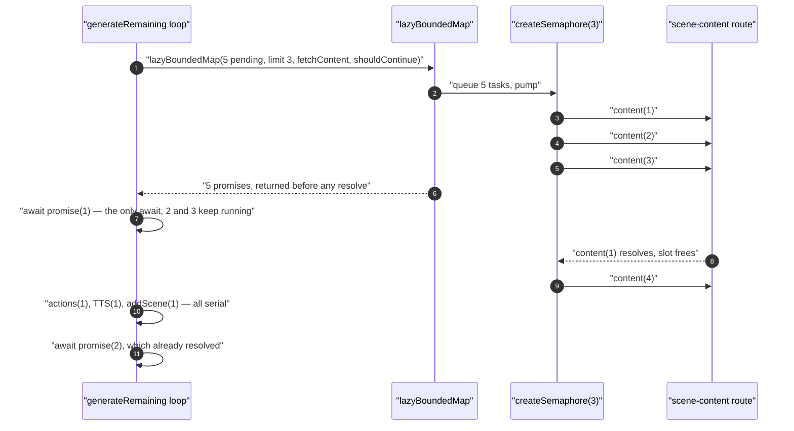
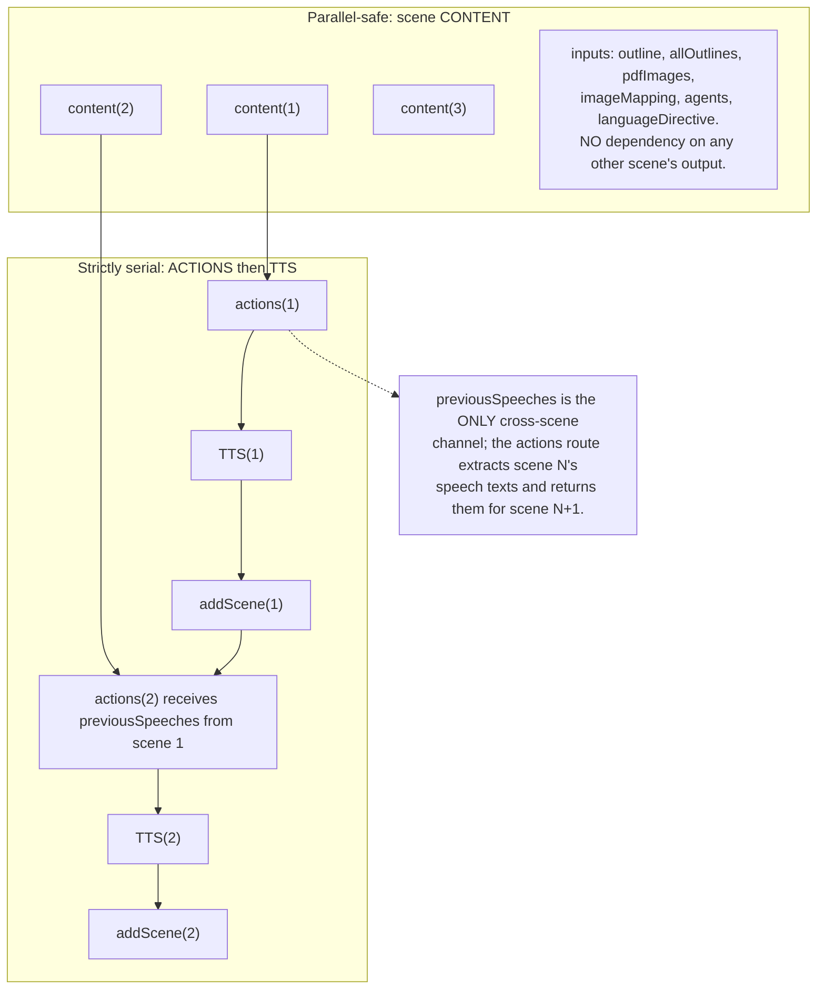
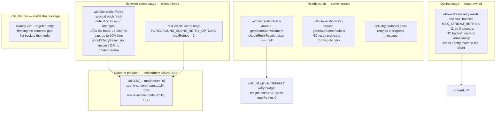
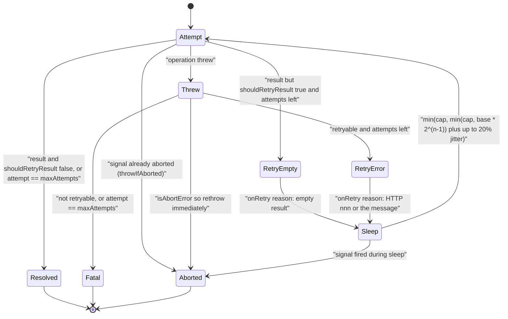

# Concurrency, Retry and Partial Failure

What happens when one scene of twenty fails. Fan-out shape, the four independent retry
layers and why they do not multiply, abort propagation, epoch guarding, and the
partial-failure matrix per layer.

**Sources:** `lib/utils/concurrency.ts`, `lib/hooks/use-scene-generator.ts`,
`packages/@openmaic/generation/src/generation-retry.ts`,
`app/api/generate/{scene-content,scene-actions,scene-outlines-stream}/route.ts`,
`lib/server/classroom-generation.ts`, [`lib/server/provider-config.ts:1112`](lib/server/provider-config.ts#L1112);
evidence: [`05-failure-modes.md`](docs/appendix/research/generation-pipeline/05-failure-modes.md),
[`03b-flows-scenes-and-quiz.md`](docs/appendix/research/generation-pipeline/03b-flows-scenes-and-quiz.md).

## Fan-out is opt-in and server-configured

`PARALLEL_SCENE_CONCURRENCY` is read server-side, clamped to `[0, 10]`, and published to
the client through `GET /api/server-providers`:

```ts
// lib/server/provider-config.ts:1112
export function getParallelSceneConcurrency(): number {
  const raw = Number.parseInt(process.env.PARALLEL_SCENE_CONCURRENCY ?? '', 10);
  if (!Number.isFinite(raw) || raw <= 0) return 0;
  return Math.min(raw, 10);
}
```

The reason it lives server-side is stated in place (`:1108-1110`): "many deployments use API
keys with low per-key concurrency quotas, where a bursty default would surface as 429s."

Default `0` means the browser keeps the original strictly-serial loop. The value is clamped
**three times** — in `getParallelSceneConcurrency`, again in the settings store
([`lib/store/settings.ts:1913`](lib/store/settings.ts#L1913)), and a third time in the loop itself
([`use-scene-generator.ts:689-695`](lib/hooks/use-scene-generator.ts#L689-L695)) with the comment "re-clamp here so a stale/garbage store
value can never spawn an unbounded fetch fan-out". Parallelism activates only when
`parallelConcurrency > 1 && pending.length > 1` (`:696`).

## The no-barrier primitive

`lazyBoundedMap` ([`lib/utils/concurrency.ts:47`](lib/utils/concurrency.ts#L47)) returns one promise per item
**immediately, in input order**, without awaiting them. Each item acquires a slot on a FIFO
counting semaphore before `fn` runs.



The contract that makes this useful: the caller can `await` in any order and each promise
resolves as soon as *its* work is done, while later items keep running in the background.
`limit` is clamped to `[1, items.length]` inside the helper (`:54`), so a raw value is safe
to pass. `shouldContinue` is checked when an item reaches the front of the queue; once it
returns false, remaining items resolve to `undefined` without running `fn` (`:56`) — here
it is `!abortRef.current && generationEpoch === startEpoch` (`:744-745`).

The pre-warm wrapper catches per-item throws and converts them to
`{ success: false, error }` (`:736-741`) so an unexpected throw routes through the same
mark-failed path as the serial loop instead of taking sibling fetches down with it.

## Why content can be parallel but actions cannot



The asymmetry is documented in place ([`use-scene-generator.ts:698-706`](lib/hooks/use-scene-generator.ts#L698-L706)): content has no
cross-scene dependency so running it ahead is safe, while "actions + TTS stay strictly
serial to preserve `previousSpeeches` threading and the pause-on-failure UX". Consuming the
content promises inside the serial loop also means the **first scene still paints after
content(1) + actions(1) + TTS(1)**, exactly as in serial mode; only later content fetches
are hidden behind earlier scenes' actions and TTS.

`previousSpeeches` is seeded from the highest-order *existing* scene at loop start
(`:677-684`), so a resumed run keeps speech coherence across the interruption.

## Five retry layers



The `maxRetries: 0` on the two scene routes is the key design decision: the client owns the
retry budget, so the two layers cannot multiply into an unpredictable worst case. The
headless job does **not** pass `maxRetries: 0`, so on that path `callLLM`'s own budget
composes with `withGenerationRetry` — an asymmetry between the drivers.

Note also `L4.j2`: the actions retry in the headless job has no `shouldRetryResult`, so a
successfully-returned empty or canned action list is never retried there, while the browser
retries on `!result.scene`.

### `withGenerationRetry` semantics



Defaults are 5 retries, 1000 ms base, 16 000 ms cap
([`generation-retry.ts:21-23`](packages/@openmaic/generation/src/generation-retry.ts#L21-L23)). The delay is clamped to the cap **twice** ([`:172-174`](packages/@openmaic/generation/src/generation-retry.ts#L172-L174)):

```ts
const exponentialDelay = Math.min(maxDelayMs, baseDelayMs * 2 ** Math.max(0, attempt - 1));
const jitter = Math.floor(exponentialDelay * Math.max(0, Math.min(random(), 1)) * 0.2);
return Math.min(maxDelayMs, exponentialDelay + jitter);
```

The outer `Math.min` is what keeps the worst case at 16 000 ms rather than 19 200 ms — the
jitter cannot push a capped delay past the cap. `sleep` and `random` are injectable purely so
tests can be deterministic.

`isRetryableGenerationError` (`:129`) decides in this precedence order:

| Check | Result |
| --- | --- |
| already seen (cycle guard) | `false` |
| `isAbortError` | `false` — never retryable |
| explicit `isRetryable` boolean field | honoured verbatim |
| status in `{408, 409, 425, 429}` or `>= 500` | `true` |
| status in `{400, 401, 403, 404, 422}` or any other 4xx | `false` |
| has `lastError`, `cause`, or `errors[]` | recurse into all of them, `some()` |
| `name === 'TimeoutError'` (record or `Error`) | `true` |
| message matches rate limit / too many requests / timeout / timed out / fetch failed / network / `ECONNRESET` / `ECONNREFUSED` / `ECONNABORTED` / `ETIMEDOUT` / `ENOTFOUND` / `EPIPE` / socket hang up | `true` |
| otherwise | `false` |

The status-code walk through `cause`/`lastError`/`errors[]` is what lets a provider 429
buried inside the AI SDK's `RetryError` be classified correctly. On the browser side,
`createHttpError` ([`use-scene-generator.ts:110`](lib/hooks/use-scene-generator.ts#L110)) attaches `errorCode` and `statusCode` from
the route's error envelope onto the thrown `Error` precisely so this classifier can see the
HTTP status of a failure that happened two hops away.

`isAbortError` (`:63`) recognises three shapes — an `Error` with `name === 'AbortError'`, a
`DOMException`, and a bare `{ name: 'AbortError' }` record — because the same code runs in
the browser, in Node route handlers, and under Vitest.

## Continued

This section outgrew the file-size ceiling and was split. Partial-failure semantics in both
drivers, the traced twenty-scene failure, abort propagation, epoch guarding, TTS fan-out, the
full partial-failure matrix, and the open questions are in
[`./07b-partial-failure-and-cancellation.md`](docs/06-generation-pipeline/07b-partial-failure-and-cancellation.md).
