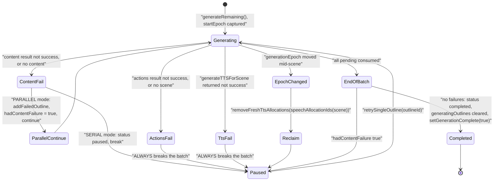
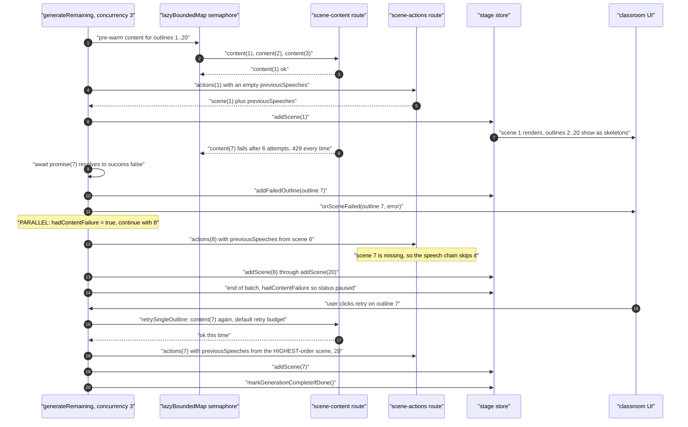
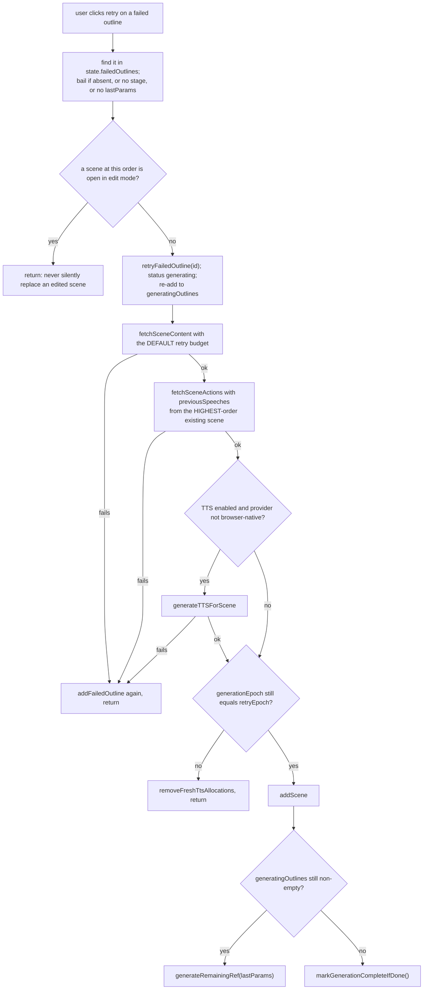
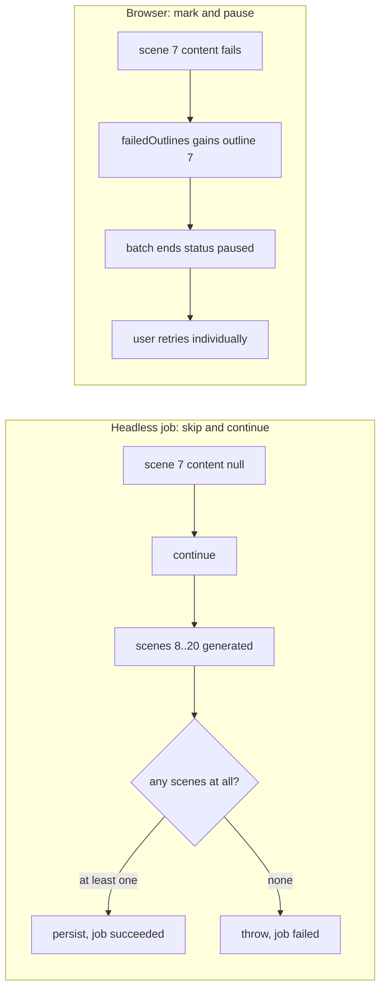
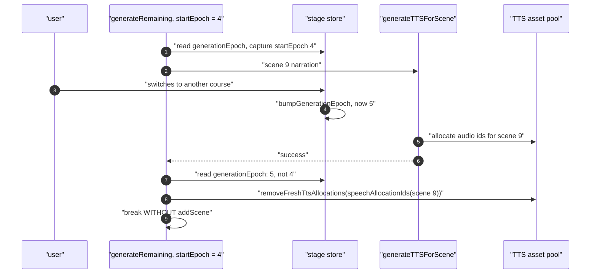

# Partial Failure, Abort and Epoch Guarding

Part 2 of the concurrency walkthrough. Fan-out shape and the four retry layers are in
[`./07-concurrency-and-retry.md`](./07-concurrency-and-retry.md). This half answers the
operational question: **what happens when one scene of twenty fails**, and what happens
when the user walks away mid-run.

**Sources:** `lib/hooks/use-scene-generator.ts:627-1053`,
`lib/server/classroom-generation.ts:558-664`,
`packages/@openmaic/generation/src/generation-retry.ts:27-52`, `:189-229`,
`app/api/generate/scene-outlines-stream/route.ts:504-640`, `lib/store/stage.ts`;
evidence: [`05-failure-modes.md`](../appendix/research/generation-pipeline/05-failure-modes.md),
[`03b-flows-scenes-and-quiz.md`](../appendix/research/generation-pipeline/03b-flows-scenes-and-quiz.md).

## Partial failure in the browser loop

The exact difference between the two modes, at `use-scene-generator.ts:776-794`:

| | Serial (`PARALLEL_SCENE_CONCURRENCY` unset) | Parallel (`> 1`, `pending.length > 1`) |
| --- | --- | --- |
| Content failure | `addFailedOutline`, status `paused`, `break` | `addFailedOutline`, `hadContentFailure = true`, `continue` |
| Other scenes | never started | already in flight, keep going |
| End state | `paused` at the failure | `paused` after the whole batch, with every failed outline in `failedOutlines` |

Actions and TTS failures always break, in both modes (`:836-846`, `:860-870`), because a
gap in the `previousSpeeches` chain would silently degrade every later scene.

### A partial failure, traced

Two consequences of that trace worth knowing before changing anything here:

- **A skipped scene leaves a gap in the speech chain, silently.** Scene 8's
  `previousSpeeches` came from scene 6, and nothing records that scene 7's narration was
  never available.
- **A retried scene gets the wrong `previousSpeeches`.** `retrySingleOutline` seeds from the
  highest-order existing scene (`:977-983`), not from `order - 1`. For a mid-course retry
  that is the *last* scene of the course.

`retrySingleOutline` also refuses to replace a scene that is open in edit mode
(`isSceneEditLocked`, `:927-936`) — structurally a no-op today because failed outlines have
no completed scene, but the guard is in place for a future "regenerate a successful scene"
path. On success it either resumes the batch via `generateRemainingRef` or calls
`markGenerationCompleteIfDone()` (`:1034-1042`), because the completion path inside
`generateRemaining` is not reached on the retry flow.

## Partial failure in the headless job

Different semantics, same primitives (`lib/server/classroom-generation.ts:558-657`):

| Failure | Behaviour |
| --- | --- |
| Content returns `null` after retries | `log.warn` and `continue` — the scene is **skipped** (`:623-626`) |
| `PBLGenerationError` | `containPBLGenerationError` converts it to `null`, so the scene is skipped; **anything else rethrows and fails the job** (`:42-46`, `:620`) |
| `createSceneWithActions` returns no id | `log.warn` and `continue` (`:643-646`) |
| Zero scenes after the loop | `throw new Error('No scenes were generated')` → job `failed` (`:662-664`) |
| Media phase throws | logged, job continues to TTS and persistence |
| TTS phase throws | logged, job continues to persistence |
| Web search throws | logged, generation continues with **no** research context (`:459-461`) |
| Agent profile generation invalid | caught, `getDefaultAgents()` used instead (`:514-517`) |

So the job's contract is "as many scenes as we could get, at least one" — while the browser's
is "every scene, or paused for retry".

The one error class that crosses the boundary differently is `PBLGenerationError`: the job
*contains* it (skip the scene) while the browser surfaces it as an HTTP error the client's
retry classifier reads. `containPBLGenerationError` rethrows everything else, so an
unexpected error still fails the job loudly rather than silently dropping scenes.

## Abort and cancellation

```mermaid
stateDiagram-v2
  [*] --> Running
  Running --> ClientStop: "user presses stop"
  ClientStop --> BumpEpoch: "abortRef.current = true; bumpGenerationEpoch()"
  BumpEpoch --> AbortFetch: "fetchAbortRef.abort()"
  AbortFetch --> AbortMedia: "mediaAbortRef.abort()"
  AbortMedia --> Paused: "AbortError caught in the loop's catch, status paused"
  Running --> ServerAbort: "req.signal aborted (socket closed)"
  ServerAbort --> StopStream: "outline route: stopHeartbeat and return, no retry burn"
  StopStream --> [*]
  Running --> StaleEpoch: "stage switched while a scene was in flight"
  StaleEpoch --> Reclaim: "removeFreshTtsAllocations"
  Reclaim --> Paused
  Paused --> Running: "retrySingleOutline or generateRemaining"
```

The abort signal is threaded end to end:

| Point | Mechanism |
| --- | --- |
| Browser `fetch` | one `AbortController` per run, its `signal` passed to every `fetch` (`use-scene-generator.ts:640-641`) |
| Inside `withGenerationRetry` | `throwIfAborted` at loop top, post-operation, and before each sleep (`generation-retry.ts:189`, `:193`, `:207`, `:214`, `:228`) — plus `defaultSleep` rejecting on abort (`:34-37`) |
| Route to provider | `abortSignal: req.signal` on the outline stream (`scene-outlines-stream/route.ts:504`, `:511`) |
| Inside the SSE loop | `req.signal?.aborted` checked per chunk (`:536`) **and** in the catch (`:636`), so a client disconnect does not burn a retry |
| Loop exit | `isAbortError(err)` swallows the abort into `status: paused` rather than an error (`use-scene-generator.ts:887-889`) |

`generateAndStoreTTS` and `fetchSceneContent`/`fetchSceneActions` all **rethrow** aborts
rather than converting them to a failure result (`:188`, `:237`, `:540`) — the loop's own
catch is the single place an abort becomes a state change.

`defaultSleep` is worth reading: it rejects immediately if the signal is already aborted,
registers a `{ once: true }` abort listener that clears the timeout, and removes the listener
on the normal path (`generation-retry.ts:27-46`). So a cancelled run never sits in a 16-second
backoff.

## Epoch guarding

`generationEpoch` is a monotonic counter in the stage store, bumped by `stop()`
(`:906`) and by a stage switch. `generateRemaining` captures `startEpoch` at entry
(`:645`) and compares it at **five** points:

| Point | Line | Action on mismatch |
| --- | --- | --- |
| `shouldContinue` in the semaphore | `:745` | remaining items resolve to `undefined`, never running |
| loop top | `:754` | status `paused`, break |
| after a content failure | `:777` | break without marking the outline failed |
| after content success | `:796` | status `paused`, break |
| after TTS, before `addScene` | `:850` | `removeFreshTtsAllocations(speechAllocationIds(scene))` then break |

The last comparison is the important one: a scene generated for course A must not be injected
into course B, and the TTS assets it minted must be reclaimed rather than leaked.
`retrySingleOutline` applies the same guard against its own `retryEpoch` (`:1025-1028`).

## TTS fan-out

`generateTTSForScene` (`:500`) reuses the same `parallelSceneConcurrency` knob for speech
actions within one scene (`:560-567`), justified because "speech actions within a scene are
independent — each renders its own audio under its own `audioId`, with no cross-action
ordering". Individual clip failures are **counted, not thrown** (`generateOne`, `:523-552`),
so one bad clip does not abort the rest of the scene — but a non-zero `failedCount` makes
`generateTTSForScene` return `success: false`, and that fails the whole scene in the loop
above. Aborts still propagate (`:540`).

So TTS has *two* granularities: per-clip resilience inside a scene, and all-or-nothing at
scene level. The narrator-voice fallback adds a third bound: `generateAndStoreTTS` allows at
most `MAX_NARRATOR_VOICE_FALLBACK_HOPS = 1` hop (`:260`) so a chain of dead voices cannot
loop `/api/generate/tts` indefinitely.

## Partial-failure matrix

| Layer | Partial failure allowed? | What survives |
| --- | --- | --- |
| One document of a multi-document bundle | **No** — `Promise.all` (`app/generation-preview/page.tsx:340`) | nothing; the run reports a preparation error |
| One page or one image inside a document | Yes | the rest of the document (`lib/pdf/pdf-providers.ts:308`, `:312`) |
| One outline in the stream | n/a — the whole stream retries, or errors | either all parsed outlines or none |
| One element inside a slide | Yes | the rest of the slide (`scene-generator.ts:511`) |
| One `latex` element | Yes | the rest of the slide (`scene-generator.ts:574`, `:591`) |
| One image with no mapping entry | Yes | the element is removed, the slide survives |
| One vision image | Yes | a text description replaces the attachment |
| One action | Yes | remaining actions, or the canned default list |
| One TTS clip | Yes inside the scene, No at scene granularity | earlier scenes; this scene fails and the batch pauses |
| One scene, browser serial | No | earlier scenes are stored; the batch pauses here |
| One scene, browser parallel (content phase) | Yes | all other scenes; failures land in `failedOutlines`, run ends `paused` |
| One scene, browser (actions or TTS phase) | No | earlier scenes; the batch pauses |
| One scene, headless job | Yes | scene skipped; the job succeeds if ≥ 1 scene exists |
| Media or TTS phase, headless job | Yes | the course is persisted without the media |

## Open questions

- **Whether the retry asymmetry between drivers is intended.** The browser routes pass
  `maxRetries: 0` to `callLLM` so budgets do not multiply; the headless job's direct
  `callLLM` calls keep the provider's own budget on top of `withGenerationRetry`.
- **Whether `previousSpeeches` should be repaired after a skip or a retry.** Today a skipped
  scene silently breaks the chain, and a mid-course retry seeds from the last scene rather
  than the previous one.
- **Why the outline stream retries without backoff** when a rate limit is the likeliest cause
  of an empty attempt. See
  [`./03b-outline-streaming.md`](./03b-outline-streaming.md#whole-stream-retry).
- **Whether the one document that fails a bundle should be tolerated.** Every other layer in
  the pipeline degrades; `Promise.allSettled` at `app/generation-preview/page.tsx:340` would
  make ingestion match.
