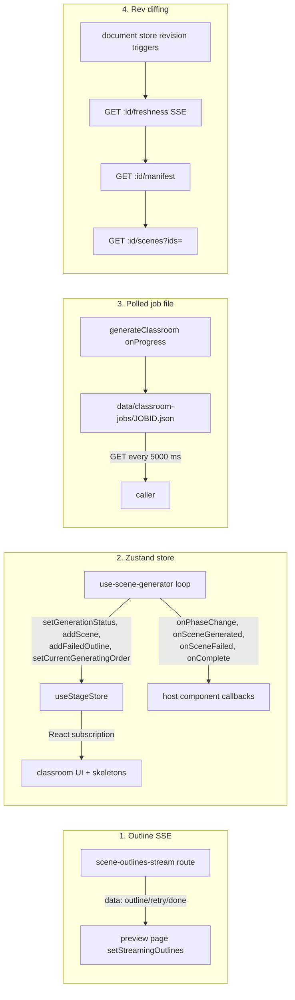
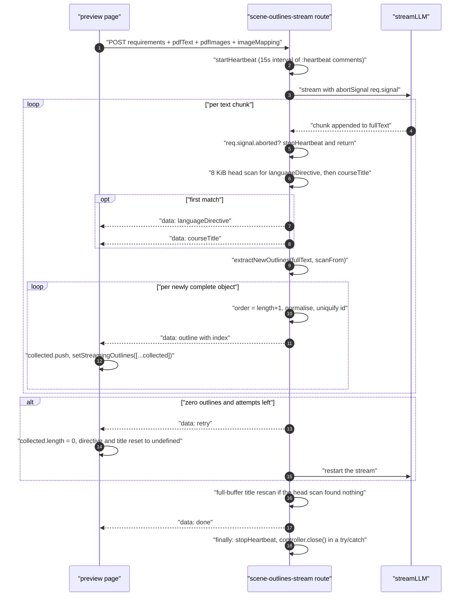
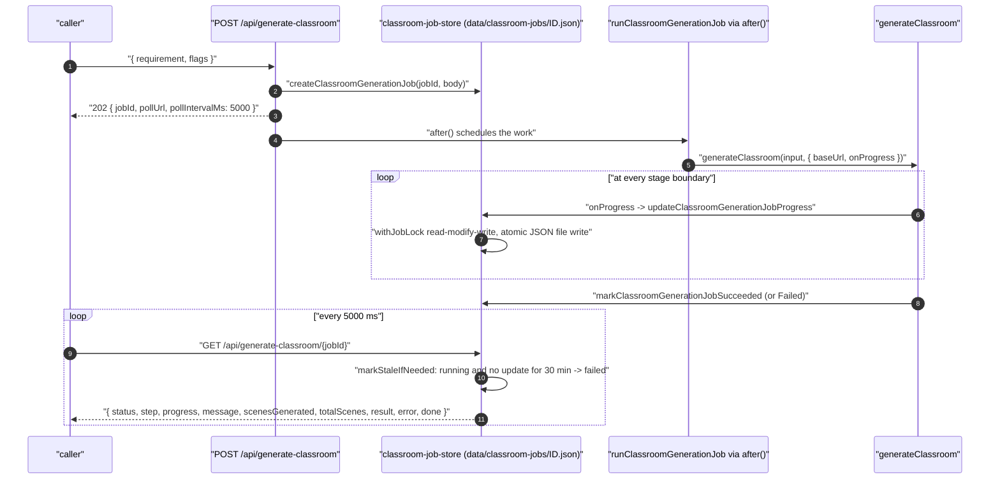
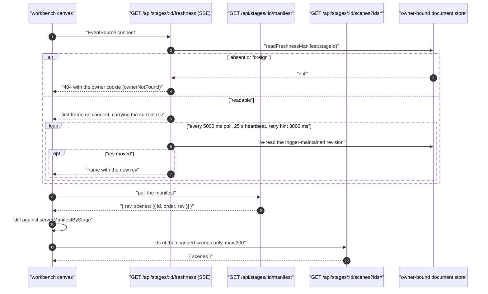
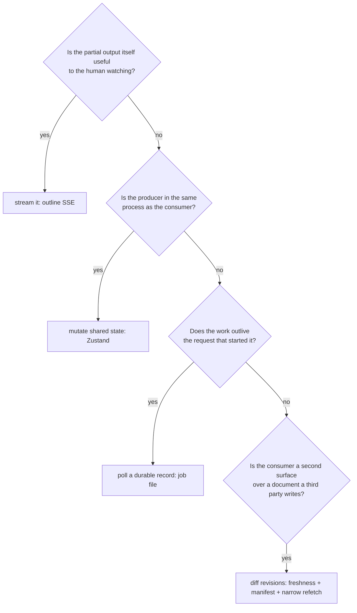

# Progress Reporting

Four independent progress transports, one per consumer. Nothing unifies them, and the
choice in each case follows from a single question: is the partial output itself useful, or
only the fact that progress happened?

**Sources:** `app/api/generate/scene-outlines-stream/route.ts`,
`app/generation-preview/{page.tsx,types.ts,components/visualizers.tsx}`,
`lib/store/stage.ts`, `lib/hooks/use-scene-generator.ts`,
`lib/server/{classroom-generation,classroom-job-store,classroom-storage}.ts`,
`app/api/generate-classroom/**`, `app/api/stages/[id]/freshness/route.ts`;
evidence: [`03b-flows-scenes-and-quiz.md`](../appendix/research/generation-pipeline/03b-flows-scenes-and-quiz.md),
[`02d-interfaces-wire-and-prompt.md`](../appendix/research/generation-pipeline/02d-interfaces-wire-and-prompt.md).

## The four transports at a glance

| # | Transport | Covers | Consumer | Why this one |
| --- | --- | --- | --- | --- |
| 1 | SSE (`text/event-stream`) | outline generation only | the preview page | outlines are *useful* one at a time — the user reads them as they arrive |
| 2 | Zustand store mutation | browser scene loop | the classroom UI | the loop and the UI are in the same process; a store write *is* the notification |
| 3 | Polled JSON file | headless job | any HTTP caller, incl. an external agent | no connection is held; the job outlives the request |
| 4 | Rev-diffing SSE + manifest + narrow refetch | any writer, incl. an agent | the workbench canvas | a second surface must converge without re-reading the whole document |



## Transport 1: outline SSE

The only streaming generation endpoint. Six event shapes, all framed `data: <json>\n\n`, with
bare `:heartbeat\n\n` comments every 15 000 ms:

```
{ type: 'languageDirective', data: string }
{ type: 'courseTitle',       data: string }
{ type: 'outline',           data: SceneOutline, index: number }
{ type: 'retry',             attempt: number, maxAttempts: number }
{ type: 'done',              outlines, languageDirective, courseTitle?, taskEngineMode }
{ type: 'error',             error: string }
```



Three properties that only exist because this is a stream:

- **The heartbeat's own failure stops it.** `controller.enqueue` inside the interval is
  wrapped so an enqueue on a closed controller calls `stopHeartbeat()` rather than throwing
  into the timer (`route.ts:468-472`).
- **`controller.close()` is in a `finally` and inside a `try/catch`** (`route.ts:690-697`),
  because the controller may already be closed if the client disconnected.
- **The `retry` event exists so the client can undo its own accumulation.** Without it the
  browser would show the failed attempt's outlines alongside the successful attempt's — see
  [`./03b-outline-streaming.md`](./03b-outline-streaming.md#client-side-reduction-rules).

The preview page also drives a coarse step indicator alongside the stream:
`getActiveSteps(session)` (`app/generation-preview/types.ts:135`) filters `ALL_STEPS` down to
the six-step list this run will actually use, and `setCurrentStepIndex` moves through it.
Step visibility is conditional:

| Step id | Shown when |
| --- | --- |
| `pdf-analysis` | a legacy `pdfStorageKey` exists, OR there are `documentSources` and no `pdfText` yet |
| `web-search` | `session.requirements.webSearch` |
| `outline` | always |
| `agent-generation` | `useSettingsStore.getState().agentMode === 'auto'` |
| `slide-content` | always |
| `actions` | always |

`pdf-analysis` swaps its copy for audio/video material (`getGenerationStepText`, `:67-82`)
because "Analyzing documents" would misdescribe a transcription.
`components/visualizers.tsx` renders a per-step animation keyed on these ids.

## Transport 2: the Zustand store

The browser scene loop has no wire protocol. It mutates `useStageStore` and React does the
rest. The generation-relevant slice (`lib/store/stage.ts:299-331`):

| Field | Persisted? | Meaning |
| --- | --- | --- |
| `outlines` | **yes** | the plan; persisted for resume-on-refresh |
| `generationComplete` | **yes** | gates resume-on-mount so an edited finished deck is not regenerated |
| `generatingOutlines` | no | outlines still pending — these render as skeletons |
| `generationEpoch` | no | monotonic cancellation counter |
| `generationStatus` | no | `idle \| generating \| paused \| completed \| error` |
| `currentGeneratingOrder` | no | which order is in flight; `-1` when none |
| `failedOutlines` | no | outlines the user can retry individually |

Only the first two survive a reload. That is the whole resume contract: on mount, the loop
diffs `outlines` against `scenes` by `order` and regenerates the difference
(`use-scene-generator.ts:654-657`), unless `generationComplete` is set.

`isDeckComplete` (`lib/store/stage.ts:384`) is the completion predicate:
`outlines.length > 0 && failedOutlines.length === 0 && every outline has a scene with the
same order`. It is what `markGenerationCompleteIfDone()` consults on the retry path.

```mermaid
stateDiagram-v2
  [*] --> idle
  idle --> generating: "setGenerationStatus('generating')"
  generating --> generating: "setCurrentGeneratingOrder(n); addScene; setGeneratingOutlines(rest)"
  generating --> paused: "addFailedOutline + setGenerationStatus('paused')"
  generating --> paused: "abort or epoch change"
  generating --> completed: "setGeneratingOutlines([]) + setGenerationComplete(true)"
  paused --> generating: "retrySingleOutline"
  completed --> [*]
```



Alongside the store, four optional host callbacks give a mounting component a push signal
without subscribing to the store (`use-scene-generator.ts:597-600`):

```ts
onSceneGenerated?: (scene: Scene, index: number) => void;
onSceneFailed?:    (outline: SceneOutline, error: string) => void;
onPhaseChange?:    (phase: 'content' | 'actions', outline: SceneOutline) => void;
onComplete?:       () => void;
```

`onPhaseChange('content', …)` fires from **inside** the `lazyBoundedMap` callback in parallel
mode (`:733`) and from the serial branch in serial mode (`:772`), so in parallel mode the
reported "content phase" outline is whichever fetch just started — not the one the serial
loop is currently consuming.

## Transport 3: the polled job file

`POST /api/generate-classroom` answers **202** immediately and schedules the work in
Next's `after()` (`route.ts:48`), so `maxDuration = 30` bounds the *request*, not the job.

```
202 { jobId, status, step, message, pollUrl, pollIntervalMs: 5000 }
```

The poll endpoint adds `progress`, `scenesGenerated`, `totalScenes`, `result`, `error`, and
`done = status === 'succeeded' || status === 'failed'`
(`app/api/generate-classroom/[jobId]/route.ts:31-44`). It declares
`dynamic = 'force-dynamic'` and validates the id against `/^[a-zA-Z0-9_-]+$/`
(`classroom-job-store.ts:96`) before touching the filesystem.



The store is a **JSON file per job** under `data/classroom-jobs/` (`CLASSROOM_JOBS_DIR`,
`lib/server/classroom-storage.ts:7`), written atomically, with two mechanisms worth knowing:

- **An in-process per-job mutex.** `withJobLock` (`classroom-job-store.ts:60-74`) chains a
  promise per `jobId` so concurrent read-modify-write on the same file serialises. It is
  process-local: it does not protect against two server instances sharing the directory.
- **A staleness sweep on read.** `markStaleIfNeeded` (`:79-94`) converts a `running` job with
  no `updatedAt` movement for `STALE_JOB_TIMEOUT_MS` (30 minutes) into `failed` with
  `'Stale job: process may have restarted during generation'`. This is the only recovery
  path for a job whose process died mid-run — `after()` work does not survive a restart.

The `progress` numbers are fixed waypoints, not a computed fraction
(`lib/server/classroom-generation.ts:186`–`:728`):

| Step | Progress |
| --- | --- |
| `initializing` | 5 |
| `researching` | 10 |
| `generating_outlines` (start) | 15 |
| `generating_outlines` (done) | 30 |
| `generating_scenes` | `30 + floor(index / total * 60)`, floored at 31, ceilinged at 90 |
| `generating_media` | 90 |
| `generating_tts` | 94 |
| `persisting` | 98 |
| `completed` | 100 |

Retries inside the scene loop surface as progress *messages* rather than a distinct state:
`reportSceneRetry` (`classroom-generation.ts:572-586`) is wired as the `onRetry` handler on
both `withGenerationRetry` calls and emits
`Retrying scene 4/12 content (2/6): <title>` at the same progress value. So a client that
only watches `progress` sees a stall; one that watches `message` sees why.

`inputSummary` (`classroom-job-store.ts:47-55`) stores a 200-char requirement preview plus
PDF text length and image count — never the PDF text itself, and never the API keys from the
request body.

## Transport 4: rev-diffing manifest

The workbench canvas is a *second* surface over a document that a background agent may be
writing. It cannot poll the whole document, so three routes compose:



Constants are exported so the client can share them
(`app/api/stages/[id]/freshness/route.ts:38-42`): `STAGE_FRESHNESS_POLL_INTERVAL_MS = 5_000`,
`STAGE_FRESHNESS_HEARTBEAT_MS = 25_000`, `STAGE_FRESHNESS_RETRY_MS = 3_000`.

The route's header comment states the design contract explicitly (`:17-23`): **degradation is
by design.** This stream is a pure optimisation — a dead or missing stream only costs
latency, because the client's low-frequency fallback poll still converges. The stream never
closes on a terminal state, and a broken socket is the client's `EventSource` problem.

It also documents a deliberate divergence from its reference implementation (`:9-15`): the
reference woke this stream from a database trigger's `NOTIFY`, but the storage package
exposes no `LISTEN`/`NOTIFY`, so this stream **polls** the owner-bound store for the same
trigger-maintained revision. Correctness is unchanged; only the wakeup latency differs.

The store side of the diff is `serverManifestByStage` (`lib/store/stage.ts:340`) — the
manifest this browser has actually rendered — written by
`lib/workbench/use-workbench-session.ts`, not by the generation loop.

## Why four and not one



Outlines are the only stage whose partial output a human reads directly, which is why they
are the only stage that streams. Scene generation produces a *scene* — nothing partial about
a half-generated slide is useful — so the browser signals completion per scene and the
headless job signals a waypoint per stage.

## Open questions

- **Whether the two drivers should share a progress vocabulary.** `ClassroomGenerationStep`
  (eight values, `lib/server/classroom-generation.ts:62`) and the browser's `ALL_STEPS`
  (six ids, `app/generation-preview/types.ts:90`) describe the same pipeline with different
  names and different granularity. Nothing maps one to the other.
- **Whether the job file store is intended for multi-instance deployments.** `withJobLock` is
  process-local and the staleness sweep is the only crash recovery, so two instances sharing
  `data/classroom-jobs/` could interleave writes. Owner:
  [`../17-deployment-view/index.md`](../17-deployment-view/index.md).
- **Whether `onPhaseChange` is meant to be meaningful in parallel mode.** It fires per
  content fetch start, which in parallel mode is not the scene the serial loop is on.
