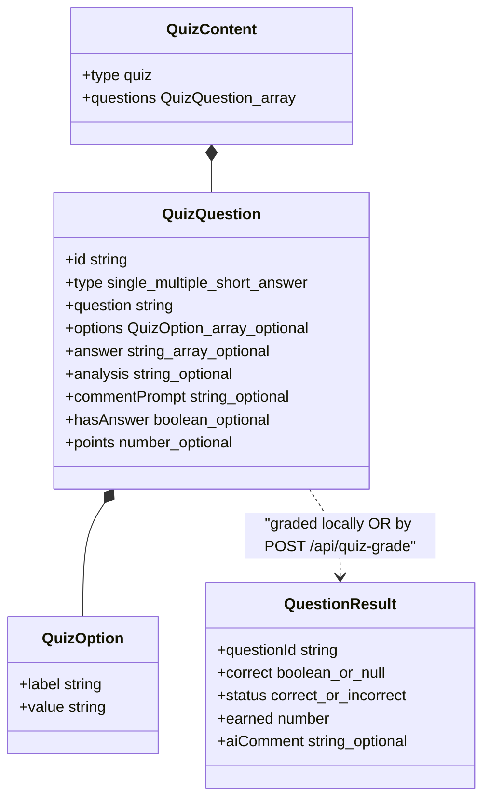
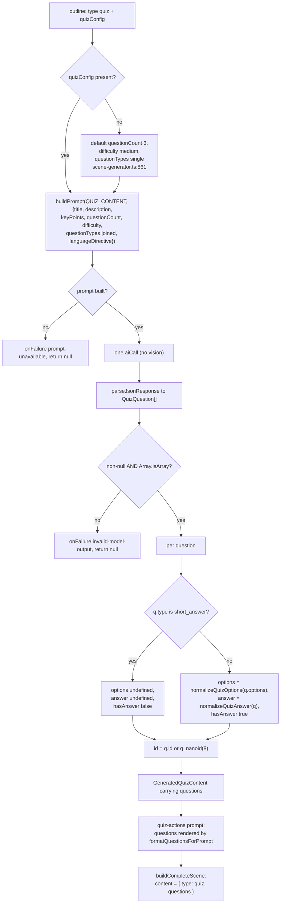
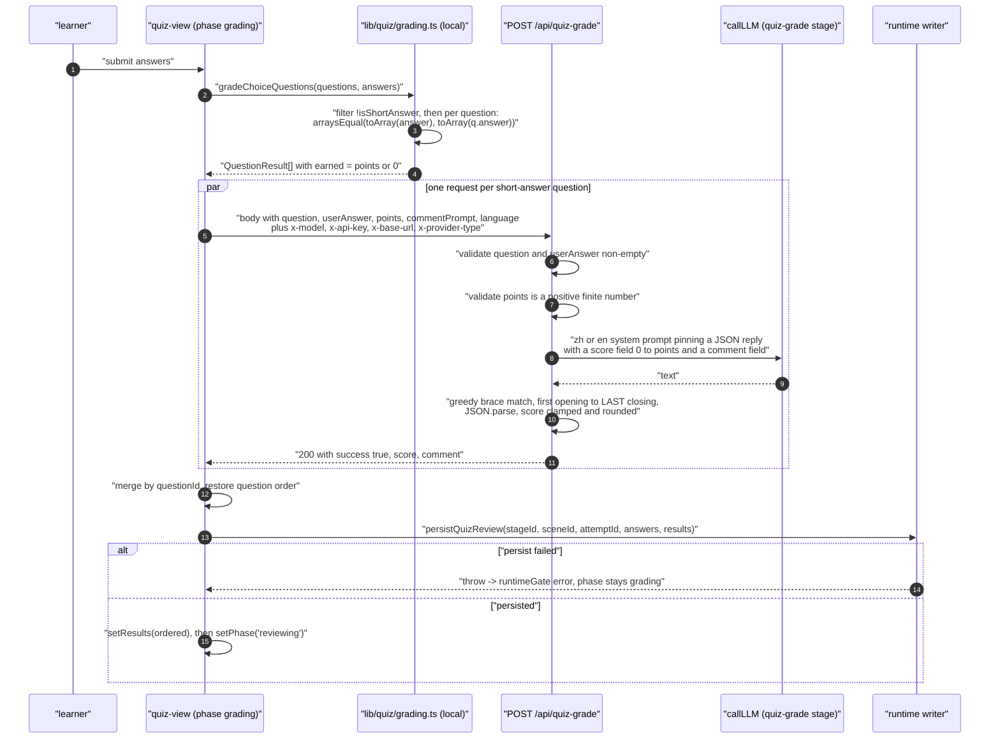
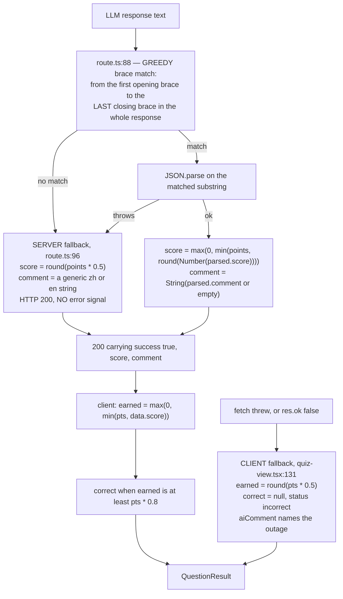
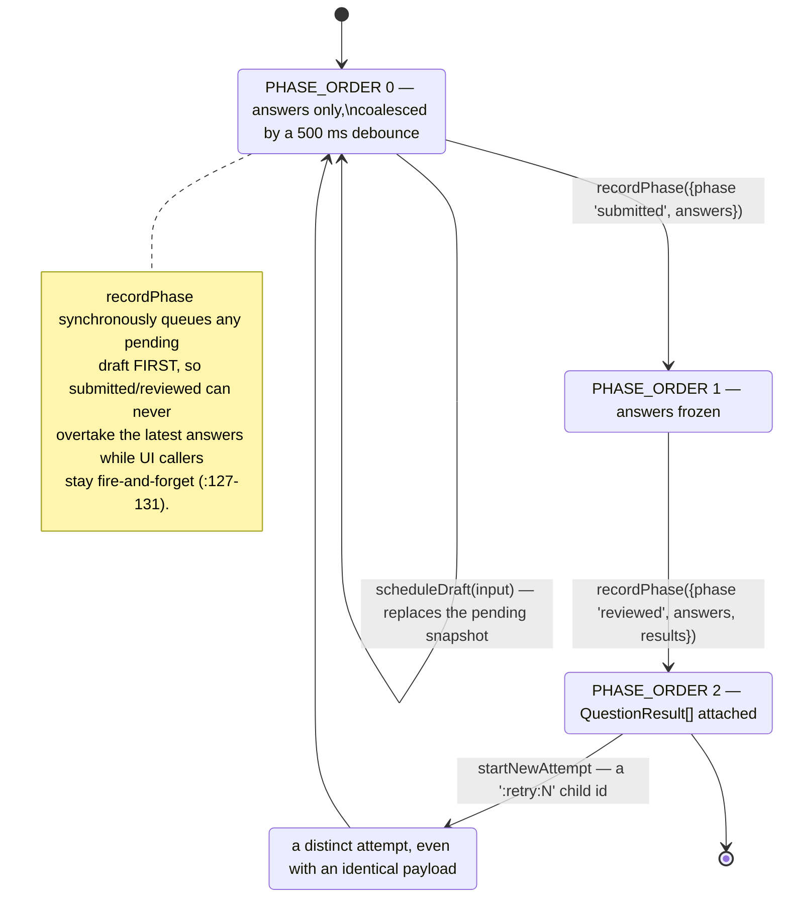

# Quiz Generation and Grading

Quiz is the one scene type whose lifecycle spans generation *and* runtime: the generator
decides which questions can be graded from an answer key and which need a model, and the
classroom then grades them two different ways. This section covers both halves and the
feedback shape they converge on.

**Sources:** `packages/@openmaic/generation/src/scene-generator.ts:854-955`, `:1660-1686`,
`packages/@openmaic/dsl/src/stage.ts:191-214`,
`packages/@openmaic/generation/templates/quiz-content/**`, `.../quiz-actions/**`,
`lib/quiz/grading.ts`, `components/scene-renderers/quiz-view.tsx`,
`app/api/quiz-grade/route.ts`; evidence:
[`03b-flows-scenes-and-quiz.md`](../appendix/research/generation-pipeline/03b-flows-scenes-and-quiz.md),
[`06-quality-and-metrics.md`](../appendix/research/generation-pipeline/06-quality-and-metrics.md).

## The contract: `QuizQuestion`



`QuizOption.value` is the selection key (`"A"`, `"B"`, …) and `label` the display text
(`packages/@openmaic/dsl/src/stage.ts:191-194`). `answer` holds the *values*, so
`["A"]` or `["A","C"]`, and is `undefined` for text questions (`:201`).

Two enum mismatches to hold in mind:

| Where | Vocabulary |
| --- | --- |
| `SceneOutline.quizConfig.questionTypes` (`outline-types.ts:85`) | `'single' \| 'multiple' \| 'text'` |
| `QuizQuestion.type` (`dsl/stage.ts:198`) | `'single' \| 'multiple' \| 'short_answer'` |

Nothing translates `'text'` into `'short_answer'`. The outline asks for one vocabulary; the
generator's post-processing and the runtime both branch on the other.

## Generation



`quiz-content/system.md` includes `{{snippet:json-output-rules}}` at line 5 — the only quiz
template that pulls a snippet, and the reason quiz output arrives as a bare JSON array
rather than a wrapper object.

### Tolerant normalisation

`normalizeQuizOptions` (`scene-generator.ts:914`) accepts three shapes per option:

| Model emitted | Normalised to |
| --- | --- |
| `"Chlorophyll"` (plain string) | `{ value: <positional letter>, label: "Chlorophyll" }` |
| `{ value: "B", label: "…" }` | kept as-is |
| `{ value: "B" }` or `{ text: "…" }` | `label` falls back `label → String(value) → String(text) → letter` |
| anything else | `{ value: letter, label: String(opt) }` |

Positional letters come from `String.fromCharCode(65 + index)` (`:920`), so option order in
the model's array *is* the A/B/C/D assignment.

`normalizeQuizAnswer` (`:943`) reads `question.answer ?? question.correctAnswer ??
question.correct_answer` — three field names, in that precedence — and coerces to `string[]`
(`:951-954`). It returns `undefined` for any falsy raw value, which means a legitimate
`answer: 0` or `answer: ""` is treated as absent.

Neither normaliser validates that the answer values exist among the option values. A model
that emits options `A`–`D` and `answer: ["E"]` produces a question that is unanswerable but
structurally valid.

## Runtime grading: two paths

`components/scene-renderers/quiz-view.tsx:797-844` splits the question list at submit time
and runs both paths, then merges results back into the original question order.



### Local grading is exact-set-match

```ts
// lib/quiz/grading.ts:34
export function gradeChoiceQuestions(
  questions: QuizQuestion[],
  answers: Record<string, string | string[]>,
): QuestionResult[]
```

It filters `!isShortAnswer(q)`, then per question compares
`arraysEqual(toArray(answers[q.id]), toArray(q.answer))` — both sides sorted, so option order
does not matter (`grading.ts:11-16`). `earned` is `q.points ?? 1` on a match, `0` otherwise.

`isShortAnswer` (`:29`) classifies **by `type` only**, and the doc comment says why (`:23-28`):
"an unanswered choice question (empty `answer`) is still a choice question and must not be
re-routed to AI grading. `hasAnswer` does not override the type."

### LLM grading

`POST /api/quiz-grade` (113 lines) is the whole server side. It validates two things
(`route.ts:37-44`): `question` and `userAnswer` must be non-empty, and `points` must be a
positive finite number. Then it resolves the `quiz-grade` model stage and builds a
locale-branched system prompt (`:55-61`):

```
zh (language === 'zh-CN'):
  你是一位专业的教育评估专家。…
  必须以如下 JSON 格式回复（不要包含其他内容）：
  {"score": <0到{points}的整数>, "comment": "<一两句评语>"}

en (everything else):
  You are a professional educational assessor. …
  {"score": <integer from 0 to {points}>, "comment": "<one or two sentences of feedback>"}
```

The user prompt carries the question, the full marks, an optional `Grading guidance:` line
from `commentPrompt`, and the student answer (`:63-69`).

Note: this route does **not** pass `maxRetries: 0` to `callLLM`, unlike the two scene routes,
so the provider's own retry budget applies here.

## Feedback shape and the two half-credit fallbacks

There are **two independent 50 %-credit fallbacks** on this path, at different layers.



The extractor is `text.match(/\{[\s\S]*\}/)` (`route.ts:88`) — **greedy**, so it does not
match the first brace-delimited object; it matches from the first `{` to the last `}` in the
entire response. A model that emits a reasoning block or trailing prose containing a second
`{…}` produces a match spanning both objects, `JSON.parse` throws, and the server fallback
below fires. That is the most likely real-world trigger for it.

The two fallbacks differ in an observable way:

| | Server fallback (`route.ts:95-103`) | Client fallback (`quiz-view.tsx:131-144`) |
| --- | --- | --- |
| Trigger | response present but unparseable | request threw, or non-2xx |
| `correct` | derived from the 0.8 threshold — so 0.5 becomes `false` | explicitly `null` |
| `aiComment` | `'Answer received. Please refer to the standard answer.'` / `'已作答，请参考标准答案。'` | `'Grading service unavailable. Base score given.'` / `'评分服务暂时不可用，已给予基础分。'` |
| Caller can tell | **no** — indistinguishable from a real 50 % grade | yes, `correct === null` |

The server fallback is the sharper problem: a grader model that always returns prose looks
like a lenient grader, not an outage. There is no `errorCode`, no header, and no log field
the client can read.

A third, subtler path: `Math.round(Number(parsed.score))` on a non-numeric `score` yields
`NaN`, which passes through `Math.min`/`Math.max` as `NaN` and serialises to JSON `null`. The
client's `Math.min(pts, null)` is then `0`, so a model that answers
`{"score": "good", "comment": "…"}` awards **zero** — a different outcome from both
documented fallbacks, and it does not take the parse-failure branch.

### `QuestionResult`

```ts
// lib/quiz/grading.ts:3
export interface QuestionResult {
  questionId: string;
  correct: boolean | null;      // null only from the client's network fallback
  status: 'correct' | 'incorrect';
  earned: number;
  aiComment?: string;           // set only on the LLM-graded path
}
```

The 0.8 threshold is client-side and hard-coded (`quiz-view.tsx:126-127`): a short-answer
question counts as `correct` when `earned >= points * 0.8`. So a partial-credit score of
70 % renders as incorrect even though the learner keeps the points.

Results are merged by `questionId` into a `Map` and re-ordered to match the original question
array (`quiz-view.tsx:816-820`), then persisted through `persistQuizReview` before the phase
advances to `reviewing` (`:827-838`). A persistence failure holds the phase at `grading` and
sets `runtimeGate.status = 'error'` — the grade is not shown if it could not be recorded.

## Action generation for quiz scenes

`generateSceneActions`'s quiz branch (`scene-generator.ts:1660-1686`) renders the question
list with `formatQuestionsForPrompt` and calls the `quiz-actions` prompt. Two things differ
from the slide branch:

- `processActions(actions, [], agents, log)` is called with an **empty element list**
  (`:1682`), so the `spotlight.elementId` repair is a no-op for quiz scenes — a hallucinated
  `spotlight` keeps its invalid id and is later stripped by
  `SLIDE_ONLY_ACTIONS` filtering in the parser (`action-parser.ts:142`).
- The zero-actions fallback is a single canned `speech` action titled `'测验引导'`
  (`:1908-1917`), whose Chinese text reaches the learner regardless of `languageDirective`.

## Where a result is written: `lib/quiz/runtime.ts`

Grading produces `QuestionResult[]`. Persisting it is a separate 665-line module, the
largest of `lib/quiz/`'s five files (`runtime.ts` 665, `math-text.ts` 310,
`persistence.ts` 191, `view-state.ts` 96, `grading.ts` 52 — `wc -l lib/quiz/*.ts`). The
*shape* it writes belongs to this topic; the *place* — the learner `RuntimeStore` — belongs
to [`../10-persistence-and-state/index.md`](../10-persistence-and-state/index.md).

An attempt is identified by `quizAttemptId(stageId, sceneId, learnerKey)` (`:252`) and
advances through a three-phase monotonic ladder — `QuizAttemptPhase = 'draft' | 'submitted' | 'reviewed'`
(`packages/@openmaic/dsl/src/runtime.ts:332`, with a compile-time exhaustiveness assertion
at `:341-348`), ordered by `PHASE_ORDER` (`lib/quiz/runtime.ts:93`). The record written is
`QuizAttemptPayload` (`:18`): a `QuizAttemptSkeleton` plus `payloadVersion: 1`, the phase,
the answers, and the `results?: QuestionResult[]` this file's grading section produces.



Three mechanisms make that safe under fire-and-forget UI callers, and each is worth knowing
before touching the file:

- **Two module-level write queues, keyed differently on purpose.**
  `queues: WeakMap<RuntimeStore, Map<string, Promise<void>>>` (`:99`) serialises store
  appends per attempt and is keyed on the *store instance*, so a test store cannot inherit a
  production queue. `writerTails: Map<string, Set<Promise<void>>>` (`:100`) tracks in-flight
  debounced writer work per attempt id.
- **Retry lineage is walked, not assumed.** A retry appends `:retry:<n>` to the attempt id;
  `awaitQueuedWriterLineage` (`:102`) and `awaitQueuedAttemptLineage` (`:115`) strip that
  suffix in a loop (`queueKey.replace(/:retry:\d+$/, '')`) to drain the parent's queue
  before the child writes. Without it a retry could land before the attempt it retries.
- **Two typed failures rather than one.** `RuntimeAppendConflictError` (from
  `@openmaic/storage`) is the store's optimistic-append conflict; `QuizRetryProgressedError`
  (`:52`) is this module's own — the attempt moved on while you were writing.

Legacy attempts are lifted rather than lost: `backfillQuizAttempt` (`:638`) takes a
`LegacyQuizAttemptInput` (`:36`) built from `readLegacyQuizStateSnapshot`
(`lib/quiz/persistence.ts`) and clears the old snapshot after a successful write.

`loadQuizAttemptState` (`:368`) is the read side, and it has more consumers than the write
side has callers — which is why its return type is the load-bearing part of the module:
`components/scene-renderers/quiz-view.tsx:32` (the learner surface, plus the writer),
`components/scene-renderers/classroom-complete.tsx:16` (the end-of-class summary),
`lib/chat/quiz-results-for-store-state.ts:3` (so an in-class agent can see the score),
`lib/pbl/v2/operations/runtime/quiz-snapshot.ts:24` (PBL progress), and
`lib/quiz/view-state.ts:3` (types only).

## Test posture

| Covered | Not covered |
| --- | --- |
| `gradeChoiceQuestions` and `isShortAnswer` — the local deterministic grader (`tests/quiz/grading.test.ts`) | `app/api/quiz-grade/route.ts` — no unit or integration test |
| the quiz-content prompt bytes, via the scene prompt goldens | the server 50 % fallback, the `NaN` path, and the clamp |
| the quiz surface end to end, via Playwright | — the E2E spec **stubs** the route with a fixed 200 (`e2e/tests/quiz-content-surface-657.spec.ts:181`) |

So the route's failure behaviour is exercised nowhere. See
[`../14-code-quality/index.md`](../14-code-quality/index.md).

## Open questions

- **Whether the 50 % server fallback should be a signalled degradation.** Returning an
  `errorCode` alongside the score, or a distinguishable `correct: null`, would let the client
  say "graded unavailable" rather than showing a confident half mark. Nothing in the code
  states the intent.
- **Whether `quizConfig.questionTypes: 'text'` is meant to reach the generator.** The outline
  enum has `'text'`, the question enum has `'short_answer'`, and no translation exists — so
  an outline that asks for `'text'` questions relies on the model choosing
  `'short_answer'` in its output.
- **Whether the 0.8 correctness threshold belongs on the client.** It is the only grading
  policy constant not visible to the server, so the server cannot report a consistent
  pass/fail.
