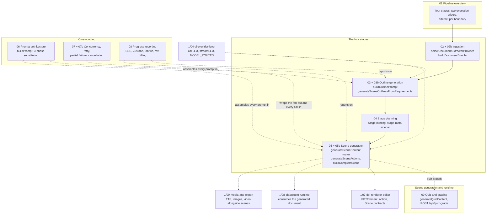

# Component View: Generation Pipeline

The generation pipeline turns a free-text course requirement plus optional uploaded
materials into a persisted course document: a `Stage` and an ordered list of `Scene`s,
each carrying typed content (slide canvas / quiz questions / interactive widget HTML /
PBL project) and an ordered `Action[]` playback script.

This topic is the C4 level-3 decomposition of that subsystem: its four stages, the
artefact each hands on, the publishable package that owns the pure parts, the prompt
system, and the two independent execution drivers that run over the same primitives.

**Sources:** `packages/@openmaic/generation/**` (8199 LOC src), `app/api/generate/**`,
`app/api/extract-document/route.ts`, `app/api/quiz-grade/route.ts`,
`app/api/generate-classroom/**`, `lib/document/**`, `lib/pdf/**`,
`lib/hooks/use-scene-generator.ts`, `lib/server/classroom-generation.ts`,
`app/generation-preview/page.tsx`, and the evidence pack
[`../appendix/research/generation-pipeline/`](../appendix/research/generation-pipeline/00-overview.md).

## Who this is for

A staff engineer who needs to change generation behaviour: add a scene type, swap an
extractor, retune a prompt, debug a partial failure, or decide which of the two
execution modes a new feature belongs in. Read [01](./01-pipeline-overview.md) first;
everything else is reachable from there.

## The one architectural fact that matters

Steps 2 and 4 of the pipeline (outline generation, per-scene generation) live in the
publishable package `@openmaic/generation`, whose **entire** model dependency is one
function type:

```ts
// packages/@openmaic/generation/src/pipeline-types.ts:60
export type AICallFn = (
  systemPrompt: string,
  userPrompt: string,
  images?: Array<{ id: string; src: string }>,
) => Promise<string>;
```

The package never selects a provider, reads an environment variable, or persists
anything. Its five runtime dependencies are `@openmaic/dsl`, `jsonrepair`, `katex`,
`nanoid`, `partial-json` (`packages/@openmaic/generation/package.json:45-51`) — not one
provider SDK. Every provider decision, retry budget, and persistence write lives in the
app. That seam is what makes the generation logic testable without a network and is the
first thing to preserve when changing anything here.

## Topic overview

Nine section files over four pipeline stages plus three cross-cutting concerns. Node labels
name the real entry point each section documents.



## Section files

Four sections outgrew the 350-line ceiling and were split; both halves are registered here.

| File | Contents |
| --- | --- |
| [`01-pipeline-overview.md`](./01-pipeline-overview.md) | The four stages end to end, the artefact each produces, the two execution drivers, and where the stage boundaries actually are in code |
| [`02-document-ingestion.md`](./02-document-ingestion.md) | Five document extractors, two media extractors, registry-order selection, the credential-aware availability probe, and the normalised IR everything converges on |
| [`02b-bundling-and-egress.md`](./02b-bundling-and-egress.md) | Multi-document bundling and vision-slot round-robin, managed credentials and SSRF on extractor egress, the two request forms, ingestion's partial-failure behaviour |
| [`03-outline-generation.md`](./03-outline-generation.md) | Outline prompt inputs, the vision split, the `languageDirective` / `courseTitle` / `outlines` output shape, and the three-layer validation-and-repair ladder |
| [`03b-outline-streaming.md`](./03b-outline-streaming.md) | The SSE route: wire format, O(n) incremental parser, whole-stream retry, client reduction rules, the two app-only prompt variants, and output-language control |
| [`04-stage-planning.md`](./04-stage-planning.md) | What a stage is, who mints its id on each of the three paths, how many scenes there are and who decides, and the stage-metadata sidecar |
| [`05-scene-generation.md`](./05-scene-generation.md) | The three hops, the `generateSceneContent` type router, the content schemas, and the slide branch with its five-pass repair pipeline and vision pre-resolution |
| [`05b-scene-types-and-assembly.md`](./05b-scene-types-and-assembly.md) | Quiz, the six widget sub-types, PBL, action generation and parsing, the canned fallbacks, and DSL assembly |
| [`06-prompt-architecture.md`](./06-prompt-architecture.md) | 26 Markdown templates, 7 snippets, the three-phase substitution, the three parallel loaders, prompt i18n via the `languageDirective` variable, and one real assembled prompt |
| [`07-concurrency-and-retry.md`](./07-concurrency-and-retry.md) | `lazyBoundedMap` fan-out, why content can be parallel but actions cannot, and the five retry layers that deliberately do not multiply |
| [`07b-partial-failure-and-cancellation.md`](./07b-partial-failure-and-cancellation.md) | What happens when one scene of twenty fails, in both drivers; abort propagation, epoch guarding, TTS fan-out, and the partial-failure matrix |
| [`08-progress-reporting.md`](./08-progress-reporting.md) | Four independent progress transports — outline SSE, Zustand store, polled job file, rev-diffing manifest — and which consumer each serves |
| [`09-quiz-and-grading.md`](./09-quiz-and-grading.md) | Quiz content generation, the `short_answer` split, local deterministic grading, and the `POST /api/quiz-grade` LLM grader with its two independent half-credit fallbacks |

## Vocabulary

**The canonical table for the whole set is [`../glossary.md`](../glossary.md).** Read the
`stage` entry there before anything else in this topic: the word has four senses, and this
topic uses *three* of them — the Stage document, the pipeline step ("stage 2 produces the
outline"), and `LlmStage`, the model-routing key that every generation call passes.

Terms below are the ones specific to this pipeline. Everything shared — `Stage`, `Scene`,
`Action`, `AssetRef`, course, classroom — is defined once in the glossary and not restated
here.

| Term | Meaning here | Defined at |
| --- | --- | --- |
| outline | One `SceneOutline`: the plan for one scene, produced by pipeline step 2 | `packages/@openmaic/generation/src/outline-types.ts:70` |
| content | The raw generated payload for one scene, before DSL assembly | `packages/@openmaic/generation/src/scene-types.ts` |
| scene | An assembled DSL `Scene` with `content` + `actions` — the package's own builder view of the glossary's `Scene` | `packages/@openmaic/generation/src/scene-builder.ts:22` |
| action | One of the DSL playback verbs the model emits per scene, as the parser sees it | `packages/@openmaic/generation/src/action-parser.ts:41` |
| widget | An interactive scene sub-type; the discriminant is `outline.widgetType` | `packages/@openmaic/generation/src/scene-generator.ts:1140` |
| bundle | Several uploaded documents flattened into one prompt input | `lib/document/bundle.ts:181` |
| vision slice | The first `MAX_VISION_IMAGES` mapped images, attached as real bytes | `packages/@openmaic/generation/src/outline-formatters.ts:63` |
| pipeline step *N* | An informal ordinal with no type: 1 ingestion, 2 outline, 3 stage planning, 4 scene generation. Not an `LlmStage` | [`./01-pipeline-overview.md`](./01-pipeline-overview.md) |

## Related topics

- [`../04-ai-provider-layer/index.md`](../04-ai-provider-layer/index.md) — `callLLM`/`streamLLM`, model registry, `MODEL_ROUTES` stage routing.
- [`../07-dsl-renderer-editor/index.md`](../07-dsl-renderer-editor/index.md) — the `PPTElement`/`Action`/`Scene` contracts this pipeline must satisfy.
- [`../08-classroom-runtime/index.md`](../08-classroom-runtime/index.md) — what consumes the generated document.
- [`../09-media-and-export/index.md`](../09-media-and-export/index.md) — TTS, image, and video generation that runs alongside scene generation.
- [`../11-data-flows/index.md`](../11-data-flows/index.md) — the end-to-end process view that stitches this topic to its neighbours.
- [`../12-api-reference/index.md`](../12-api-reference/index.md) — full request/response reference for every route named here.
- [`../README.md`](../README.md) — the documentation set root.
