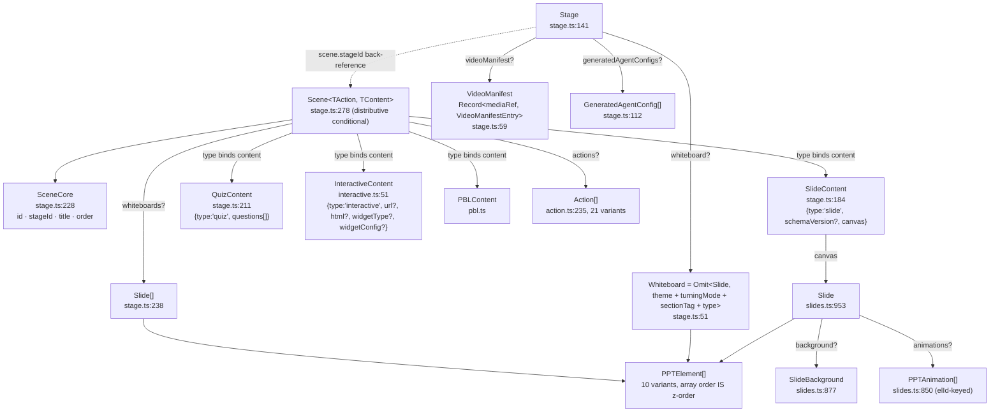
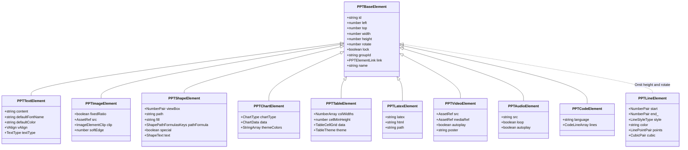

# 01 — The DSL: node-type inventory

The serialized slide contract lives in `packages/@openmaic/dsl` — 16 source files, 4 847 lines, zero
runtime dependencies. This section is the inventory: what nodes exist, what each requires, how they nest,
and the smallest document a schema-validating consumer will accept. Invariants, validation and
versioning are in [./02-dsl-invariants.md](./02-dsl-invariants.md).

**Sources:** `packages/@openmaic/dsl/src/{index,slides,stage,action,interactive,schema-roots}.ts`,
`packages/@openmaic/dsl/{scripts/gen-schema.mjs,test/schema.test.ts}`,
`lib/server/agent-runtime/course-edit/apply.ts`; evidence
[../appendix/research/dsl-renderer-editor/01a-modules.md](../appendix/research/dsl-renderer-editor/01a-modules.md)
and [../appendix/research/dsl-renderer-editor/02a-interfaces.md](../appendix/research/dsl-renderer-editor/02a-interfaces.md).

## 1. The barrel and its deliberate omission

`src/index.ts:25-37` re-exports thirteen modules flat. `schema-roots.ts` is **not** among them: it exists
only to hand the JSON-Schema generator a concrete, non-generic root, and re-exporting it would publish a
type nothing should program against (`src/schema-roots.ts:8`). The barrel docstring states the charter
(`src/index.ts:11-13`): "ONLY the spec … It must never gain a runtime dependency on React, pptx,
echarts, etc."

## 2. The document tree



The two whiteboard slots are not the same type: `Stage.whiteboard?` is `Whiteboard[]` (`stage.ts:151`),
the narrowed alias, while `SceneCore.whiteboards?` is a full `Slide[]` (`stage.ts:238`) — a scene
whiteboard may therefore carry `theme`, `turningMode`, `sectionTag` and `type`.

`Stage` does not embed its scenes. A `Scene` carries `stageId` as a back-reference for integrity
checks (`stage.ts:230`), and the two are stored as separate aggregates — which is why the version
ladder is written to run over "a `Stage` aggregate, a single Scene row, or a bundle of them"
(`version.ts:17-21`).

## 3. Element model

Two **regular** (not `const`) enums open `slides.ts`: `ShapePathFormulasKeys` (`:27`, 21 members) and
`ElementTypes` (`:51`, 10 members). The comment at `:21-26` gives the reason: consumers compile with
`isolatedModules`, under which importing an ambient `const enum` across a package boundary is TS2748,
so a regular enum is used to get both a value and a type.

`PPTBaseElement` (`slides.ts:156`) is `id / left / top / width / height / rotate` plus optional
`lock / groupId / link / name`. Nine variants extend it directly; `PPTLineElement` (`:480`) is the
exception — `extends Omit<PPTBaseElement, 'height' | 'rotate'>`.



Diagram notes: `type` is omitted from each body (it is the variant name lower-cased); `NumberPair` =
`[number, number]`, `CubicPair` = `[[number,number],[number,number]]`, `TableCellGrid` = `TableCell[][]`,
`CodeLineArray` = `CodeLine[]`; `end_` is `PPTLineElement.end` (`end` is a Mermaid reserved word) and the
dashed arrow marks the `Omit`.

### 3.1 Per-variant required fields and traps

| Variant | Line | Required beyond base | Trap worth knowing |
| --- | --- | --- | --- |
| `PPTTextElement` | `:210` | `content` (HTML string), `defaultFontName`, `defaultColor` | `content` is HTML, not plain text; `vAlign` (`:233`) came from the renderer+importer merge and defaults to top-anchored when absent |
| `PPTImageElement` | `:332` | `fixedRatio`, `src: AssetRef` | `clip.range` is a `[[x,y],[x,y]]` **percentage** pair (`:289`) |
| `PPTShapeElement` | `:432` | `viewBox: [number,number]`, `path`, `fixedRatio`, `fill` | `special` (`:447`) marks a path using commands beyond `L Q C A`; the pptx exporter rasterizes those. `fill: ''` means "no solid fill", not "unset" |
| `PPTLineElement` | `:480` | `start`, `end`, `style`, `color`, `points` | no `height`, no `rotate`; `start`/`end` are **local** to `(left, top)`, and `width` is used by the renderer as the stroke width |
| `PPTChartElement` | `:531` | `chartType`, `data`, `themeColors` | `ChartType` (`:497`) has exactly 8 members; importer 3-D variants collapse into them |
| `PPTTableElement` | `:674` | `outline`, `colWidths`, `cellMinHeight`, `data` | `rowHeights?` is a **minimum** height; `TableCell.vAlign` needs the importer's `up|mid|down` aliases normalized (`:619`) |
| `PPTLatexElement` | `:711` | `latex` | two representations coexist: `html` (KaTeX snapshot, current) and `path`/`color`/`strokeWidth`/`viewBox` (legacy SVG) |
| `PPTVideoElement` | `:736` | `autoplay` | both `src?` and `mediaRef?` are `AssetRef`; merging them is explicitly deferred (`:741-742`, `:748-749`), so consumers must handle both |
| `PPTAudioElement` | `:774` | `fixedRatio`, `color`, `loop`, `autoplay`, `src` | `src` is a plain `string`, **not** `AssetRef` (`:780`) — an asymmetry with image/video |
| `PPTCodeElement` | `:811` | `language`, `lines: CodeLine[]` | lines carry stable ids `L1`, `L2`… (`:791`) so the `wb_edit_code` action can address them |

The line-element `width` overload is documented only in the renderer:
`packages/@openmaic/renderer/src/elements/line/BaseLineElement.tsx:119` passes
`strokeWidth={elementInfo.width}` and `:33` derives the dash array from it, while
`PPTBaseElement.width` is annotated "元素宽度" (element width) at `slides.ts:146` and the line variant
inherits it uncommented. **Inferred:** setting `width` on a line to resize it changes its thickness.

### 3.2 `Slide`

```ts
// packages/@openmaic/dsl/src/slides.ts:953
export interface Slide {
  id: string;
  viewportSize: number;
  viewportRatio: number;
  theme: SlideTheme;
  elements: PPTElement[];
  background?: SlideBackground;
  animations?: PPTAnimation[];
  turningMode?: TurningMode;
  sectionTag?: SectionTag;
  type?: SlideType;
  /** @since-merge importer  Speaker notes carried over from the source .pptx. */
  script?: string;
}
```

`viewportSize` is the canvas width in the slide's own coordinate space and `viewportRatio` is
height/width. Three conventions coexist in-tree, so a mixed-`viewportSize` deck is expressible:
app-authored slides use `1000` (`lib/server/agent-runtime/course-edit/apply.ts:505`
`emptySlideContent`), the renderer's fit hook defaults to `1000`
(`packages/@openmaic/renderer/src/hooks/useViewportSize.ts:38`), and the importer emits the deck's real
pixel width — `1280` for a 16:9 deck, with `FALLBACK_VIEWPORT_SIZE = 1280`
(`packages/@openmaic/importer/src/import-pipeline/index.ts:34`). `SlideData` (`slides.ts:982`) is
`@deprecated`, retained only for persisted legacy payloads.

## 4. Scene content kinds

`SceneType = 'slide' | 'quiz' | 'interactive' | 'pbl'` (`stage.ts:22`). The scene-level `type` is
**bound** to its content by a distributive conditional:

```ts
// packages/@openmaic/dsl/src/stage.ts:278
export type Scene<
  TAction = Action,
  TContent extends { type: SceneType } = SlideContent | QuizContent,
> = TContent extends unknown
  ? SceneCore<TAction> & { type: TContent['type']; content: TContent }
  : never;
```

So the default `Scene` is `({type:'slide'; content:SlideContent} | {type:'quiz'; content:QuizContent})
& SceneCore` — the two fields cannot disagree at the type level, and `validateScene` re-checks the same
binding at runtime (`validate.ts:266-287`).

| Content kind | Declared at | Payload |
| --- | --- | --- |
| `SlideContent` | `stage.ts:184` | `{ type:'slide'; schemaVersion?: number; canvas: Slide }` |
| `QuizContent` | `stage.ts:211` | `{ type:'quiz'; questions: QuizQuestion[] }` — `QuizQuestion` (`:196`) is `single`/`multiple`/`short_answer` |
| `InteractiveContent<TWidgetConfig>` | `interactive.ts:51` | `{ type:'interactive'; url?; html?; widgetType?; widgetConfig? }` — generic extension point; the contract names only `WidgetConfigBase.type` (`:37`) |
| `PBLContent` | `pbl.ts` | project-based-learning project; four of its definitions are re-opened in the generated schema |

`InteractiveContent` requires at least one of `html` or `url` at the *validator* level
(`interactive.ts:64`), a disjunction the interface and the generated schema deliberately do not express
(`interactive.ts:47-49`); `url` is optional because producers historically wrote `url: ''`.
`WidgetType` has 6 members (`interactive.ts:4`): `simulation`, `diagram`, `code`, `game`,
`visualization3d`, `procedural-skill`.

## 5. The action vocabulary

`Action` (`action.ts:235`) is 21 variants over `ActionBase = { id; title?; description? }` (`:22`).
Scheduling class is data, not a type-level distinction:

| Constant | Line | Members |
| --- | --- | --- |
| `FIRE_AND_FORGET_ACTIONS` | `:261` | `spotlight`, `laser` |
| `SLIDE_ONLY_ACTIONS` | `:264` | `spotlight`, `laser` (same two, different reason: they target canvas elements) |
| `SYNC_ACTIONS` | `:267` | the other 19; each must finish before the next runs |
| `ACTION_TYPES` | `:290` | all 21, `as const satisfies readonly ActionType[]` |

Grouped by what they drive: canvas effects (`spotlight`, `laser`), narration (`speech`), media
(`play_video`), whiteboard (`wb_open`, `wb_draw_{text,shape,chart,latex,table,line,code}`,
`wb_edit_code`, `wb_clear`, `wb_delete`, `wb_close`), conversation (`discussion`), and widget control
(`widget_{highlight,setState,annotation,reveal}`). `SpeechAction` (`:47`) carries `audioId?: AssetRef`
plus `audioInvalidated?: boolean` (`:59`), the latter suppressing a legacy derived-id fallback once an
edit invalidates old narration; `WbEditCodeAction` (`:180`) is line-addressed through the `CodeLine.id`s
on `PPTCodeElement`. `PercentageGeometry` (`:333`) also lives here despite not being an action:
`x/y/w/h` plus `centerX/centerY`, all 0–100, used by the spotlight and laser overlays.

## 6. Minimal real example, annotated

The smallest scene the generated `scene.schema.json` accepts, verbatim from
`packages/@openmaic/dsl/test/schema.test.ts:99`:

```ts
const slideScene = {
  id: 'sc',              // SceneCore.id
  stageId: 'st',         // back-reference; not validated against a real Stage
  type: 'slide',         // must equal content.type — the Scene binding
  title: 't',
  order: 0,              // display order; a number, not an index into anything
  content: {
    type: 'slide',
    canvas: {            // a full Slide
      id: 'c',
      viewportSize: 1920,
      viewportRatio: 0.5625,
      theme: { themeColors: [], fontColor: '#000', fontName: 'Arial', backgroundColor: '#fff' },
      elements: [],      // legal empty; array order would be z-order
    },
  },
};
```

Note what is absent and still valid: no `actions`, no `whiteboards`, no `dslVersion` stamp, no
`schemaVersion`. The version stamp is an envelope field the store adds, not a document requirement
(`version.ts:17-21`). The smallest valid action, from the same file (`test/schema.test.ts:90`), is
`{ id: 'a', type: 'spotlight', elementId: 'e' }`; dropping `elementId` makes the schema reject it
(`:93`).

The app's own blank-slide factory, for contrast — note the `1000` viewport and that the whole canvas is
four required fields plus an empty array:

```ts
// lib/server/agent-runtime/course-edit/apply.ts:505
export function emptySlideContent(): SlideContent {
  return {
    type: 'slide',
    canvas: {
      id: `slide-${nanoid(8)}`,
      viewportSize: 1000,
      viewportRatio: 0.5625,
      theme: { backgroundColor: '#ffffff', themeColors: ['#2563eb'],
               fontColor: '#111827', fontName: 'Inter' },
      elements: [],
    },
  };
}
```

## 7. Generated schema artifacts

`scripts/gen-schema.mjs` runs `ts-json-schema-generator` (a devDependency, so the shipped package keeps
zero runtime deps) over the tsconfig program and emits three files into `dist/schema/` (`:15-19`):

| Root type | Artifact |
| --- | --- |
| `Stage` | `stage.schema.json` |
| `SerializedScene` (`schema-roots.ts:23`) | `scene.schema.json` |
| `Action` | `action.schema.json` |

Two pinned generator decisions: `jsDoc: 'extended'` (`:40`) because the contract now depends on `@default`
tags reaching the schema, and four PBL definitions re-opened to `additionalProperties: true` after
generation (`:24`, `:49-51`) because historical stored PBL documents carry app-owned runtime fields.
Everything else is `additionalProperties: false`, and `stage.ts:102-110` spells out the consequence:
an additive field is **non-breaking** for this codebase's structural validators but **breaking** for a
cross-language consumer validating against a pinned older schema artifact. A `DSL_VERSION` bump would
not help them — an old schema rejects the new document either way.

## Open questions

- Is `PPTLineElement.width` intentionally the stroke width? Only the renderer says so
  (`BaseLineElement.tsx:119`, `:33`), and `getElementRange` also treats a line's extent as
  `left + max(start[0], end[0])` (`packages/@openmaic/renderer/src/utils/element.ts:48`) — so `width`
  genuinely is not the box width for a line. The type needs either a comment or a rename.
- Why is `PPTAudioElement.src` a plain `string` while the image and video `src` are `AssetRef`
  (`slides.ts:780` vs `:341`, `:744`)? `AssetRef` *is* `string`, so this is documentation-only today,
  but `slideMediaSlotDescriptors` does classify `audio-src` as a media slot.
- Is `SlideData` (`slides.ts:982`) still written by anything? No writer was found in this subsystem.
- The generated artifacts could not be inspected (`dsl/dist` is absent here), so every schema claim above
  is read from `gen-schema.mjs`, `schema-roots.ts` and `test/schema.test.ts`, not an emitted `.json`.
