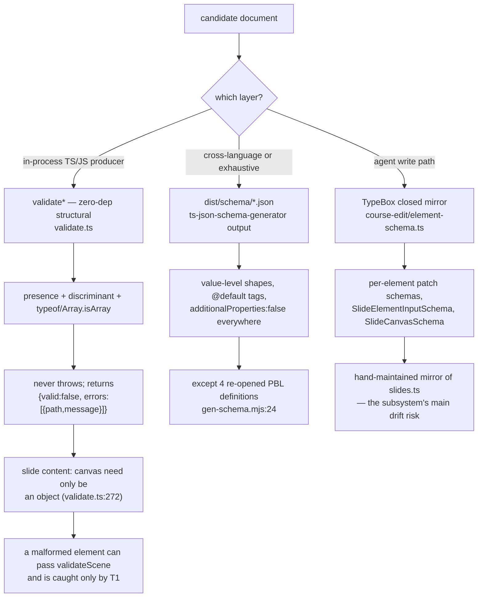
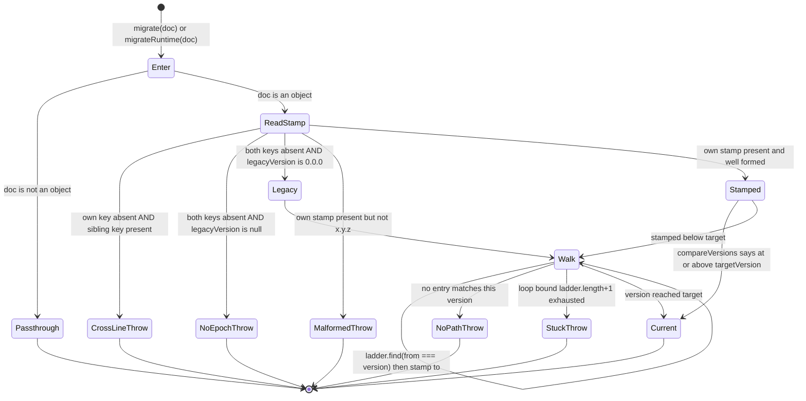

# 02 — DSL invariants, validation, versioning, migration

What a valid document must satisfy, who checks it, and how a stored document written years ago is
brought forward. Three mechanisms cooperate: `validate*` (report), `normalize*` (repair), and the
version ladders (migrate). Node types are in [./01-dsl-schema.md](./01-dsl-schema.md).

**Sources:** `packages/@openmaic/dsl/src/{validate,normalize,version,legacy-line-geometry,guards,runtime}.ts`,
`packages/@openmaic/dsl/scripts/gen-schema.mjs`, `lib/edit/slide-schema.ts`,
`scripts/check-package-version-bumps.mjs`;
evidence [../appendix/research/dsl-renderer-editor/02b-interfaces.md](../appendix/research/dsl-renderer-editor/02b-interfaces.md),
[../appendix/research/dsl-renderer-editor/05-failure-modes.md](../appendix/research/dsl-renderer-editor/05-failure-modes.md).

## 1. The invariants

| # | Invariant | Enforced by |
| --- | --- | --- |
| I1 | `scene.type === scene.content.type` for all four kinds | the `Scene` distributive conditional (`stage.ts:278`) at compile time; `validate.ts:267` at runtime |
| I2 | Every enumerated union's tuple is exhaustive in both directions | `as const satisfies readonly T[]` plus a companion conditional type: `SCENE_TYPES` (`stage.ts:30`, `:35`), `ACTION_TYPES` (`action.ts:312`, `:318`), `WIDGET_TYPES` (`interactive.ts:20`, `:24`), `RUNTIME_SESSION_STATUSES` (`runtime.ts`) |
| I3 | Each action variant carries its variant-required fields with the right runtime kind | `ACTION_REQUIRED_FIELDS` (`validate.ts:43`), a `Record<ActionType, Record<field, FieldKind>>` kept in lockstep with the generated `action.schema.json` **by a test** |
| I4 | A `line` element carries neither `height` nor `rotate` | the type's `Omit` (`slides.ts:480`); on stored data, migration step 0.2.0→0.3.0 (`legacy-line-geometry.ts:64`) |
| I5 | Array order in `Slide.elements` is z-order | the renderer, not the contract: `elementIndexById` → `zIndex` (`packages/@openmaic/renderer/src/SlideCanvas.tsx:119`, `SlideElement.tsx:170`) |
| I6 | A line's `start`/`end` are **local** to `(left, top)` | `normalize.ts:518-526` derives `start=[0,0]`, `end=[width,height]`, with the comment naming the double-offset bug absolute coordinates would cause |
| I7 | A `runtimeDslVersion`-stamped aggregate never carries `dslVersion`, and vice versa | `validate.ts:405` rejects the stray stamp; `versionOf` (`version.ts:388`) throws on the ambiguous envelope |
| I8 | A `RuntimeRecord.seq` is a non-negative integer | `validate.ts:447` — `typeof x === 'number'` alone would admit `NaN`/`Infinity`/fractional and corrupt replay order |
| I9 | `normalize*` is pure, non-mutating and idempotent | stated at `normalize.ts:32-33`; every path spreads rather than assigns |
| I10 | Every migration transform is pure, side-effect-free, and depends on no runtime library | stated as a contract requirement at `version.ts:147-152` |

Two invariants are notably **not** enforced anywhere in the contract: `Scene.stageId` is never checked
against a real `Stage` (it is documented as being "for data integrity checks", `stage.ts:230`), and
element ids are not checked for uniqueness within a slide by `validateScene`. The latter is caught
only on the agent write path — see [./05-ai-edit-operations.md](./05-ai-edit-operations.md).

## 2. Three checking layers, deliberately unequal



`validate.ts:11-16` states the relationship explicitly: the validators are a **structural subset**
(presence + discriminants), the shipped JSON Schema is the cross-language mirror that additionally
checks each field's value shape, and both describe the same contract.

### 2.1 The validator surface

```ts
// packages/@openmaic/dsl/src/validate.ts
export function validateStage(doc: unknown): ValidationResult              // :299
export function validateScene(doc: unknown): ValidationResult              // :311
export function validateInteractiveContent(doc: unknown): ValidationResult // :318
export function validatePBLContent(doc: unknown): ValidationResult         // :325
export function validateAction(doc: unknown): ValidationResult             // :332
export function validateRuntimeSession(doc: unknown): ValidationResult     // :353
export function validateRuntimeRecord(doc: unknown): ValidationResult      // :435
```

All return `{valid:true} | {valid:false; errors: ValidationIssue[]}` where `ValidationIssue` is
`{path, message}` with a JSON-pointer-ish path such as `/actions/0/elementId` (`:26-30`). None of
them throws.

`validateStage` is thin on purpose (`:299-308`): `id`, `name` as non-empty-ish strings and
`createdAt`/`updatedAt` as numbers. Scenes are separate aggregates and are not reachable from a
`Stage`, so a stage check cannot validate them.

Two rules are stricter than "structural", and both have written reasons:

- `validateRuntimeSession` rejects a stray document-line `dslVersion` on a session (`:405-411`) — the
  one deliberate exception to "unknown fields are ignored", because a doubly-stamped envelope makes
  the cross-line guard ambiguous once stored.
- `validateRuntimeRecord` narrows `seq` and `actionIndex` to non-negative integers (`:447`, `:453`)
  and requires a real `payload` value rather than merely the key (`:470` — `'payload' in doc` would
  admit an explicit `{payload: undefined}`; `null` stays legal).

Also on `validateRuntimeSession`: `runtimeDslVersion` is **required** and must be well-formed `x.y.z`
(`:386-398`), because the runtime line has no unversioned epoch and accepting a string like
`'legacy'` would only defer the throw to read time.

### 2.2 `normalize*` — the repair pass

`normalize.ts` is the complement of `validate.ts`: validate reports, normalize repairs. Semantics are
stated once at `normalize.ts:28-33`:

| Input state | Result |
| --- | --- |
| required content field **missing** | filled with the canonical default |
| present but **wrong-typed** | **throws** — a producer bug, not something to silently reset |
| present and well-formed | passed through untouched |

`ELEMENT_DEFAULTS` (`:79`) is the single source of truth for static defaults, mirrored onto the
generated schema through `@default` JSDoc on the type fields, with a test pinning the two
(`:72-73`):

| Kind | Defaults |
| --- | --- |
| `text` | `defaultFontName: 'Microsoft YaHei'`, `defaultColor: '#333333'`, `content: ''` |
| `image` | `fixedRatio: true` |
| `shape` | `fill: '#5b9bd5'`, `fixedRatio: false` |
| `shapeText` | `content: ''`, font/colour as text, `align: 'middle'` |
| `line` | `style: 'solid'`, `color: '#333333'`, `points: ['', '']` |

Geometry-derived defaults have no static value: a shape's `viewBox` defaults to `[width, height]` and
its `path` to `rectPath(width, height)` (`:472-473`); a line's `start` to `[0,0]` and `end` to
`[width, height]` (`:525-526`), local to the element origin per I6.

`normalize.ts` scopes itself out of base identity/geometry (`id`, `left/top/width/height/rotate`)
because those are producer-supplied (`:35-42`) — the `id` in particular is often assigned downstream.
`chart`/`table`/`latex`/`video`/`audio`/`code` elements pass through unchanged (`:574-580`): the
contract owns no defaults for them yet.

Two helpers encode a single-field distinction worth knowing: `str` (`:394`) treats `''` as absent,
`strKeepEmpty` (`:406`) does not — used only for a shape's `fill`, where `''` means "no solid fill"
and the renderer maps it to `none` (`:474-478`).

The degrade policy is an explicit parameter, not an implicit behaviour:

```ts
// packages/@openmaic/dsl/src/normalize.ts:601
export interface NormalizeSlideOptions {
  onInvalid?: 'throw' | 'drop';
  onDropped?: (element: unknown, error: unknown) => void;
}
```

`normalizeSlide` (`:616`) throws; `normalizeSlideWith({onInvalid:'drop', onDropped})` (`:632`) drops
the one element and reports it. Both are unary so `slides.map(fn)` stays valid — an options parameter
would collide with `map`'s index argument (`:613-614`). The importer is the one caller that chooses
`'drop'`.

## 3. Two independent version lines

| Line | Stamp field | Current | Ladder | Unversioned epoch? |
| --- | --- | --- | --- | --- |
| document | `dslVersion` (`version.ts:91`) | `DSL_VERSION = '0.3.0'` (`:61`) | `DSL_MIGRATIONS`, 3 steps (`:235`) | yes — `UNVERSIONED_DSL_VERSION = '0.0.0'` (`:76`) |
| runtime | `runtimeDslVersion` (`:108`) | `RUNTIME_DSL_VERSION = '0.1.0'` (`:276`) | `RUNTIME_DSL_MIGRATIONS`, **empty** (`:314`) | no — throws `noRuntimeEpochError` (`:488`) |

A third, app-only line exists outside the package: `CURRENT_SLIDE_CONTENT_SCHEMA_VERSION = 1`
(`lib/edit/slide-schema.ts:24`) on `SlideContent.schemaVersion`, applied by `migrateSlideContent`
(`:26`) at every SlideContent read boundary. It has no per-step migration body — v1 only guarantees
the field is present (`slide-schema.ts:11-13`) — and it is forward-compatible in the same way as the
DSL ladder (`:31-36`).

### 3.1 The document ladder

```ts
// packages/@openmaic/dsl/src/version.ts:235
export const DSL_MIGRATIONS: readonly DslMigration[] = [
  { from: UNVERSIONED_DSL_VERSION, to: INITIAL_DSL_VERSION, migrate: (doc) => doc },
  { from: INITIAL_DSL_VERSION, to: '0.2.0', migrate: stampAudioUrlAbolition },
  { from: '0.2.0', to: '0.3.0', migrate: stripLegacyLineRotateHeight },
];
```

Every `from`/`to` is a **pinned literal**, never the moving `DSL_VERSION`, so appending a step cannot
retroactively re-target an existing one (`:213-216`).

Steps 1 and 2 are pure stamps. Step 2's reason is instructive (`version.ts:163-182`): 0.2.0 removes
`audioUrl` from the *contract*, but removing it from *data* is not a pure transform's job — the URL
may be the only live handle for the narration, and whether it is live is a reachability question only
the app-side reference converter can answer by probing. The ladder runs on every read, before the
converter sees the document, so a ladder entry that dropped `audioUrl` would destroy a possibly live
handle first.

Step 3 is the ladder's only real payload transform. Its motivation (`version.ts:188-205`) is a
concrete production failure: `patch_stage` validates the whole canvas against a closed schema whose
`line` variant lists neither `rotate` nor `height`, so **one** legacy line element made every agent
edit to its scene fail — old classrooms opened fine (import does not validate) and then rejected
their first agent edit.

`stripLegacyLineGeometry` (`legacy-line-geometry.ts:64`) walks every line-element surface of every
migratable envelope shape: a Stage aggregate (`{stage, scenes}`), a single Scene row, or a single
Stage row (`:24-32`). It returns the input **by identity** when nothing needed stripping (`:19-20`,
implemented at `:88`) and shares untouched subtrees by reference — a cheap no-op detector. It gates on
`content.type === 'slide' || content.type === undefined` (`:143`): an absent discriminant stays
eligible because the dirty-line epoch predates schema enforcement.

### 3.2 The runner and the cross-line guard



Everything above is `runLadder` (`version.ts:597`) plus its single reader `versionOf` (`:379`).
The design points:

- **One reader.** `versionOf` is the sole implementation behind `dslVersionOf` (`:407`),
  `runtimeDslVersionOf` (`:423`), `needsMigration` (`:507`), `needsRuntimeMigration` (`:532`) and both
  runners, so a predicate and its runner cannot disagree on an envelope and a
  `while (needsMigration(x)) x = migrate(x)` loop always terminates or fails loud (`:428-438`).
- **Cross-line guard**, case (3) at `:588-595`: own stamp absent + sibling stamp present → throw.
  Both silent answers are named and rejected — walking the ladder mangles a misrouted session,
  returning it unchanged permanently orphans a stray-stamped document from its own line.
- **Forward compatibility**: a document stamped newer than the target is returned untouched (`:617`),
  so its on-disk shape survives for the next compatible reader.
- **Loop safety**: the walk is bounded at `ladder.length + 1` iterations and then throws "did not
  reach" (`:622`, `:632`), so a cyclic or non-advancing registry cannot spin.
- **Non-objects are not migratable aggregates** and are returned as-is on every line (`:605`); the
  predicates answer `false` for them (`:447`).

`stampVersion` (`:540`) returns `{...doc, [key]: version}` — never mutates.

## 4. The release rule that protects the format

Changing `DSL_VERSION` or `RUNTIME_DSL_VERSION` requires an npm version increase that the dependents'
caret range will **not** admit: a MINOR while `@openmaic/dsl` is `0.x`, a MAJOR once it reaches
`1.0.0` (`version.ts:25-40`). The rule is stated as "escapes the caret" rather than as a fixed level
because the level changes at the 1.0 boundary.

The failure it prevents is spelled out at `version.ts:46-50`: `@openmaic/storage`, `renderer` and
`importer` depend on the DSL as `workspace:^`, published as a caret; the same published `storage`
version resolved against two different admitted dsl versions would write rows it then refuses to
read, because storage compares these constants by value.

`scripts/check-package-version-bumps.mjs` enforces it at merge time and at release. Mechanics and its
documented limitations are in [./10-public-package-api.md](./10-public-package-api.md).

## 5. Where each layer runs

| Boundary | Layer | Behaviour |
| --- | --- | --- |
| pptx import | `normalizeSlideWith({onInvalid:'drop'})` | drop the element, `console.warn`, keep the slide (`packages/@openmaic/importer/src/import-pipeline/index.ts:101`) |
| generation output | `validate*` / `normalize*` per producer | see [../06-generation-pipeline/index.md](../06-generation-pipeline/index.md) |
| agent `patch_stage` | closed TypeBox canvas schema **then** `validateScene` | reject the op with a path-anchored message ([./05-ai-edit-operations.md](./05-ai-edit-operations.md)) |
| browser editor commit | op-kernel field-kind tables only | no `validateScene` on the write path ([./04-editor-prosemirror.md](./04-editor-prosemirror.md)) |
| store read | `migrate` / `migrateRuntime` | see [../10-persistence-and-state/index.md](../10-persistence-and-state/index.md) |

## Open questions

- **The most consequential gap in this section.** `validateScene` accepts a `slide` scene whose
  `content.canvas` is merely "an object" (`validate.ts:272`) and never runs an element-level check.
  `validateAppScene` (`lib/document-store/validators.ts:27`) delegates straight to it for slide
  scenes. So a browser-side edit can, in principle, persist an out-of-contract element that the agent
  path's TypeBox `validateSlideCanvas` would have rejected. Whether any browser write path applies an
  equivalent check was not established.
- How many stored documents are still below `DSL_VERSION 0.3.0`, and whether migration runs eagerly
  or lazily per access. The 0.2.0→0.3.0 comment implies real affected data existed
  (`version.ts:196-201`), but no telemetry or backfill script was found in this subsystem; the
  migrate-on-read boundary belongs to `@openmaic/storage`.
- Whether `SlideContent.schemaVersion` will ever move past `1`. If not, it is a permanent no-op field
  every writer still stamps, and nothing connects it to the ladder mechanics in `version.ts`.
- `RUNTIME_DSL_MIGRATIONS` ships empty and `runtime.ts:6` describes `RuntimeStore` as "Part B of
  #869". Whether the runtime version line has a live producer today was not determined from this
  subsystem's scope.
- The generated schema artifacts could not be inspected (`packages/@openmaic/dsl/dist` is absent in
  this checkout), so which definitions actually end up `additionalProperties: false` is read from
  `gen-schema.mjs:24` and asserted at `stage.ts:104` rather than verified against an emitted file.
