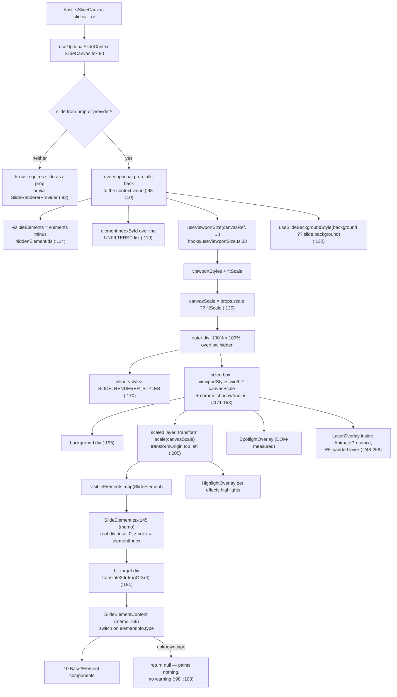
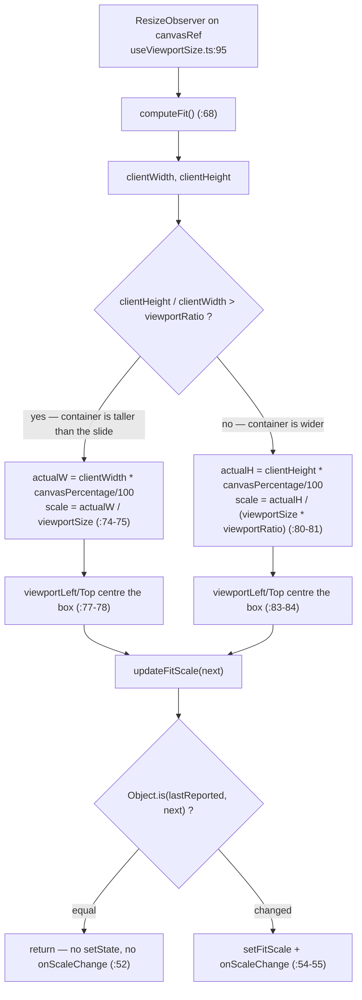
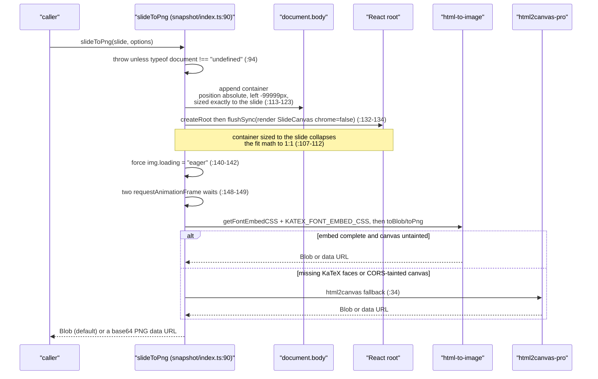

# 03 — The renderer: DSL → React/DOM

`@openmaic/renderer` (48 files, 5 003 lines) is read-only paint: a `Slide` in, DOM out, plus an
off-screen snapshot path. This section is the contract it offers a host, how layout is computed, and
— honestly — which parts of the output are deterministic and which are not.

**Sources:** `packages/@openmaic/renderer/src/{SlideCanvas.tsx,SlideElement.tsx,styles.ts}`,
`src/hooks/useViewportSize.ts`, `src/utils/{geometry,element}.ts`,
`src/elements/{text,shape,line}/Base*Element.tsx`, `src/snapshot/{index,measure}.ts`,
`packages/@openmaic/renderer/package.json`;
evidence [../appendix/research/dsl-renderer-editor/01a-modules.md](../appendix/research/dsl-renderer-editor/01a-modules.md) §2.

## 1. Export surface

Four subpath exports plus a static stylesheet (`packages/@openmaic/renderer/package.json:9`): `.`,
`./elements`, `./types`, `./snapshot`, `./fonts.css`. `./types` is a pure re-export of the whole DSL
plus the renderer's own `effects` types (`src/types/index.ts:4`), which is why a historical
`@openmaic/renderer/types` import still resolves against the contract.

23 of the 48 source files carry `'use client'`, which is why the build uses
`rollup-plugin-preserve-directives` — Next.js needs those directives to survive bundling.

## 2. The render pass



Three structural facts a host must know:

1. **Array order is z-order.** `elementIndexById` maps element id → `index + 1` over the
   **unfiltered** element list (`SlideCanvas.tsx:119-122`) and that becomes `zIndex`
   (`SlideElement.tsx:170`). Hiding an element therefore does not renumber its siblings.
2. **The element box lives in the leaf, not the wrapper.** `SlideElement`'s root div is
   `position:absolute; inset:0` with only `zIndex`, `color` and `fontFamily`
   (`SlideElement.tsx:164-175`). Each `Base*Element` positions itself from the authored
   `left/top/width/height` — e.g. `BaseTextElement.tsx:36-42`, `BaseShapeElement.tsx:144-150`.
3. **`dragOffsets` never touches the document.** It is a compositor-only `translate3d` plus
   `willChange:'transform'` on the hit-target wrapper (`SlideElement.tsx:181-184`), supplied by the
   editing surface during a move gesture.

### 2.1 Determinism levers on `SlideCanvasProps`

| Prop | Line | Effect |
| --- | --- | --- |
| `scale` omitted | `:38` | auto-fit; `useViewportSize` measures the container, and `onScaleChange` is wired **only** in this mode (`:128`) |
| `scale` given | `:38` | fit math bypassed; renders at `viewportSize × scale` |
| `canvasPercentage` | `:40` | percent of the container the slide occupies when auto-fitting |
| `chrome` (default `true`) | `:86` | drop shadow + `0.5rem` radius on the sized box (`:174-179`) and the background div (`:200`). Snapshot pipelines pass `false` so html2canvas does not bake a 1px outline and rounded corners into the PNG (docstring `:78-85`) |
| `hiddenElementIds` | `:75` | filtered out of rendering **and** effect targeting — `laserGeometry`/`zoomGeometry` and `HighlightOverlay` all resolve against `visibleElements` (`:138`, `:147`, `:235`) |
| `dragOffsets` | `:73` | compositor-only, per element |
| `elementIdPrefix` (default `'slide-element-'`) | `:69` | must match `SpotlightOverlay`'s prefix, and the snapshot probe hard-codes the same default (`snapshot/measure.ts:57`) |
| `renderImage`/`renderVideo`/`renderText`/`renderShapeLabel`/`renderTable` | `:48`–`:60` | slot overrides; this is how the editor layers live ProseMirror into an otherwise read-only canvas |

## 3. Layout computation

### 3.1 Fit scale



Defaults come from the hook, not the slide: `viewportSize = 1000`, `viewportRatio = 0.5625`,
`canvasPercentage = 100` (`useViewportSize.ts:38-41`). `viewportStyles` is always the slide's own
design-pixel box (`width: viewportSize`, `height: viewportSize * viewportRatio`, `:100-108`); only the
CSS `transform: scale()` on the inner layer converts it to container pixels
(`SlideCanvas.tsx:213`). The `Object.is` de-dupe at `:52` is what keeps a stable container from
re-notifying the host every observer tick.

One subtlety: when `onScaleChange` transitions from absent to present, `lastReportedScaleRef` is reset
to `undefined` (`:62-64`) so the newly-attached listener gets the current value rather than nothing.

### 3.2 Two geometry helpers that do not agree

| Helper | Location | Reads |
| --- | --- | --- |
| `getElementPercentageGeometry` | `src/utils/geometry.ts:16` | the **authored** `left/top/width/height` against `viewportSize × viewportSize*viewportRatio`, returning 0–100 space. Pure, synchronous, needs no DOM |
| `measureSlideElementGeometry` | `src/snapshot/measure.ts:73` | the **rendered** `.element-content` `getBoundingClientRect()`, normalized against the SlideCanvas inner container, also 0–100 |

The divergence is real and documented at `measure.ts:6-13`: `BaseTextElement` renders
`height: elementInfo.vertical ? '100%' : 'auto'` on `.element-content` plus `padding: '10px'`
(`BaseTextElement.tsx:62-66`), so an auto-sized text box's rendered extent is not its authored box —
and a spotlight placed on the authored box sits offset from the rendered text. The video-export
compiler consumes the measured map as a `GeometryProbe` and falls back to the authored box for
anything unmeasured (`measure.ts:18-20`); see [../09-media-and-export/index.md](../09-media-and-export/index.md).

`getElementPercentageGeometry` returns `null` for an element lacking any of the four box fields
(`geometry.ts:21-28`) — which is exactly a `line` element, since it has no `height`.

### 3.3 Line geometry is its own coordinate system

`getElementRange` (`src/utils/element.ts:43`) has three branches, and the line branch is the odd one:

```ts
// packages/@openmaic/renderer/src/utils/element.ts:46
if (element.type === 'line') {
  minX = element.left;
  maxX = element.left + Math.max(element.start[0], element.end[0]);
  minY = element.top;
  maxY = element.top + Math.max(element.start[1], element.end[1]);
}
```

So a line's extent comes from `start`/`end`, not from `width`/`height`. `width` is used as the SVG
stroke width (`BaseLineElement.tsx:119`), as the dash-array base (`:32-39`) and as the arrow/dot
marker base size (`:102`, `:111`). The SVG viewport itself is `max(|Δx|, 24)` × `max(|Δy|, 24)`
(`:22-30`) — a 24px floor so a horizontal or vertical line still has a paintable box.

`getLineElementPath` (`element.ts:72`) turns the mutually-exclusive control-point fields into an SVG
`d`: `broken` → `M L L`, `broken2` → a four-point staircase whose orientation depends on which range
is wider (`:81-84`), `curve` → `Q`, `cubic` → `C`, otherwise a straight `M L`.

## 4. What is deterministic, and what is not

**Deterministic:** element boxes, z-order, fit scale, path geometry, and the CSS reset.
`createTextProseStyles(selector)` (`src/styles.ts:18`) exists precisely so the static renderer and the
ProseMirror editor share one layout contract while keeping different DOM roots (`:11-17`); it is
injected once as an inline `<style>` at the top of `SlideCanvas` (`SlideCanvas.tsx:170`), which is why
the package needs no Tailwind at runtime.

**Not deterministic:** anything whose height is `auto`.

| Source of nondeterminism | Where | Mitigation |
| --- | --- | --- |
| auto-height text extent depends on loaded font faces | `BaseTextElement.tsx:66` | `measure.ts:117-129` force-loads every `(style, weight, family)` triple actually present in the tree before awaiting `document.fonts.ready` |
| `document.fonts.ready` alone is racy | `measure.ts:110-114` | it can resolve *before* the off-screen render triggers a self-hosted woff2 fetch, leaving a fallback face whose advances differ |
| KaTeX re-fits after `KaTeX_Size` loads (a React state update) | `measure.ts:136-139` | two `requestAnimationFrame` waits bracket the read on each side (`:115`, `:138`) |
| the settle wait is capped | `measure.ts:55` `DEFAULT_TIMEOUT_MS = 5000` | on a cold cache the measurement proceeds with fallback faces — producing exactly the drift the module exists to prevent |
| shape paths can extend outside the element box | `BaseShapeElement.tsx:174-181` | the SVG viewport is grown to the path's coordinate bbox and offset back, capped at `CAP = 4000` px (`:185`), because html2canvas-pro clips SVG overflow and turned connector arcs into stubs |
| an unknown SVG path token | `BaseShapeElement.tsx:82` | skipped rather than looped on; a non-finite bbox returns `null` (`:85-93`) and no padding is applied |
| an unrecognised element `type` | `SlideElement.tsx:98`, `:103` | **none** — the switch returns `null` with no default warning, so the element silently does not paint |

That last row is a genuine silent-failure surface: a future DSL element type renders as nothing until
someone notices.

## 5. The snapshot path



Why native-paint-first (`snapshot/index.ts:10-25`): `html-to-image` serializes the slide into an SVG
`<foreignObject>` that **the same Chrome engine painting the live classroom** rasterizes, so KaTeX
HTML, CSS `filter`, soft-edge `mask` and mixed CJK/Latin text come out as the classroom shows them.
html2canvas-pro re-implements layout and paint, which re-rasterizes KaTeX internals, drops
filter/mask, and cannot draw `<video>`. The one thing a foreignObject SVG cannot do is reach the
document's font registry, hence the up-front font embed.

`position: absolute` rather than `fixed` is deliberate (`:109-112`): some browsers skip paint for
`position: fixed` elements outside the viewport. `flushSync` is required (`:128-131`) because without
it React 18's scheduler can defer the first commit past the RAF waits and the snapshot captures an
empty container. `pixelRatio` defaults to `window.devicePixelRatio ?? 1` (`:102`).

`measureSlideElementGeometry` mirrors the same mount lifecycle (`measure.ts:22-23`) and is
deliberately forgiving: an element id that is not in the DOM is simply **absent from the result map**
(`:150-151`), a zero-sized container returns early (`:147`), and a 0×0 rect is skipped (`:155`). It
throws only for a non-browser environment (`:79-81`). Cleanup unmounts the root and removes the
container on `setTimeout(…, 0)` inside `finally` (`:162-168`).

## 6. Element components and their heavy dependencies

| Component | Extra dependency | Peer status |
| --- | --- | --- |
| `BaseChartElement` → `Chart` | `echarts >=5` | optional peer (`package.json:65`, `:73`) |
| `BaseCodeElement` | `shiki >=1.0.0` | optional peer (`:69`, `:76`) |
| `BaseLatexElement` | `katex ^0.16.33` | dependency (`:85`) |
| `BaseTableElement` → `StaticTable` | `tinycolor2` for sub-theme colours (`utils/element.ts:1`) | dependency |
| `LaserOverlay` | `motion` `AnimatePresence` (`SlideCanvas.tsx:4`) | peer `>=11` |
| snapshot | `html-to-image ^1.11.13`, `html2canvas-pro ^2.0.4` | dependencies (`:83`, `:84`) |

Making echarts and shiki *optional* peers is what lets a host that never renders a chart or a code
block avoid pulling them into the bundle. The peer ranges are deliberately wide — the app happens to
pin `echarts ^6.0.0` (root `package.json:97`) and `shiki ^3.21.0` (`:150`), but the renderer accepts
echarts 5.x and shiki 1.x too.

## Open questions

- Is `@openmaic/renderer`'s required `tailwindcss >= 4` peer (`package.json:70`) still genuine now
  that `SLIDE_RENDERER_STYLES` is injected as a `<style>` element (`src/styles.ts:53`,
  `SlideCanvas.tsx:170`) and every element uses inline styles? The `DESIGN.md` D3 decision predates
  that injection.
- What `chrome: false` costs beyond the shadow and radius. The docstring names exactly those two
  effects (`SlideCanvas.tsx:78-85`); whether snapshot output is otherwise byte-identical to the
  on-screen canvas could not be verified without a browser in this checkout.
- Whether the renderer's `./fonts.css` export and the generated `KATEX_FONT_EMBED_CSS` are kept in
  sync with the app's own font loading. `packages/@openmaic/renderer/FONTS.md` was not read in full.
- Whether the silent `null` for an unknown element type (`SlideElement.tsx:98`) is intended as
  forward compatibility or is an oversight. There is no comment either way.
