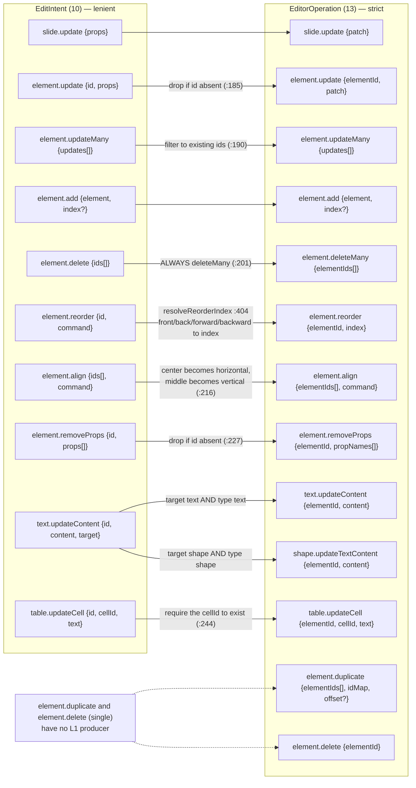
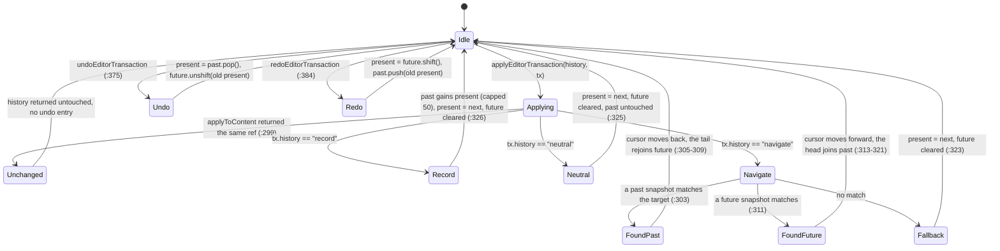
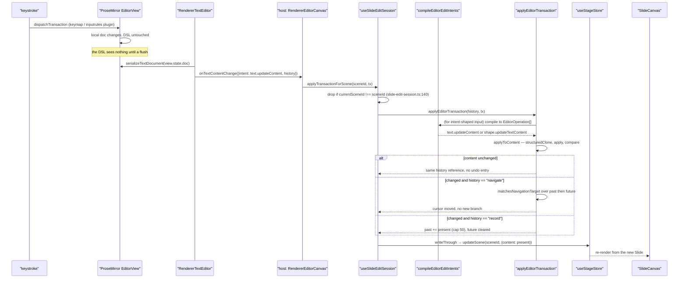
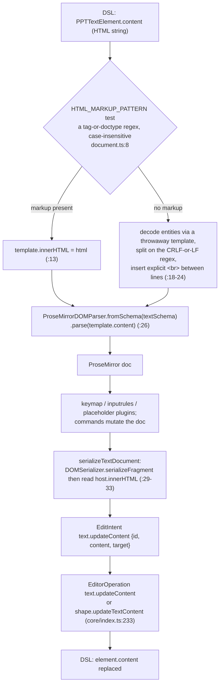

# 04 — The editor: op kernel, undo/redo, ProseMirror

`@openmaic/editor` (113 files, 16 302 lines) is mutation. It has a pure two-layer op kernel, a
controlled React gesture surface, and optional UI chrome. This section covers the layering, the
strictness asymmetry between the two op layers, undo/redo, and how ProseMirror rich text maps onto the
DSL's HTML-string `content` field.

**Sources:** `packages/@openmaic/editor/src/core/index.ts`, `src/react/{types.ts,useEditGesture.ts}`,
`src/react/core/intent.ts`, `src/react/text/{types.ts,commandExecutor.ts}`,
`src/react/text/prosemirror/**`, `packages/@openmaic/editor/package.json`,
`components/edit/surfaces/slide/slide-edit-session.ts`, `lib/prosemirror/index.ts`,
`lib/edit/slide-ops.ts`;
evidence [../appendix/research/dsl-renderer-editor/01b-modules.md](../appendix/research/dsl-renderer-editor/01b-modules.md) §3,
[../appendix/research/dsl-renderer-editor/03-flows.md](../appendix/research/dsl-renderer-editor/03-flows.md) Flow A.

## 1. Three layers, stated as a rule

`packages/@openmaic/editor/src/react/types.ts:18-24` names the layering explicitly:

| Layer | What | Where it lives |
| --- | --- | --- |
| **L0** | the canonical change representation (`EditorOperation`) | today in `editor/src/core`; the comment says it "belongs in `@openmaic/dsl`" |
| **L1** | `EditIntent` — the bounded UI gesture vocabulary the canvas emits | `editor/src/core` (types) + `editor/src/react` (producers) |
| **L2** | the agent tool surface, "expected to churn and lives outside this package" | `lib/server/agent-runtime/` — see [./05-ai-edit-operations.md](./05-ai-edit-operations.md) |

Three subpath exports (`packages/@openmaic/editor/package.json:8`): `./core` (also the default `.`),
`./react`, `./ui`.

## 2. The intent → operation mapping

L1 has 10 variants (`core/index.ts:119`), L0 has 13 (`:88`). L1 is coarser and **lenient**; L0 is
finer and **strict**. `compileEditorEditIntents` (`:162`) is the only translation point.

Two behaviours worth internalising:

- **The compiler advances a private working snapshot.** `append` (`core/index.ts:169`) applies each
  emitted operation batch to `working` through a `history:'neutral'` transaction before moving on, so
  intent *n+1* is compiled against the document as intent *n* left it (`:157-161`). Without this, a
  batch that adds an element and then updates it would drop the update.
- **Intents naming a nonexistent element are silently dropped** (`:185`, `:191`, `:200`, `:210`,
  `:227`, and the `type`/`cellId` mismatches at `:233`, `:244`). This is not sloppiness: L1 is the
  lenient layer *by design*, because a UI gesture can race a deletion. L0 throws in the same
  situation.

`element.duplicate` (`:100`) and single-element `element.delete` (`:96`) have no L1 producer in this
package; they are L0-only entry points for a host that drives the kernel directly.

## 3. Strictness at L0

`applyOperation` (`core/index.ts:424`) throws on every one of these:

| Condition | Line |
| --- | --- |
| operation names a missing element | `:661` (`missingElement`) |
| `element.add` with a duplicate id | `:434` |
| `element.duplicate` with an `idMap` gap or a colliding new id | `:477`, `:478` |
| patch setting or removing `id` / `type` | `:554`, `:501` |
| `slide.update` touching `elements` or `animations` | `:567` |
| a required field set to `undefined` or the wrong kind | `:604` |
| removing a required property | `:506` |
| a `table.updateCell` whose cell does not exist | `:544` |
| a transaction with zero operations | `:152` |

Three tables drive it:

| Table | Line | Enforces |
| --- | --- | --- |
| `IMMUTABLE_ELEMENT_PROPERTIES = {id, type}` | `:9` | identity is not patchable |
| `IMMUTABLE_SLIDE_PROPERTIES = {id}` plus the explicit `elements`/`animations` ban | `:10`, `:567` | `slide.update` is metadata-only |
| `REQUIRED_ELEMENT_FIELD_KINDS` per element type | `:27-75` | a required field cannot be nulled out or wrong-typed |

`REQUIRED_ELEMENT_FIELD_KINDS.line` (`:45-55`) spells out its own field list rather than spreading
`REQUIRED_BOX_FIELD_KINDS`, precisely because it must omit `height` and `rotate` — matching the DSL's
`Omit<PPTBaseElement, 'height'|'rotate'>`. `matchesFieldKind` narrows `'number'` through
`Number.isFinite` (`:636`), so `NaN` geometry is rejected.

**Atomicity is structural, not conventional.** `applyToContent` (`:393`) clones with
`structuredClone` (`:777`), applies every operation to the clone, and only then returns — so a throw
happens before the clone escapes (`:397-398`). A no-op batch returns the **original reference**
(`:401`, via a `JSON.stringify` comparison), which is what makes "no change ⇒ no undo entry" fall out
of `applyEditorTransaction` for free (`:299`).

## 4. Undo/redo

`EditorHistory = {past, present, future}` over whole `SlideContent` snapshots (`:137`), capped at
`MAX_EDITOR_HISTORY = 50` (`:3`, `capHistory` `:773`). Three history modes (`:78`):

`'navigate'` exists so ProseMirror's own undo and the document history stay in step instead of each
generating a separate entry. `matchesNavigationTarget` (`:346`) says a snapshot matches when it
deep-equals the target *or* when **every** operation's post-state is already present in it — and it
only recognises three operation types (`:357-371`): `text.updateContent`, `shape.updateTextContent`
and `table.updateCell`. Every other operation type returns `false`, so a `'navigate'` transaction
carrying, say, an `element.update` always falls through to "replace present, clear future" (`:323`).

## 5. The gesture surface

`EditableSlideCanvasProps` (`src/react/types.ts:86`) is a **controlled** contract: the host owns
`slide`, `selection` and undo. Selection is id-based, not position-based, "so it survives document
edits" (`:48`), and `EMPTY_SELECTION` is `Object.freeze`d two levels deep (`:72-74`).

The gesture→intent contract is stated at `src/react/types.ts:36-39`: one completed gesture emits
**exactly one** intent (or one batch), never one per animation frame, so it maps 1:1 onto one host
undo entry. `useEditGesture.ts:17` `DRAG_THRESHOLD_PX = 2` decides commit versus select-only
(`:289`), and a multi-element move collapses into a single `moveManyIntent` while a single-element
move stays on `moveIntent` for host backward compatibility (`:297-302`, builders at
`src/react/core/intent.ts:8`, `:38`).

`resizeIntent` (`src/react/core/intent.ts:19`) deliberately emits **box props only**. Its docstring
names what it does *not* recompute: a shape's `path`/`viewBox`, a table's `cellMinHeight`, an image's
clip mode. The host post-processes. That is a documented seam — and it is exactly where a shape
resized in the packaged editor diverges from the same shape resized in the legacy canvas, which does
recompute them (`components/slide-renderer/Editor/Canvas/hooks/useScaleElement.ts`).

## 6. A keystroke becomes a DSL mutation

`writeThrough` (`components/edit/surfaces/slide/slide-edit-session.ts:79`) is the single point where
an edit reaches `useStageStore`, deliberately so that undo, redo, `applyOp`, user `commitContent` and
the ResizeObserver normalization all stay in lockstep (`:71-78`). The session store does **not**
persist to localStorage: the stage store is the source of truth and auto-persists, so there is
nothing "unsaved" to recover on reload — stated as a design decision at `:14-17`.

Two compatibility behaviours live in that file and are worth knowing:

- `applyOp` makes a legacy-toolbar op on an already-deleted element a **silent no-op** (`:117-122`),
  while explicit transactions stay strict, "so callers cannot hide invalid batch operations behind
  this compatibility behavior".
- `commitContent(next, /* isUserEdit */ false)` — the renderer's ResizeObserver text auto-height
  normalization — replaces `present` and writes through but leaves `past` untouched and clears
  `future` (`:147-158`). The reasoning at `:50-61`: the reflow can chase a user resize, so wiping the
  undo stack would silently break undo, but leaving a stale redo branch would let a later redo revert
  the normalization.

## 7. ProseMirror integration

The packaged stack is `packages/@openmaic/editor/src/react/text/prosemirror/`: `schema/{nodes,marks}.ts`,
`plugins/{inputrules,keymap,placeholder}.ts`, `commands/{replaceText,setListStyle,setTextAlign,setTextIndent,toggleList}.ts`,
plus `document.ts`, `utils.ts` and `selection-sync.ts`.

`initTextEditor(element, content, options)` (`prosemirror/index.ts:9`) builds an `EditorState` from
`createTextDocument(content)` and `buildPlugins(textSchema, options)`, then constructs an
`EditorView`. That is the whole entry point — 20 lines.

`buildPlugins` (`plugins/index.ts:16`) installs six plugins in a fixed order, plus a seventh only when
a placeholder string is supplied (`:28`). Three of the six are stock and unconfigured — `dropCursor()`,
`gapCursor()`, `history()` (`:23-25`) — and `keymap(baseKeymap)` is registered *after* the local keymap
(`:21-22`) so a local binding wins. What is local:

| Plugin | Source | Behaviour |
| --- | --- | --- |
| `buildInputRules(schema)` | `plugins/inputrules.ts:49` | stock `smartQuotes`, `ellipsis`, `emDash`, then five local rules: `> ` wraps a blockquote (`:11`); `1. ` opens an ordered list whose `order` attr is the typed number, and the rule only fires when that number continues the list (`:13-19`); `-`/`+`/`*` + space opens a bullet list (`:21`); `` `x` `` replaces the backticks with `x ` and applies the `code` mark (`:23-34`); a bare URL — the scheme is optional (`:37`) — gets a `link` mark with `href` and `title` both set to the matched text (`:36-47`) |
| `keymap(buildKeymap(schema))` | `plugins/keymap.ts:18` | mark toggles `Mod-b/i/u/d/e/;/'` → strong, em, underline, strikethrough, code, superscript, subscript (`:28-34`); `Mod-z`/`Mod-y` undo/redo; `Backspace` → `undoInputRule`, so an autoformat that just fired can be typed back out (`:26`); `Escape` → `selectParentNode`; `Alt-Arrow{Up,Down}` → `joinUp`/`joinDown`; `Enter` is a `chainCommands` that tries `splitListItem` first and falls back through `newlineInCode`, `createParagraphNear`, `liftEmptyBlock`, `splitBlockKeepMarks` (`:35-44`); `Mod-[`/`Mod-]`/`Tab` lift and sink list items (`:45-47`) |
| `placeholderPlugin(placeholder)` | `plugins/placeholder.ts:9` | a decorations-only plugin: it decorates the paragraph **holding the cursor** with `data-placeholder` whenever that paragraph is empty (`nodeSize === 2`, `:5-7`), so the hint follows the caret rather than appearing only on an empty document |

One trap in that keymap: `Tab` is bound *only* to `sinkListItem` (`keymap.ts:47`). Outside a list the
command returns `false`, nothing else in either keymap claims `Tab`, so focus leaves the editor — text
boxes are not tab-indentable.

`selection-sync.ts` is one six-line predicate, not a plugin: `shouldPushAttrs(tr)` returns
`tr.selectionSet || tr.docChanged || tr.storedMarksSet`. `RendererTextEditor`'s
`dispatchTransaction` uses it to decide whether to re-derive and push toolbar format state to the host
(`RendererTextEditor.tsx:144`), which keeps a pure-scroll or pure-metadata transaction from
re-rendering the toolbar.

### 7.1 The DSL ↔ ProseMirror document mapping

The DSL stores rich text as an **HTML string** on `PPTTextElement.content` (and on
`ShapeText.content`, and on `TableCell.text`). The mapping is therefore HTML ↔ PM doc, not a bespoke
node schema:

The two-branch parse exists to mirror the renderer. `preservesPlainTextLineBreaks`
(`packages/@openmaic/renderer/src/utils/richText.ts`) makes the static renderer paint a tag-free
`content` with `white-space: pre-line` (`BaseTextElement.tsx:27`); the editor's tag-free branch turns
the same literal newlines into explicit ` ` nodes so a plain-text `content` round-trips the same
way in both.

The legacy app stack does **not** do this. `lib/prosemirror/index.ts:12-17` always wraps:
`createDocument` builds `` `
${content}
` `` and parses that. So a plain-text `content`
containing newlines round-trips differently depending on which editor is enabled — a real behavioural
divergence between the two live stacks, flagged again in the open questions.

### 7.2 Text commands

`TextEditCommand` (`src/react/text/types.ts:3`) is a three-arm union:

| Arm | Line | Members |
| --- | --- | --- |
| no value | `:4-15` | `bold`, `em`, `underline`, `strikethrough`, `subscript`, `superscript`, `blockquote`, `code`, `clear` |
| required value | `:16-28` | `fontname`, `fontsize`, `forecolor`, `backcolor`, `align`, `indent`, `textIndent`, `insert`, `replace` |
| optional value | `:29-32` | `fontsize-add`, `fontsize-reduce`, `bulletList`, `orderedList`, `link` |

`executeTextCommand` (`src/react/text/commandExecutor.ts:82`) dispatches them onto an `EditorView`.
Two behaviours are non-obvious: `applyMark` calls `autoSelectAll(view)` first (`:22`), so a font or
colour change with a collapsed cursor applies to the whole box; and `fontsize`/`forecolor`
additionally call `setListStyle` (`:107`, `:121`) so list markers inherit the size and colour.

`TextEditorController` (`src/react/text/types.ts:53`) is the imperative handle the host receives:
`focus / flush / discard / execute / getHTML`, with `kind?: 'element' | 'table-cell'` distinguishing a
cell editor from an element-body editor. `discard()` exists specifically to drop an uncommitted text
change when the host is about to delete the element (`:59`).

## 8. Two live op kernels

| | `@openmaic/editor/src/core/index.ts` | `lib/edit/slide-ops.ts` |
| --- | --- | --- |
| Size | 779 LOC | 359 LOC |
| Clone primitive | `structuredClone` (`:777`) | `immer` |
| Op variants | 13 (`:88`) | 11 |
| Undo depth | `MAX_EDITOR_HISTORY = 50` (`:3`) | `MAX_HISTORY = 50` |
| Missing element | **throws** (`:661`) | silent no-op (`lib/edit/slide-ops.ts:184`, `:198`) |
| Reached when | `NEXT_PUBLIC_MAIC_EDITOR_RENDERER_ENABLED` is on | the default path |

Both are live today, selected by feature flag. `lib/server/agent-runtime/course-edit/apply.ts:122`
documents keeping the **server agent** op union independent of the browser one on purpose — but that
note covers the server split, not the two browser kernels. A behaviour fix currently has to land
twice.

## Open questions

- Which browser op kernel is the intended future? `slide-edit-session.ts:160-165` casts an
  `EditorHistory` to `SlideEditHistory` and back through `commitSlideEdit`, calling it a
  "compatibility bridge isolated to that fallback until its React surface moves into
  `@openmaic/editor`" — which reads like migration in progress. No target date or deletion plan was
  found.
- Which ProseMirror stack is canonical. They differ behaviourally (§7.1) and no comment in either says
  one supersedes the other.
- Is `components/slide-renderer/Editor/Canvas/` (the legacy editable canvas: `useScaleElement.ts` 695
  LOC, `useDragElement.ts` 404 LOC, `useDragLineElement.ts`, `Operate/`) meant to be deleted once the
  packaged editor flag defaults on? The flag docstring implies an eventual flip
  (`lib/config/feature-flags.ts:60`) but no deprecation marker exists on the legacy tree.
- Is `'navigate'` ever used with an operation type its matcher does not recognise? If so it silently
  degrades to "replace present, clear future" (`core/index.ts:323`). No caller was traced.
- `EditableSlideCanvasProps` carries props documented as no-ops "until Part A" — `grid`, `ruler`,
  `snapping` (`src/react/types.ts:150`) — and `onElementsChange` is documented as "Not yet emitted by
  the Stage 0 shell" (`:101-106`) while `useEditGesture.ts:302` clearly calls it. `snapping` is also
  consumed (`useEditGesture.ts:74`). Those comments are stale; whether anything else in that props
  block is also stale was not audited prop by prop.
