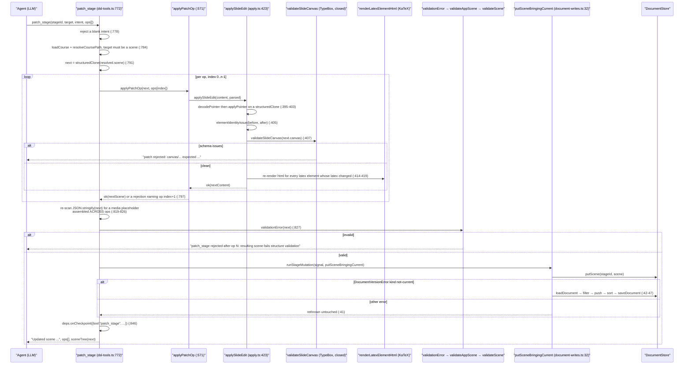
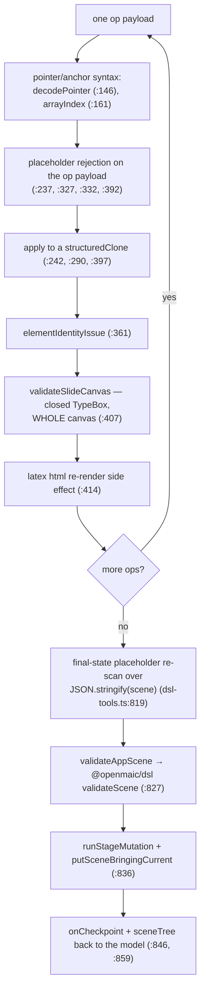

# 05 — AI edit operations: typed DSL ops, not prose

The agent never writes slide prose into the document. It calls `patch_stage` with a list of typed
operations — a JSON Pointer edit, an exact-text replace, or an element add/delete — and every one is
re-validated against a **closed** schema before anything is persisted. This section is the op
vocabulary, the validation ladder, and how concurrent human edits are handled.

**Sources:** `lib/server/agent-runtime/dsl-tools.ts`,
`lib/server/agent-runtime/course-edit/{apply.ts,element-schema.ts}`,
`lib/server/agent-runtime/{course-tools.ts,document-writes.ts,mutation-fence.ts}`,
`lib/agent-runtime/stage-writer-tools.ts`, `lib/document-store/validators.ts`,
`lib/edit/slide-edit-elements.ts`;
evidence [../appendix/research/dsl-renderer-editor/03-flows.md](../appendix/research/dsl-renderer-editor/03-flows.md) Flow B,
[../appendix/research/dsl-renderer-editor/05-failure-modes.md](../appendix/research/dsl-renderer-editor/05-failure-modes.md).
Who runs the agent and how a session survives a restart: [../05-agent-runtime/index.md](../05-agent-runtime/index.md).

## 1. The operation vocabulary

`patch_stage` (`dsl-tools.ts:772`) takes `{stageId, target, intent, ops[]}` where `target` must resolve
to `/scenes/<order|sceneId>` (`:784`). Five op kinds reach the scene:

| Tool-level op | Path constraint | Routed to |
| --- | --- | --- |
| `set` | `/content/…` or `/actions` or `/actions/…` (`:613-617`); for a slide scene, `/content/canvas/…` (`:556`) | `applySlideEdit({op:'patch'})` for slide content, else `applyJsonPointerEdit` on the whole scene |
| `remove` | same | same |
| `str_replace` | `/content/…` or `/actions/…` (`:586-590`) — explicitly **not** routed through the slide canvas (`:553`) | `applyStrReplace` on the whole scene |
| `add_element` | slide scenes only (`:573`) | `applySlideEdit({op:'add_element'})` |
| `delete_element` | slide scenes only (`:573`) | `applySlideEdit({op:'delete_element'})` |

Internally that collapses to a three-variant union:

```ts
// lib/server/agent-runtime/course-edit/apply.ts:127
export type SlideEditOp =
  | { op: 'patch'; action: 'set' | 'remove'; path: string; value?: unknown }
  | { op: 'add_element'; element: Record<string, unknown>; afterId?: string; index?: number }
  | { op: 'delete_element'; elementId: string };
```

Why this union is separate from the browser editor's, stated at `apply.ts:122-126`: "Server course-agent
surface only. The classroom/browser editor uses the lower-level `SlideEditOperation` union in
`lib/edit/slide-ops.ts` directly; keep that UI contract independent from which sugar ops the agent
exposes." That is the L2 layer named in [./04-editor-prosemirror.md](./04-editor-prosemirror.md) §1.

Scene metadata (title, order) and stage/page-list operations are deliberately **not** here — the tool
description routes them to `edit_deck` (`dsl-tools.ts:775`, error messages at `:594`, `:620`).

## 2. One `patch_stage` call, end to end



**The whole batch is atomic against the store.** Ops are applied to an in-memory
`structuredClone` of the scene (`dsl-tools.ts:791`); any single failure returns before `putScene` is
ever called, naming the 1-based op index (`:797`). The tool description states the contract: "Any
failed op or resulting validation error rejects the whole batch" (`:775`).

## 3. Validation: three layers on one write

### 3.1 Identity is not patchable

`elementIdentityIssue` (`apply.ts:361`) runs after the pointer edit and before the schema check. It
rejects four things:

| Condition | Message |
| --- | --- |
| canvas id changed | `patch cannot change canvas id` (`:362`) |
| duplicate element ids | `patch produced duplicate element ids` (`:365`) |
| an element id added, removed or renamed | `patch cannot add, remove, or change element ids; use add_element/delete_element` (`:367`) |
| an element's `type` changed | `patch cannot change type for element <id>` (`:371`) |

Note that this is the **only** place in the whole subsystem that enforces element-id uniqueness. The
DSL's `validateScene` does not (see [./02-dsl-invariants.md](./02-dsl-invariants.md) §1).

### 3.2 The closed TypeBox mirror

`validateSlideCanvas(next.canvas)` (`apply.ts:407` → `element-schema.ts:689`) checks the **whole
canvas**, not just the patched subtree. The module header states the design (`element-schema.ts:1-16`):

- a patch is a partial element JSON — every field optional, `additionalProperties` closed at every
  level, so an unknown or out-of-contract field fails loud rather than landing in a document;
- nested objects are themselves partial patches (deep-merge semantics); arrays are validated against
  their element types and replaced wholesale, never merged;
- patch schemas omit `id` and `type` because identity is not patchable; the insertion schema adds the
  discriminating `type`, still omits `id`, and restores every DSL-required field.

Three exported validators (`element-schema.ts:673`, `:681`, `:689`):

```ts
export function validateElementPatch(type: string, patch: Record<string, unknown>): string[];
export function validateElementInput(element: unknown): string[];
export function validateSlideCanvas(canvas: unknown): string[];
```

Each returns a list of human-readable issues prefixed with `patch`, `element` or `canvas` plus the
TypeBox `instancePath` — messages a model can act on. `SlideCanvasSchema` (`:626`) closes the canvas
itself, including the `turningMode`, `sectionTag`, `type` and `script` fields
(`:635-664`), all with `additionalProperties: false` (`:666`).

This is the mechanism the 0.2.0→0.3.0 DSL migration exists to serve: a legacy `line` element carrying
a stray `rotate` fails this schema, so one dirty element made every edit to its scene fail
(`packages/@openmaic/dsl/src/version.ts:196-201`).

### 3.3 The DSL structural validators

`validationError(next)` (`dsl-tools.ts:827`) delegates to `validateAppScene`
(`lib/document-store/validators.ts:27`), which for slide and quiz scenes delegates to the DSL's
`validateScene`. That catches scene-level and action-level problems the canvas schema cannot see —
notably a malformed `Action` in `scene.actions`.



### 3.4 Read-placeholder rejection, in four places plus a fifth

`read_stage` serves a **bounded projection**: large inline media bytes are replaced by a placeholder
before serialization (`dsl-tools.ts:736-745`), because historical imported pages carry tens of MB of
inline data URLs and materializing them would block the event loop on a string the budget then throws
away.

A model that copies that placeholder back into a write would corrupt the document, so it is rejected:

| Site | Line | Checks |
| --- | --- | --- |
| `applyJsonPointerEdit` | `apply.ts:237` | a `set` value |
| `applyJsonPointerPatch` | `apply.ts:392` | a slide-canvas `set` value |
| `applyStrReplace` anchor | `apply.ts:327` | `oldText` — with a distinct message: the anchor "does not exist in the stored value — choose an anchor outside omitted regions" |
| `applyStrReplace` replacement | `apply.ts:332` | `newText` |
| **final state** | `dsl-tools.ts:819-826` | the serialized scene, after the last op |

That fifth site is described as "the primary guard" (`dsl-tools.ts:818`) precisely because the per-op
checks inspect each payload **in isolation** — two `str_replace` calls each carrying only a fragment
would assemble a complete placeholder and bypass all four.

### 3.5 `str_replace` refuses to guess

`applyStrReplace` (`apply.ts:286`) counts non-overlapping exact matches and then:

| Outcome | Behaviour |
| --- | --- |
| `oldText === ''` | `str_replace needs a non-empty oldText` (`:287`) |
| target field is not a string | `str_replace requires a string field; <path> is <type>` (`:323`) — with `null`/`array`/`typeof` naming (`:271-275`) |
| 0 occurrences | `anchor text not found in <path> (0 occurrences)` (`:344`) |
| >1 occurrence without `replaceAll` | `anchor text occurs N times; extend the anchor or set replaceAll` (`:347`) |
| exactly 1, or `replaceAll` | replaced; `occurrences` is reported back to the model (`:358`) |

Ambiguity is an error, not a coin flip. The same discipline appears in `arrayIndex` (`:161`), which
rejects a non-canonical index (`'01'`, `'+1'`) as well as an out-of-bounds one.

### 3.6 `add_element` — the server owns identity

| Rule | Line |
| --- | --- |
| `element` must be an object | `apply.ts:431` |
| `element` must **not** include `id` — "the server assigns element identity" | `:432-436` |
| `validateElementInput(element)` must pass | `:437` |
| `afterId` XOR `index`, never both | `:439` |
| `afterId` must resolve to an existing element | `:445` |
| `index` must be an integer in `[0, elements.length]` | `:448-456` |
| the id is `el-<nanoid(8)>`, retried until unique | `:459-460` |

`delete_element` (`:466`) requires the element to exist and then filters it out of a clone.

### 3.7 One side effect, deliberately

A `latex` element whose `latex` string changed gets its cached KaTeX `html` snapshot re-rendered, or
deleted if rendering fails (`apply.ts:409-419` → `lib/edit/slide-edit-elements.ts:154`). This is the
only place in the agent write path that computes a derived field. It matters because the renderer
prefers `html` over re-rendering (`PPTLatexElement.html`), so a stale snapshot would silently paint
the old formula.

## 4. Concurrency

Four independent mechanisms, at different granularities:

```mermaid
flowchart TD
  subgraph L1["1. Scheduler: no parallel writers in one turn"]
    W["STAGE_WRITER_TOOL_NAMES<br/>lib/agent-runtime/stage-writer-tools.ts:20"]
    W --> DW["DOCUMENT_WRITING_TOOLS = the set minus rename_stage<br/>course-tools.ts:110"]
    DW --> SEQ["markDocumentWritersSequential<br/>executionMode: 'sequential' (:137)"]
    SEQ --> PI["pi runs the WHOLE batch through<br/>executeToolCallsSequential (:126-131)"]
  end

  subgraph L2["2. Fence: an aborted tool call cannot commit"]
    RSM["runStageMutation(signal, mutation)<br/>mutation-fence.ts:10"]
    RSM --> ALS["AsyncLocalStorage carries the signal<br/>into the persistence transaction"]
    ALS --> CHK["assertCurrentStageMutationActive() (:23)<br/>throws if aborted"]
  end

  subgraph L3["3. Store: version-stamp recovery"]
    PS["store.putScene"]
    PS -->|"DocumentVersionError not-current"| RE["loadDocument → splice → saveDocument<br/>document-writes.ts:42-47"]
    PS -->|"any other error"| RT["rethrown untouched (:41)"]
  end

  subgraph L4["4. Client: write ownership on tool start"]
    TS["tool_execution_start carries the target stageId"]
    TS --> OWN["the workbench fold arms write ownership<br/>(veto + realtime sync) — writers only,<br/>never read_stage (stage-writer-tools.ts:8-12)"]
  end
```



### 4.1 Why sequential, in the authors' words

`course-tools.ts:114-136` is worth reading in full. The summary: none of the writers takes a lock —
each is `load whole document → apply one op in memory → write the whole scene back`. The agent
routinely emits several of them for one page as **parallel** tool calls in a single turn, and they
then all load the same snapshot and overwrite each other. "The damage is silent — the last writer
wins, every sibling op is lost while still reporting success, and an element added by one call is
erased by a sibling whose snapshot predates it."

The requirement is declared to pi rather than hand-rolled, because in pi's `executeToolCalls` a batch
containing **any** `sequential` tool runs entirely through `executeToolCallsSequential`. That is
deliberately stronger than serializing writers against each other: it also orders the **reads** in the
same batch, so a `read_stage` next to an edit observes committed state instead of the pre-write
snapshot. The stated trade-off: "a lost write is not self-correcting, a slower turn is."

`STAGE_WRITER_TOOL_NAMES` is the single source of truth for three consumers — the server scheduler,
the workbench write-ownership fold, and `rename_stage`'s separate sequential marking in the curriculum
toolset (`stage-writer-tools.ts:3-18`). A consistency test pins the scheduler to the list (`:5-7`).
Arming ownership only for writers is load-bearing: ownership's side effect is dropping the user's own
pending edits, so a `read_stage` must never take it (`:10-12`).

### 4.2 Human vs agent: the accepted window

`putSceneBringingCurrent` (`document-writes.ts:32`) exists because `putScene` refuses to write into a
document whose stored DSL stamp is stale: marking the whole document current off one scene write would
strand its other scenes below the migrate-on-read line (`:6-13`). On `not-current` it reloads the
already-migrated aggregate, splices the scene in, sorts by `order`, and saves the whole document — so
the current stamp is earned by an actually-run migration rather than asserted.

The limitation is documented rather than hidden (`:22-31`):

| Fact | Consequence |
| --- | --- |
| the fallback's reload → splice → save spans **two transactions** | a writer committing another scene inside that window is pruned by the snapshot save |
| cross-session server writers are excluded by the per-stage lease | the only remaining competitor is the browser autosave |
| the browser autosave already replaces the whole document last-writer-wins | that is the system's pre-existing document-level concurrency model, not a new hazard |
| the browser's data is periodic | the editor re-saves its live state on the next tick |
| the window is one-shot per document | once the stamp is current, every later write takes the `putScene` fast path |

So the honest statement is: **there is no operational-transform or CRDT merge between a human edit and
an agent edit.** Concurrency is handled by (a) not letting two agent writes race within a turn, (b)
client-side write ownership that drops the human's pending edits while a writer tool runs, and (c)
document-level last-writer-wins underneath. A human typing into a scene while the agent patches the
same scene will lose one side's change.

## 5. Failure messages the model sees

Every rejection is a `toolResult(..., isError: true)` with a path-anchored, corrective message. A
representative sample:

| Trigger | Message |
| --- | --- |
| slide pointer not under `/canvas/` after stripping `/content` | `slide patch path must start with /canvas/ after removing the scene /content prefix` (`apply.ts:381`) |
| `set` with no value | `patch set needs value (use action:"remove" to delete an optional field)` (`:386`) |
| bad `~0`/`~1` escape | `bad JSON pointer escape in path "..."` (`:154`) |
| path crosses a non-container | `patch path crosses a non-container at "..."` (`:188`) |
| out-of-contract canvas | `patch rejected: canvas/elements/3/rotate: ...` (`:408`) |
| batch failed | `patch_stage rejected at op 2: ...` (`dsl-tools.ts:797`) |
| structural failure after the last op | `patch_stage rejected after op N: resulting scene fails structure validation (...)` (`:830`) |
| store failure | `patch_stage could not persist the scene: <message>` (`:841`) |

On success the model gets back the intent echo, the op details (including `str_replace`'s occurrence
count), and `sceneTree(next)` (`dsl-tools.ts:855-859`) — a compact projection so it can verify the
result without a second `read_stage`.

## Open questions

- The TypeBox schemas are a **hand-maintained** mirror: `element-schema.ts:15` says the field sets
  "mirror `@openmaic/dsl` `slides.ts` exactly", which is 694 lines duplicating a 995-line type file
  with no generated cross-check in that file. The DSL already emits `scene.schema.json` from the same
  types; nothing forces the TypeBox copy to track it. Adding a DSL field means editing two files, and
  forgetting the second makes every `patch_stage` touching that field fail with an unknown-property
  error. This is the subsystem's highest-severity fragility.
- Whether the browser write path has any equivalent of `validateSlideCanvas`. It does not appear to —
  `validateAppScene` delegates to `validateScene`, which accepts any object canvas. So the agent path
  is strictly stricter than the human path on the same document.
- Whether client-side write ownership can drop a human edit the user believes was saved. The ownership
  side effect is documented as "dropping the user's own pending edits"
  (`stage-writer-tools.ts:10-12`) but the UX around that was not traced in this subsystem.
