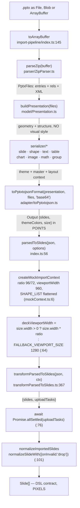
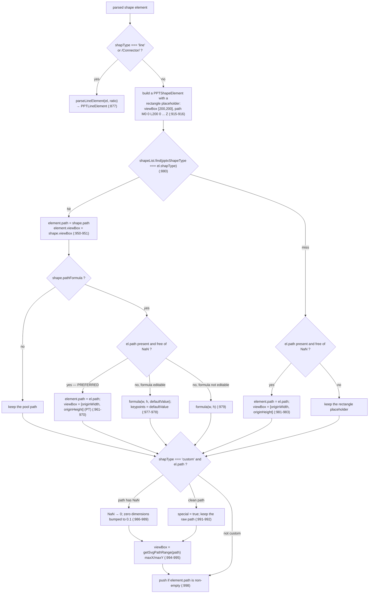
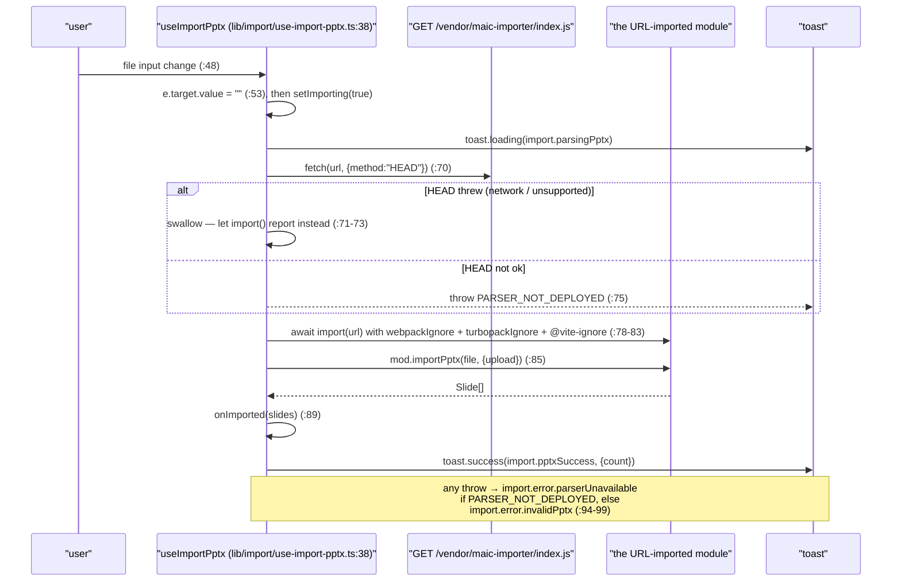

# 06 — Importer: `.pptx` → DSL

`@openmaic/importer` (51 files, 22 133 lines) is the largest module in the subsystem. It is a fork of
`pptxtojson` that grew a full DSL transform on top. This section is the four-layer architecture, the
unit conversions, the shape-preset machinery, and the fidelity losses that are known and accepted.

**Sources:** `packages/@openmaic/importer/{DESIGN.md,package.json}`,
`src/import-pipeline/{index.ts,transformParsedToSlides.ts,mockContext.ts,types.ts}`,
`src/parser/units.ts`, `src/shapes/presets.ts`, `src/openmaic/configs/shapes.ts`,
`lib/import/use-import-pptx.ts`, `lib/server/agent-runtime/{import-pptx.ts,import-pptx-worker.mjs}`;
evidence [../appendix/research/dsl-renderer-editor/01b-modules.md](../appendix/research/dsl-renderer-editor/01b-modules.md) §4,
[../appendix/research/dsl-renderer-editor/03-flows.md](../appendix/research/dsl-renderer-editor/03-flows.md) Flow C.

## 1. The pipeline

Two stacked pipelines. The lower one is the vendored `pptxtojson` fork (`parse()`); the upper one is
OpenMAIC's addition (`parsedToSlides` / `importPptx`).

Layer responsibilities are stated in `packages/@openmaic/importer/DESIGN.md:23`, and the dependency
direction is one-way `adapter → serializer → model → parser`:

| Layer | Owns | Explicitly does not |
| --- | --- | --- |
| `parser` | zip, XML, rels, units | any OOXML semantics |
| `model` | geometry and structure resolution | any visual style |
| `serializer` | combining theme/master/layout context into JSON elements | touching the zip |
| `adapter` | the outward JSON type (`Output`) | — |

`parsedToSlides` is the **transform-only** entry and is documented as bundler-safe: it never touches
`../src` (the parser tree), which keeps `pdfjs-dist`'s dynamic `require()` out of a consumer's bundle
(`index.ts:3-8`). `importPptx` bundles parse + transform for environments without that constraint.
See [./09-vendored-forks.md](./09-vendored-forks.md) for why that matters.

## 2. Units and the viewport

| Conversion | Function | Formula |
| --- | --- | --- |
| EMU → px (96 DPI) | `emuToPx` (`parser/units.ts:13`) | `/914400 × 96` |
| EMU → pt | `emuToPt` (`:18`) | `/12700` |
| OOXML angle → deg | `angleToDeg` (`:23`) | `/60000` |
| OOXML percentage → fraction | `pctToDecimal` (`:28`) | `/100000` |
| hundredths of a point → pt | `hundredthPtToPt` (`:33`) | `/100` |
| pt → px (96 DPI) | `ptToPx` (`:38`) | `× 96/72` |

The outward `Output` is in **points** (`DESIGN.md:105`); the DSL transform multiplies by
`ctx.ratio = 96/72` to reach pixels (`mockContext.ts:20`, applied per element at
`transformParsedToSlides.ts:459-462`).

`detectUnit` (`units.ts:46`) is a documented **heuristic**: `|value| > 20000 → 'emu'`, on the reasoning
that one point is 12 700 EMU (`:43-45`). `smartToPx` (`:54`) dispatches on it. Right on real decks,
silently wrong on a pathological one, and there is no provenance flag to consult instead.

Viewport resolution has three tiers:

| Deck | `viewportSize` | Source |
| --- | --- | --- |
| 16:9 widescreen (960 pt wide) | 1280 px | `json.size.width * ratio` (`index.ts:65`) |
| 4:3 (720 pt wide) | 960 px | same |
| `size.width <= 0` | 1280 px | `FALLBACK_VIEWPORT_SIZE` (`index.ts:34`) |

The comment at `index.ts:61-63` gives the reason the deck width — not a fixed default — drives it: the
legacy 4:3 default of 960 truncated text elements on widescreen decks. `viewportRatio` is
`size.height / size.width` with a `0.5625` fallback (`transformParsedToSlides.ts:381`), and one
`SlideTheme` is resolved once per deck, preferring the parsed `themeColors` over the context theme
(`:382-389`).

## 3. `transformParsedToSlides` (1 376 lines)

Signature at `:367`. Per slide it resolves the background (image / gradient / solid,
`:396-438`), builds a complete DSL `Slide` including `script: item.note || ''` (`:440-448`), then walks
elements sorted by `order` (`:451`), converting the box to pixels **in place** (`:459-462`) before
branching on `el.type`:

| Parsed type | Branch line | Emits |
| --- | --- | --- |
| `text` | `:463` | `PPTTextElement`, or a `PPTShapeElement` when `autoFit.type === 'text'` so the fill covers the exact box (`:470-472`) |
| `image` | `:619` | `PPTImageElement` |
| `math` | `:719` | `PPTLatexElement` |
| `audio` | `:780` | `PPTAudioElement` |
| `video` | `:819` | `PPTVideoElement` |
| `shape` | `:875` | `PPTLineElement` or `PPTShapeElement` (see §4) |
| `table` | `:1018` | `PPTTableElement` |
| `chart` | `:1248` | `PPTChartElement` |
| `group` | `:1326` | recursion; the group transform is baked into children |
| `diagram` | `:1358` | recursion |

Media uploads are queued through a 6-way concurrency limiter (`:393`,
`createConcurrencyLimiter(6)`), never awaited inline, and settled once at the pipeline boundary.

## 4. The shape branch and the preset machinery

The **parser-path-beats-formula** rule (`:958-960`) is one of the more consequential decisions in the
importer, and the comment names the failure it fixes: the formula's `defaultValue` discards non-default
`adj` values, so `roundRect@adj=50%` (a circle) would render as a near-square at the formula's default
12.5%. When the parser's path is used, `viewBox` is pinned to `[originWidth, originHeight]` — the **pt**
values, captured before the ×ratio mutation (`:454-455`) — because the px `[el.width, el.height]`
assigned two lines earlier is dimensionally mismatched and would make the SVG group scale compute to 1,
leaving the path filling only ~75% (the pt/px ratio) of its CSS box (`:963-969`).

Preset registries, measured with `grep -c`:

| Registry | Count | Location |
| --- | --- | --- |
| `presetShapes.set(...)` — OOXML preset geometry generators | 154 | `src/shapes/presets.ts`, first entry `:153` |
| `multiPathPresets.set(...)` — multi-sub-path presets | 44 | same file, first entry `:4521` |
| `presetOverlays.set(...)` — 3-D top faces etc. | **1** (`can`) | same file, `:4432` |
| `SHAPE_PATH_FORMULAS` — resize-time recompute formulas | 21 | `src/openmaic/configs/shapes.ts` |
| `SHAPE_LIST` entries carrying `pptxShapeType` | 26 | same file, from `:285` |

`getPresetShapePath` (`presets.ts:6557`) lower-cases the OOXML `prst` name for lookup, special-cases
`textNoShape` → `''` (a text-only shape without geometry, `:6563-6564`), and otherwise **falls back to
a rectangle with a `console.warn`** (`:6572`). That warn is the only signal a shape silently became a
box, and it never reaches the UI.

Note the 26-entry `SHAPE_LIST` pool is a much narrower map than the 154 preset generators: a shape
whose `pptxShapeType` is not in the pool skips the pool branch entirely and falls through to the
parser's own path (`:981`) — degrading quietly to a non-editable shape rather than failing.

## 5. Two callers, one core

### 5.1 Browser

Only a **type-only** import of `@openmaic/importer` appears in the app (`use-import-pptx.ts:12`), with
the comment explaining that the workspace package contributes types while values flow through the
URL-loaded dist. The HEAD probe exists so a missing artifact surfaces as a specific message rather than
an opaque `SyntaxError` from parsing 404 HTML as JS (`:63-67`).

### 5.2 Server (`import_pptx` agent tool)

The same `importPptx`, but inside a **worker thread** so the DOM shims never touch the request process
(`lib/server/agent-runtime/import-pptx-worker.mjs`). `installHost()` installs a `linkedom` document, a
`fetch`-backed `WorkerXHR` and a fake `location`; the worker's `upload` callback returns a `data:` URL.

Parent-side caps (`lib/server/agent-runtime/import-pptx.ts:41-43`):

| Cap | Value |
| --- | --- |
| `MAX_IMPORT_SLIDES` | 80 |
| `MAX_IMPORT_BYTES` | 8 MiB |
| `PARSE_PPTX_TIMEOUT_MS` | 90 000 |

The tool also emits a next-step directive back to the agent (`AFTER_IMPORT_NEXT_STEP`, `:46-47`)
requiring inspection with `list_scenes` / `read_stage` / `render_scene_preview` before any
`patch_stage` on actions and before `generate_tts` — an explicit acknowledgement that imported pages
routinely need repair.

## 6. Where fidelity is knowingly lost

Every row below is read out of the code, not inferred.

| Loss | Evidence |
| --- | --- |
| An unknown OOXML preset becomes a **rectangle** | `presets.ts:6572` `console.warn(... falling back to rectangle)` |
| A `prst="textNoShape"` becomes an empty path (intended) | `presets.ts:6563-6564` |
| `custom` geometry with a clean path is flagged `special` and later **exported as an image** | flag set at `transformParsedToSlides.ts:991`; semantics documented on the DSL type at `slides.ts:422` |
| A `custom` path containing `NaN` has every `NaN` rewritten to `0`, and zero dimensions bumped to `0.1` | `transformParsedToSlides.ts:986-989` |
| An element the DSL cannot normalize is **dropped** | `import-pipeline/index.ts:101-110`, `normalizeSlideWith({onInvalid:'drop'})` with a `console.warn` |
| Group `flip`/`rotation` are **baked into children**; the emitted group is always `rotate:0, isFlipH/V:false` | `DESIGN.md:96` |
| Curved connectors are approximated to a single cubic Bézier | `transformParsedToSlides.ts:119` (`parseCubicFromPath` docstring) |
| Arrow heads are **inferred from path shape**, not read from OOXML attributes | `detectArrowsFromPath` (`:168`), with comments at `:178` and `:193` describing two arrow classes an earlier version missed |
| Without an `upload` callback, images stay base64 and audio/video keep a tab-scoped `blob:` URL | `import-pipeline/index.ts:39-44` |
| A **failed** media upload leaves the original base64 in place, silently | `transformParsedToSlides.ts:416-418` (`console.error('背景图片上传失败:', …)`); the same pattern for shape pattern fills at `:1011` and video at `:871` |
| 3-D chart variants collapse onto their 2-D peers, and everything must land in the DSL's 8 `ChartType`s | `transformParsedToSlides.ts:1269-1302` (`bar3DChart`, `line3DChart`, `area3DChart`, `pie3DChart`, `bubbleChart`); `ChartType` at `packages/@openmaic/dsl/src/slides.ts:497` |
| A `text` element with `autoFit.type === 'text'` is converted into a **shape**, changing its element type | `transformParsedToSlides.ts:470-473` |
| Table `vAlign` arrives as PPTist aliases `up|mid|down` and must be mapped | table cells at `transformParsedToSlides.ts:1119-1128`, consumed at `:1175`; the shape and text branches carry their own `vAlignMap`s at `:882-886` and `:464-468`; DSL note at `slides.ts:619` |

The importer's failure philosophy is stated once, at `import-pipeline/index.ts:13-16`: "every upload
site inside `transformParsedToSlides` already swallows individual errors and leaves the original base64
in place; we use `Promise.allSettled` here so a missing inner `.catch` cannot fail the whole import
either." That is defence in depth, and it is why an import never partially fails — it quietly carries
larger payloads instead.

## 7. Failure modes

| Boundary | On failure |
| --- | --- |
| vendored bundle missing at build time | `pnpm build` exits 1 with the repair command (`scripts/assert-vendor-maic-importer.mjs`) |
| vendored bundle missing at runtime | HEAD probe → `PARSER_NOT_DEPLOYED` → `import.error.parserUnavailable` toast (`use-import-pptx.ts:74`, `:96`) |
| any parse failure in the browser | caught, logged, `import.error.invalidPptx` toast (`use-import-pptx.ts:92-99`) |
| server: worker file absent | `throw` "PPTX import worker is missing from the deployment." (`import-pptx.ts:268`) |
| server: parse exceeds 90 s | worker terminated (`import-pptx.ts:288`) |
| server: worker throws | posts `{error: message}` to the parent instead of crashing (`import-pptx-worker.mjs:128`) |
| `WorkerXHR` fetch failure | `readyState = 4` then `onerror(error)`; aborts are swallowed (`import-pptx-worker.mjs:84`) |

## 8. Its own dependency tree

`packages/@openmaic/importer/package.json:48` — `@xmldom/xmldom ^0.9.9`, `jpegxr ^0.3.0`, `jszip`,
`katex`, `mathml-to-latex 1.5.0`, `nanoid`, `omml2mathml ^1.3.0`, **`pdfjs-dist 4.8.69`** (pinned),
`pptxtojson ^1.11.0`, `tinycolor2 1.6.0`, `utif ^3.1.0`.

Two oddities: `pdfjs-dist` is the sole reason for the whole static-URL vendor dance, and `pptxtojson`
is still listed even though this package *is* a fork of it — imported purely for the parsed-JSON
**types** (`transformParsedToSlides.ts:1`, with `ParsedPptxJson` defined as
`Awaited<ReturnType<typeof parsePptxDefault>>` at `:34`). Because that is a *value* import, the two
versions must stay structurally compatible, and `index.ts:68-70` calls the bridge exactly what it is:
"the cast bridges the two declaration sources."

Optional media converters (`utif`, `pngjs`, `jpegxr`, `canvas`) are shimmed with local
`declare module` blocks in `src/types/vendor-shims.d.ts` rather than typed upstream.

## Open questions

- What fraction of the OOXML `ST_ShapeType` enumeration the 154 + 44 registry entries cover.
  `DESIGN.md:29` claims "200+ OOXML preset 几何" while the measured registries total 198; which spec
  names fall through to the rectangle fallback needs the spec list diffed against the registry keys.
- Whether `SHAPE_LIST`'s 26 `pptxShapeType` mappings are the intended full set or a partial one. A
  missing mapping degrades quietly (`transformParsedToSlides.ts:981`) rather than failing.
- Whether `presetOverlays` having exactly one entry (`can`) means other 3-D presets lose their top
  face, or whether those are handled through `multiPathPresets` instead.
- Whether the `detectUnit` `> 20000` cutoff is empirically derived. `units.ts:43-45` gives the
  reasoning but no provenance for the specific threshold.
- **There is no `.pptx` → DSL → `.pptx` fidelity suite.** The round-trip suite that exists
  (`tests/edit/round-trip/`, 9 test files plus `fixtures.ts`) is *edit* → export. `tests/import` contains one file. The
  importer has ~932 test LOC against 22 133 source LOC — the thinnest cover of the four packages by an
  order of magnitude, and none of it walks `presetShapes`.
- Whether `ImportContext.fixedViewport` and `ImportContext.extractVideoFirstFrame` are ever
  non-default: both are annotated "当前未被 transform 使用" (currently unused by the transform) and
  reserved for a later viewport-strategy migration (`import-pipeline/types.ts:6`, `:14`).
