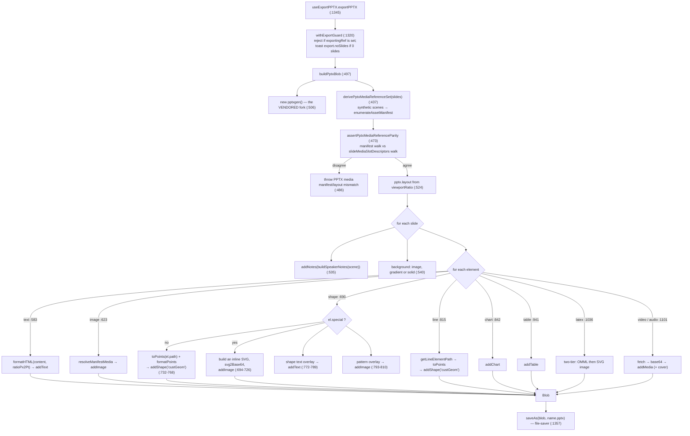
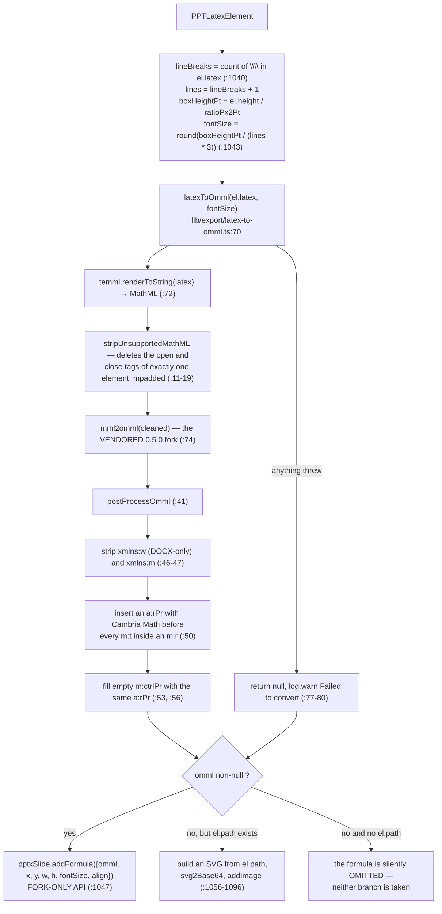

# 07 — Export: DSL → `.pptx`

`lib/export/use-export-pptx.ts` (1 443 lines) walks `Slide[]` and writes a `.pptx` through the
**vendored** pptxgenjs 4.0.1. It mirrors the importer in reverse, one branch per element type, plus a
two-tier equation path via temml + the vendored mathml2omml. This section is the pipeline, the
reference-parity guards, and what is dropped.

**Sources:** `lib/export/{use-export-pptx.ts,latex-to-omml.ts,svg-path-parser.ts,html-parser/*}`,
`packages/pptxgenjs/src/{slide.ts,gen-objects.ts}`, `packages/@openmaic/dsl/src/asset-manifest.ts`,
`packages/@openmaic/renderer/src/utils/element.ts`;
evidence [../appendix/research/dsl-renderer-editor/03-flows.md](docs/appendix/research/dsl-renderer-editor/03-flows.md) Flow D,
[../appendix/research/dsl-renderer-editor/05-failure-modes.md](docs/appendix/research/dsl-renderer-editor/05-failure-modes.md).

## 1. Entry points and coordinate scales

`buildPptxBlob` (`:497`) is exported specifically so the round-trip integration harness can wire its
own slides and inspect the resulting bytes with JSZip; the hook is the only intended runtime caller
(`:494-496`).

```ts
export async function buildPptxBlob(
  slides: Slide[],
  slideScenes: Scene[],
  viewportRatio: number,
  viewportSize: number,
  ratioPx2Inch: number,
  ratioPx2Pt: number,
  stageId?: string,
): Promise<Blob>;
```

`useExportPPTX` (`:1300`) computes the two scale factors from the canvas store (`:1310-1311`):

| Factor | Formula |
| --- | --- |
| `ratioPx2Inch` | `96 * (viewportSize / 960)` |
| `ratioPx2Pt` | `(96 / 72) * (viewportSize / 960)` |

Every geometry write is `value / ratioPx2Inch` (pptxgenjs positions in inches) and every point size is
`value / ratioPx2Pt`. Layout selection is a three-way match on `viewportRatio` (`:524-526`): `0.625`
→ `LAYOUT_16x10`, `0.75` → `LAYOUT_4x3`, otherwise `LAYOUT_16x9`. A deck with an unusual ratio
silently gets 16:9.

Only **slide** scenes are exported: the hook filters `scenes` to `content.type === 'slide'` and maps
to canvases (`:1313-1314`). Interactive, quiz and PBL scenes have no `.pptx` representation at all —
they go through the resource pack ([./08-export-html.md](docs/07-dsl-renderer-editor/08-export-html.md)).

## 2. The export pass



### 2.1 Helpers

| Helper | Line | Job |
| --- | --- | --- |
| `formatColor` | `:50` | tinycolor → `{alpha, color}`; pptxgenjs wants transparency as a percentage, so alpha is inverted at each call site |
| `formatHTML` | `:64` | the slide's HTML `content` → `pptxgen.TextProps[]` via the local himalaya port ([`lib/export/html-parser/index.ts:9`](lib/export/html-parser/index.ts#L9) `toAST`) |
| `formatPoints` | `:223` | SVG points → pptxgenjs `Points`, in inches, with an optional per-axis `scale` |
| `getShadowOption` | `:267` | `PPTElementShadow` → `pptxgen.ShadowProps`, offsets converted through `ratioPx2Pt` |
| `getOutlineOption` | `:328` | `PPTElementOutline` → `pptxgen.ShapeLineProps` |
| `getLinkOption` | `:340` | `PPTElementLink` → `pptxgen.HyperlinkProps`, resolving a `slide`-type link against the slide list |
| `buildSpeakerNotes` | `:368` | `Scene` → the notes string |
| `resolvePptxEmbeddableSrc` | `:410` | one media ref → an embeddable data URL, pool-first |

Two constants behave like configuration: `DEFAULT_FONT_SIZE = 16` and
`DEFAULT_FONT_FAMILY = 'Microsoft YaHei'` (`:45-46`), used for the shape-text overlay
(`:779-780`).

### 2.2 The reference-parity guards

Unusual and worth understanding. The export walks slide **elements** directly (it needs coordinates,
z-order and video binding selection), not the asset manifest — so two independent enumerations of the
same document exist and could disagree. Three functions pin them:

| Function | Line | Contract |
| --- | --- | --- |
| `derivePptxMediaReferenceSet` | `:437` | builds synthetic `Scene`s (`id: pptx-slide-<i>`, `stageId: 'pptx-export'`) and runs the DSL's `enumerateAssetManifest`. The docstring states the scope decision: "speaker-note actions and non-rendered whiteboards are intentionally outside this media scope" (`:431-436`) |
| `isPptxManifestForeignRef` | `:460` | is this ref foreign to the manifest with no task ownership legitimating it? A generated task may supply concrete runtime URLs (`objectUrl`, a poster) that are runtime metadata, not document refs (`:452-459`) |
| `assertPptxMediaReferenceParity` | `:473` | throws with both difference sets when the manifest walk and the `slideMediaSlotDescriptors` walk disagree (`:486-490`) |

`resolveManifestMedia` (`:510`) closes the loop at resolution time: a ref the layout tries to resolve
that is foreign to the manifest throws `PPTX layout attempted to resolve a ref outside the asset
manifest: <ref>` (`:518`).

### 2.3 Shapes

The `special` flag decides the branch (`:691`). A `special` shape — one whose path uses commands
beyond `L Q C A`, set by the importer at [`transformParsedToSlides.ts:991`](packages/@openmaic/importer/src/import-pipeline/transformParsedToSlides.ts#L991) — is rasterized: an inline
`<svg>` is built from `el.path`, `viewBox`, `fill` and `outline`, base64-encoded, and added as an
image (`:694-726`). It is no longer an editable PowerPoint shape.

A normal shape becomes `addShape('custGeom', …)` with `points` derived from
`toPoints(el.path)` scaled by `{x: width/viewBox[0], y: height/viewBox[1]}` (`:728-734`). A malformed
path that `toPoints` cannot parse skips the element entirely (`:733`, `continue`).

Gradient fills are **flattened to a single mixed colour**: `tinycolor.mix(firstColor, lastColor)`
(`:737-743`). A pattern fill sets the shape fill fully transparent and adds the pattern image on top
(`:744`, `:793-810`).

### 2.4 Equations: the only two-tier path



`addFormula` does not exist upstream. It is the fork's single feature
([`packages/pptxgenjs/src/slide.ts:253`](packages/pptxgenjs/src/slide.ts#L253), [`packages/pptxgenjs/src/gen-objects.ts:669`](packages/pptxgenjs/src/gen-objects.ts#L669)
`addFormulaDefinition`) — see [./09-vendored-forks.md](docs/07-dsl-renderer-editor/09-vendored-forks.md). When it is taken, the
formula is a **native, editable PowerPoint equation**. When it is not, the fallback is a static image
and `svg2Base64` returning falsy skips the element (`:1082`).

`buildMathRPr` ([`latex-to-omml.ts:25`](lib/export/latex-to-omml.ts#L25)) is the reason the fork is needed at all: PowerPoint requires
`Cambria Math` on every math run, injected with the panose and charset attributes PowerPoint expects
(`:28-31`).

### 2.5 Media

Everything is fetched and converted to base64 (`:1116-1127`) because `blob:` and remote URLs do not
work in an offline `.pptx` — stated verbatim in the comment. A non-2xx response throws inside the
per-element `try` (`:1123-1124`).

Extension resolution has three tiers (`:1139-1142`): a suffix matched off the URL, then `el.ext`, then
`mp4` for video / `mp3` for audio.

Video cover images have two tiers (`:1144-1189`): resolve the poster the element or its generation task
names through the same shared chain, and failing that capture the first frame by drawing a
`crossOrigin='anonymous'`, `muted`, `preload='auto'` `<video>` onto a canvas at `currentTime = 0`.

## 3. What the `.pptx` export drops

| Dropped or degraded | Evidence |
| --- | --- |
| A LaTeX element becomes a **static image** when temml or mathml2omml throws | [`use-export-pptx.ts:1056`](lib/export/use-export-pptx.ts#L1056); [`latex-to-omml.ts:77-80`](lib/export/latex-to-omml.ts#L77-L80) returns `null` and warns |
| A LaTeX element with **neither** OMML nor a legacy `path` is silently omitted | [`use-export-pptx.ts:1046`](lib/export/use-export-pptx.ts#L1046), [`:1056`](lib/export/use-export-pptx.ts#L1056) — there is no `else` branch and the export still succeeds |
| MathML `<mpadded>` spacing is discarded before conversion | [`latex-to-omml.ts:12`](lib/export/latex-to-omml.ts#L12) |
| LaTeX font size is **estimated** from `\\` count, not measured | [`use-export-pptx.ts:1040-1043`](lib/export/use-export-pptx.ts#L1040-L1043) |
| `special` shapes become images, losing editability | [`use-export-pptx.ts:691-726`](lib/export/use-export-pptx.ts#L691-L726); the flag's semantics at [`packages/@openmaic/dsl/src/slides.ts:422`](packages/@openmaic/dsl/src/slides.ts#L422) |
| A shape's gradient collapses to one mixed colour | [`use-export-pptx.ts:737-743`](lib/export/use-export-pptx.ts#L737-L743) |
| A shape whose path `toPoints` cannot parse is skipped | [`use-export-pptx.ts:733`](lib/export/use-export-pptx.ts#L733) |
| An unresolvable media ref makes the element **skipped entirely** | [`use-export-pptx.ts:1114`](lib/export/use-export-pptx.ts#L1114) (`continue`) — no counter, no toast |
| An offline or CORS-blocked asset is lost: everything is re-fetched to base64 | [`use-export-pptx.ts:1116-1127`](lib/export/use-export-pptx.ts#L1116-L1127) |
| Extension guessing falls back to `mp4`/`mp3` | [`use-export-pptx.ts:1142`](lib/export/use-export-pptx.ts#L1142) |
| A deck whose `viewportRatio` is neither `0.625` nor `0.75` gets `LAYOUT_16x9` | [`use-export-pptx.ts:524-526`](lib/export/use-export-pptx.ts#L524-L526) |
| Interactive / quiz / PBL scenes have no `.pptx` representation | the hook filters to slide scenes (`:1313`) |
| Speaker-note asset refs and non-rendered whiteboards are outside the export's media scope | [`use-export-pptx.ts:431-436`](lib/export/use-export-pptx.ts#L431-L436) |
| `PPTAnimation` entries are not written | no `animations` branch exists in `buildPptxBlob` |

Two of these are honest silent failures with no user signal: the omitted formula and the skipped media
element.

## 4. Failure handling

| Boundary | Behaviour |
| --- | --- |
| manifest and layout walks disagree | `throw` with both difference sets (`:486`) |
| layout resolves a ref outside the manifest, not task-owned | `throw` naming the ref (`:518`) |
| a second export while one is running | ignored via `exportingRef` (`:1322`) |
| PPTX export with zero slide scenes | `toast.warning(export.noSlides)`, nothing attempted (`:1323-1326`) |
| any export throw | `log.error` + `toast.error(export.exportFailed)`, `exporting` reset in `finally` (`:1332-1338`) |
| resource pack with nothing exportable | `toast.warning(export.nothingToExport)` (`:1399`) |
| resource pack with interactive scenes only | PPTX skipped, `toast.info(export.noSlidesSkipped)` (`:1403`) |
| assets that could not be inlined | `log.warn` + `toast.warning(export.inlinePartial)` listing the distinct hosts (`:1408-1427`) |

The whole export runs inside a `setTimeout(…, 100)` (`:1329`) so the `exporting` state paints before
the synchronous-heavy work begins.

## 5. The test that pins this path

`tests/edit/round-trip/` (9 test files plus `fixtures.ts`: `background`, `geometry`, `image-data-url`,
`image-flip`, `insert`, `quiz`, `text-content`, `text-format`, `z-order`) applies a `SlideEditOperation` and asserts the result lands
as specific PPTX XML (`<a:off>`, `<a:ext>`, `rot=`), with an explicit anti-tautology guard that the
un-edited fixture does *not* already match ([`tests/edit/round-trip/geometry.test.ts:52`](tests/edit/round-trip/geometry.test.ts#L52)).
`buildPptxBlob` is exported for exactly this harness ([`use-export-pptx.ts:494`](lib/export/use-export-pptx.ts#L494)).

Note the direction: this is **edit → export**, not import → export. There is no `.pptx` → DSL →
`.pptx` fidelity suite.

## Open questions

- `postProcessOmml` edits XML with regexes ([`latex-to-omml.ts:41-58`](lib/export/latex-to-omml.ts#L41-L58)). It works for the shapes
  `mathml2omml` emits today; a change upstream in whitespace or nesting would silently break font
  application rather than failing loudly.
- `stripUnsupportedMathML` strips exactly one tag ([`latex-to-omml.ts:12`](lib/export/latex-to-omml.ts#L12)). Any other element
  `mathml2omml` cannot handle makes the whole conversion throw and fall back to a raster image.
- Whether any test pins the OMML output shape. `lib/export/latex-to-omml.ts` is 82 lines of string
  surgery and the measured `tests/export` case count does not reveal whether the OMML bytes are
  asserted anywhere.
- Whether the LaTeX `fontSize` estimate has a known-bad case in the corpus. Any formula whose visual
  height is not proportional to its `\\` count exports at the wrong size.
- Whether `PPTAnimation` is intentionally out of scope for the `.pptx` bridge, or simply not
  implemented. Nothing in the file says.
