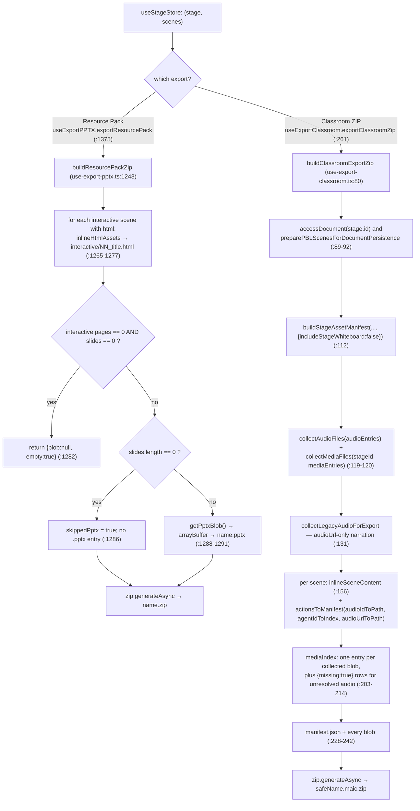
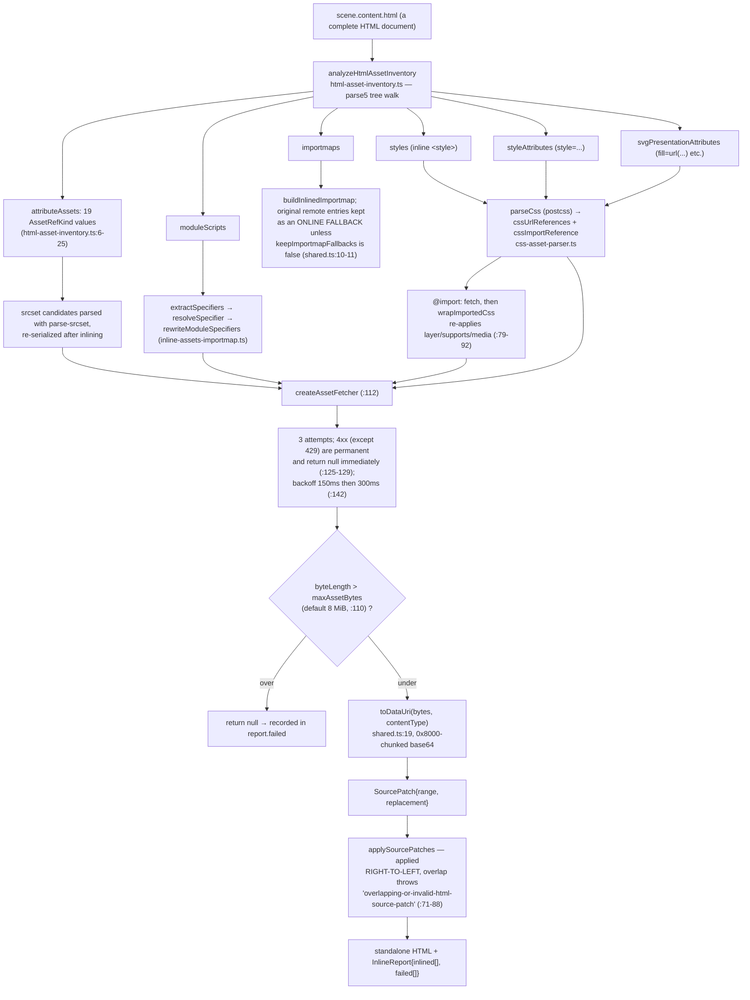
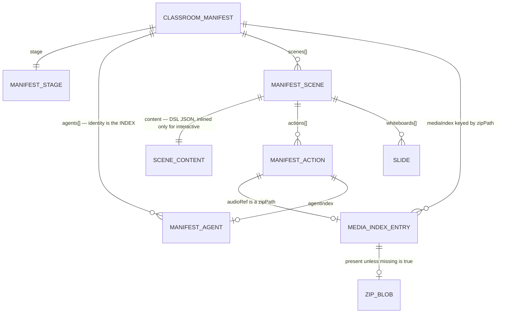

# 08 — Export: DSL → standalone HTML

The first thing to know: **there is no slide-to-HTML renderer in the export path.** "HTML export" in
OpenMAIC means two distinct things — inlining every external asset into an *interactive* scene's own
HTML document, and packaging a whole classroom as a `.maic.zip`. This section covers both, what gets
inlined, what is dropped, and what interactivity survives.

**Sources:** `lib/export/{use-export-classroom.ts,inline-assets.ts,inline-assets-shared.ts,inline-assets-importmap.ts,html-asset-inventory.ts,css-asset-parser.ts,classroom-zip-types.ts,classroom-zip-utils.ts,proxied-fetch.ts}`,
`lib/export/use-export-pptx.ts` (`buildResourcePackZip`);
evidence [../appendix/research/dsl-renderer-editor/01b-modules.md](docs/appendix/research/dsl-renderer-editor/01b-modules.md) §5.3.

## 1. Two products, one inliner



| | Resource Pack | Classroom ZIP |
| --- | --- | --- |
| Entry | `exportResourcePack` ([`use-export-pptx.ts:1375`](lib/export/use-export-pptx.ts#L1375)) | `exportClassroomZip` ([`use-export-classroom.ts:261`](lib/export/use-export-classroom.ts#L261)) |
| Builder | `buildResourcePackZip` ([`use-export-pptx.ts:1243`](lib/export/use-export-pptx.ts#L1243)) | `buildClassroomExportZip` ([`use-export-classroom.ts:80`](lib/export/use-export-classroom.ts#L80)) |
| Extension | `.zip` | `.maic.zip` (`CLASSROOM_ZIP_EXTENSION`) |
| Contains | `<name>.pptx` + `interactive/NN_<title>.html` | `manifest.json` + media blobs |
| Purpose | hand a human a deck plus standalone pages | round-trip a whole classroom back into OpenMAIC |
| Reimportable | no | yes — `agentConfigFromManifest` ([`classroom-zip-types.ts:98`](lib/export/classroom-zip-types.ts#L98)) is the documented inverse |

Both share `inlineHtmlAssets` and both share a single `createAssetFetcher({fetchImpl: createProxiedFetch()})`
instance per export so an asset referenced by several pages is fetched once
([`use-export-pptx.ts:1378`](lib/export/use-export-pptx.ts#L1378), [`use-export-classroom.ts:153`](lib/export/use-export-classroom.ts#L153)).

## 2. What `inlineSceneContent` actually does

```ts
// lib/export/use-export-classroom.ts:41
export async function inlineSceneContent(
  content: SceneContent,
  options?: InlineOptions,
): Promise<{ content: SceneContent; report: InlineReport }> {
  if (content?.type !== 'interactive' || !('html' in content) || !content.html) {
    return { content, report: { inlined: [], failed: [] } };
  }
  const { html, report } = await inlineHtmlAssets(content.html, options);
  return { content: { ...content, html }, report };
}
```

Every other scene kind — `slide`, `quiz`, `pbl` — passes through **untouched**. A slide scene's
`content.canvas` is serialized into `manifest.json` as DSL JSON, not rendered to HTML. Reconstructing
pixels is the importing OpenMAIC instance's job, using `@openmaic/renderer`.

## 3. The asset inliner

`lib/export/inline-assets.ts` (727 lines) plus four helpers: `html-asset-inventory.ts` (329),
`inline-assets-importmap.ts` (163), `css-asset-parser.ts` (85), `inline-assets-shared.ts` (27).



### 3.1 The 19 reference kinds

`AssetRefKind` ([`html-asset-inventory.ts:6-25`](lib/export/html-asset-inventory.ts#L6-L25)): `link`, `script`, `img`, `srcset`, `poster`,
`iframe-src`, `iframe-srcdoc`, `object-data`, `embed-src`, `source`, `video`, `audio`, `svg-image`,
`svg-use`, `css-url`, `css-import`, `module-import`, `base`, `importmap`.

That is a broader inventory than a naive `src`/`href` sweep: it reaches into CSS `url()` and `@import`,
ES-module specifiers, SVG `<use>` and `<image>`, `srcset` descriptor lists, and both `<iframe src>` and
`<iframe srcdoc>`.

### 3.2 Patching, not re-serializing

The inliner does not rebuild the document from the parse5 tree. It records byte ranges
(`SourceRange {start, end}`) and replacement strings, then applies them **descending by start offset**
so earlier offsets stay valid ([`html-asset-inventory.ts:71-88`](lib/export/html-asset-inventory.ts#L71-L88)). Any overlapping or out-of-bounds patch
throws `overlapping-or-invalid-html-source-patch` (`:82`) — the loop refuses to guess.

The consequence is that a scene's HTML survives byte-for-byte except at the patched ranges: author
formatting, comments, unusual whitespace, custom attributes and inline scripts are all preserved.

### 3.3 Fetching goes through the SSRF proxy

`createProxiedFetch()` ([`proxied-fetch.ts:10`](lib/export/proxied-fetch.ts#L10)) routes cross-origin `http(s)` requests through
`fetchProxiedMediaUrl` → `/api/proxy-media`, "which validates the URL server-side (SSRF guard) and
returns the bytes" (`:1-7`). Relative, `blob:` and `data:` URLs are fetched directly (`:22-24`). Two
opt-in modes exist: `crossOriginOnly` keeps browser-owned URLs direct (`:26`), and `directFirst` tries
a CORS-enabled CDN first and falls back to the bounded proxy (`:27-33`). The classroom and
resource-pack exports use the plain default. See
[../15-cross-cutting/index.md](docs/15-cross-cutting/index.md) for the SSRF boundary itself.

### 3.4 Import maps keep an online fallback by default

`keepImportmapFallbacks` defaults to `true` ([`inline-assets-shared.ts:10-11`](lib/export/inline-assets-shared.ts#L10-L11)): the inlined import map
keeps the original remote entries alongside the data-URI ones. So a page whose module graph could not
be fully inlined still works **when online**, and works offline only for what was inlined. That is a
deliberate hedge, not a bug — but it means "standalone" is conditional for module-heavy pages.

## 4. What is inlined, what is dropped

### 4.1 Inlined

| Category | Mechanism |
| --- | --- |
| stylesheets (`<link rel=stylesheet>`) and inline `<style>` | fetched, then their own `url()` / `@import` recursively resolved |
| CSS `@import` | fetched and wrapped so `layer` / `supports` / `media` conditions survive ([`inline-assets.ts:79-92`](lib/export/inline-assets.ts#L79-L92)) |
| images, `srcset` candidate lists, `poster`, SVG `<image>` / `<use>` | data URI; `srcset` is re-serialized with its original `w`/`x`/`h` descriptors (`:94-108`) |
| scripts, including ES modules | data URI, with module specifiers rewritten and the import map rebuilt |
| video / audio / `<source>` | data URI, subject to the byte cap |
| fonts | as CSS `url()` references |
| `style="..."` attributes and SVG presentation attributes | parsed as CSS values and rewritten |
| MIME when the server omits `content-type` | guessed from the extension (`guessMime`, [`inline-assets.ts:170`](lib/export/inline-assets.ts#L170)) |

### 4.2 Dropped or degraded

| Dropped | Evidence |
| --- | --- |
| Any asset over `maxAssetBytes` (default **8 MiB**) | [`inline-assets.ts:110`](lib/export/inline-assets.ts#L110), [`:132`](lib/export/inline-assets.ts#L132) — returns `null`, recorded in `report.failed` |
| Any asset whose fetch returns a 4xx other than 429 | [`inline-assets.ts:127`](lib/export/inline-assets.ts#L127) — permanent, no retry |
| Any asset still failing after 3 attempts | [`inline-assets.ts:121-144`](lib/export/inline-assets.ts#L121-L144) |
| `Stage.whiteboard` refs and their bytes, from the classroom ZIP | [`use-export-classroom.ts:109-113`](lib/export/use-export-classroom.ts#L109-L113): "Classroom ZIP v1 has never serialized `Stage.whiteboard` … archiving their bytes would create an unreconstructable, permanently orphaned payload on import." Scene whiteboards **are** kept |
| `Stage.interactiveMode` | [`classroom-zip-types.ts:32-33`](lib/export/classroom-zip-types.ts#L32-L33): "intentionally NOT exported — it reflects the original generation prompt branch, which imports can't faithfully reproduce" |
| Agent ids — identity becomes positional (index into `manifest.agents`) | [`classroom-zip-types.ts:49-53`](lib/export/classroom-zip-types.ts#L49-L53); `multiAgent.agentIds` become `agentIndices` ([`use-export-classroom.ts:176-178`](lib/export/use-export-classroom.ts#L176-L178)) |
| `SpeechAction.audioId` — replaced by `audioRef`, a ZIP path | `ManifestAction = Omit<Action,'audioId'> & {audioRef?, agentIndex?}` ([`classroom-zip-types.ts:128`](lib/export/classroom-zip-types.ts#L128)) |
| Referenced audio whose bytes resolved nowhere | kept as a `{missing: true}` `mediaIndex` row rather than silently omitted ([`use-export-classroom.ts:203-214`](lib/export/use-export-classroom.ts#L203-L214)) |
| A malformed voice binding on **import** | dropped per field; the agent survives ([`classroom-zip-types.ts:67-89`](lib/export/classroom-zip-types.ts#L67-L89)) |
| Everything a slide *looks* like | slides ship as DSL JSON; nothing renders them to HTML |
| Non-interactive scenes in the resource pack | only `content.type === 'interactive' && content.html` produces a file ([`use-export-pptx.ts:1266`](lib/export/use-export-pptx.ts#L1266)) |

Failures are reported, never fatal: `InlineReport.failed` rides out with the ZIP
([`use-export-classroom.ts:58`](lib/export/use-export-classroom.ts#L58), aggregated at [`:159-162`](lib/export/use-export-classroom.ts#L159-L162)) and surfaces as a
`toast.warning(export.inlinePartial)` listing the distinct failing **hosts**
([`use-export-classroom.ts:273-289`](lib/export/use-export-classroom.ts#L273-L289), and the same pattern at [`use-export-pptx.ts:1408-1427`](lib/export/use-export-pptx.ts#L1408-L1427)).

## 5. Interactivity retained

An interactive scene's HTML is a complete document rendered via iframe `srcDoc` in the live classroom
([`packages/@openmaic/dsl/src/interactive.ts:45-46`](packages/@openmaic/dsl/src/interactive.ts#L45-L46)). The inliner does not touch behaviour:

| Retained | Why |
| --- | --- |
| inline `<script>` bodies | never rewritten, only their `src` counterparts are inlined |
| ES-module graphs | specifiers rewritten to data URIs; the import map keeps remote fallbacks |
| event handlers, DOM APIs, canvas/WebGL | untouched |
| `<iframe srcdoc>` sub-documents | recognised as an asset kind and inlined |
| CSS animations, `@supports`, `@layer`, media queries | condition wrappers reconstructed on inlined `@import`s |

| Not retained | Why |
| --- | --- |
| anything requiring a network call at runtime (`fetch`, WebSocket, dynamic `import()` of an un-inlined URL) | the inliner walks static references only |
| `postMessage` conversation with the OpenMAIC host | the host is `InteractiveIframeHost` in the live app ([../08-classroom-runtime/index.md](docs/08-classroom-runtime/index.md)); a standalone file has no peer |
| the `widget_*` action verbs (`widget_highlight`, `widget_setState`, `widget_annotation`, `widget_reveal`) | those are driven by the playback engine over `postMessage`, which is absent |

**Inferred:** a widget authored to be driven by `widget_setState` will render its initial state in a
standalone export and then sit inert. Nothing in the export path warns about this.

One security note worth flagging: the live path injects **no** CSP into the interactive document (the
only app-level CSP is `frame-ancestors`), while the *video* exporter does inject
`default-src 'none'; connect-src 'none'`. Neither of the two exports documented here injects a CSP into
the emitted standalone HTML.

## 6. The classroom manifest

`CLASSROOM_ZIP_FORMAT_VERSION = 1` ([`classroom-zip-types.ts:11`](lib/export/classroom-zip-types.ts#L11)) — a fourth version line, independent
of `dslVersion`, `runtimeDslVersion` and `SlideContent.schemaVersion`
([./02-dsl-invariants.md](docs/07-dsl-renderer-editor/02-dsl-invariants.md) §3).



The critical ordering decision is documented at [`use-export-classroom.ts:61-76`](lib/export/use-export-classroom.ts#L61-L76): the **authoritative
document is accessed first** so lazy reference conversion runs and persists allocated ids before
anything reads the media rows. Only then is the manifest built from the working state (the user's
unsaved edits) with its legacy references converted in memory. If that ordering were reversed, "a
manifest that named the old handles while the archive was keyed by freshly allocated ids would be
unusable." Conversion is best-effort: a failure rolls back the pass's fresh allocations and falls back
to the accessed document snapshot, which is always reference-consistent with the media rows.

Note `MediaIndexEntry.sourceRef`'s comment ([`classroom-zip-types.ts:140-141`](lib/export/classroom-zip-types.ts#L140-L141)): "Original document ref;
ZIP paths and refs are separate namespaces." The manifest is keyed by ZIP path, and `sourceRef` is
metadata — an import must mint fresh refs, not reuse the exported ones.

## Open questions

- Whether a standalone interactive page is ever verified to actually run offline. The
  `keepImportmapFallbacks` default means a partially-inlined module graph looks fine online and fails
  only when disconnected; no test or CI step was found that loads an exported page with the network
  off.
- Whether the 8 MiB `maxAssetBytes` default is tuned or arbitrary ([`inline-assets.ts:110`](lib/export/inline-assets.ts#L110)). A single
  oversized video is silently dropped into `report.failed` with no size hint in the toast.
- Whether the emitted standalone HTML should carry a CSP. The video exporter injects one; these two
  paths do not, and nothing in either file discusses the choice.
- What an importer does with a `{missing: true}` `mediaIndex` row
  ([`use-export-classroom.ts:203-214`](lib/export/use-export-classroom.ts#L203-L214)). The producer side is explicit; the consumer side is outside this
  subsystem.
- Why `buildClassroomExportZip` wraps its body in `try { … } catch (error) { throw error }`
  ([`use-export-classroom.ts:100`](lib/export/use-export-classroom.ts#L100), [`:246-248`](lib/export/use-export-classroom.ts#L246-L248)) — the catch is a no-op rethrow, so either a `finally`
  was removed or the block is vestigial.
