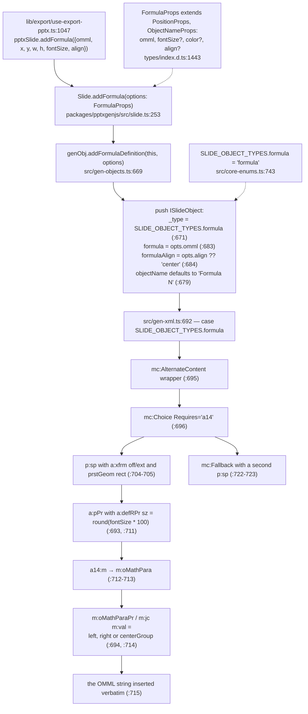
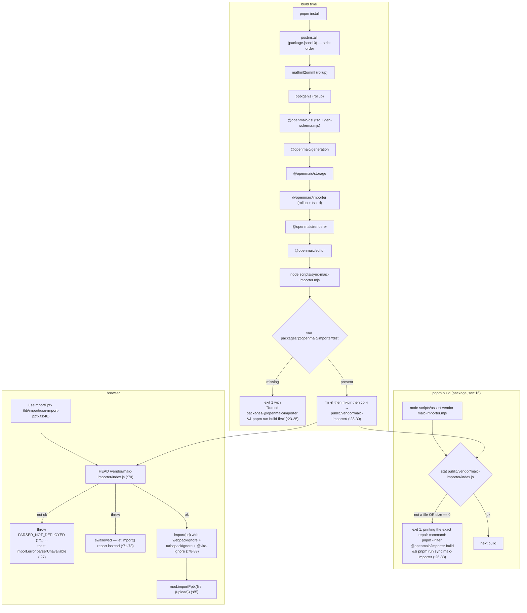

# 09 — Vendored forks and the vendor guard scripts

Three things in this subsystem are vendored rather than installed: `pptxgenjs`, `mathml2omml`, and — in
a different sense — `@openmaic/importer`'s built bundle, which is copied into `public/vendor/` and
loaded from a URL. This section is why each one is vendored, how much each diverges, and the two guard
scripts that stop a missing artifact from becoming an opaque runtime error.

**Sources:** root `package.json` (`postinstall`, `build`, dependency block),
`packages/pptxgenjs/{package.json,src/slide.ts,src/gen-objects.ts,src/gen-xml.ts,src/core-enums.ts,types/index.d.ts}`,
`packages/mathml2omml/{package.json,src/parse-stringify/parse.js}`,
`scripts/{sync-maic-importer,assert-vendor-maic-importer}.mjs`, `lib/import/use-import-pptx.ts`,
`.gitignore`, commit `a3f88d53`;
evidence [../appendix/research/dsl-renderer-editor/01b-modules.md](docs/appendix/research/dsl-renderer-editor/01b-modules.md) §6.

## 1. The three cases

| Thing | Version | Wired as | Why vendored | Local divergence |
| --- | --- | --- | --- | --- |
| `packages/pptxgenjs` | 4.0.1 ([`package.json:3`](packages/pptxgenjs/package.json#L3)) | `"pptxgenjs": "workspace:*"` (root [`package.json:129`](package.json#L129)) | needs an OMML formula primitive upstream does not have | one feature: `addFormula` / `addFormulaDefinition` / `SLIDE_OBJECT_TYPES.formula` / `FormulaProps` and one `gen-xml` case |
| `packages/mathml2omml` | 0.5.0 ([`package.json:2`](packages/mathml2omml/package.json#L2)) | `"mathml2omml": "workspace:*"` (root [`package.json:114`](package.json#L114)) | an upstream bug in the text-container check | **one character**: commit `a3f88d53` |
| `packages/@openmaic/importer` dist | 0.1.3 | `"@openmaic/importer": "workspace:*"` for **types only**; values load from `/vendor/maic-importer/index.js` | `pdfjs-dist`'s dynamic `require()` is a hard Turbopack error | the whole `src/import-pipeline/` + `src/openmaic/` trees (it is a `pptxtojson` fork) |

Licences differ and matter: `pptxgenjs` is MIT ([`packages/pptxgenjs/package.json:10`](packages/pptxgenjs/package.json#L10)), `mathml2omml` is
**LGPL-3.0-or-later** (`packages/mathml2omml/package.json`). See
[../13-dependencies/index.md](docs/13-dependencies/index.md).

## 2. `pptxgenjs` — one added primitive, traced end to end



Five files carry the delta, and nothing else in the fork is modified:

| File | Line | Addition |
| --- | --- | --- |
| `src/slide.ts` | `253` | the public `addFormula` method |
| `src/gen-objects.ts` | `669` | `addFormulaDefinition` — builds the slide object |
| `src/core-enums.ts` | `743` | `'formula' = 'formula'` in `SLIDE_OBJECT_TYPES` |
| `src/gen-xml.ts` | `692` | the OOXML emitter case |
| `types/index.d.ts` | `1443`, `2661-2664` | `FormulaProps` and the method declaration |

Two implementation details worth knowing because they constrain the caller:

- The formula rides inside `<mc:AlternateContent><mc:Choice Requires="a14">` with an `<mc:Fallback>`
  sibling ([`gen-xml.ts:695-696`](packages/pptxgenjs/src/gen-xml.ts#L695-L696), [`:722`](packages/pptxgenjs/src/gen-xml.ts#L722)), which is how PowerPoint's math namespace is declared for
  readers that support it while older readers get a plain shape.
- `fontSize` reaches the XML twice, in different units: as `sz="round(fontSize * 100)"` on
  `<a:defRPr>` ([`gen-xml.ts:693`](packages/pptxgenjs/src/gen-xml.ts#L693)) — hundredths of a point — and via `latexToOmml`'s injected
  `<a:rPr sz>` on each math run ([`lib/export/latex-to-omml.ts:26`](lib/export/latex-to-omml.ts#L26)). Both are needed; that is why
  `buildPptxBlob` passes `fontSize` to *both* `latexToOmml` and `addFormula`
  ([`lib/export/use-export-pptx.ts:1044`](lib/export/use-export-pptx.ts#L1044), [`:1053`](lib/export/use-export-pptx.ts#L1053)).

Build: `rollup -c --bundleConfigAsCjs` (`packages/pptxgenjs/package.json`), emitting
`dist/pptxgen.{es,cjs}.js` plus the `types/` tree it ships as-is.

Fork drift since the initial import is small: `git log` over `packages/pptxgenjs/` shows three commits
after `0d20abfe` (`Initial commit`) — `c0b7ea23` (ESM import for typescript in the rollup config),
`e613b757`, `1b5d2114` (comment fixes). The formula feature arrived with the initial commit.

## 3. `mathml2omml` — a one-character fix

```js
// packages/mathml2omml/src/parse-stringify/parse.js:82, after a3f88d53
textContainerNames.includes(arr[level].name) &&
```

The upstream code was `textContainerNames.includes[arr[level].name]` — indexing the `includes` *method
object* instead of calling it, which always evaluates `undefined` and so always fails the condition.
`textContainerNames` is `['mtext', 'mi', 'mn', 'mo', 'ms']` ([`parse.js:8`](packages/mathml2omml/src/parse-stringify/parse.js#L8)); the same array is used
correctly at [`parse.js:48`](packages/mathml2omml/src/parse-stringify/parse.js#L48), which is what makes the bug at [`:82`](packages/mathml2omml/src/parse-stringify/parse.js#L82) clearly a typo rather than intent.

`git show --stat a3f88d53` confirms the scope: **1 file changed, 1 insertion, 1 deletion**. One other
commit touched the package — `a58618a7`, "use cross-platform file copy in mathml2omml", which is why
the build script is `rollup -c && node -e "require('fs').copyFileSync('src/index.d.ts','dist/index.d.ts')"`
rather than a shell `cp`.

**Inferred:** because the delta is a single upstream bug fix, this fork is replaceable by a version bump
the moment upstream ships the same correction. Nothing in the repo records whether the fix was reported
upstream, which is the open question below.

## 4. The importer bundle — vendored by URL, not by workspace

This is the structurally interesting one. `@openmaic/importer` **is** a workspace package and **is** a
root dependency ([`package.json:77`](package.json#L77)), but the app never imports its values.



### 4.1 Why the URL indirection exists

Stated in three places, consistently. [`scripts/sync-maic-importer.mjs:6-9`](scripts/sync-maic-importer.mjs#L6-L9): "the bundle contains
dynamic `require()` patterns (from `pdfjs-dist`) that Turbopack rejects as a hard 'Module not found:
Can't resolve `<dynamic>`' error. By serving it as a static asset and importing it via a runtime URL,
we bypass the bundler entirely while keeping types via the workspace package."

The app side enforces the same split: [`lib/import/use-import-pptx.ts:8-12`](lib/import/use-import-pptx.ts#L8-L12) marks its
`@openmaic/importer` import **type-only** with the comment "stripped at compile time, never reaches the
bundler … The workspace package only contributes types." And the importer package itself keeps
`parsedToSlides` bundler-safe by never touching the parser tree
([`packages/@openmaic/importer/src/import-pipeline/index.ts:3-8`](packages/@openmaic/importer/src/import-pipeline/index.ts#L3-L8)), which is the escape hatch for a
consumer that can pass in pre-parsed JSON.

The three `import()` magic comments (`webpackIgnore`, `turbopackIgnore`, `@vite-ignore`) cover all
three bundlers a consumer might use.

### 4.2 Why two guard scripts, not one

`public/vendor/maic-importer` is **gitignored** ([`.gitignore:37`](.gitignore#L37)), so it exists only if `postinstall`
ran. Each guard closes a different hole:

| Guard | When | Guards against | Failure surface |
| --- | --- | --- | --- |
| `sync-maic-importer.mjs` | `postinstall`, or manually via `pnpm run sync:maic-importer` | running the sync before the importer is built — it `stat`s `dist` and refuses (`:20-26`) | `exit 1` naming the build command |
| `assert-vendor-maic-importer.mjs` | `pnpm build`, before `next build` ([`package.json:16`](package.json#L16)) | a deploy that skipped or failed the sync | `exit 1` printing `pnpm --filter @openmaic/importer build && pnpm run sync:maic-importer` |
| the runtime `HEAD` probe | every import attempt | the artifact vanishing between build and serve | a distinct `import.error.parserUnavailable` toast instead of an opaque `SyntaxError` |

The assert deliberately requires a **non-empty file**, not mere existence (`:22-24`). Its docstring
explains what that prevents (`:6-10`): if the file is missing the URL 404s, the 404 HTML gets parsed as
JS, and the user sees an opaque `SyntaxError` with no connection to the real cause. The runtime probe
exists for the same reason and produces a different i18n key so the two failures are
distinguishable in a bug report.

### 4.3 The `postinstall` order is not incidental

[`package.json:10`](package.json#L10) builds in a fixed chain: `mathml2omml → pptxgenjs → dsl → generation → storage →
importer → renderer → editor → sync`. Two constraints force it: `@openmaic/dsl` must be built before
its three dependents (they consume its emitted `dist` and `dist/schema`), and the importer must be
built before the sync step can copy its `dist`.

Note the mixed package managers: the two vendored forks use `npm run build`, the `@openmaic/*` packages
use `pnpm run build`. `pnpm-workspace.yaml` globs `packages/*` and `packages/@openmaic/*`.

## 5. Managing divergence

There is no automated upstream-diff check for either fork. What exists instead:

| Mechanism | What it gives you |
| --- | --- |
| a pinned `version` field matching the upstream release (`4.0.1`, `0.5.0`) | you can `npm diff` against the registry by hand |
| `git log -- packages/<fork>/` | the complete local delta, since both forks arrived in one commit |
| the delta being **small and feature-shaped** | pptxgenjs's addition is one feature in five files; mathml2omml's is one character |
| the `check:package-versions` gate | covers the six publishable `@openmaic/*` packages, **not** the two vendored forks — see [./10-public-package-api.md](docs/07-dsl-renderer-editor/10-public-package-api.md) |

**Inferred:** upgrading either fork means re-applying the delta by hand. For `mathml2omml` that is
trivial; for `pptxgenjs` it means re-porting `addFormula` across five files, one of which
(`gen-xml.ts`) is a large emitter function where upstream churn is likely.

## Open questions

- Whether `pptxgenjs`'s `addFormula` has been offered upstream. The fork carries exactly one feature,
  which makes it a maintenance liability if upstream ever ships an equivalent under a different name —
  the merge would then be a rename, not a delete.
- Whether the `mathml2omml` one-character fix (`a3f88d53`) was reported upstream. If it landed, this
  fork can be replaced by a version bump; nothing in the repo records that.
- Whether `pdfjs-dist` is still needed by the importer at all. It is pinned at `4.8.69`
  ([`packages/@openmaic/importer/package.json:57`](packages/@openmaic/importer/package.json#L57)) and is the sole cause of the whole vendor-bundle
  dance; which importer code path actually uses it was not traced.
- Whether `public/vendor/maic-importer` could be committed instead of gitignored, removing both guards.
  Nothing in the repo discusses that trade-off.
- Whether the vendored forks' licences are surfaced in any shipped attribution file. `mathml2omml` is
  LGPL-3.0-or-later while the app is MIT; the obligation was not traced in this subsystem.
