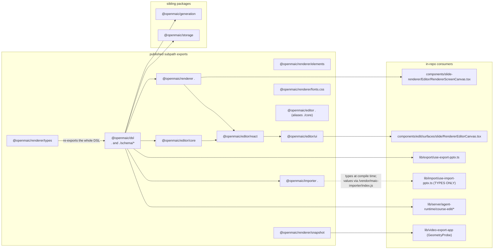
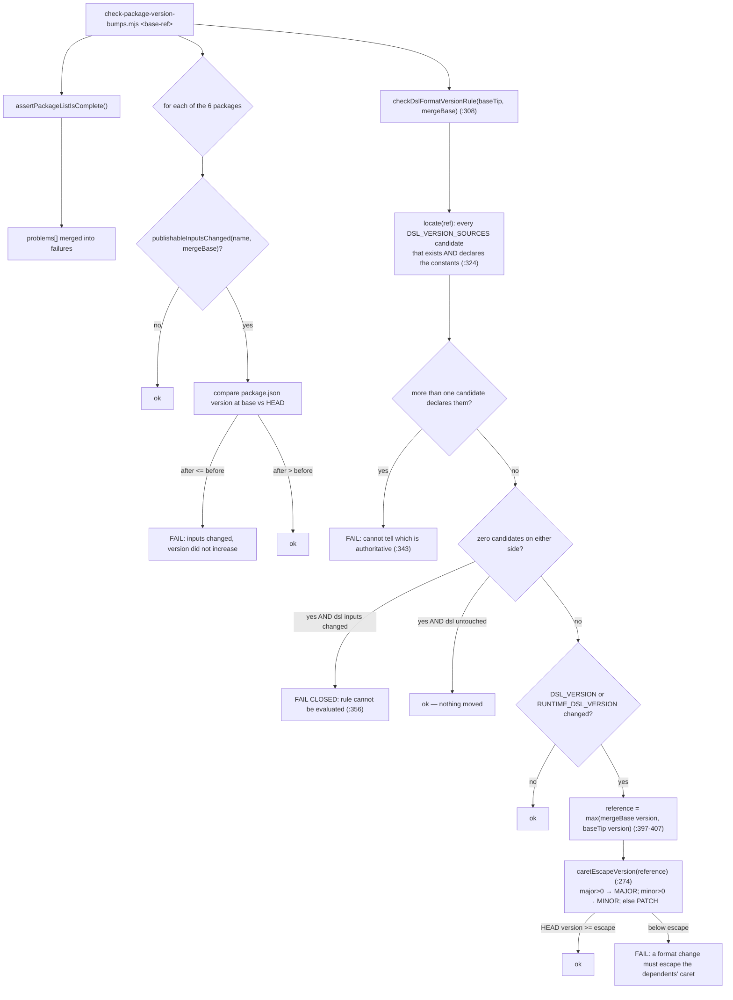
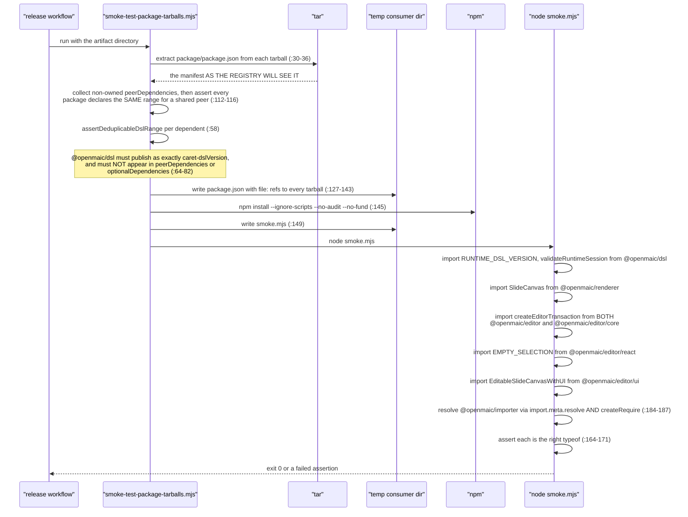

# 10 — Public package API and the release gates

Four of this subsystem's modules are published to npm: `@openmaic/dsl`, `@openmaic/renderer`,
`@openmaic/editor`, `@openmaic/importer`. This section is the surface an external consumer may rely on,
plus the two gates that protect it — the version-bump check and the tarball smoke test.

**Sources:** `packages/@openmaic/{dsl,renderer,editor,importer}/package.json`,
`packages/@openmaic/renderer/src/index.ts`, `packages/@openmaic/editor/src/{react,ui}/index.ts`,
`packages/@openmaic/importer/src/index.ts`, `scripts/openmaic-packages.mjs`,
`scripts/check-package-version-bumps.mjs`, `scripts/smoke-test-package-tarballs.mjs`,
root `package.json`;
evidence [../appendix/research/dsl-renderer-editor/04-dependencies-and-config.md](docs/appendix/research/dsl-renderer-editor/04-dependencies-and-config.md) §4,
[../appendix/research/quality-testing-ci-deps/00-overview.md](docs/appendix/research/quality-testing-ci-deps/00-overview.md).

## 1. Consumers and entry points



| Package | Version | Subpaths | Notes |
| --- | --- | --- | --- |
| `@openmaic/dsl` | 0.11.1 | `.`, `./schema/*` | `sideEffects: false`; ships `dist`, `README.md`, `LICENSE` |
| `@openmaic/renderer` | 0.1.6 | `.`, `./elements`, `./types`, `./snapshot`, `./fonts.css` | also ships `DESIGN.md`, `FONTS.md`, `font-licenses` |
| `@openmaic/editor` | 0.0.5 | `.` (= `./core`), `./core`, `./react`, `./ui` | `main`/`types` point at `dist/core/index` |
| `@openmaic/importer` | 0.1.3 | `.` only | dual: `import` → `dist/index.js`, `require` → `dist/index.cjs` |

Every export map is `types` + `import` (plus `require` for the importer) — no `default` fallbacks, so a
consumer reaching for an undeclared subpath gets a resolution error rather than an internal file.

## 2. What each surface guarantees

### 2.1 `@openmaic/dsl`

The barrel re-exports thirteen modules flat ([`src/index.ts:25-37`](packages/@openmaic/dsl/src/index.ts#L25-L37)) and deliberately excludes
`schema-roots.ts`. The surface is: the type universe, the guards, `validate*`, `normalize*`, the version
constants and ladder runners, the asset seam. See [./01-dsl-schema.md](docs/07-dsl-renderer-editor/01-dsl-schema.md) and
[./02-dsl-invariants.md](docs/07-dsl-renderer-editor/02-dsl-invariants.md).

`./schema/*` maps straight onto `dist/schema/` ([`package.json:14`](packages/@openmaic/dsl/package.json#L14)), so a cross-language consumer
imports `@openmaic/dsl/schema/scene.schema.json`.

### 2.2 `@openmaic/renderer`

`src/index.ts` is 39 lines and every export is named — there is no `export *` except the deliberate
`export * from './types'` at the end:

| Group | Exports |
| --- | --- |
| components | `SlideCanvas` + `SlideCanvasProps`, `SlideElement` + `SlideElementProps` |
| context | `SlideRendererProvider`, `useSlideContext`, `useOptionalSlideContext`, `SlideContextValue`, `SlideRendererProviderProps` |
| effects | `HighlightOverlay`, `SpotlightOverlay`, `LaserOverlay`, `ZoomWrapper` + their props types |
| hooks | `useSlideBackgroundStyle`, `useViewportSize` + `ViewportStyles`, `UseViewportSizeOptions`, `UseViewportSizeResult` |
| geometry | `findElementGeometry`, `findNearestCorner`, `getElementPercentageGeometry`, `PercentageGeometry` |
| element math | `getElementRange`, `getLineElementPath`, `getTableSubThemeColor` |
| styling | `cn`, `createTextProseStyles` |

`createTextProseStyles` being public is what lets a host share the renderer's exact rich-text layout
contract in its own editor DOM ([./03-renderer.md](docs/07-dsl-renderer-editor/03-renderer.md) §4).

`./snapshot` adds `slideToPng`, `measureSlideElementGeometry`, `MeasuredGeometry`, `MeasureOptions`,
`SlideToPngOptions`. `./elements` exposes the ten `Base*Element` components for a host that wants to
compose its own canvas.

### 2.3 `@openmaic/editor`

Three tiers with genuinely different stability characteristics:

| Subpath | Contents | Character |
| --- | --- | --- |
| `./core` | `EditIntent`, `EditorOperation`, `EditorTransaction`, `EditorHistory`, `compileEditorEditIntents`, `createEditorTransaction(FromIntents)`, `applyEditorTransaction`, `undo`/`redoEditorTransaction`, `createEditorHistory`, `isValidEditorElement`, `MAX_EDITOR_HISTORY` | pure, no React; the layer the RFC says "belongs in `@openmaic/dsl`" ([`src/react/types.ts:22`](packages/@openmaic/editor/src/react/types.ts#L22)) |
| `./react` | `EditableSlideCanvas`, `EMPTY_SELECTION`, `RendererTextEditor`, `createCanvasCommands`, `handleCanvasShortcut`, `useCanvasShortcuts`, plus ~16 type exports | the controlled gesture surface |
| `./ui` | `EditableSlideCanvasWithUI`, `resolveEditorHost`, `DEFAULT_EDITOR_INSERT_ITEMS`, `EDITING_UI_STYLES`, and ~14 toolbar/picker/overlay components (`TextFormatToolbar`, `LineFormatToolbar`, `InsertToolbar`, `TableInsertPicker`, `ChartInsertPicker`, `LineInsertPicker`, `BackgroundInsertPicker`, `LatexEditorDialog`, `LatexToolbarOverlay`, `VideoToolbarOverlay`, `EditorVideoContent`, `VideoInsertPicker`, `TextToolbarOverlay`, `DefaultColorPicker`, …) | opinionated chrome; the largest and least stable surface |

At `0.0.5` with a `./ui` barrel exporting dozens of identifiers, this is the package most likely to
break a consumer. `EditableSlideCanvasProps` also still carries props documented as no-ops
([`src/react/types.ts:150`](packages/@openmaic/editor/src/react/types.ts#L150)), so a consumer cannot tell from the types which props do anything — see
[./04-editor-prosemirror.md](docs/07-dsl-renderer-editor/04-editor-prosemirror.md).

### 2.4 `@openmaic/importer`

One subpath, and two distinct halves behind it (`src/index.ts`):

| Half | Exports | Bundler-safe? |
| --- | --- | --- |
| parse | `parse(buffer, options?)`, `ParseOptions`, `parseZip`, `buildPresentation`, `toPptxtojsonFormat`, plus `Output`/`Slide`/`Element`/`PptxFiles`/`PresentationData`/`MediaMode` types | **no** — pulls `pdfjs-dist` |
| transform | `importPptx`, `parsedToSlides`, `normalizeImportedSlides`, `transformParsedToSlides`, `createMockImportContext`, `ImportContext`, `TransformResult`, `OssUpload`, `ImportPptxOptions`, `Slide as CanvasSlide` | **yes** — `parsedToSlides` never touches the parser tree |

A Turbopack consumer must URL-load the parse half and call `parsedToSlides` with the JSON. See
[./09-vendored-forks.md](docs/07-dsl-renderer-editor/09-vendored-forks.md).

## 3. The one list behind every gate

[`scripts/openmaic-packages.mjs:34`](scripts/openmaic-packages.mjs#L34) is the single source of truth:

```js
export const OPENMAIC_PACKAGES = ['dsl', 'generation', 'storage', 'renderer', 'editor', 'importer'];
export const INTERNAL_DEPENDENTS = {
  generation: ['@openmaic/dsl'],
  storage: ['@openmaic/dsl'],
  renderer: ['@openmaic/dsl'],
  editor: ['@openmaic/dsl', '@openmaic/renderer'],
  importer: ['@openmaic/dsl'],
};
```

Six packages, ordered by dependency (`:15`). The module docstring explains why the list was
centralised (`:8-13`): several checks and the release workflow each carried their own copy, "which meant
a package missing from one of them was silently exempt from that check rather than failing anything."

`assertPackageListIsComplete()` (`:71`) cross-checks three sources as **exact sets**: the directories on
disk, `OPENMAIC_PACKAGES`, and `.github/workflows/publish-packages.yml`'s own enumerations. Being wrong
in either direction is silent by nature (`:63-68`), so the check asserts both:

| Enumeration in the workflow | How it is compared | Line |
| --- | --- | --- |
| `on.push.paths` | exact set, scoped to the `paths:` block so `$pkg` loop variables are not matched | `:151-167` |
| every `for pkg in …;` loop | exact set per loop | `:170-183` |
| `--filter "@openmaic/<name>"` | loosely: every package must appear somewhere, and no filter may name an unknown package | `:185-202` |

The filter check is deliberately loose and says why (`:132-139`): individual steps legitimately filter
subsets — the typecheck step omits importer — and "a textual check cannot tell a deliberate subset from
an accidental one; converting the workflow to a matrix would, and is a larger change than this."
Comments are stripped before matching (`:143-146`) so a commented-out trigger path cannot satisfy the
check while quietly disabling a release.

### 3.1 The threat model, written down

[`openmaic-packages.mjs:17-32`](scripts/openmaic-packages.mjs#L17-L32) states it plainly and it is worth quoting because it governs how to read
every gate in this section: these are configuration in the same repository as the code they check, so
anyone who can merge can shorten the list or relax a rule. "That is fine, because it is not the threat
these gates are for. They exist to catch **MISTAKES** … Deliberate subversion is not in scope and cannot
be."

## 4. The version-bump gate

`scripts/check-package-version-bumps.mjs` runs in two modes: `<base-ref>` (diff mode, merge-time) and
`--release` (pre-publish).



`readFormatConstants` (`:235`) anchors its regex to the start of a line so a commented-out
`// export const DSL_VERSION = '0.1.0'` cannot be read as the live value, and `export const <name> =`
keeps the longer identifiers that merely *contain* those names — `RUNTIME_DSL_VERSION_KEY`,
`INITIAL_DSL_VERSION`, `UNVERSIONED_DSL_VERSION` — from matching (`:239-242`).

Three deliberately conservative behaviours:

| Behaviour | Line | Why |
| --- | --- | --- |
| the caret to escape comes from the **highest dsl version on the base branch**, not the merge base | `:386-397` | that is what already-published dependents carry; an ordinary minor landing on main while the branch is open moves the reference |
| two candidate files both declaring the constants is an **error**, not "take the first" | `:341-350` | during a half-finished rename both can exist, the new one carrying stale values; taking the first would compare the wrong file and pass |
| unlocatable constants **while dsl changed at all** is a failure, not a default pass | `:351-367` | renaming that file is exactly the case where the rule would silently stop comparing |

The worked failure the whole rule prevents is spelled out at `:290-295`: dsl ships `0.5.1` moving
`DSL_VERSION 0.1.0 → 0.2.0` with a migration. Installation A resolves `0.5.1`, and the very same
published `storage` version stamps `dslVersion: '0.2.0'` into `document_stages`. Installation B,
lockfile-pinned to dsl `0.5.0`, reads that row and hard-fails as "newer than this client" — two installs
of one published storage version, silently data-incompatible.

### 4.1 The limitation the script documents on itself

[`check-package-version-bumps.mjs:16-30`](scripts/check-package-version-bumps.mjs#L16-L30) states it: "publishable input" means "file under the package
directory", which under-approximates for **all** the packages. Renderer and importer inline their
dependency graph through Rollup, so a lockfile-only resolution change rewrites their published bundles;
dsl and storage are not exempt either, because their `dist` is whatever the lockfile's TypeScript emits
and dsl's shipped JSON schema is generated by the lockfile's `ts-json-schema-generator`. Closing it
would mean treating the lockfile and toolchain as an input of every package — "Diff mode is a
merge-time guard against the common case, not a proof of byte equality."

Ignored inputs per package (`:8-53`): `.gitignore`, `vitest.config.ts`, `docs/` and `test/` for
everything, plus a longer list for importer covering its local tooling and its legacy `src1/` reference
implementation.

## 5. The tarball smoke test

`pnpm test:package-tarballs` → `scripts/smoke-test-package-tarballs.mjs <artifact-directory>`. It
installs the **packed tarballs** into a throwaway consumer and executes real imports.



The check that matters most for this subsystem is `assertDeduplicableDslRange` (`:58`), and its
docstring (`:38-56`) explains the stake: the dependents declare `@openmaic/dsl` as `workspace:^`, which
pnpm publishes as `^<dsl version>`, and that range is what lets a consumer installing several
`@openmaic` packages resolve **one** copy of the dsl. An exact pin — what `workspace:*` publishes —
gives each dependent its own copy, "and since the dsl carries the schema, the validators and the version
constants, two copies mean a document produced against one instance can be validated by the other's
schema revision."

It checks all three published constraint fields, because `peerDependencies` and
`optionalDependencies` are published constraints too and an exact entry in either would reintroduce the
duplicate while `dependencies` still read correctly (`:47-51`, `:71-82`).

Its own stated limitation (`:52-56`): `^` deduplicates within one `0.x` line only. A consumer mixing an
older dependent requiring `^0.5.0` with a newer one requiring `^0.6.0` still ends up with two dsl
copies. Removing that would mean making the dsl a peer dependency of all three dependents, which
changes their installation contract.

Both the dual-entry importer resolution (`import.meta.resolve` **and** `createRequire`, `:184-187`) and
the `@openmaic/editor` root-vs-`./core` double import (`:159-160`) exist to catch an export-map typo
that a single import path would not.

## 6. Where these gates run

| Gate | Trigger |
| --- | --- |
| `check:package-versions <base-ref>` | `.github/workflows/ci.yml` (diff mode) |
| `check:package-versions --release` | `.github/workflows/publish-packages.yml` (release mode) |
| `test:package-tarballs` | the release workflow, against packed artifacts |
| `assert-vendor-maic-importer.mjs` | `pnpm build`, before `next build` (root [`package.json:16`](package.json#L16)) |

The release workflow makes its security boundary a **job** boundary: install/build/pack run with
`contents:read` and no token; the token-bearing job downloads an immutable artefact, re-verifies its
SHA-256, requires the commit on main's first-parent history, and polls for a green `ci.yml` on the same
SHA. Details in [../16-development-view/index.md](docs/16-development-view/index.md).

## Open questions

- [`CONTRIBUTING.md:132`](CONTRIBUTING.md#changing-a-published-package) names **four** published packages where `OPENMAIC_PACKAGES` has six, omitting
  `generation` and `editor`. The doc is stale relative to the code.
- Nothing gates the two **vendored** forks (`packages/pptxgenjs`, `packages/mathml2omml`): they are
  outside `OPENMAIC_PACKAGES`, so no version, format or tarball check applies to them.
- Whether `@openmaic/editor` at `0.0.5` is intended to stabilise before or after the legacy in-app
  editor is deleted. The `./ui` surface is large and pre-0.1, and no deprecation or stability note
  exists on it.
- Whether `@openmaic/renderer`'s `tailwindcss >= 4` peer is still required (see
  [./03-renderer.md](docs/07-dsl-renderer-editor/03-renderer.md)); the smoke test installs declared non-optional peers, so it
  would surface a *missing* peer but not a *needless* one.
- Published tarball sizes and whether the "publishable inputs" under-approximation has ever bitten in
  practice. That needs `npm pack` and release history, neither available in this checkout.
