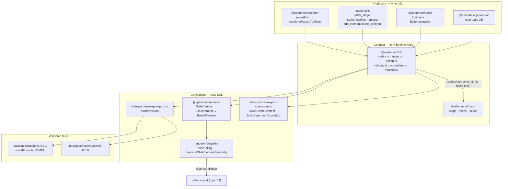
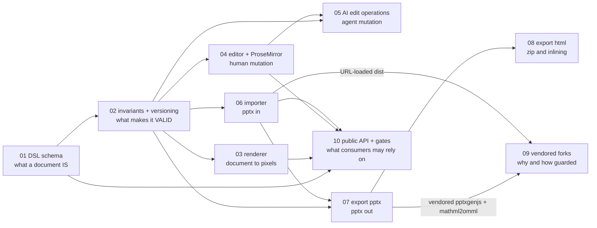

# Component View: Slide DSL, Renderer, Editor, Import/Export

This topic documents the **slide document** end to end: the serialized contract (`@openmaic/dsl`),
everything that turns it into pixels (`@openmaic/renderer`), everything that mutates it (human gesture
via `@openmaic/editor`, or an AI agent via typed DSL ops), and the two bridges to PowerPoint
(`@openmaic/importer` in, vendored `pptxgenjs` out).

It is a C4 Level-3 component view of one subsystem. It does not cover playback scheduling
(see [../08-classroom-runtime/index.md](../08-classroom-runtime/index.md)), TTS/whiteboard/video
(see [../09-media-and-export/index.md](../09-media-and-export/index.md)), or where documents are
stored (see [../10-persistence-and-state/index.md](../10-persistence-and-state/index.md)).

## Who this is for

A staff engineer who has to change the slide contract, add an element type, fix a fidelity bug in the
`.pptx` bridge, or reason about why an AI edit was rejected. It assumes you can read TypeScript and
that you will open the cited file rather than trust a paraphrase.

## The five homes

| Concern | Home | Nature |
| --- | --- | --- |
| The contract | `packages/@openmaic/dsl` | pure types, generated JSON Schema, pure validators/normalizers, two migration ladders; zero runtime deps (`packages/@openmaic/dsl/src/index.ts:10-12`; `package.json` declares no `dependencies` block at all) |
| Read-only paint | `packages/@openmaic/renderer` | React; `Slide` in, DOM out, plus an off-screen PNG/geometry snapshot path |
| Mutation | `packages/@openmaic/editor` | pure op/transaction/history kernel (`src/core/index.ts`) + a React gesture surface (`src/react/`) + optional chrome (`src/ui/`) |
| `.pptx` → DSL | `packages/@openmaic/importer` | OOXML unzip → model → serializer → `Slide[]`, then the DSL's own normalize pass |
| DSL → `.pptx` / HTML | `lib/export/` + vendored `packages/pptxgenjs` + `packages/mathml2omml` | browser-side deck writer, LaTeX→OMML, HTML asset inlining |

Two implementations of renderer + editor ship simultaneously: the packaged `@openmaic/*` ones behind
feature flags, and a legacy in-app pair (`components/slide-renderer/`, `lib/edit/`,
`lib/prosemirror/`) that is still the default. That duality is this subsystem's dominant structural
debt and is called out wherever it changes behaviour.

## Topic overview

Dependency arrows are declared and kept acyclic by fiat in
`packages/@openmaic/dsl/src/index.ts:4-8`: `dsl -> (nothing)`, `renderer -> dsl`, `importer -> dsl`;
`scripts/openmaic-packages.mjs:37` adds `editor -> {dsl, renderer}`.

## Sources

Read from the code at `main` / `c2c9553a`. Primary paths:

- `packages/@openmaic/dsl/src/**`, `packages/@openmaic/dsl/scripts/gen-schema.mjs`
- `packages/@openmaic/renderer/src/**`
- `packages/@openmaic/editor/src/{core,react,ui}/**`
- `packages/@openmaic/importer/src/**`
- `lib/export/**`, `lib/edit/**`, `lib/prosemirror/**`, `lib/import/use-import-pptx.ts`
- `lib/server/agent-runtime/{dsl-tools.ts,course-edit/**,import-pptx*.{ts,mjs}}`
- `packages/pptxgenjs/src/**`, `packages/mathml2omml/src/**`
- `scripts/{sync-maic-importer,assert-vendor-maic-importer,check-package-version-bumps,openmaic-packages}.mjs`

Evidence packs: [../appendix/research/dsl-renderer-editor/00-overview.md](../appendix/research/dsl-renderer-editor/00-overview.md)
and its siblings `01a`–`07`.

## Reading order

Read `01` and `02` first: everything else is a producer or a consumer of that contract. `09` and `10`
are reference material you reach for when a build breaks or a release is being cut.

## Section files

| File | What it covers |
| --- | --- |
| [01-dsl-schema.md](./01-dsl-schema.md) | The node-type inventory: the 10-variant `PPTElement` union, `Slide`, `Stage`/`Scene`/content kinds, the 21-verb `Action` union, and an annotated minimal document |
| [02-dsl-invariants.md](./02-dsl-invariants.md) | What a valid document must satisfy: the structural validators, the generated JSON Schema, the two independent version ladders, and the cross-line guard |
| [03-renderer.md](./03-renderer.md) | `Slide` → DOM: the canvas contract, z-order, fit-scale math, the authored-vs-rendered box divergence, and what is and is not deterministic |
| [04-editor-prosemirror.md](./04-editor-prosemirror.md) | The `EditIntent`/`EditorOperation` two-layer kernel, undo/redo, ProseMirror integration, and the DSL ↔ PM document mapping |
| [05-ai-edit-operations.md](./05-ai-edit-operations.md) | Why the agent emits typed DSL ops instead of prose: the op vocabulary, the closed TypeBox mirror, and concurrent-write handling |
| [06-importer-pptx-to-dsl.md](./06-importer-pptx-to-dsl.md) | `.pptx` → `Slide[]`: the four-layer parser, the shape-preset machinery, unit conversion, and the fidelity losses that are known and accepted |
| [07-export-pptx.md](./07-export-pptx.md) | `Slide[]` → `.pptx` via the vendored pptxgenjs, equations via temml + mathml2omml, and what is dropped |
| [08-export-html.md](./08-export-html.md) | The classroom ZIP and interactive-HTML asset inlining — what "HTML export" actually is here, and what it is not |
| [09-vendored-forks.md](./09-vendored-forks.md) | Why pptxgenjs and mathml2omml are vendored, the importer's static-URL bundle, and the sync/assert guard scripts |
| [10-public-package-api.md](./10-public-package-api.md) | The public export surface consumers may rely on, plus the version-bump gate that protects the serialized format |

## Cross-topic links

- Who calls `patch_stage` and how a session survives a restart: [../05-agent-runtime/index.md](../05-agent-runtime/index.md)
- Who produces the first `Slide` of a course: [../06-generation-pipeline/index.md](../06-generation-pipeline/index.md)
- Who plays an `Action` list: [../08-classroom-runtime/index.md](../08-classroom-runtime/index.md)
- Who resolves an `AssetRef` to bytes: [../10-persistence-and-state/index.md](../10-persistence-and-state/index.md)
- Vendored-fork licensing and the full dependency inventory: [../13-dependencies/index.md](../13-dependencies/index.md)
- The set root: [../README.md](../README.md)
