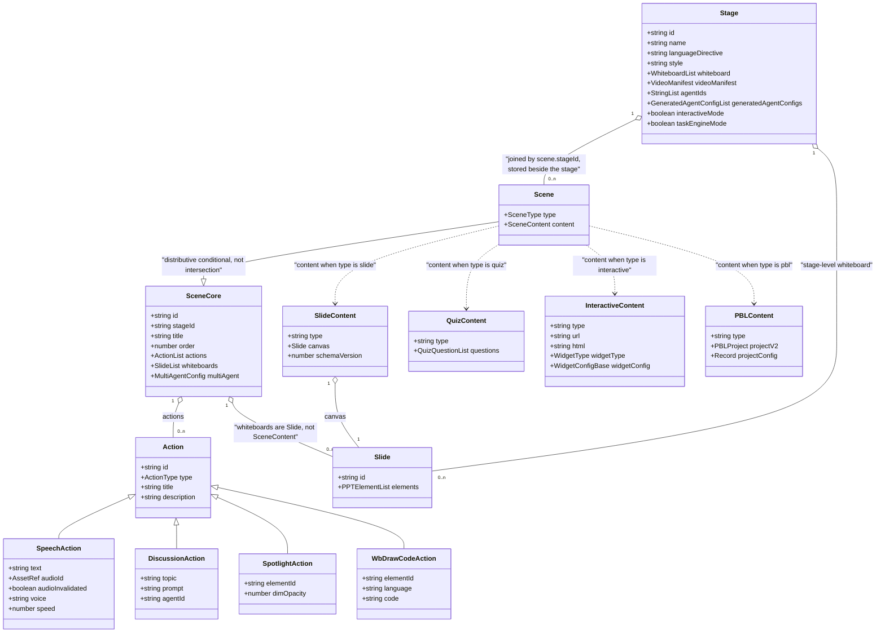
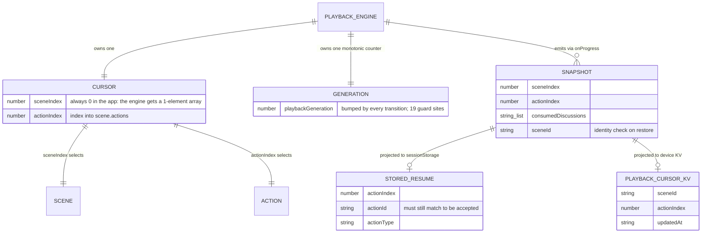

# Playback Vocabulary

Four words carry most of the weight in this subsystem — *stage*, *scene*,
*action*, *utterance* — and three of them are overloaded. This page pins each one
to a declared type at a line number, draws the containment hierarchy, and lists
the overloads so the rest of the docs set can use the words without hedging.

**Sources:** `packages/@openmaic/dsl/src/stage.ts`,
`packages/@openmaic/dsl/src/action.ts`, `lib/playback/engine.ts`,
`lib/playback/types.ts`, `lib/buffer/stream-buffer.ts`, `components/stage.tsx`,
`lib/choreography/cursor.ts`,
[`../appendix/research/classroom-runtime/00-overview.md`](../appendix/research/classroom-runtime/00-overview.md).

## The four terms

| Term | Declared as | Line | One-sentence definition |
| --- | --- | --- | --- |
| **stage** | `interface Stage` | `packages/@openmaic/dsl/src/stage.ts:141` | The whole course document: `id`, `name`, optional `languageDirective` / `style`, a stage-level `whiteboard: Whiteboard[]`, a `videoManifest`, and the persisted agent roster (`agentIds` or `generatedAgentConfigs`). |
| **scene** | `type Scene` over `interface SceneCore` | `:278` / `:228` | One page of the course. `SceneCore` carries `id`, `stageId`, `title`, `order`, optional `actions?: TAction[]`, optional `whiteboards?: Slide[]`, optional `multiAgent`. `Scene` binds a `type` discriminant to a matching `content` payload. |
| **action** | `type Action` | `packages/@openmaic/dsl/src/action.ts:235` | One playback verb. A 21-member discriminated union on `type`. |
| **utterance** | *not a domain type* | — | There is no `Utterance` in the codebase. The only identifier is the browser's `SpeechSynthesisUtterance` (`lib/playback/engine.ts:798`). See [§ Utterance](#utterance-the-word-with-no-type) below. |

`SceneType` is a closed four-member union — `'slide' | 'quiz' | 'interactive' |
'pbl'` (`stage.ts:22`) — mirrored by a `SCENE_TYPES` tuple with a compile-time
exhaustiveness assertion (`stage.ts:35-37`) so adding a member without updating
the tuple fails the build. `StageMode` is a separate three-member union
`'autonomous' | 'playback' | 'edit'` (`stage.ts:45`).

## Containment

Two things the diagram encodes that a table would not:

1. **`Scene` is not `SceneCore & { content }` by intersection.** It is a
   distributive conditional over the content union (`stage.ts:281-283`), so each
   member ties *its own* `type` to *its own* `content` shape. A
   `{ type: 'quiz', content: SlideContent }` value is unrepresentable.
   `InteractiveContent` (`packages/@openmaic/dsl/src/interactive.ts:51`) and
   `PBLContent` (`packages/@openmaic/dsl/src/pbl.ts:151`) are contract-owned but
   composed in through `Scene`'s generic content parameter — the default is only
   `SlideContent | QuizContent` (`stage.ts:280`).
2. **`whiteboards` on a scene are `Slide[]`, not scene content.** A whiteboard is
   structurally `Omit<Slide, 'theme' | 'turningMode' | 'sectionTag' | 'type'>`
   (`stage.ts:51`). Stage-level and scene-level whiteboards both exist; the
   whiteboard the runtime mutates is resolved through `lib/api/stage-api`'s
   `whiteboard.get()` (`lib/action/engine.ts:301`).

## The 21 actions, grouped by how playback treats them

`FIRE_AND_FORGET_ACTIONS = ['spotlight', 'laser']` and `SYNC_ACTIONS` (19
members) partition the union at `action.ts:261` and `:267`. The partition is data,
not a hardcoded branch: `lib/choreography/timeline.ts:51` builds its blocking set
from `FIRE_AND_FORGET_ACTIONS` precisely so the two cannot drift.

| Group | Members | Playback behaviour |
| --- | --- | --- |
| Fire-and-forget effects | `spotlight`, `laser` | Dispatched, then `queueMicrotask` straight to the next action (`lib/playback/engine.ts:672`). Cleared by one shared 5 s timer. |
| Narration | `speech` | Handled by `PlaybackEngine` itself, never through `ActionEngine` on the playback path. Owns the clock (`engine.ts:584`). |
| Whiteboard mutations (12) | `wb_open`, `wb_draw_text`, `wb_draw_shape`, `wb_draw_chart`, `wb_draw_latex`, `wb_draw_table`, `wb_draw_line`, `wb_draw_code`, `wb_edit_code`, `wb_clear`, `wb_delete`, `wb_close` | `await ActionEngine.execute(action)` (`engine.ts:735`); each has a fixed animation dwell. The only group replayed during a seek. |
| Video | `play_video` | Blocking; waits for the media task to become playable, then for the element to stop playing, capped at `MAX_VIDEO_WAIT_MS` (`lib/action/engine.ts:424`). |
| Discussion | `discussion` | Blocking in a different sense: it schedules a 3 s timer, shows a card, and then the engine idles with **no timer of its own** (`engine.ts:706-713`). |
| Widget messages (4) | `widget_highlight`, `widget_setState`, `widget_annotation`, `widget_reveal` | `postMessage` into the interactive iframe plus a 300 ms dwell (`lib/action/engine.ts:872-901`). |

`SLIDE_ONLY_ACTIONS` (`action.ts:264`) is a third, smaller list — `spotlight` and
`laser` again — declaring which verbs need slide canvas elements to point at.

## Cursor, generation, snapshot

Three runtime concepts complete the vocabulary. None of them is in the DSL.

- **cursor** — the `(sceneIndex, actionIndex)` pair private to `PlaybackEngine`
  (`engine.ts:64-65`). Resolved to a concrete action by the pure
  `resolvePlaybackCursor` (`lib/choreography/cursor.ts:44`), which advances past
  exhausted scenes and yields one synthetic `EMPTY_SCENE_DWELL` beat for a scene
  with `actions: []` (`cursor.ts:19`, `:54`) so a blank slide still shows.
  `sceneIndex` is effectively dead in the app: the only production constructor
  passes `[currentScene]` (`components/edit/PlaybackChromeRoot.tsx:759`). The
  multi-scene walk exists for the video exporter.
- **generation** — `playbackGeneration`, a monotonic counter
  (`engine.ts:96`, `:493`). Every state transition bumps it; every async
  continuation opens with `if (!this.isCurrentGeneration(generation)) return;`.
  This, not an `AbortController`, is the cancellation primitive.
- **snapshot** — `PlaybackSnapshot` (`lib/playback/types.ts:5`), emitted through
  `onProgress` **before** the cursor advances (`engine.ts:579`), so a restored
  snapshot replays the action the learner was part-way through rather than the
  next one.

## Utterance: the word with no type

Docs and issue threads say "utterance". The code does not. Two structurally
different things get called that, and conflating them causes real confusion:

| What a reader means | Actual type | Where it lives | Audio source |
| --- | --- | --- | --- |
| A pre-authored narration line | `SpeechAction` (`action.ts:47`) with an `audioId?: AssetRef` | inside `scene.actions` in the document | Pre-generated bytes resolved at play time by `AudioPlayer.play` (`lib/utils/audio-player.ts:99`); falls back to browser TTS, then to a timer |
| A live agent's spoken segment | a `TextItem` in the `StreamBuffer` queue (`lib/buffer/stream-buffer.ts:35`), sealed then queued | in memory only, driven by SSE deltas | Synthesised per segment by `useDiscussionTTS` after `onSegmentSealed` (`lib/hooks/use-discussion-tts.ts:351`) |

The browser-TTS path adds a third granularity: a `SpeechAction`'s text is split
into **sentence chunks** and each chunk becomes one real
`SpeechSynthesisUtterance` (`engine.ts:757`, `:798`), because Chrome silently
truncates utterances beyond roughly fifteen seconds and never fires `onend`.

**Convention for this docs set:** "narration line" for a `SpeechAction`, "live
segment" for a sealed `TextItem`, "chunk" for a `SpeechSynthesisUtterance`. The
bare word *utterance* is avoided.

## The other overloads

The canonical table for the whole set is [`../glossary.md`](../glossary.md); what follows
is the playback-relevant subset, plus the two senses of *stage* that this topic never
touches but a reader arriving from 04 or 06 will already have met.

| Word | Meaning A | Meaning B |
| --- | --- | --- |
| **whiteboard** | a `Slide`-shaped document attached to a stage or a scene | the live overlay layer rendered at `z-[110]` above scene content (`components/canvas/canvas-area.tsx:123-127`) |
| **mode** | `StageMode` — `autonomous \| playback \| edit`, the chrome selector | `EngineMode` — `idle \| playing \| paused \| live`, the playback state (`lib/playback/types.ts:18`) |
| **cursor** | the engine's `(sceneIndex, actionIndex)` | `PlaybackCursor`, the persisted `{sceneId, actionIndex, updatedAt}` record in device KV (`lib/playback/cursor.ts`) |

**`stage` has four senses, not two.** The two this topic uses:

| Sense | What it is |
| --- | --- |
| Stage-the-document | the course document (`Stage`, `packages/@openmaic/dsl/src/stage.ts:141`) — the unit of persistence |
| `components/stage.tsx` | the top-level React container (388 lines) that dispatches chrome and mounts `InteractiveIframeHost` |

And the two it does not, listed because nothing in the code distinguishes them:

| Sense | What it is | Read |
| --- | --- | --- |
| `LlmStage` | one of the 20 routable *model-selection* keys — `'scene-outlines-stream'`, `'scene-content:quiz'`, `'chat-adapter'`, `'maic-agent-driver'`, … `LLM_STAGES` at `lib/server/model-routes.ts:131`, the type at `:154`. It selects a **model**, not a document | [`../04-ai-provider-layer/03-stage-routing.md`](../04-ai-provider-layer/03-stage-routing.md) |
| stage-as-pipeline-step | prose only, no type: "stage 2 produces the outline". Four steps | [`../06-generation-pipeline/01-pipeline-overview.md`](../06-generation-pipeline/01-pipeline-overview.md) |

The collision is live rather than theoretical: playback runs a Stage document whose scenes
were generated by pipeline step 4, and each of those generation calls routed through the
`LlmStage` `'scene-content:slide'`. Three senses, one word, one trace.

Two directory names also mislead: `components/edit/PlaybackChromeRoot.tsx` is the
*playback* orchestrator despite living under `components/edit/`, and `lib/live/`
contains exactly one file, `server-api.ts`, whose one non-error export is `apiRenameStage`
— nothing live, nothing playback.

## Next

- [`./02-playback-state-machine.md`](./02-playback-state-machine.md) — what the
  engine does with this vocabulary.
- [`../07-dsl-renderer-editor/index.md`](../07-dsl-renderer-editor/index.md) —
  the contract package that owns `Stage`, `Scene` and `Action`.
