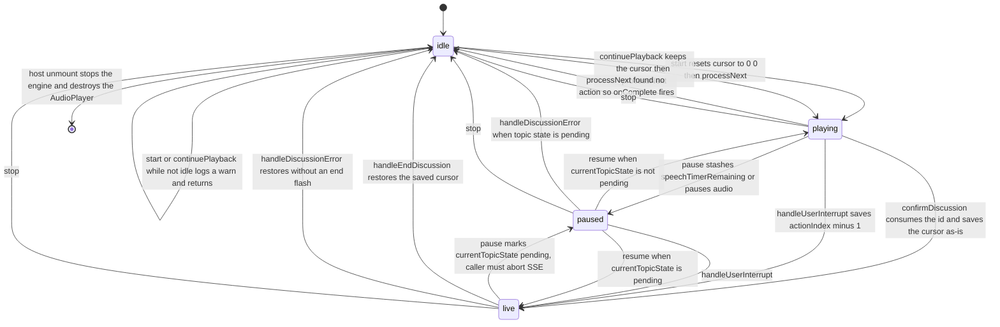
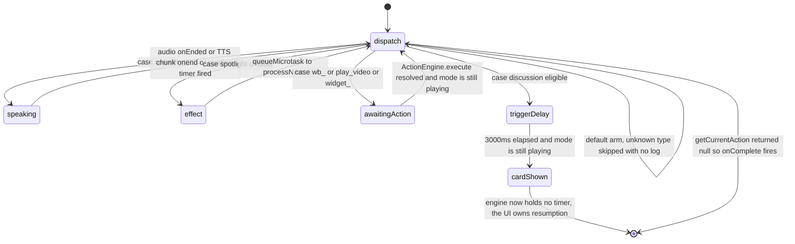
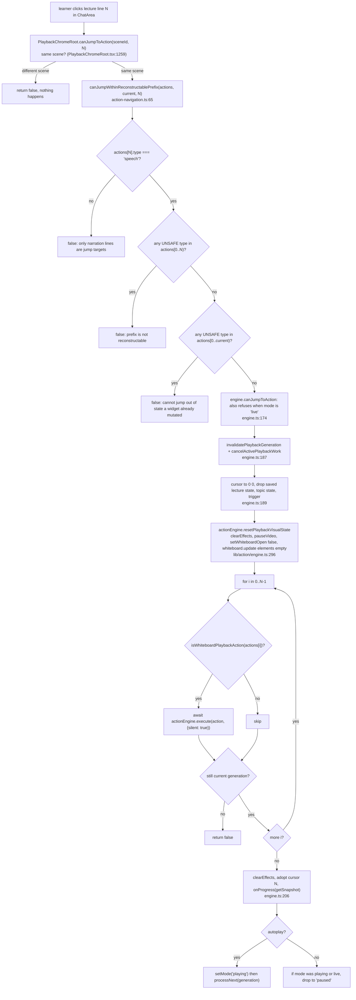

# The Playback State Machine

`PlaybackEngine` (`lib/playback/engine.ts`, 902 lines, one class, no React) is the
whole playback state machine. This page covers its four modes and every
transition, the four competing clocks, the generation counter that makes
cancellation safe, and exactly what happens when a learner pauses, seeks or
resumes part-way through a narration line.

**Sources:** `lib/playback/engine.ts`, `lib/playback/types.ts`,
`lib/playback/action-navigation.ts`, `lib/playback/action-resume.ts`,
`lib/playback/cursor.ts`, `lib/playback/auto-resume.ts`,
`components/edit/PlaybackChromeRoot.tsx`, `lib/action/engine.ts`,
[`../appendix/research/classroom-runtime/01a-modules-playback.md`](../appendix/research/classroom-runtime/01a-modules-playback.md).

## Modes

`EngineMode = 'idle' | 'playing' | 'paused' | 'live'` (`lib/playback/types.ts:18`).
A second, orthogonal field `currentTopicState: TopicState | null`
(`'active' | 'pending' | 'closed'`, `types.ts:21`) disambiguates two very
different `paused` states, and a third field `currentTrigger: TriggerEvent | null`
distinguishes "paused mid-narration" from "waiting on a discussion card".



Inside `playing`, `processNext` is itself a small machine — one state per action
group, all of them returning to the dispatcher:



Two invariants that are easy to break and are commented as bug fixes:

- **`setMode` is a no-op when the mode is unchanged** (`engine.ts:521`), so
  `onModeChange` never fires spuriously.
- **Mode is set *before* audio is stopped** in both `stop()` (`engine.ts:319-322`)
  and `handleUserInterrupt()` (`engine.ts:459-465`), because
  `speechSynthesis.cancel()` can fire `onend` synchronously and the `processNext`
  guard tests `this.mode === 'playing'`. Setting mode first prevents a spurious
  `processNext` that would advance past the interrupted line.

## The generation counter

There is no `AbortController` in the engine. Cancellation is
`playbackGeneration`, a monotonic integer (`engine.ts:96`):

```ts
private invalidatePlaybackGeneration(): number {   // :493
  this.playbackGeneration += 1;
  return this.playbackGeneration;
}
private isCurrentGeneration(generation: number): boolean {   // :498
  return generation === this.playbackGeneration;
}
```

Every public transition bumps it — `start` `:158`, `continuePlayback` `:169`,
`jumpToAction` `:187`, `pause` `:224`/`:254`, `stop` `:318`,
`confirmDiscussion` `:359`, `skipDiscussion` `:390`, `handleEndDiscussion` `:400`,
`handleDiscussionError` `:430`, `handleUserInterrupt` `:441` — and every async
continuation opens by checking it. There are 19 guard sites between `engine.ts:198`
and `:838` (a twentieth `isCurrentGeneration` hit at `:498` is the method
definition itself). `processNext` alone checks twice: once on entry (`:553`) and once
after `getCurrentAction()` (`:565`).

`cancelActivePlaybackWork()` (`:502`) is the paired teardown: stop audio, cancel
browser TTS, `clearEffects()`, `pauseVideo()`, kill both timers, zero
`speechTimerRemaining`, `onProactiveHide()`.

## Clock ownership — there is no single clock

Whichever of four mechanisms is live owns the advance to the next action.

| Owner | Installed at | Advance trigger | Notes |
| --- | --- | --- | --- |
| Pre-generated audio | `engine.ts:589` `audioPlayer.onEnded(cb)` | the `HTMLAudioElement` `ended` event → `onSpeechEnd` → `processNext` | The callback is registered *before* `play()` is called (`:623`) |
| Browser-native TTS | `engine.ts:829` `utterance.onend` | per **sentence chunk**, then recursion into `playBrowserTTSChunk` | Only used when `ttsProviderId === 'browser-native-tts'` **and** that provider is enabled (`:632-643`) |
| Reading timer | `engine.ts:601` `scheduleReadingTimer` | `setTimeout(estimateSpeechDurationMs(text, {speed}))` | The fallback when there is no audio and no browser TTS, and the only path for blank text |
| `await ActionEngine.execute` | `engine.ts:735` | the action's own `delay()` inside `ActionEngine` | The 12 whiteboard verbs, `play_video`, and the 4 `widget_*` verbs |

`spotlight` and `laser` own no clock at all: they dispatch and then
`queueMicrotask(() => processNext(generation))` (`engine.ts:672`). The microtask —
rather than direct recursion — is explicitly there to avoid a stack overflow on a
long run of consecutive effects.

`discussion` is the one action that hands the clock to the **UI**. `processNext`
arms a `DISCUSSION_TRIGGER_DELAY_MS` (3 000 ms) timer, and when it fires the
engine sets `currentTrigger`, calls `onProactiveShow`, and stops — it holds no
further timer (`engine.ts:706-713`, comment at `:712`: "Engine pauses here").
Resumption comes from `ProactiveCard`'s own 5 s countdown calling `onSkip`, or the
learner joining. See [§ Known stall](#known-stall-a-discussion-with-no-viewer).

## Speech dispatch, in order

`processNext`'s `case 'speech'` (`engine.ts:584-655`) does five things in a fixed
order, and the order matters:

1. `onSpeechStart(text)` — the bubble and the chat transcript update *before* any
   audio decision is made, so the line is visible even if audio never starts.
2. `audioPlayer.onEnded(cb)` — the advance callback is installed first, because
   `play()` may resolve after the audio has already ended on a very short clip.
3. `hasText = !!speechAction.text.trim()` — computed up front (`:621`). Blank text
   never reaches `speechSynthesis`; an empty `SpeechSynthesisUtterance` does not
   reliably fire `onend` in Chromium and would hang the slide.
4. `audioPlayer.play(audioId || '', legacyAudioUrl)` (`:623-626`). Resolves to
   `true` if bytes were found and playback started.
5. On `false`: browser TTS if and only if it is both selected and enabled,
   else `scheduleReadingTimer()`. On a rejected promise: `log.error` then
   `scheduleReadingTimer()` (`:650-654`) — playback never stalls on an audio
   failure.

## Pause and resume, mid-line

`pause()` has three distinct branches (`engine.ts:222-261`), and `resume()` has
four (`:264-314`). The pairing is exact:

| Situation at pause | `pause()` does | `resume()` does |
| --- | --- | --- |
| Playing with pre-generated audio | `audioPlayer.pause()` (`:250`) | re-registers `onEnded` with the **current** generation, then `audioPlayer.resume()` (`:287-297`) |
| Playing with browser TTS | saves `browserTTSChunks.slice(chunkIndex)` into `browserTTSPausedChunks`, then `speechSynthesis.cancel()` (`:246-247`) | re-speaks from the **start of the current chunk** (`:280-286`) |
| Playing with a reading timer | `speechTimerRemaining -= Date.now() - speechTimerStart`, `clearTimeout` (`:232-237`) | reschedules exactly `speechTimerRemaining` (`:298-308`) |
| Playing while a `ProactiveCard` is shown (`currentTrigger` set) | mode only — audio is deliberately **not** touched (`:241`) | mode only (`:274-276`) |
| Audio already finished while paused | — | falls through to a bare `processNext()` (`:311`) |
| `live` (an agent is streaming) | mode → `paused`, `currentTopicState = 'pending'`; **the caller must abort SSE** (`:253-257`) | `currentTopicState = 'active'`, mode → `live` (`:270-273`) |

The browser-TTS cancel-and-re-speak pattern exists because
`speechSynthesis.pause()`/`resume()` is broken on Firefox (comment at `:243-245`).
The cost is bounded: a pause loses at most one sentence of position, never the
whole line. The `'canceled'` error code is then explicitly ignored in
`utterance.onerror` (`:840`) because it is the expected consequence of the cancel.

`pause()` in `idle` logs `Cannot pause: mode is idle` and returns (`:259`);
`resume()` outside `paused` likewise (`:266`). Neither throws.

## Seek

Seeking is `jumpToAction(actionIndex, { autoplay })` (`engine.ts:182`). It is the
only operation that rebuilds visual state from scratch, and it is admission-gated.



`UNSAFE_ACTION_TYPES` is `play_video`, `discussion`, and the four `widget_*`
(`action-navigation.ts:16-23`). `WHITEBOARD_ACTION_TYPES` is the 12 `wb_*` verbs
(`:25-38`) — that is the replay set.

`{ silent: true }` short-circuits `speech`, `spotlight`, `laser`, `discussion`,
`play_video` and every `widget_*` inside `ActionEngine.execute`
(`lib/action/engine.ts:215-225`), and suppresses the `delay()` in each whiteboard
verb, so the replay is instant and produces board state without narration,
effects, or animation. The one exception worth knowing: `executeWbClear` in silent
mode writes `{elements: []}` directly instead of running the cascade animation
(`lib/action/engine.ts:832-836`).

Note what `resetPlaybackVisualState` implies: a seek **empties the whiteboard
document** and closes the board before replaying. Board state after a seek is
therefore derived purely from the replayed prefix, never from whatever was on
screen.

`autoplay` defaults to `options.autoplay ?? this.mode === 'playing'`
(`engine.ts:186`); the host passes it explicitly as
`engine.getMode() === 'playing'` (`PlaybackChromeRoot.tsx:1275`). Resume-on-mount
passes `{ autoplay: false }` (`:943`) — restoring a position never starts
playback.

## Resume across reloads: two stores, one winner

| Store | Scope | Key | Written by |
| --- | --- | --- | --- |
| `sessionStorage` | per tab, per scene | `getActionResumeStorageKey(stageId)` (`lib/playback/action-resume.ts`) | `saveSceneResumePosition` on every `onProgress`, synchronously (`PlaybackChromeRoot.tsx:769`) |
| KV `device` scope | per device, per stage | `playback-cursor:<stageId>` (`lib/playback/cursor.ts`) | `scheduleCursorSave`, debounced 1 000 ms (`PlaybackChromeRoot.tsx:326-338`) |

`sessionStorage` wins: the KV cursor is consulted only when the session position
is absent (`PlaybackChromeRoot.tsx:690`). Both are validated before use — the KV
path additionally re-checks `cursor.sceneId === currentScene.id`, that
`actions[cursor.actionIndex]` exists, and
`canJumpWithinReconstructablePrefix(actions, 0, cursor.actionIndex)` (`:693-697`).

`saveSceneResumePosition` (`:345`) is defensive in a way worth noting: if the
current action is not a `speech` **and** the prefix up to it crossed an unsafe
action, it *clears* the stored position rather than storing an unusable one
(`:357-366`). A pending debounced KV write is flushed synchronously in the unmount
cleanup (`:970-972`).

`restoreFromSnapshot(snapshot)` exists on the public API (`engine.ts:143`) and has
**zero call sites** anywhere, including tests. The app restores through
`jumpToAction` instead, because a bare cursor assignment would not replay the
whiteboard prefix.

## Auto-resume after an interruption

`shouldAutoResumeLecture` (`lib/playback/auto-resume.ts:37`) is a pure function
whose entire body is five refusals:

```ts
if (args.source !== 'soft_close_confirmed' && args.source !== 'soft_close_timeout') return false;
if (!args.hadLectureInterruption) return false;
if (args.endReason !== 'user_done' && args.endReason !== 'back_to_lesson') return false;
if (args.engineMode !== 'idle') return false;
if (args.isExhausted || args.playbackCompleted) return false;
return true;
```

`hadLectureInterruption` must be read **before** cleanup runs, because
`handleEndDiscussion()` restores and then clears the saved position
(`PlaybackChromeRoot.tsx:495`, `engine.ts:526-533`). After the awaited
`startLecture`, the host re-checks both `engineRef.current === engine` and
`engine.getMode() === 'idle'` and tears down the just-created session on either
failure (`:520-530`) — a scene switch during the await would otherwise resume an
orphaned engine over the new scene's cursor.

## Scene completion and auto-advance

`processNext` reaching a null cursor is the completion path: bump generation,
`clearEffects()`, mode → `idle`, `onComplete()` (`engine.ts:565-571`). The engine
itself does nothing further; auto-advance lives in the host's `onComplete`
callback (`PlaybackChromeRoot.tsx:871-922`): after 1 500 ms it re-reads
`autoPlayLecture`, refuses to advance off a `quiz`, `interactive` or `pbl` scene
(`:895-901`), sets `autoStartRef.current = true`, and calls `setCurrentSceneId`.
The next `initializeScene` sees that flag and calls `engine.start()` (`:929-938`).

This bypasses `gatedSceneSwitch` entirely — auto-advance is the ungated path,
which is safe only because it fires from `idle` with no live session.

## Known stall: a discussion with no viewer

If `processNext` arms the trigger timer and the learner never interacts, the
engine sits at `currentTrigger` with no timer. The only thing that resumes it is
`ProactiveCard`'s countdown, and that countdown is gated on `mode === 'playback'`
(`components/chat/proactive-card.tsx:94`, `:115`). The roundtable passes
`mode={engineMode === 'paused' ? 'paused' : 'playback'}`
(`components/roundtable/index.tsx:1111`, `:1269`, `:2045`) — so the countdown
runs in every state except a paused engine, and a paused engine showing a
discussion card waits indefinitely. That is the intended behaviour for a pause,
but it means the card is the sole owner of the resume path.

The exporter models the *unattended* branch as
`DISCUSSION_TRIGGER_DELAY_MS + DISCUSSION_AUTO_SKIP_MS` = 8 000 ms of dwell
(`lib/choreography/timeline.ts:210`).

## Unknown actions are skipped silently

`processNext`'s `default:` arm calls `processNext(generation)` with no log and no
counter (`engine.ts:743-746`). A document carrying a verb the running build does
not know about therefore plays as if the verb were absent, with no diagnostic.

## Next

- [`./03-choreography.md`](./03-choreography.md) — the pure spec these timings
  come from.
- [`./07-utterance-to-output.md`](./07-utterance-to-output.md) — one narration
  line traced end to end.
- [`./06-turn-taking-and-interruption.md`](./06-turn-taking-and-interruption.md) —
  the `live` mode's other half.
