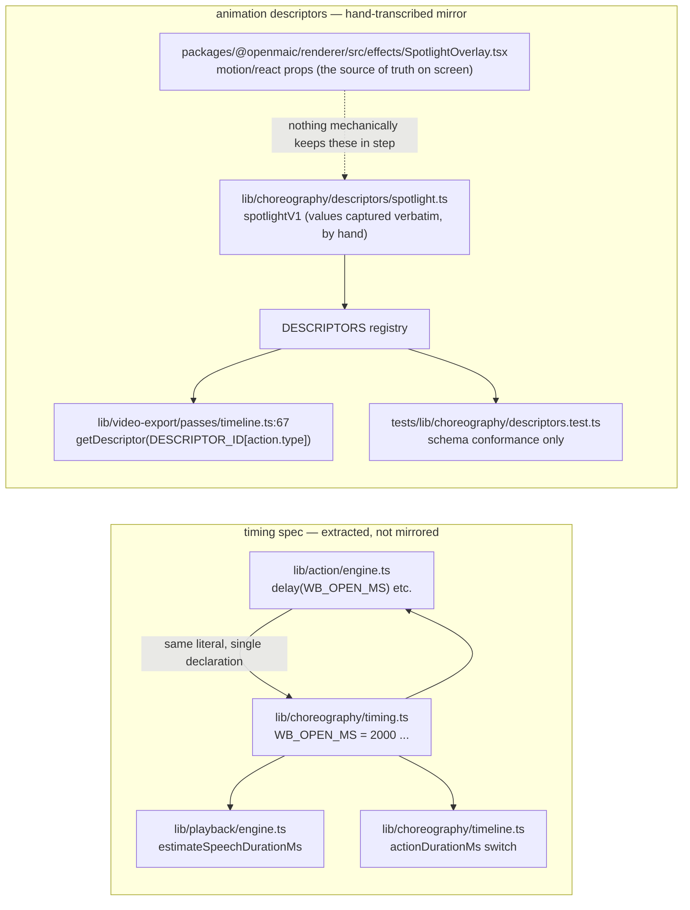
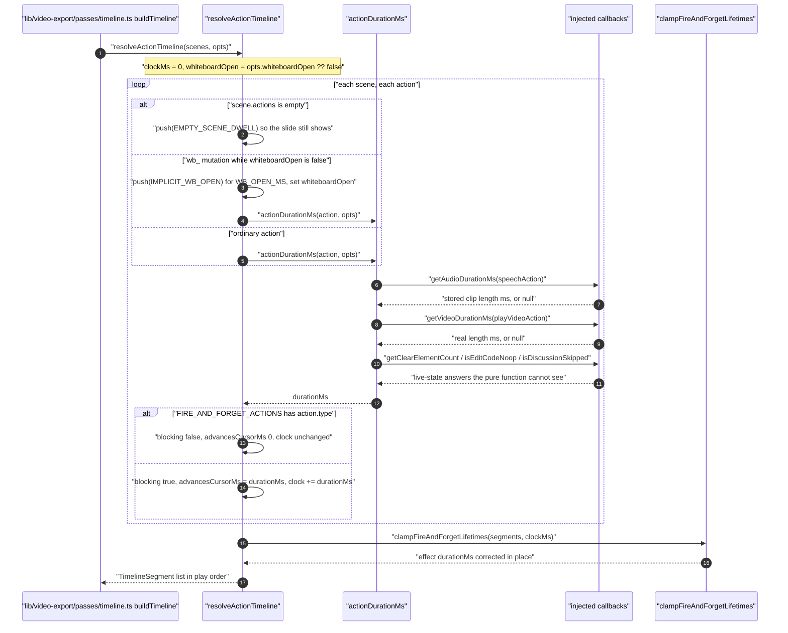
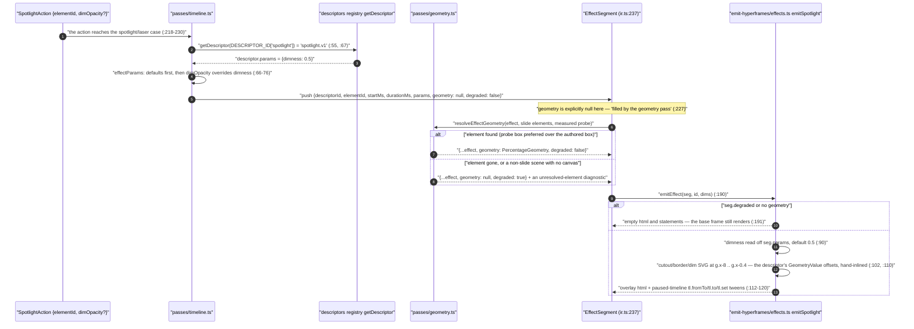
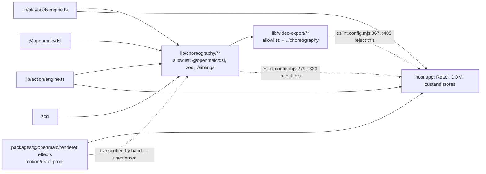

# Choreography Descriptors and the Shared Timing Spec

`lib/choreography/**` is the only code shared between the live classroom and the
offline video exporter. It answers two different questions: *how long does each
action take* (the timing spec and `resolveActionTimeline`) and *what does each
visual effect animate* (the animation descriptors). The two have very different
enforcement stories, and that difference is the most important thing on this page.

**Sources:** `lib/choreography/timing.ts`, `cursor.ts`, `timeline.ts`,
`descriptors/{index,types,spotlight,laser}.ts`, `lib/action/engine.ts`,
`lib/video-export/passes/timeline.ts`, `eslint.config.mjs`,
[`../appendix/research/classroom-runtime/02c-interfaces-choreography-and-buffer.md`](docs/appendix/research/classroom-runtime/02c-interfaces-choreography-and-buffer.md),
[`../appendix/research/media-audio-video/02d-interfaces-choreography-ir.md`](docs/appendix/research/media-audio-video/02d-interfaces-choreography-ir.md).

## What is in the module

| File | Lines | Exports |
| --- | --- | --- |
| `timing.ts` | 121 | 10 duration constants, `wbDrawCodeMs`, `wbClearMs`, `estimateSpeechDurationMs` |
| `cursor.ts` | 73 | `EMPTY_SCENE_DWELL`, `CursorResult`, `resolvePlaybackCursor` |
| `timeline.ts` | 403 | `IMPLICIT_WB_OPEN`, `TimelineSegment`, `ResolveTimelineOptions`, `resolveActionTimeline` |
| `descriptors/types.ts` | 190 | the zod schemas and their inferred TS types |
| `descriptors/spotlight.ts` | 175 | `spotlightV1` |
| `descriptors/laser.ts` | 138 | `laserV1` |
| `descriptors/index.ts` | 22 | `DESCRIPTORS`, `getDescriptor` |
| `index.ts` | 25 | the barrel |

## Two kinds of descriptor, two enforcement stories



**Timing constants are extracted.** `ActionEngine` imports `WB_OPEN_MS`,
`WB_DRAW_MS`, `WB_EDIT_MS`, `WB_DELETE_MS`, `WB_CLOSE_MS`, `WIDGET_MS`,
`wbDrawCodeMs`, `wbClearMs`, `EFFECT_AUTO_CLEAR_MS` and `MAX_VIDEO_WAIT_MS`
from `@/lib/choreography` ([`lib/action/engine.ts:44-55`](lib/action/engine.ts#L44-L55)) and passes them straight
into `delay()`. `PlaybackEngine` imports `estimateSpeechDurationMs` and
`DISCUSSION_TRIGGER_DELAY_MS` ([`lib/playback/engine.ts:39-43`](lib/playback/engine.ts#L39-L43)). There is exactly
one declaration of each number, so app and exporter cannot drift.

**Animation descriptors are a mirror.** `spotlightV1` says so in its own header:
"Values captured verbatim from the `SpotlightOverlay` effect component
(`motion/react`)" ([`descriptors/spotlight.ts:7-8`](lib/choreography/descriptors/spotlight.ts#L7-L8)). The app's overlays still hold
their real animation values as `motion/react` props. `DESCRIPTORS` is consumed
**only** by [`lib/video-export/passes/timeline.ts:67`](lib/video-export/passes/timeline.ts#L67) and by a schema-conformance
test. Editing `SpotlightOverlay.tsx` and not editing `spotlight.ts` silently
diverges the exported video from the live classroom, and nothing fails.

## The timing spec

```ts
export const EFFECT_AUTO_CLEAR_MS = 5000;          // timing.ts:18
export const DISCUSSION_TRIGGER_DELAY_MS = 3000;   // :21
export const DISCUSSION_AUTO_SKIP_MS = 5000;       // :31
export const MAX_VIDEO_WAIT_MS = 5 * 60 * 1000;    // :34
export const WB_OPEN_MS = 2000;                    // :43
export const WB_DRAW_MS = 800;                     // :46
export const WB_EDIT_MS = 600;                     // :49
export const WB_DELETE_MS = 300;                   // :52
export const WB_CLOSE_MS = 700;                    // :55
export const WIDGET_MS = 300;                      // :58
export function wbDrawCodeMs(lineCount: number): number;   // min(800 + 50*lines, 3000)  :64
export function wbClearMs(elementCount: number): number;   // min(380 + 55*elements, 1400)  :72
```

`estimateSpeechDurationMs(text, {speed})` (`:113`) is the no-audio narration
estimate: CJK when more than 30 % of characters match
`/[一-鿿㐀-䶿぀-ゟ゠-ヿ가-힯]/`, then
150 ms/char; otherwise 240 ms/word (about 250 WPM); floored at 2 000 ms; then
divided by `speed`.

A trap: `PlaybackEngine` declares its **own** `CJK_LANG_THRESHOLD = 0.3`
([`lib/playback/engine.ts:60`](lib/playback/engine.ts#L60)) with the same value but a different purpose — it
picks `zh-CN` versus `en-US` for a browser voice, and its regex covers only CJK
Unified Ideographs plus Ext-A (`:824`). Same number, two declarations, two
meanings.

## `resolveActionTimeline` — index domain to wall clock

Playback drives actions by cursor; a faithful exporter needs them on a clock.
`resolveActionTimeline(scenes, opts)` ([`timeline.ts:282`](lib/choreography/timeline.ts#L282)) is the pure expansion.
Its output is `TimelineSegment[]` in play order, each carrying `startMs`,
`durationMs` (how long it is *visually present*) and `advancesCursorMs` (how long
the cursor waits) — the two differ only for fire-and-forget effects.



### The eight options: five injected callbacks and three plain values

`ResolveTimelineOptions` ([`timeline.ts:71-126`](lib/choreography/timeline.ts#L71-L126)) has eight optional fields, all
supplying something the pure function cannot observe. Exactly **five** are
injected callbacks — one per fact that depends on runtime or stored state:

| Callback | Answers | Default |
| --- | --- | --- |
| `getAudioDurationMs` | the stored TTS clip's natural length; the timeline divides by `playbackSpeed` to match the live `AudioPlayer.setPlaybackRate` path (`:186-195`) | fall back to `estimateSpeechDurationMs` |
| `getVideoDurationMs` | the real video length, capped at `MAX_VIDEO_WAIT_MS` (`:163`) | see `onUnresolvedVideoDuration` |
| `getClearElementCount` | how many elements a `wb_clear` will animate away | `0`, which yields a **0 ms** dwell, matching the engine's early return on an empty board (`:243-249`) |
| `isDiscussionSkipped` | whether the engine will skip this discussion outright — already consumed, or its `agentId` is not selected | not skipped, i.e. 8 000 ms (`:199-211`) |
| `isEditCodeNoop` | whether a `wb_edit_code` target still exists | a normal `WB_EDIT_MS` edit (`:237-242`) |

The remaining three are plain option values, not callbacks:

| Value | Answers | Default |
| --- | --- | --- |
| `playbackSpeed` | the speed multiplier every speech dwell is divided by, estimate and real audio alike (`:72-73`) | `1` |
| `onUnresolvedVideoDuration` | policy when a video length is unknown: `'throw'`, `'cap'`, or `'zero'` | **`'throw'`** (`:165`) |
| `whiteboardOpen` | seed for the implicit-open model | `false`, matching post-`resetPlaybackVisualState` (`:119-125`) |

The `'throw'` default is deliberate and worth internalising: `play_video` blocks
live playback, so a silently-zero segment would shift every later action early.
The error message names the fix (`:172-176`).

### Two modelled behaviours that are not in the action list

- **Implicit whiteboard open.** `ActionEngine.execute` awaits
  `ensureWhiteboardOpen()` before any `wb_*` verb other than `wb_open`/`wb_close`
  ([`lib/action/engine.ts:228-230`](lib/action/engine.ts#L228-L230)). The timeline emits a synthetic
  `IMPLICIT_WB_OPEN` segment with a distinct id so consumers can tell it apart
  from an authored `wb_open` ([`timeline.ts:61-64`](lib/choreography/timeline.ts#L61-L64), `:319-322`).
- **Zero-dwell no-ops.** `actionDurationMs` mirrors every early return in
  `ActionEngine`: empty `wb_draw_text` content → 0 (`:216-221`), a table with no
  rows or columns → 0 (`:222-229`), an empty `wb_clear` → 0 (`:243-249`).

### `clampFireAndForgetLifetimes`

The subtle pass ([`timeline.ts:368`](lib/choreography/timeline.ts#L368)). An effect's *nominal* lifetime is
`EFFECT_AUTO_CLEAR_MS`, but the engine both shortens and lengthens it:

- **Shortened at a scene boundary or at completion.** The app plays one
  `PlaybackEngine` per scene; a scene switch stops it (`clearEffects()`) and
  completion also clears effects. So a spotlight late in a scene dies at the next
  scene's start, not a flat 5 s later.
- **Lengthened by a later effect.** `ActionEngine.scheduleEffectClear` uses **one
  shared timer** that each new effect *resets* ([`lib/action/engine.ts:308-316`](lib/action/engine.ts#L308-L316)),
  and `clearAllEffects` drops every active effect together. So back-to-back
  effects all live until the last one's fire plus 5 s.

`advancesCursorMs` is never touched — only the visual hint (`:363`).

## Animation descriptors

The descriptor model is a declarative, render-backend-agnostic animation: *what
property, from what value to what value, over how long, with what easing*. The
schema is authored in zod and the TS types are **inferred from it**, so the schema
is the single source ([`descriptors/types.ts:176`](lib/choreography/descriptors/types.ts#L176)).

```ts
export const AnimationDescriptorSchema = z.object({   // types.ts:163
  id: z.string(),                                     // 'spotlight.v1'
  version: z.number(),
  effect: z.enum(['spotlight', 'laser']),
  params: StaticPropsSchema.optional(),               // declared defaults, e.g. { dimness: 0.5 }
  zIndex: z.number(),
  layers: z.array(LayerSchema),
});
```

Four modelling devices carry information a flat track list could not:

| Device | Schema | What it reconstructs |
| --- | --- | --- |
| `role: 'mask'` + `maskedBy: {layerId, mode}` | `:99`, `:111` | The spotlight's "dim everywhere except the cutout" compositing. The cutout layer is geometry only, never painted; the dim layer subtracts it. Without this a non-React consumer would draw a black rectangle. |
| `inheritsFrom: {parentId, props?}` | `:130` | Layers that are *nested inside* an animated wrapper in the React source (the laser ring and core ride the animated dot). A flat list cannot express that; the child names the parent and the props it rides. |
| `GeometryValue {ref, scale?, offset?}` | `:25` | A value derived linearly from the target element's percentage geometry: `value = geometry[ref] * scale + offset`. The spotlight cutout insets from `{ref:'x', offset:-8}` to `{ref:'x', offset:-0.4}` ([`spotlight.ts:41-42`](lib/choreography/descriptors/spotlight.ts#L41-L42)). |
| `CornerValue {axis, threshold, whenAbove, whenBelow}` | `:38` | The laser's off-screen fly-in start: pick one of two positions based on which half of the viewport the element centre sits in — the `center > 50 ? 105 : -5` rule. |

`Easing` is a three-member discriminated union: `cubicBezier` with a 4-tuple,
`named`, or `spring` with stiffness/damping/optional mass (`:61-73`). Duration and
easing are both **optional** on a `Track`, meaning "the source specified none —
use the consumer's engine default" (`:84`, `:87`).

### How a descriptor is authored

By hand, from the React component, with the reasoning written into the module
docstring. [`spotlight.ts:3-25`](lib/choreography/descriptors/spotlight.ts#L3-L25) records: cutout 600 ms expo-out with easing
`[0.16, 1, 0.3, 1]`; border 500 ms expo-out delayed 50 ms; dim a static
`rgba(0,0,0,{dimness})` with default `dimness: 0.5`. It also records *why* 0.5
rather than the component's own `?? 0.7` fallback: `ActionEngine.executeSpotlight`
stores `action.dimOpacity ?? 0.5` ([`lib/action/engine.ts:322`](lib/action/engine.ts#L322)), so the component's
fallback is unreachable at playback and the exporter must use 0.5 to match.

### How a descriptor is executed

Not by the live classroom. The only production consumer is the exporter:

```ts
const DESCRIPTOR_ID: Record<'spotlight' | 'laser', string> = {   // video-export/passes/timeline.ts:55
  spotlight: 'spotlight.v1',
  laser: 'laser.v1',
};
function effectParams(action: SpotlightAction | LaserAction) {    // :66
  const descriptor = getDescriptor(DESCRIPTOR_ID[action.type]);
  const params = { ...(descriptor?.params ?? {}) };
  if (action.type === 'spotlight') { if (action.dimOpacity != null) params.dimness = action.dimOpacity; }
  else if (action.color != null) { params.color = action.color; }
  return params;
}
```

The merge order is load-bearing and commented (`:60-65`): descriptor defaults
first, then the authored action override, because descriptor defaults alone cannot
recover an authored `dimOpacity`.

One `spotlight.v1` running end to end, from authored action to GSAP statement:



Read step 12 carefully: the emitter does **not** interpret the descriptor's
`layers`/`tracks` generically. [`effects.ts:5-11`](lib/video-export/emit-hyperframes/effects.ts#L5-L11) says so outright — the two
descriptors "were transcribed from the live React overlays, whose *rendering* is
effect-specific (spotlight is an SVG mask; laser is nested CSS divs) — a fact the
descriptor data model does not encode", so each effect gets a targeted emitter
whose constants "match the descriptor tracks 1:1". The `spotlight.v1` cutout's
`{ref:'x', offset:-8}` → `{ref:'x', offset:-0.4}` reappears as literal `g.x - 8`
and `g.x - 0.4` arithmetic ([`effects.ts:102`](lib/video-export/emit-hyperframes/effects.ts#L102), `:110`), and the laser's
`CornerValue` rule as a literal `g.centerX > 50 ? 105 : -5` (`:151-152`). Nothing
checks that the two stay in step — the same unenforced-mirror problem the renderer
has with `lib/choreography`. See
[`../09-media-and-export/index.md`](docs/09-media-and-export/index.md).

## The purity boundary is machine-enforced

`eslint.config.mjs` applies a dedicated block to
`lib/choreography/**/*.{ts,tsx,js,jsx,mjs,cjs}` (`:255`) that forbids:

| Rule | Line | Effect |
| --- | --- | --- |
| no `@/…` literal | `:262` | cannot reach the host app |
| no `@/…` inside a template literal | `:267` | closes the string-interpolation escape |
| import allowlist | `:279` | only `@openmaic/dsl`, `zod`, or `./…` siblings — no `../…` parent escape |
| re-export allowlist | `:285`, `:291` | same set for `export … from` and `export * from` |
| no dynamic `import()` | `:298` | it would bypass the static allowlist |
| no `require()` | `:303` | same |
| no React / DOM / GSAP / framer-motion | `:323` | "must stay render-backend-agnostic (pure Node)" |

`lib/video-export/**` gets three mirrored blocks — root files (`:349`), `passes/`
and `legacy/` (`:420`), and `emit-hyperframes/` (`:499`) — whose allowlists add
exactly one cross-module dependency: `../choreography` (root) or
`../../choreography` (nested). That asymmetry **is** the enforced dependency
direction.



A separate comment at [`eslint.config.mjs:585-586`](eslint.config.mjs#L585-L586) explains a flat-config gotcha
that keeps the whole scheme honest: flat config **replaces** a rule's options per
key rather than merging them, so `no-restricted-syntax` had to be re-spread into
every block that sets it. `:648-658` records that `lib/choreography/**` and
`lib/video-export/**` are excluded from the repo-wide dynamic-import allowance
because their own blocks ban it outright.

## Open questions

- Nothing enforces agreement between `SpotlightOverlay.tsx` / `LaserOverlay.tsx`
  and their descriptors. A property-level differ, or generating the overlays from
  the descriptors, would close it; neither exists. The descriptor files admit the
  gap in prose but the build does not.
- `resolvePlaybackCursor`'s multi-scene walk and `resolveActionTimeline`'s
  cross-scene `whiteboardOpen` carry-over are only exercised by the exporter — the
  app builds one engine per scene. Whether the engine is *intended* to become
  multi-scene is not recorded anywhere.

## Next

- [`./02-playback-state-machine.md`](docs/08-classroom-runtime/02-playback-state-machine.md) — the
  consumer of the timing spec inside the app.
- [`../09-media-and-export/index.md`](docs/09-media-and-export/index.md) — the other
  consumer, and the IR the descriptors compile into.
