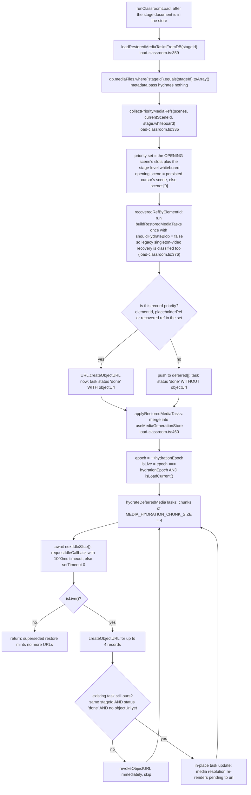
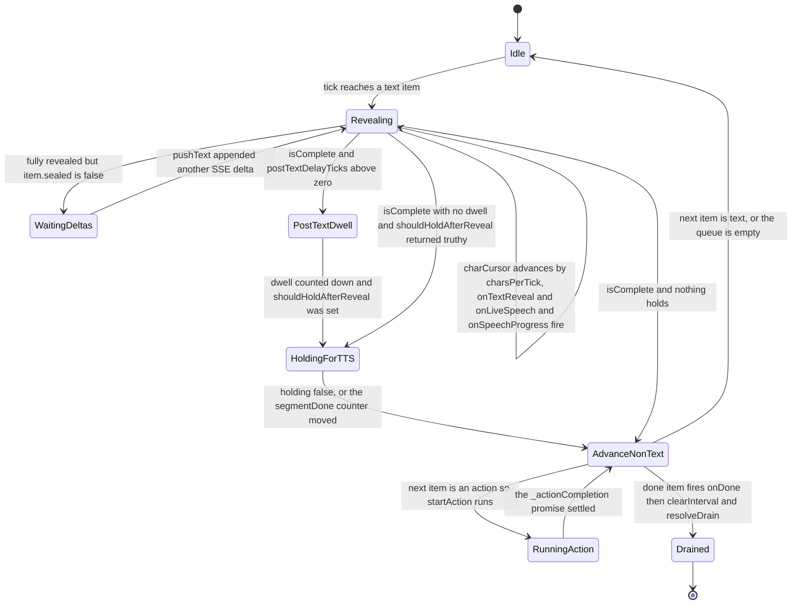
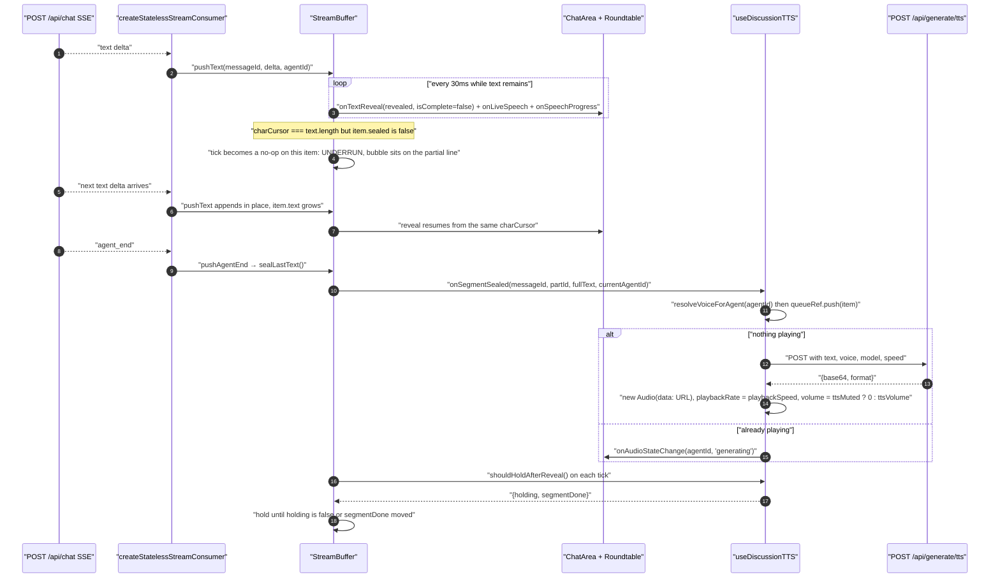

# Buffering and Prefetch

Two independent buffering stories live in the classroom, and only one of them is
a buffer in the usual sense. Slide media is genuinely prefetched into object URLs.
Narration audio, TTS audio and whiteboard strokes are **not** prefetched at all.
`StreamBuffer` is not a network buffer — it is a *presentation pacing* layer that
deliberately slows content down.

**Sources:** `lib/buffer/stream-buffer.ts`, `lib/classroom/load-classroom.ts`,
`lib/utils/audio-player.ts`, `lib/media/resolve-audio-bytes.ts`,
`lib/hooks/use-discussion-tts.ts`, `components/chat/use-chat-sessions.ts`,
[`../appendix/research/classroom-runtime/01a-modules-playback.md`](../appendix/research/classroom-runtime/01a-modules-playback.md),
[`../appendix/research/media-audio-video/03a-flows-audio-media.md`](../appendix/research/media-audio-video/03a-flows-audio-media.md).

## What is prefetched, and what is not

| Asset class | Prefetched? | Mechanism | Evidence |
| --- | --- | --- | --- |
| Slide / whiteboard **images and videos** | Yes, in two tiers | Opening scene eager, everything else in idle slices of 4 | `lib/classroom/load-classroom.ts:335`, `:460`, `:526` |
| **Narration audio** for a `speech` action | **No** | Resolved lazily inside `AudioPlayer.play()`, per line, with no cache and no lookahead | `lib/utils/audio-player.ts:99`, `lib/media/resolve-audio-bytes.ts:15` |
| **Live TTS audio** for a discussion segment | **No** | One-at-a-time serial queue; the next item's `POST /api/generate/tts` starts only after the previous audio ends | `lib/hooks/use-discussion-tts.ts:207-216` |
| **Whiteboard strokes** | Not applicable | There are no stroke assets. Whiteboard content is produced by executing `wb_*` actions against the whiteboard document; a seek replays them synchronously | `lib/action/engine.ts:485`, `lib/playback/engine.ts:197-203` |
| The **editor chunk** | Yes, on demand | `preloadEditor()` before flipping to edit mode | `components/stage.tsx:174`, `:221` |

The absence of narration prefetch is the single most consequential fact on this
page. `PlaybackEngine` calls `audioPlayer.play(audioId, legacyUrl)` at the moment
the line begins (`lib/playback/engine.ts:623`), and `play()` then does a dynamic
`import('@/lib/media/resolve-audio-bytes')` followed by `withAssetUrl` +
`fetch`, falling back to a Dexie `audioFiles.get` (`resolve-audio-bytes.ts:16-23`).
Nothing memoises the result: replaying the same line re-fetches its bytes. A batch
helper `resolveAudioBlobs` exists (`resolve-audio-bytes.ts:27`) but has **zero
call sites** in `lib/`, `components/` or `app/` — the export and regeneration
paths call the singular form.

## Slide media: the two-tier restore



Three details that matter operationally:

- A **deferred record keeps `status: 'done'`** but carries no `objectUrl`
  (`load-classroom.ts:427-434`). Media resolution treats a known task without
  bytes as *pending* and re-renders when hydration fills the URL in. This is what
  stops generation resume from re-running an already-generated asset.
- The `status !== 'done'` check in the write guard is what catches an in-flight
  replacement: only a deferred restore is `done` without an `objectUrl`, because
  regeneration and retry pass through `pending`/`generating` first
  (`:515-518`).
- A superseded restore **revokes URLs it already minted** rather than leaking them
  (`:555-557`), and `discardRestoredMediaTasks` only revokes eager tasks because
  deferred records hold raw blobs with nothing to revoke (`:484-491`).

An IndexedDB read failure here is swallowed by a bare `catch` returning
`{tasks:{}, deferred:[]}` (`:395-397`) — media goes silently missing with no
user-visible error.

## `StreamBuffer` policy

One `setInterval` (`stream-buffer.ts:302`), default `tickMs = 30`,
`charsPerTick = 1` — roughly 33 characters per second. Eight item kinds
(`BufferItem`, `:84`). The stated invariants (`:12-15`) are:

1. one source of pacing — no second typewriter anywhere;
2. `pause()` is O(1) — `tick()` returns immediately when `_paused`;
3. actions fire only when the tick cursor reaches them, after preceding text;
4. the roundtable sees only the *current* segment.

Pacing options differ per session type, and the split is one line:

```ts
const pacingOptions = type === 'lecture' ? {} : { postTextDelayMs: 1200, actionDelayMs: 800 };
// components/chat/use-chat-sessions.ts:906
```

| Session type | `postTextDelayMs` | `actionDelayMs` | Rationale (comment at `:904`) |
| --- | --- | --- | --- |
| `lecture` | 0 | 0 | Lecture pacing is owned by `PlaybackEngine`; the buffer only drives chat-area transcript pacing |
| `qa` / `discussion` | 1 200 | 800 | So a fast model does not rush through text and action badges |

Both are converted to tick counts with `Math.ceil(ms / tickMs)` (`:210-211`), so
1 200 ms is 40 ticks and 800 ms is 27.

`text` items are **growable**: `pushText` appends into the last unsealed item for
the same `messageId` rather than creating a new one (`:233-248`). Four push methods
— `pushAgentStart`, `pushAgentEnd`, `pushAction`, `pushDone` — call
`sealLastText()` first (`:218`, `:224`, `:264`, `:288`), and that ordering is what
makes `onSegmentSealed` fire with the *correct* `currentAgentId` (comment at
`:476-477`).

A subtlety worth knowing: `sealText(messageId)` (`:251`) sets the flag but does
**not** fire `onSegmentSealed`; only `sealLastText()` (`:471`) does. Lecture
narration is pushed with `pushText` immediately followed by `sealText`
(`use-chat-sessions.ts:2188-2189`), so a lecture line never reaches
`useDiscussionTTS` — pre-generated narration is not double-synthesised.

## The TTS hold protocol

This is the mechanism that keeps a bubble's text on screen while its audio plays.
The buffer asks a callback; the callback is `useDiscussionTTS.shouldHold`
(`lib/hooks/use-discussion-tts.ts:469`):

```ts
const shouldHold = useCallback(() => ({
  holding: isPlayingRef.current || queueRef.current.length > 0,
  segmentDone: segmentDoneCounterRef.current,   // monotonic count of finished segments
}), []);
```

`segmentDone` is monotonic and incremented on `ended`, on `error`, and in the
catch branch (`:278`, `:287`, `:331`) — so a failed synthesis still releases the
hold. The buffer snapshots the counter when it *starts* holding (`:574`, `:584`)
and releases when either `holding` goes false **or** the counter has moved
(`:515-526`). Snapshotting is why the buffer releases the instant *this* segment's
audio ends, even though the next one has already started playing.



**A truthy-object trap.** `shouldHoldAfterReveal` returns an *object*, and the
first check treats any truthy result as "hold" (`:581-587`) without inspecting
`.holding`. So a lecture buffer — which has the same callback wired
(`use-chat-sessions.ts:1100`) and `postTextDelayTicks === 0` — always enters
`HoldingForTTS` for exactly one tick, then the hold branch reads `!result.holding`
and releases (`:512-519`). Net effect: one extra 30 ms tick per lecture line.
Harmless, but it means "holding" is entered even when nothing is playing.

## Underrun: text outruns its source

There are three distinct underruns, with three different outcomes.

### 1. SSE deltas outrun by the tick loop — the normal case



The underrun state is benign and expected: `isComplete = fullyRevealed &&
item.sealed` (`stream-buffer.ts:548`), so an unsealed fully-revealed item simply
stops advancing and waits. **But** if the stream dies without a `sealText` or a
`pushDone`, the bubble freezes on the partial line forever — there is no timeout
in the buffer. Recovery depends on the transport layer aborting and
`onLiveSessionError` firing (`PlaybackChromeRoot.tsx:1783`).

### 2. TTS generation outruns by text reveal

Text reveals at 33 chars/s; `POST /api/generate/tts` takes a network round trip
plus synthesis. For a short segment the text finishes first, and the hold protocol
covers the gap — the buffer holds while `queueRef.current.length > 0` even before
the first byte arrives. If synthesis *fails*, the catch branch still increments
`segmentDone` (`use-discussion-tts.ts:331`), so the hold releases rather than
wedging.

The queue is strictly serial: `processQueue` returns early when
`isPlayingRef.current` is true (`:209`) and the next item is only started from the
`ended` / `error` handlers via `queueMicrotask` (`:281`, `:290`). There is no
lookahead synthesis, so back-to-back short segments each pay a full round trip.

### 3. Paused buffer

`waitUntilDrained()` **never settles while paused, by design** — the docstring
says so (`:319-323`). The tick loop is a no-op when `_paused`, nothing advances,
and drain never fires. Since the client agent loop awaits buffer drain between
iterations (`lib/chat/agent-loop.ts:239`), a paused buffer pauses the whole
multi-agent round. This is intentional; `livePausedRef` is a *sticky* intent that
newly created **discussion/QA** buffers inherit — the inherit is gated on
`type !== 'lecture'`, so a lecture buffer never picks it up
(`use-chat-sessions.ts:1112-1114`) — which is why
`onMessageSend` must call `resumeActiveLiveBuffer()` **before** `sendMessage`
creates the next buffer (`PlaybackChromeRoot.tsx:1599-1602`).

## Action back-pressure

An action item blocks the queue through a single promise:

```ts
if (this._actionCompletion) return;   // tick(), :506
```

`trackAction` (`:723`) wraps `onActionReady` so that a synchronous throw *and* a
rejection both become `onError('Action <name> failed: <msg>')` with the completion
resolved (`:729-736`, `:745-748`). A failing action therefore never blocks the
queue permanently. `waitForCurrentAction()` (`:347`) exposes the same promise so a
caller can await an in-flight presentation mutation — `initializeScene` uses the
equivalent guarantee through `endActiveSession({source:'scene_switch'})` before
touching shared whiteboard state (`PlaybackChromeRoot.tsx:668`).

## Teardown surface

| Method | Timer | `onLiveSpeech(null, null)` | Drain promise | Used when |
| --- | --- | --- | --- | --- |
| `pause()` | left running, `tick` no-ops | no | never settles | learner pauses reading |
| `flush()` | untouched | fires via the `done` item | resolved if a `done` was queued | restoring a persisted session |
| `dispose()` (`:432`) | cleared | **yes** | rejected `'Buffer disposed'` | ordinary teardown |
| `shutdown()` (`:454`) | cleared | **no** | rejected `'Buffer shutdown'` | replacing a buffer, so a stale microtask cannot clear live roundtable state |

`flushRemaining` re-checks `this._disposed` after **every** callback (`:372`-`:421`)
so no callback fires after disposal, and `flush()` memoises its promise (`:357`) so
concurrent calls collapse into one.

## Open questions

- No test in the repo drives the `postTextDelayTicks` / `_holdingForTTS` /
  `segmentDone` interaction under fake timers, so the one-tick lecture hold above
  is derived by reading rather than observed.
- Whether a lecture line's narration bytes should be prefetched one line ahead is
  not addressed anywhere in code or comments. With no cache in
  `resolveAudioBlob`, a seek that replays a prefix re-fetches nothing (whiteboard
  replay is silent) but a *restart* re-fetches every clip.

## Next

- [`./07-utterance-to-output.md`](./07-utterance-to-output.md) — the lecture rail,
  which does not use `StreamBuffer` for timing.
- [`./06-turn-taking-and-interruption.md`](./06-turn-taking-and-interruption.md) —
  the four pause semantics that all land on this buffer.
- [`../09-media-and-export/index.md`](../09-media-and-export/index.md) — TTS
  synthesis itself.
