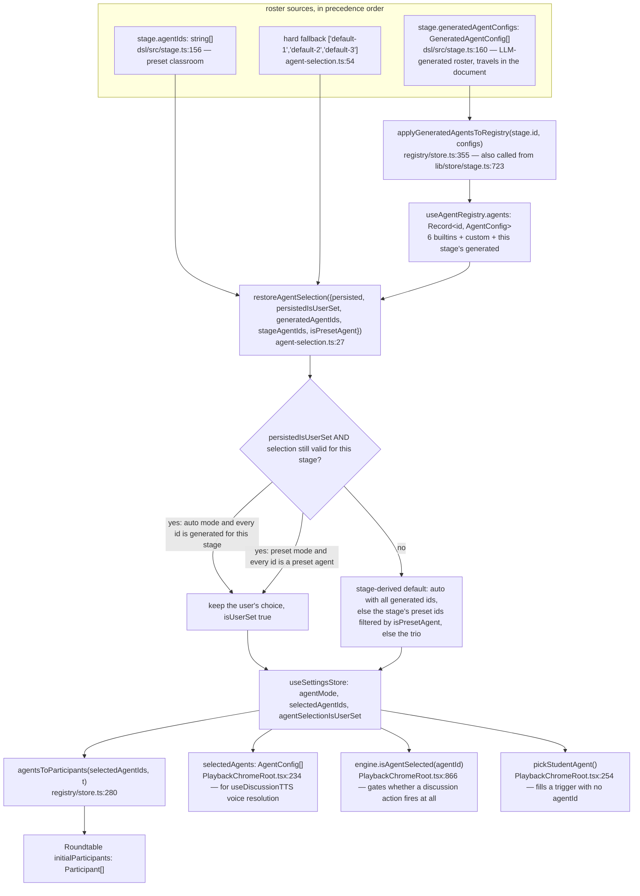
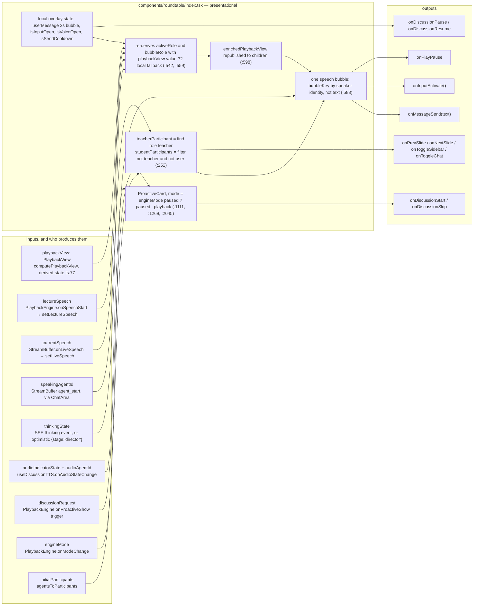

# The Roundtable Agent Cast

The roundtable is the classroom's face: an avatar row, one speech bubble, a text
and voice input, and a toolbar. It is also, deliberately, **entirely
presentational** — 2 189 lines that own no engine, no session, and no decision
about who speaks. This page covers where the cast comes from, how it is reduced
to a participant list, and exactly which state the roundtable derives itself
versus receives.

**Sources:** `lib/orchestration/registry/store.ts`,
`lib/orchestration/registry/types.ts`, `lib/orchestration/registry/agent-selection.ts`,
`lib/types/roundtable.ts`, `components/roundtable/index.tsx`,
`components/edit/PlaybackChromeRoot.tsx`, `lib/classroom/load-classroom.ts`,
`packages/@openmaic/dsl/src/stage.ts`,
[`../appendix/research/classroom-runtime/01a-modules-playback.md`](../appendix/research/classroom-runtime/01a-modules-playback.md).

## The six built-in agents

`DEFAULT_AGENTS` (`lib/orchestration/registry/store.ts:47`) is a code-defined
record of six `AgentConfig` values. They are always present on both server and
client and are never overwritten by persisted state — the persist `merge`
rehydrates `{ ...DEFAULT_AGENTS }` and then copies back only agents whose id does
not start with `default-` and which are not `isGenerated` (`:255-264`).

| Id | Name | `role` | `priority` | `allowedActions` | Character (from `persona`) |
| --- | --- | --- | --- | --- | --- |
| `default-1` | AI teacher | `teacher` | 10 | `SLIDE_ACTIONS` + `WHITEBOARD_ACTIONS` (15) | Lead teacher; step-by-step, checks understanding, may spotlight/laser/play video |
| `default-2` | AI助教 | `assistant` | 7 | `WHITEBOARD_ACTIONS` (12) | TA; rephrases, adds concrete examples, summarises |
| `default-3` | 显眼包 | `student` | 4 | `WHITEBOARD_ACTIONS` | Class clown; one-liners, keeps responses short |
| `default-4` | 好奇宝宝 | `student` | 5 | `WHITEBOARD_ACTIONS` | Endlessly curious; asks why/how, surfaces edge cases |
| `default-5` | 笔记员 | `student` | 5 | `WHITEBOARD_ACTIONS` | Note-taker; structured recaps, writes formulas on the board |
| `default-6` | 思考者 | `student` | 6 | `WHITEBOARD_ACTIONS` | Deep thinker; challenges assumptions, plays devil's advocate |

`AgentConfig.role` is a plain `string` (`registry/types.ts:12`), not a union.
`ROLE_ACTIONS` (`types.ts:83`) maps the three roles the codebase actually uses:
`teacher` gets slide plus whiteboard verbs, `assistant` and `student` get
whiteboard only. `SLIDE_ACTIONS` is `['spotlight', 'laser', 'play_video']`
(`store.ts:44`) — note this is a *different* list from the DSL's
`SLIDE_ONLY_ACTIONS`, which omits `play_video`
(`packages/@openmaic/dsl/src/action.ts:264`).

Three of the six names are hard-coded Chinese strings in the persona record.
Display names are overridden per locale by
`t('settings.agentNames.<agentId>')` when that key resolves (`store.ts:309-311`),
but the `persona` text itself — which is what the model sees — is English prose
with Chinese names embedded.

## Where a cast comes from



The comment at `agent-selection.ts:12-25` explains the one rule that is easy to
get wrong: only an **explicit** user choice (`persistedIsUserSet`) may carry
across classrooms, and only while it is still valid for the loaded stage.
Stage-derived defaults written by a previous load are not user choices — treating
them as such would make one visit to a preset classroom permanently downgrade
every generated classroom to preset agents.

## `agentsToParticipants` — the reduction to a seating plan

```ts
export function agentsToParticipants(agentIds: string[], t?): Participant[]   // store.ts:280
```

1. Resolve each id through `registry.getAgent(id)`, dropping unknown ids
   (`:288-290`).
2. Sort **teacher first**, then by `priority` descending (`:291-295`).
3. Walk the sorted list; the **first** agent becomes `role: 'teacher'`, everyone
   after is `role: 'student'` (`:299-305`). There is no separate `assistant`
   participant role — `default-2` renders as a student.
4. Localise the display name via `t('settings.agentNames.<id>')`, falling back to
   `agent.name` (`:308-311`).
5. Always append a `user-1` participant using the profile store's nickname and
   avatar (`:325-333`).

Because step 3 is unconditional on the *sorted* list, the effect is: if any agent
declares `role === 'teacher'` it takes the seat; if none does, the
highest-priority agent is promoted into it. So there is always exactly one teacher
on the left, and there is always a user participant, regardless of what the roster
contains.

`Participant` is deliberately thin (`lib/types/roundtable.ts:5`): `id`, `name`,
`role` (`'teacher' | 'student' | 'user'`), `avatar`, `isOnline`, optional
`isSpeaking`. No persona, no colour, no allowed actions — the roundtable does not
need them.

## What the roundtable receives versus derives

`RoundtableProps` has **57 own properties** (`components/roundtable/index.tsx:44-113`).
Roughly: 22 state inputs, 20 callbacks, 15 layout/toolbar props. Everything the
component knows about the classroom arrives through them.



### Two derivations of the same fact

`computePlaybackView` (`lib/playback/derived-state.ts:77`) reduces 13 raw fields
into one `PlaybackView` with `phase`, `sourceText`, `bubbleRole`, `activeRole`,
`buttonState`, `isInLiveFlow`, `isTopicActive`. The roundtable then re-derives
`bubbleRole` and `activeRole` locally as `playbackView?.<field> ?? <local
fallback>` (`index.tsx:542-576`) and republishes an `enrichedPlaybackView`
(`:598-608`). Two implementations of the same ordered fallback chain live in two
files. The local copy exists to overlay `userMessage` — the learner's own bubble
shown for 3 s — which the pure function knows nothing about.

Two ordering decisions inside `computePlaybackView` are commented as bug fixes:
live-flow phases are tested **before** `playbackCompleted` so starting a Q&A from
a finished scene does not leak the restart icon into an agent bubble (`:104-107`),
and `sessionType` participates in `isInLiveFlow` to bridge the gap between
agent-loop turns, because the `done` event clears `chatIsStreaming` while the
session is still open (`:96-101`).

### The bubble is single, and keyed by speaker

There is exactly one speech bubble. Its React key is derived from speaker
identity, not text — `'user'`, `` `agent-${speakingAgentId}` ``, `'teacher'`, or
`'idle'` (`index.tsx:588-595`) — explicitly so a text update does not remount and
flicker. `bubbleName` resolves to the student's name, the teacher's name,
`t('roundtable.you')`, or empty (`:578-585`).

Loading is distinguished at two granularities: `isBubbleLoading` when
`speakingAgentId` is set but no text has arrived, and `isAgentLoading` when that
speaker is specifically a student (`:538-540`), so the bubble can pick the
agent-styled variant before the first character lands.

## Send cooldown and the local user bubble

Two mechanisms keep the single bubble coherent while a turn changes hands:

| Mechanism | Set | Cleared |
| --- | --- | --- |
| `userMessage` (local bubble) | `showLocalUserMessage(text)` on send or ASR transcription (`:306`) | a 3 000 ms timer (`:298-304`), **or** early when `hasAgentFeedback` flips false→true (`:329-336`) |
| `isSendCooldown` | on every send (`:408`) and on ASR transcription (`:393`) | when `speakingAgentId` appears (`:352-357`), **or** as a safety net when `isStreaming` goes true→false (`:362-368`) |

`showLocalUserMessage` pre-sets `prevHasAgentFeedbackRef.current = true`
(`:312`) so the immediate optimistic `thinkingState` transition does not
instantly swallow the user's own bubble. `isSendCooldownRef` shadows the state
because the ASR `onTranscription` callback captures `onMessageSend` before React
re-renders (`:387-390`).

## Roundtable-owned input surface

| Trigger | Handler | Effect |
| --- | --- | --- |
| `T` key or bubble tap | `handleToggleInput` (`:414`) | calls `onInputActivate()` on open, cancels in-flight ASR to prevent a ghost auto-send |
| `V` key or mic button | `handleToggleVoice` (`:427`) | `useAudioRecorder`; transcription calls `onMessageSend`. Gated on `asrEnabled` (`:495`) |
| Send / Enter | `handleSendMessage` (`:403`) | local bubble, `onMessageSend`, cooldown |
| `Space` during live flow | keydown handler (`:473-484`) | `onDiscussionPause` / `onDiscussionResume` — buffer level, not engine level. Guarded on `!thinkingState && currentSpeech` |
| `Escape` | `:455-463` | closes panels, cancels ASR, and `stopPropagation()` so fullscreen is not exited while panels are open |

Non-`Escape` shortcuts are skipped when the event target is an `INPUT`,
`TEXTAREA` or `contentEditable` (`:466-470`).

## Two props that go nowhere

- `mode?: 'playback' | 'autonomous'` is destructured as `_mode` and never read
  (`index.tsx:153`). The `ProactiveCard` `mode` the roundtable actually passes is
  computed from `engineMode`, so `'autonomous'` never reaches the card.
- `speechProgress` is destructured as `_speechProgress` (`:167`) — the auto-scroll
  effect keys on `sourceText` instead (`:319-326`).

## Turn-taking is elsewhere

The roundtable reflects `speakingAgentId`, `thinkingState` and `currentSpeech`; it
never chooses a speaker. That decision is made server-side behind
`POST /api/chat`. See
[`./06-turn-taking-and-interruption.md`](./06-turn-taking-and-interruption.md) and
[`../05-agent-runtime/index.md`](../05-agent-runtime/index.md).

One exception is worth flagging because it is a mutation, not a decision: when a
`discussion` action carries no `agentId`, `onProactiveShow` fills it by
**mutating the trigger object in place** with `pickStudentAgent()`
(`PlaybackChromeRoot.tsx:822-828`). The in-place mutation is deliberate — the
engine's `currentTrigger` holds the same reference, and `confirmDiscussion` reads
`agentId` off it (`lib/playback/engine.ts:376-380`). `pickStudentAgent`
(`:254-268`) picks uniformly at random among selected `role === 'student'` agents,
else among non-teachers, else `agents[0]?.id || 'default-1'`.

## Open questions

- `AgentConfig.role` is an open `string` while `ROLE_ACTIONS` covers three values
  and `agentsToParticipants` branches on `'teacher'`. A generated agent with any
  other role string gets `getActionsForRole`'s fallback and renders as a student;
  nothing validates the value at the document boundary.
- Whether `'autonomous'` stage mode is reachable in the classroom is not
  established. `resolveStageChromeMode` accepts it and `Stage` routes it to
  `PlaybackChromeRoot` (`components/stage.tsx:334`), but no surveyed entry point
  sets it, and the roundtable's own `mode` prop is unused.

## Next

- [`./06-turn-taking-and-interruption.md`](./06-turn-taking-and-interruption.md)
- [`./04-buffering-and-prefetch.md`](./04-buffering-and-prefetch.md) — what feeds
  `currentSpeech`.
