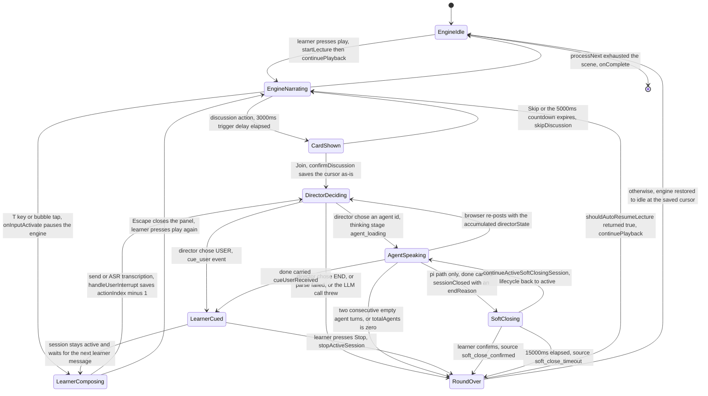
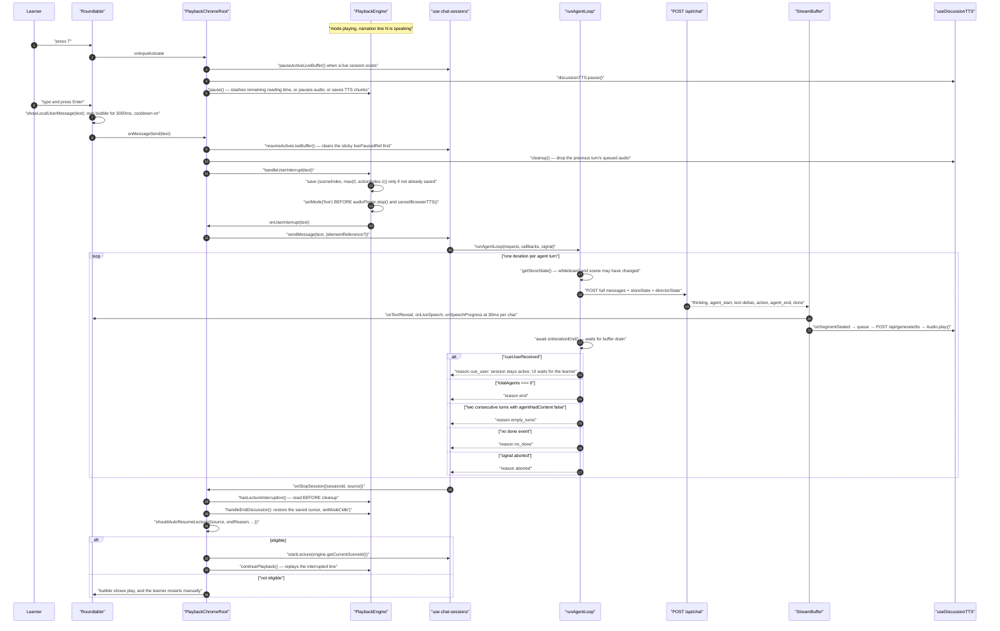
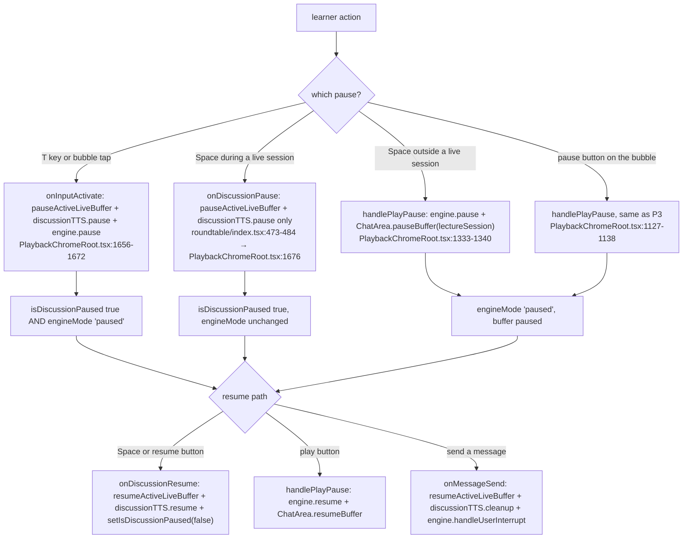

# Turn-Taking and Learner Interruption

Who holds the floor, how it changes hands, and what happens when the learner takes
it mid-sentence. Turn-taking is decided **server-side, one hop at a time**: each
`POST /api/chat` runs exactly one director→agent cycle by graph topology, and the
browser re-posts to get the next turn. Interruption is the learner's ability to
seize the floor from the narration engine, which is a different mechanism
entirely.

**Sources:** `lib/orchestration/director-graph.ts`,
`lib/orchestration/director-prompt.ts`, `lib/orchestration/stateless-generate.ts`,
`lib/chat/agent-loop.ts`, `components/chat/use-chat-sessions.ts`,
`lib/chat/pi/tools/close-session.ts`, `lib/playback/engine.ts`,
`lib/playback/auto-resume.ts`, `components/edit/PlaybackChromeRoot.tsx`,
`components/roundtable/index.tsx`, `lib/config/feature-flags.ts`,
[`../appendix/research/agent-runtime/00-overview.md`](../appendix/research/agent-runtime/00-overview.md).

## Turn ownership



Note the asymmetry the diagram exposes: the transition into `SoftClosing` — and
therefore the only path that satisfies `shouldAutoResumeLecture` — exists **only
on the pi chat path**. See [§ Two chat paths](#two-chat-paths-and-what-that-costs).

## Server side: one cycle per request

`createOrchestrationGraph()` (`lib/orchestration/director-graph.ts:484`) is a
two-node LangGraph whose topology forbids a second cycle:

```ts
.addNode('director', directorNode)
.addNode('agent_generate', agentGenerateNode)
.addEdge(START, 'director')
.addConditionalEdges('director', directorCondition, { agent_generate: 'agent_generate', [END]: END })
.addEdge('agent_generate', END)      // :493 — the agent never loops back to the director
```

`directorCondition` is one line: `state.shouldEnd ? END : 'agent_generate'`
(`:225-227`). So one HTTP request produces at most one agent turn, and the loop
lives in the browser.

### `directorNode`, in decision order

| Case | Condition | Result |
| --- | --- | --- |
| Single agent, first turn | `availableAgentIds.length <= 1 && turnCount === 0` | dispatch that agent; emit `thinking {stage:'agent_loading', agentId}`. **No LLM call at all** (`:118-126`) |
| Single agent, later turn | same, `turnCount > 0` | emit `cue_user {fromAgentId}`, `shouldEnd: true` — the session stays open for a follow-up (`:128-131`) |
| Multi-agent, triggered first turn | `turnCount === 0 && triggerAgentId` present in `availableAgentIds` | dispatch the trigger agent, skipping the LLM (`:135-144`) |
| Trigger agent not available | as above but the id is unknown | `log.warn`, fall through to the LLM (`:145-147`) |
| No resolvable agents | `agents.length === 0` after registry lookup | `shouldEnd: true` (`:155-157`) |
| Multi-agent, LLM decision | otherwise | emit `thinking {stage:'director'}`, build the prompt, call the model, parse (`:159-218`) |

The prompt is assembled by `buildDirectorPrompt(agents, conversationSummary,
agentResponses, turnCount, discussionContext, triggerAgentId, whiteboardLedger,
userProfile, whiteboardOpen)` (`:164-174`) and the model is asked a single
question: `'Decide which agent should speak next.'` (`:180`).

`parseDirectorDecision` (`lib/orchestration/director-prompt.ts:216`) is
deliberately blunt: extract the first `{...}` containing `"next_agent"`,
`JSON.parse` it, and

- `!nextAgent || nextAgent === 'END'` → `{nextAgentId: null, shouldEnd: true}`;
- a parse failure or no JSON match → **the same** `shouldEnd: true` (`:238`), with
  a `log.warn` on the throw path only.

Back in `directorNode`, `'USER'` is special-cased into a `cue_user` event plus
`shouldEnd: true` (`:194-201`), an unknown agent id logs a warning and ends
(`:203-207`), and any thrown error ends the round (`:219-222`). Every failure mode
converges on "end the round" — the director never retries.

## Client side: the re-post loop

`runAgentLoop` (`lib/chat/agent-loop.ts:154`) owns iteration. Its docstring states
the design plainly (`:150-153`): *"There is no client-side max-turn cap; the LLM
director controls round length via `cue_user` / `END`."*



### Loop exit conditions and their UI mapping

`AgentLoopOutcome.reason` (`agent-loop.ts:109`) has five members, and
`runAgentLoopFn` maps each to a *distinct* session state — the comment at
`use-chat-sessions.ts:1320-1322` insists on not conflating them:

| `reason` | Set when | Session state | `onStopSession` source |
| --- | --- | --- | --- |
| `cue_user` | `iterationResult.cueUserReceived` (`:251`) | stays `active`; UI waits for the learner | not called |
| `end` | `totalAgents === 0` (`:256`) | `completed` | `turn_complete` |
| `empty_turns` | 2 consecutive turns with `agentHadContent === false` (`:261-268`) | error toast `chat.error.emptyAgentResponses` | `error` |
| `no_done` | `onIterationEnd()` returned null (`:242`) | error toast `chat.error.streamInterrupted` | `error` |
| `aborted` | the signal fired at any of three check points (`:164`, `:174`, `:234`) | handled by the abort path | not called |

`awaitOrAbort` (`:118`) wraps each await so an abort mid-flight resolves as
`{status:'aborted'}` rather than leaving a dangling promise. `turnCount` is taken
from `directorState.turnCount` when present, else incremented locally (`:248`).

`DirectorState` (`lib/types/chat.ts:303`) is what makes a stateless server
workable: `{ turnCount, agentResponses, whiteboardLedger }`, maintained by the
client and re-posted every iteration.

## Two chat paths, and what that costs

`runAgentLoopFn` branches on one flag (`use-chat-sessions.ts:1245`):

| Path | Endpoint | Loop location | `sessionClosed` / `endReason` |
| --- | --- | --- | --- |
| `isPiChatEnabled()` true | `POST /api/chat/pi` (`:394`) | **server-side**, one request per user message; `runPiSingleRequest` reads one stream | produced by the `close_session` tool |
| default | `POST /api/chat` (`:1307`) | **browser**, `runAgentLoop` re-posts | never produced |

`isPiChatEnabled()` reads `NEXT_PUBLIC_PI_CHAT_ENABLED`
(`lib/config/feature-flags.ts:72-73`) through a strict `readBoolean` that accepts
only `'true'` or `'1'`. `.env.example:324` has the variable **commented out**, so
the LangGraph path is the shipped default.

`close_session` (`lib/chat/pi/tools/close-session.ts:29`) is a pi-only director
tool whose `endReason` is a four-member literal union — `user_goodbye`,
`user_done`, `back_to_lesson`, `lesson_complete` (`:8-11`) — and it refuses to
fire twice:

- if the user has already been cued, it returns "the session remains open"
  (`:36-46`);
- if `canCloseSession()` is false, it demands a visible closing line from a
  classroom agent first (`:48-58`).

Consequence, following the call chain: `enterSoftClosing` has exactly **one**
caller (`use-chat-sessions.ts:443`, inside `runPiSingleRequest`), reached only via
`getPiSingleRequestOutcome`'s `doneData.sessionClosed` branch (`:356-362`). It is
the only producer of the cleanup sources `soft_close_confirmed` and
`soft_close_timeout`, and `shouldAutoResumeLecture` requires one of those two
(`lib/playback/auto-resume.ts:38`). Therefore **on the default LangGraph path an
interrupted lecture never auto-resumes** — the learner always presses play again.
The `shouldAutoResumeLecture` unit test exists
(`tests/lib/playback/auto-resume.test.ts`) but the integration is flag-gated.

## The soft-close grace window

`SOFT_CLOSE_TIMEOUT_MS = 15_000` (`use-chat-sessions.ts:47`). `enterSoftClosing`
(`:754`) sets `softCloseLifecycle = 'soft-closing'`, publishes a
`softCloseDeadline = Date.now() + 15_000` so the roundtable can count down, fires
`onStopSession` with `source: 'soft_close_enter'` (which
`shouldAutoResumeLecture` explicitly rejects, `auto-resume.ts:38`), and arms a
timer that fires with `source: 'soft_close_timeout'` (`:727`, `:732`).

Three exits:

| Exit | Guard | Source |
| --- | --- | --- |
| Learner continues | `continueActiveSoftClosingSession()` — requires the lifecycle to still be `'soft-closing'` (`:1509`), then sets `'active'` (`:1514`) | none; the session resumes |
| Learner confirms | lifecycle must still be `'soft-closing'` (`:1531`), set to `'completed'` (`:1534`) | `soft_close_confirmed` (`:1538`) |
| Timeout | same lifecycle guard (`:715`), set to `'completed'` (`:718`) | `soft_close_timeout` |

The lifecycle map is what makes the three mutually exclusive — a confirm that
races the timer finds the lifecycle already `'completed'` and no-ops.

In the roundtable, `onUserInputActivity` is wired straight to
`handleContinueDiscussion` (`PlaybackChromeRoot.tsx:1653-1655`), so merely
starting to type during the grace window cancels the close.

## Interruption: four pause semantics

Three components each own a *different* pause, and they can be active
simultaneously.



`Space` is arbitrated between two keydown listeners:
`PlaybackChromeRoot.tsx:1337` breaks out of its own `Space` case while
`chatSessionType === 'qa' | 'discussion'`, so the roundtable owns `Space` during a
live session and the engine owns it otherwise. The roundtable's own handler is
additionally guarded on `!thinkingState && currentSpeech`
(`roundtable/index.tsx:480`) — the same guard as a bubble click, so `Space` cannot
pause while the director is still thinking or before the first character arrives.

### Why `paused` is in the interrupt branch

`onMessageSend` routes to `engine.handleUserInterrupt` when the mode is
`playing`, `live` **or `paused`** (`PlaybackChromeRoot.tsx:1619-1622`). The comment
explains it: `onInputActivate` already paused the engine while the learner was
typing, so without including `paused` the interrupt position would never be saved
and resuming after Q&A would skip the interrupted sentence.

`handleUserInterrupt` itself guards against double-saving:
`if (this.savedSceneIndex === null)` (`lib/playback/engine.ts:447`) — a
`live → paused → new message` sequence keeps the first saved position.

### The sticky live-pause ref

`pauseActiveLiveBuffer()` sets `livePausedRef.current = true`
(`use-chat-sessions.ts:2245`), and **newly created discussion/QA buffers inherit
it** (`:1112-1114`) so a new agent turn does not start revealing text under a
learner who paused to read. The inherit is gated on `type !== 'lecture'`, so a
lecture buffer never inherits the sticky pause. That is why `onMessageSend` calls
`resumeActiveLiveBuffer()` *before* `sendMessage` creates the next buffer
(`PlaybackChromeRoot.tsx:1599-1602`), and why the comment at `:1595-1597` notes
the closure may hold a stale `isDiscussionPaused`.

## Stale-callback discipline

Every callback that crosses from the chat layer into playback state is epoch
guarded. `sceneEpochRef` increments on each scene switch (`:664`), and
`onLiveSpeech`, `onSpeechProgress` and `onThinking` each capture the epoch and
`queueMicrotask` their state write, dropping it if the epoch moved
(`:1744-1779`). The microtask — not a direct `setState` — is deliberate: it lets a
pending scene-switch reset settle first.

`onProgress` has its own identity guard: a superseded engine must not publish its
old scene's cursor over the installed engine's (`:767`).

## Open questions

- The soft-close grace window is documented as "client-side, ~15s" on
  `RoundtableProps.isSoftClosing` (`roundtable/index.tsx:64`) and the constant
  confirms 15 000 ms — but the whole mechanism is unreachable without
  `NEXT_PUBLIC_PI_CHAT_ENABLED`. Whether the LangGraph path is meant to grow an
  equivalent, or is meant to be retired, is not recorded.
- `parseDirectorDecision` treats "could not parse" and "the director said END" as
  the same outcome. There is no counter distinguishing them, so a systematically
  malformed director response looks like a short round rather than a failure.

## Next

- [`./05-roundtable-agents.md`](./05-roundtable-agents.md) — the cast the director
  chooses from.
- [`../05-agent-runtime/index.md`](../05-agent-runtime/index.md) — the two agent
  runtimes and the pi director's tool surface.
- [`./02-playback-state-machine.md`](./02-playback-state-machine.md) — the `live`
  mode transitions in detail.
