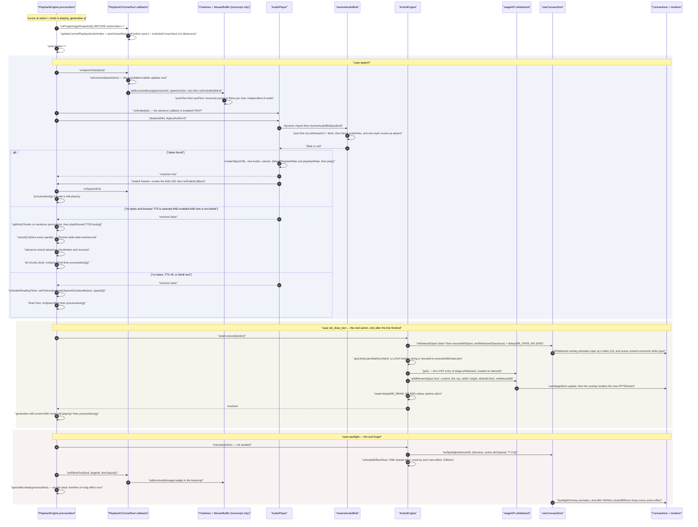
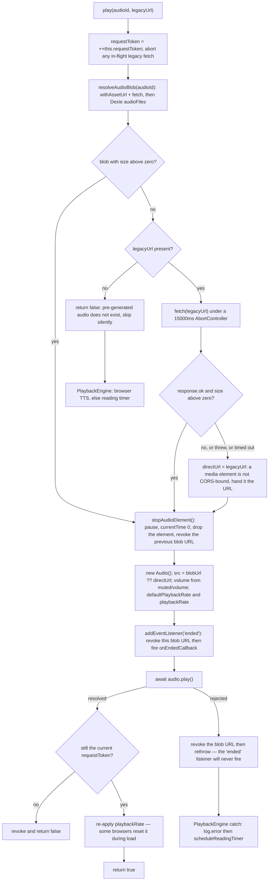

# One Narration Line to Audio, Strokes and Slide State

How a single authored `speech` action becomes sound, whiteboard content and slide
effects — in order, with the exact synchronisation mechanism. The short answer:
**there is no timeline at runtime.** Synchronisation is authoring-time action
ordering plus `await`-and-callback chaining inside one loop. Nothing aligns a
stroke to a word.

**Sources:** `lib/playback/engine.ts`, `lib/action/engine.ts`,
`lib/utils/audio-player.ts`, `lib/media/resolve-audio-bytes.ts`,
`lib/api/stage-api-whiteboard.ts`, `lib/store/canvas.ts`,
`components/canvas/canvas-area.tsx`, `components/edit/PlaybackChromeRoot.tsx`,
[`../appendix/research/classroom-runtime/03a-flows-playback.md`](../appendix/research/classroom-runtime/03a-flows-playback.md),
[`../appendix/research/media-audio-video/03a-flows-audio-media.md`](../appendix/research/media-audio-video/03a-flows-audio-media.md).

## The synchronisation model, stated plainly

| Question | Answer | Where |
| --- | --- | --- |
| What aligns narration with a stroke? | Nothing at runtime. The author emits `speech` then `wb_draw_text` as sibling actions; `processNext` runs them strictly in order, and each blocks the next | `lib/playback/engine.ts:552`, `:735` |
| What ends a narration line? | Whichever of four clocks is live: audio `ended`, per-chunk TTS `onend`, a reading timer, or an awaited `ActionEngine.execute` | `engine.ts:589`, `:829`, `:601`, `:735` |
| Can a stroke land *during* a line? | Only if the author emitted `spotlight`/`laser` — the two non-blocking verbs. Every `wb_*` verb is blocking, so it lands strictly after the preceding line finishes | `packages/@openmaic/dsl/src/action.ts:261` |
| What guarantees the whiteboard is open before a draw? | `ActionEngine.execute` awaits `ensureWhiteboardOpen()` for every `wb_*` verb other than `wb_open`/`wb_close` | `lib/action/engine.ts:228-230` |
| Where does board content live? | The **last** entry of `stage.whiteboard`, mutated through `createWhiteboardAPI`. Not `scene.whiteboards` | `lib/api/stage-api-whiteboard.ts:64` |
| What clears an effect? | One shared timer on `ActionEngine`, reset by each new effect | `lib/action/engine.ts:308-316` |

## The trace



## Ordering rules that are load-bearing

1. **`onProgress` fires before the cursor advances** (`engine.ts:579`, comment at
   `:576-578`). The persisted snapshot therefore points at the action *about to
   run*, so a restore replays a half-heard line rather than skipping it.
2. **`onSpeechStart` fires before any audio decision.** The bubble and the
   transcript update even if the audio never starts. Nothing rolls them back on a
   failure.
3. **`audioPlayer.onEnded(cb)` is registered before `play()`** (`:589` versus
   `:623`). A very short clip that ends before the promise resolves still advances.
4. **`hasText` is computed up front** (`:621`) and gates the browser-TTS branch.
   Blank text goes to the reading timer, because an empty
   `SpeechSynthesisUtterance` does not reliably fire `onend` in Chromium and would
   hang the slide.
5. **Mode is set before audio is stopped** in `stop()` and `handleUserInterrupt()`
   (`:319`, `:459`), because `speechSynthesis.cancel()` can fire `onend`
   synchronously.

## The audio path in detail

`AudioPlayer.play(audioId, legacyUrl)` (`lib/utils/audio-player.ts:99`) returns
`Promise<boolean>` — `true` only if playback actually started. It is guarded by a
monotonic `requestToken` (`:100`) re-checked at four points (`:105`, `:124`,
`:142`, `:173`) so a superseded play resolves `false` instead of hijacking the
element.



Two consequences worth internalising:

- **No cache.** Every play of a line re-resolves and re-fetches its bytes. There is
  no memo in `AudioPlayer` and none in `resolveAudioBlob`
  (`lib/media/resolve-audio-bytes.ts:15`). Restarting a scene refetches every clip.
- **`hasActiveAudio()` decides the resume branch, and it replays an ended clip.**
  The method is bare `this.audio !== null` (`:233`) despite its docstring claiming
  "playing or paused, but **not ended**" (`:230`), and the element is nulled only
  by `stopAudioElement()`. So after a clip ends naturally the element is still
  non-null and `resume()` takes the `hasActiveAudio()` branch (`engine.ts:287`)
  rather than the `speechTimerRemaining` branch: it re-registers `onEnded` and
  calls `audioPlayer.resume()`. That call is **not** a no-op. `AudioPlayer.resume()`
  is `if (this.audio?.paused) { … this.audio.play(); }` (`:213-220`), and an ended
  element *is* paused — HTML sets `paused` to true before it fires `ended` — so the
  guard passes and `play()` on an ended element seeks back to the start and replays
  the whole narration line. The `processNext()` fallthrough at `:311` is reached
  only when neither branch matched.

Volume, mute and rate are applied live rather than at next play: three effects in
the host push `setMuted`, `setVolume` and `setPlaybackRate` into the player
whenever settings change (`PlaybackChromeRoot.tsx:989-999`, and the
`playbackSpeed` effect below them).

## The whiteboard path in detail

The whiteboard is **not** a stroke stream. Every `wb_*` verb constructs a
`PPTElement` and hands it to `createWhiteboardAPI`:

| Verb | Element written | Extra behaviour |
| --- | --- | --- |
| `wb_draw_text` | `type: 'text'`, HTML content wrapped in a `<p>` with the font size when it is not already markup (`lib/action/engine.ts:481-483`) | `getLikelyLatexMath` reroutes a LaTeX-looking string to `wb_draw_latex` (`:465-475`); empty content returns with no delay |
| `wb_draw_shape` | `type: 'shape'` with one of three hardcoded SVG paths, `rectangle` as the unknown fallback (`:520`) | — |
| `wb_draw_chart` | `type: 'chart'` with a five-colour default theme (`:557`) | — |
| `wb_draw_latex` | `type: 'latex'` with `katex.renderToString(latex, {throwOnError:false, displayMode:true})` (`:574`) | a render throw logs a warning and returns without drawing (`:597-600`) |
| `wb_draw_table` | `type: 'table'` with equal column widths and generated cell ids (`:617-628`) | zero rows or columns returns with no delay (`:614`) |
| `wb_draw_line` | `type: 'line'` with coordinates rebased to the bounding box (`:672-677`) | — |
| `wb_draw_code` | `type: 'code'` with `codeToLines` ids `L1..Ln`, honouring supplied `lineIds` when the count matches (`:709-715`) | dwell is `wbDrawCodeMs(lines.length)` |
| `wb_edit_code` | mutates the target element's `lines` array; four operations (`:765-800`) | any unresolvable reference returns **before** the delay — the case `isEditCodeNoop` models for the exporter |
| `wb_clear` | `whiteboard.update({elements: []})` | pushes a history snapshot, sets `whiteboardClearing` to drive the cascade, waits `wbClearMs(count)`, then removes (`:838-850`). An empty board returns with no delay |
| `wb_delete` | `deleteElement(elementId)` | — |
| `wb_open` / `wb_close` | `setWhiteboardOpen(true/false)` plus the open/close animation dwell | — |

`whiteboard.get()` (`lib/api/stage-api-whiteboard.ts:58`) returns
`state.stage.whiteboard.at(-1)` and creates an entry when the array is empty
(`:42`). Playback therefore always writes to the **last stage-level whiteboard**,
never to `scene.whiteboards` — which are a separate authored field.

Every `addElement` goes through `withProductionPersistence`
(`lib/api/stage-api.ts:101`), so a playback-time stroke marks the stage document
dirty for persistence exactly like an edit would.

## Slide state

Slide state during playback is two things, and neither is written into the
document:

1. **Effects**, held in `useCanvasStore`: `setSpotlight(elementId, {dimness})`,
   `setLaser(elementId, {color})`, `clearAllEffects()`
   (`lib/action/engine.ts:320-332`, `:293`). Defaults are `dimOpacity ?? 0.5` and
   `color ?? '#ff0000'`.
2. **Video playback**, also in the canvas store: `playVideo(elementId)` and
   `pauseVideo()`, with `playingVideoElementId` as the observable
   (`lib/action/engine.ts:402`, `:419-420`).

`play_video` is the most involved verb because it has to wait for *bytes* before it
waits for *playback* (`:353-438`):

- resolve the element and its media task (`resolveActionVideoMedia`, `:132`);
- if the task is neither playable nor `failed`, subscribe to
  `useMediaGenerationStore` and wait — a deferred restore is `done` without an
  `objectUrl` and `isPlayableVideoTask` treats that as not playable (`:164-166`),
  matching what the renderer does;
- re-check after `getState`/`subscribe` to close the race (`:385-389`);
- if the task ended `failed`, skip playback entirely (`:396-398`);
- then `playVideo`, subscribe for `playingVideoElementId` changing away, and cap
  the wait at `MAX_VIDEO_WAIT_MS` with a `log.warn` (`:424-427`).

Both waits honour `options.signal` and remove their listeners in a single `finish`
(`:410-417`).

## Layering: the whiteboard hides the slide

`CanvasArea` composes the two surfaces:

```tsx
{/* Whiteboard Layer */}
<div className="absolute inset-0 z-[110] pointer-events-none">
  <SceneProvider><Whiteboard isOpen={whiteboardOpen} onClose={onWhiteboardClose} /></SceneProvider>
</div>

{/* Scene Content */}
{currentScene && !whiteboardOpen && (
  <div className="absolute inset-0">
    <SceneProvider><SceneRenderer scene={currentScene} mode={mode} /></SceneProvider>
  </div>
)}
// components/canvas/canvas-area.tsx:122-136
```

The scene renderer is **unmounted** while the whiteboard is open, not merely
covered. So a `wb_open` during playback tears down the slide subtree, and
`wb_close` remounts it. For a `slide` scene that is a re-render; for an
`interactive` scene it would be a document reload, which is exactly why the iframe
lives in a keep-alive host above this subtree — see
[`./09-interactive-scene-sandbox.md`](./09-interactive-scene-sandbox.md).

`SceneRenderer` has two other call sites worth knowing: `CanvasArea` (the playback
path) and `lib/edit/noop-surface.tsx:38`, which renders it with a hardcoded
`mode="playback"` as the editor's fallback surface.

## The transcript rail is independent

`onSpeechStart` also pushes the line into the `ChatArea` transcript via
`addLectureMessage` (`PlaybackChromeRoot.tsx:788-795`), which does
`pushText` + `sealText` on a lecture `StreamBuffer`
(`components/chat/use-chat-sessions.ts:2187-2189`). That buffer paces the
transcript at 30 ms/char with **no** relation to the audio's real length: a long
clip finishes its transcript early, a short one late. `pauseBuffer` /
`resumeBuffer` on the lecture session are driven from `handlePlayPause`
(`PlaybackChromeRoot.tsx:1136-1144`) so at least the two freeze together.

Effect badges take the same route through `onEffectFire`
(`PlaybackChromeRoot.tsx:804-821`), with a monotonic
`lectureActionCounterRef` supplying the dedup index — `addLectureMessage` skips any
`actionIndex <= lastIndex` (`use-chat-sessions.ts:2168-2170`), which is what makes
a replayed line idempotent in the transcript.

## Open questions

- Nothing measures the drift between `estimateSpeechDurationMs` and real TTS
  duration, and nothing measures the drift between the 30 ms/char transcript and
  the audio. Both are accepted by construction.
- `resume()`'s `speechTimerRemaining` branch (`engine.ts:298`) is only reachable
  when `hasActiveAudio()` is false, i.e. after a `stop()`/`jumpToAction` cleared
  the element. Whether the reading-timer resume path is exercised in practice was
  not established.

## Next

- [`./02-playback-state-machine.md`](./02-playback-state-machine.md) — the loop
  that drives this.
- [`./03-choreography.md`](./03-choreography.md) — the same ordering expressed as a
  wall clock for the exporter.
- [`../09-media-and-export/index.md`](../09-media-and-export/index.md) — TTS
  synthesis and the whiteboard runtime log.
