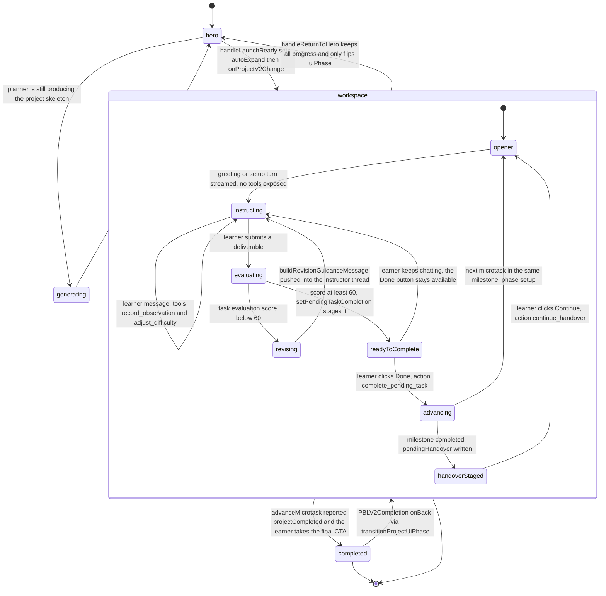
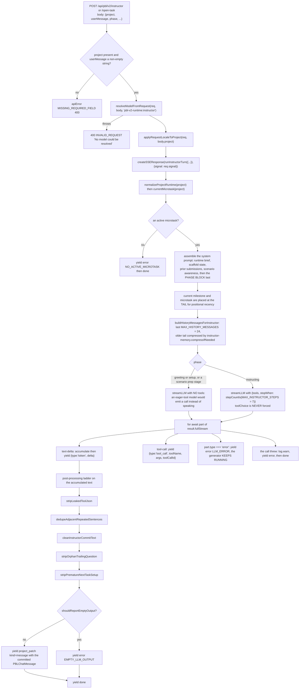

# PBL v2: Instructor Agent and Task Engine

A `pbl` scene is a project-based-learning workspace: milestones of microtasks, an
instructor agent the learner chats with, submissions scored by an evaluator, and a
learner-state ledger reconstructed on load. This page covers what state is
tracked, the instructor agent's loop, and the three gates that guard advancement.
The wire protocol, the runtime ledger and legacy reachability continue in
[`./08b-pbl-v2-runtime-and-legacy.md`](docs/08-classroom-runtime/08b-pbl-v2-runtime-and-legacy.md).

**Sources:** `lib/pbl/v2/agents/instructor.ts`, `lib/pbl/v2/types.ts`,
`packages/@openmaic/generation/src/pbl/operations/kernel/{progress,task-completion,engagement}.ts`,
`app/api/pbl/v2/task/update/route.ts`, `components/scene-renderers/pbl-renderer.tsx`,
`packages/@openmaic/dsl/src/pbl.ts`, `lib/pbl/v2/runtime/learner-state.ts`,
[`../appendix/research/classroom-runtime/01b-modules-pbl-interactive.md`](docs/appendix/research/classroom-runtime/01b-modules-pbl-interactive.md),
[`../appendix/research/classroom-runtime/03b-flows-scenes-and-pbl.md`](docs/appendix/research/classroom-runtime/03b-flows-scenes-and-pbl.md).

## What is tracked, and where

The document stores a **design template**; learner state is reconstructed from an
append-only runtime ledger. `lib/pbl/v2/runtime/learner-state.ts` owns both halves
of that contract: `extractLearnerState` and `stripToDesignTemplate`.

| Field group | Lives in | Notes |
| --- | --- | --- |
| `title`, `description`, `language`, `tags`, `roles`, milestone/microtask design fields, `scenario` config, briefings, `completionCriteria` | `scene.content.projectV2` in the course document | `PBLContent.projectV2?: PBLProject` ([`packages/@openmaic/dsl/src/pbl.ts:151-153`](packages/@openmaic/dsl/src/pbl.ts#L151-L153)) |
| thread messages, submissions, evaluations, engagement events, runtime events, `pendingHandover`, `pendingTaskCompletion`, `proficiencyAssessment` | `RuntimeStore` records, folded on read | `PBLProjectV2` is a `RuntimeOverlay` that *replaces* those properties on the contract type ([`lib/pbl/v2/types.ts:539`](lib/pbl/v2/types.ts#L539); the `RuntimeOverlay` helper is [`:43`](lib/pbl/v2/types.ts#L43)) |
| `uiPhase` | the document | `PBLUiPhase`: `hero`, `generating`, `workspace`, `completed` ([`dsl/src/pbl.ts:16`](packages/@openmaic/dsl/src/pbl.ts#L16)) |
| `status` | the document | `PBLProjectStatus`: `designing`, `review`, `active`, `completed`, `archived` ([`dsl/src/pbl.ts:3`](packages/@openmaic/dsl/src/pbl.ts#L3)) |

Both event outboxes are bounded rings: `MAX_ENGAGEMENT_EVENTS = 500`
([`kernel/engagement.ts:28`](packages/@openmaic/generation/src/pbl/operations/kernel/engagement.ts#L28)), enforced by `capEngagementEvents` splicing from the
front (`:60-63`).

## A task session

`workspace` and `completed` are rendered by **one** portaled
`PBLV2WorkspaceLayer` ([`pbl-renderer.tsx:238-261`](components/scene-renderers/pbl-renderer.tsx#L238-L261)), `position: fixed`, portalled
to `document.body` — or to the natively fullscreened element while native
fullscreen is on (`:260`). That single-instance choice is what preserves chat
scroll position and an in-flight instructor stream across expand/collapse *and*
across workspace → completion. Expand/collapse animates the frame's rect; it never
remounts the workspace (comment at `:86-91`).

Two ordering details in the renderer:

- `activeStreamCount` is a **count**, not a boolean (`:132-136`), because an
  instructor chat turn and a submission evaluation can overlap; with a boolean the
  first to settle would clear "busy" while the other was still running.
- `handleWorkspaceProjectChange` (`:197-209`) reads the **live** `uiPhase` out of
  `useStageStore` and rewrites an incoming clone's `uiPhase` back to `hero` when
  the learner has already stepped back. A stream that resolves late lands its
  progress without yanking the learner forward.

`generating` and `hero` fall into the same `default` branch of the render switch
(`:220-231`), so the distinction is invisible in the renderer.

## The instructor agent loop

`runInstructorTurn(args)` ([`lib/pbl/v2/agents/instructor.ts:1301`](lib/pbl/v2/agents/instructor.ts#L1301)) is an
`AsyncGenerator<PBLSSEEvent, void, void>` — 1 865 lines in the module, three
phases, two tools.

### The three phases

| Phase | Triggered by | Tools exposed | Prompt block |
| --- | --- | --- | --- |
| `greeting` | first entry with an empty instructor thread | **none** | `PHASE_BLOCKS.greeting` ([`instructor.ts:68`](lib/pbl/v2/agents/instructor.ts#L68)) |
| `setup` | a new microtask became active (`runTaskOpenerPhase`) | **none** | `PHASE_BLOCKS.setup` |
| `instructing` | a learner message | `record_observation`, `adjust_difficulty` (`:1422`, `:1472`) | `PHASE_BLOCKS.instructing` |

Two decisions are recorded as measured constraints, not preferences:

- Openers expose no tools because an eager-tool model emits a tool call instead of
  speaking and leaves the learner with an empty chat (`:1495-1499`).
- `toolChoice` is never forced. Measured against the live DeepSeek V4 Pro API,
  thinking mode plus a **forced** `toolChoice` returns HTTP 400 "Thinking mode does
  not support this tool_choice" (`:1508-1512`). Thinking itself is not the
  runtime's call at all: the comment at `:1519-1523` says it "holds no opinion of
  its own" and points operators at pinning `thinking` off on the
  `pbl-v2-runtime` stage route.

### The instructor cannot advance a task

`:1416-1421` states the rule: *"Teaching-agent tools. NO advance machinery: task
readiness is decided only by right-side submission evaluation."* The tool object
at `:1422` contains exactly two entries — `record_observation` (analytic learning
events; explicitly "never gates advance") and `adjust_difficulty` (applies a
learner's explicit level request). The module header is stale prose against that:
`:6-7` says "processes the three teaching tools" and then names two. Only
`adjust_difficulty` triggers the synthesised-reply fallback when the model called
a tool and wrote no text (`:1630-1631`); a lone `record_observation` stays silent
and becomes an `EMPTY_LLM_OUTPUT`.

## The three completion gates

Advancement is deliberately not a single decision. Three independent gates stand
between "the learner submitted something good" and "the next milestone is open".

| Gate | Decided by | Mechanism |
| --- | --- | --- |
| 1. Evaluation passes | the evaluator LLM behind `POST /api/pbl/v2/evaluate` | `taskEvaluationCanComplete(evaluation)`: `kind === 'task' && score >= TASK_EVAL_PASS_SCORE` where the constant is `60` ([`kernel/task-completion.ts:18-26`](packages/@openmaic/generation/src/pbl/operations/kernel/task-completion.ts#L18-L26)) |
| 2. The learner confirms | the sidebar **Done** button | `setPendingTaskCompletion` stages `{microtaskId, milestoneId, reason, assessment, evidence, createdAt}` and appends a `task_completion_staged` runtime event ([`task-completion.ts:53-84`](packages/@openmaic/generation/src/pbl/operations/kernel/task-completion.ts#L53-L84)). Only then does `POST /api/pbl/v2/task/update {action:'complete_pending_task'}` succeed |
| 3. The milestone boundary | the **Continue** button on a staged handover | `advanceMicrotask` writes `project.pendingHandover` and a `handover_staged` event ([`progress.ts:588-608`](packages/@openmaic/generation/src/pbl/operations/kernel/progress.ts#L588-L608)); the next milestone stays `locked` until `continueAfterHandover` marks the handover `consumed: true` (`:797`) |

`POST /api/pbl/v2/task/update` refuses gate 2 explicitly: no active microtask →
`400 'No active microtask to complete.'`; no staged completion →
`400 'No pending task completion to confirm.'`
([`app/api/pbl/v2/task/update/route.ts:78-84`](app/api/pbl/v2/task/update/route.ts#L78-L84)).

### `advanceMicrotask`, step by step

[`progress.ts:463`](packages/@openmaic/generation/src/pbl/operations/kernel/progress.ts#L463), and the ordering matters:

1. `findMicrotask` — missing → `{ok:false, error:'microtask_not_found'}`.
2. Already `completed` or `skipped` → `{ok:false, error:'already_terminal'}` (`:483-485`),
   which the route turns into a 400.
3. `clearPendingTaskCompletion`, then `status = 'completed'` with a
   `status_changed` runtime event carrying `from`/`to` (`:490-505`).
4. `completionReason` and `internalAssessment` recorded on the microtask.
5. `recordEvent('microtask_completed', …)` (`:509`).
6. **Freeze** `microtask.engagement = microtaskEngagement(project, microtaskId)`
   (`:526`). The comment at `:515-525` explains why: the engagement ledger is a
   500-entry ring, and a long project rolls its early task events off the back, so
   caching the summary at completion is what keeps the milestone evaluator's
   telemetry alive. It is computed *after* the completion event so the snapshot has
   a populated `completedAt` for `durationSeconds`.
7. Activate the next `todo`/`in_progress` microtask in the same milestone → return
   `{milestoneCompleted: false, projectCompleted: false, nextMicrotaskId}` (`:530-558`).
8. Otherwise complete the milestone, then look for the lowest-`order` `locked`
   milestone. Found → stage the handover, return `{milestoneCompleted: true,
   projectCompleted: false}` (`:586-610`). None → `project.status = 'completed'`,
   return `{milestoneCompleted: true, projectCompleted: true}` (`:617-635`).

Note step 8's consequence: `projectCompleted` **implies** `milestoneCompleted`.
The UI stays in `workspace` even then — the comment at `:613-616` says the chained
milestone and final evaluators need to render their cards in chat first, and the
learner enters the completion report through an explicit CTA.

## Scenario projects: two extra deterministic transitions

`POST /api/pbl/v2/task/update` carries two scenario-only actions, both LLM-free and
both hard-gated so an ordinary project can never be affected:

| Action | Gate | Effect |
| --- | --- | --- |
| `enter_scenario` | `project.scenario` present **and** the active milestone's `scenarioStage === 'prep'`, else `400 'Not a scenario project.'` / `400 'No active scenario prep stage to advance.'` ([`route.ts:120-127`](app/api/pbl/v2/task/update/route.ts#L120-L127)) | completes the prep microtask, which seals the prep milestone and stages the handover, then immediately consumes it (`:128-140`) |
| `complete_act` | `project.scenario` present, else `400 'Not a scenario project.'` (`:150-152`) | `completeRoleplayAct(project, 'act_completed_by_learner')` marks **every** not-yet-terminal beat of the active roleplay milestone `completed`, seals the milestone and stages the handover through the same path ([`progress.ts:652`](packages/@openmaic/generation/src/pbl/operations/kernel/progress.ts#L652)) |

The act model is documented at [`progress.ts:638-651`](packages/@openmaic/generation/src/pbl/operations/kernel/progress.ts#L638-L651): a roleplay milestone is one
continuous scene whose beats are background checkpoints, never sequentially
advanced, so the learner is never auto-advanced mid-scene. Which checkpoints were
met is judged later by the final evaluator for **scoring only**, never for
progression.

## Open questions

- Where `uiPhase: 'generating'` is set was not traced; the renderer routes it to
  the same branch as `'hero'`, so the distinction has no visible effect there.
- [`instructor.ts:6-7`](lib/pbl/v2/agents/instructor.ts#L6-L7) says "the three teaching tools" and names two; the tool
  object at `:1422` really does contain only two. Whether a third was removed or
  never landed is not recorded.

## Next

- [`./08b-pbl-v2-runtime-and-legacy.md`](docs/08-classroom-runtime/08b-pbl-v2-runtime-and-legacy.md) — the
  wire protocol, the runtime ledger, and legacy reachability.
- [`./01-playback-vocabulary.md`](docs/08-classroom-runtime/01-playback-vocabulary.md) — where `pbl` sits
  in the scene union.
- [`./09-interactive-scene-sandbox.md`](docs/08-classroom-runtime/09-interactive-scene-sandbox.md) — the
  other non-slide scene kind.
