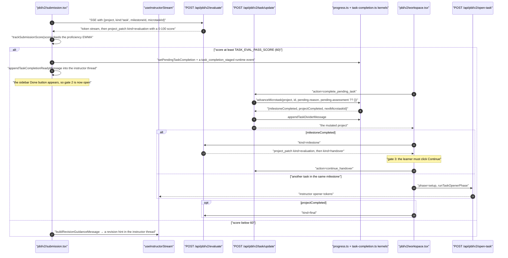
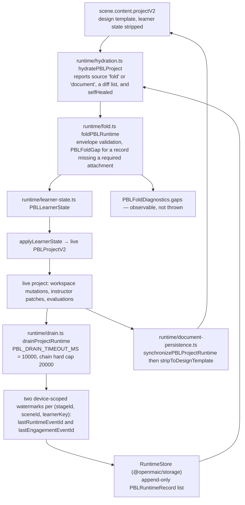
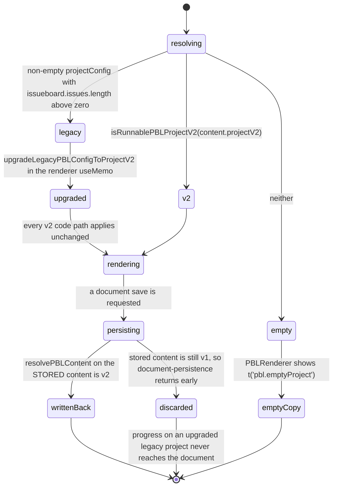

# PBL v2: Wire Protocol, Runtime Ledger, and Legacy Reachability

The second half of PBL v2, split from [`./08-pbl-v2.md`](docs/08-classroom-runtime/08-pbl-v2.md) for
length. That page covers the instructor agent and the task engine; this one covers
how state crosses the wire, how learner progress is stored and reconstructed, and
exactly how reachable the legacy v1 project shape is.

**Sources:** `lib/pbl/v2/api/sse.ts`,
`components/scene-renderers/pbl/v2/use-instructor-stream.ts`,
`lib/pbl/v2/runtime/{drain,fold,hydration,learner-state,document-persistence}.ts`,
`lib/pbl/legacy/read.ts`, `components/scene-renderers/pbl-renderer.tsx`,
`lib/pbl/v2/types.ts`,
[`../appendix/research/classroom-runtime/01b-modules-pbl-interactive.md`](docs/appendix/research/classroom-runtime/01b-modules-pbl-interactive.md),
[`../appendix/research/classroom-runtime/02b-interfaces-pbl-and-scenes.md`](docs/appendix/research/classroom-runtime/02b-interfaces-pbl-and-scenes.md).

## The wire protocol is stateless

`lib/pbl/v2/api/sse.ts` owns the envelope. The client POSTs the **whole**
`PBLProjectV2`; the server mutates its own copy and emits `project_patch` events
describing what changed. Six patch kinds: `message`, `advance`, `engagement_event`,
`evaluation`, `handover`, `proficiency`.

The `advance` patch carries three `shouldEvaluate*` booleans — the server telling
the client *what to do next declaratively*, because the server "doesn't know the
client's stream state" and running the evaluator inline with the instructor would
interleave two LLM token streams into the same draft ([`sse.ts:88-93`](lib/pbl/v2/api/sse.ts#L88-L93)).

`createSSEResponse` adds a 15 s `: keepalive` comment and
`X-Accel-Buffering: no` so a proxy cannot idle the stream out, and its catch still
writes `STREAM_ERROR` plus `done` to the wire before closing.

### The evaluator chain runs after, never during



`useInstructorStream` chains the evaluators **after** the instructor stream closes,
in the fixed order task → milestone → final, never interleaved. Two guards make
that safe:

- a synchronous `runningRef` lock rejects a second call in the same effect flush —
  React state alone would let two openers double-fire;
- the chain's `catch` sets `ok=false` and an error, but the `finally` still calls
  `onProjectChange(workingProject)`, so patches applied before the failure are kept.

There are **two** SSE readers, and they disagree about tolerance. `runOneStream`
calls `assertNotStreamError` unconditionally, so an `EMPTY_LLM_OUTPUT` frame aborts
its chain. `submission.tsx` has its own inline reader and is the only caller that
consults `isToleratedReactionStreamError` — even though the tolerance helper lives
in `use-instructor-stream.ts`.

## Runtime ledger: fold, drain, hydrate



Properties stated in the code:

- Drain is **at-least-once**; downstream folds must dedupe by event id.
- Two independent watermarks, one per outbox, so a partial drain of one does not
  re-emit the other.
- `PBL_DRAIN_TIMEOUT_MS = 10_000` and `PBL_DRAIN_CHAIN_HARD_CAP_MS = 20_000`
  ([`drain.ts:29-31`](lib/pbl/v2/runtime/drain.ts#L29-L31)), with `PBL_HYDRATION_DRAIN_BARRIER_TIMEOUT_MS` aliased to the
  hard cap (`:31`) and a timeout error naming the budget (`:408`).
- A watermark pointing at an event that has already rolled out of a ring is handled
  rather than fatal ([`drain.ts:7`](lib/pbl/v2/runtime/drain.ts#L7)).
- `hydratePBLProject` reports `source`, `diagnostics`, `diff` and `selfHealed`, so
  divergence between ledger and document is observable rather than silently
  resolved.
- A record missing one of the kinds in
  `PBL_RUNTIME_EVENT_KINDS_REQUIRING_ATTACHMENT` becomes a recorded `PBLFoldGap`,
  not a thrown error.

## Is legacy PBL reachable?

**Read-only, yes. Runnable, no. Persistable, no.**

`resolvePBLContent(content)` ([`lib/pbl/legacy/read.ts:206`](lib/pbl/legacy/read.ts#L206)) is the single arbiter
and returns one of three kinds:

```ts
export type ResolvedPBLContent =
  | { kind: 'v2'; projectV2: PBLProjectV2 }
  | { kind: 'legacy'; projectConfig: PBLProjectConfig }
  | { kind: 'empty' };
```



- `v2` when `isRunnablePBLProjectV2(content.projectV2)` — the strictest of three
  guards, requiring every container the renderer dereferences, at least one
  `instructor` role with a non-empty string `id` and a string `name`, and every
  milestone carrying at least one microtask with a non-empty string `id` and a
  string `title`.
- `legacy` when a non-empty `projectConfig` has `issueboard.issues.length > 0`
  (`:213-220`).
- `empty` otherwise → `PBLRenderer` renders `t('pbl.emptyProject')`
  ([`pbl-renderer.tsx:69-73`](components/scene-renderers/pbl-renderer.tsx#L69-L73)).

A `legacy` result is **immediately upgraded** in the renderer:

```ts
const resolved = resolvePBLContent(content);
if (resolved.kind === 'v2') return resolved.projectV2;
if (resolved.kind === 'legacy') return upgradeLegacyPBLConfigToProjectV2(resolved.projectConfig);
return null;
// components/scene-renderers/pbl-renderer.tsx:44-49
```

`upgradeLegacyPBLConfigToProjectV2` ([`legacy/read.ts:84`](lib/pbl/legacy/read.ts#L84)) synthesises: one
`instructor` compatibility role, one milestone per legacy issue ordered by
`issue.index` (`:93`), exactly one microtask per milestone, notes lifted into a
reference document, and the legacy chat replayed into the instructor thread. So
there is **no legacy runtime** — only a read-time projection into the v2 shape,
after which every v2 code path applies unchanged.

The module header is explicit about the direction ([`legacy/read.ts:5`](lib/pbl/legacy/read.ts#L5)): *"Writers
must never import it to create or project legacy shapes."*

### The asymmetry that loses progress

`preparePBLScenesForDocumentPersistence` and its sibling both bail on a non-`v2`
resolution:

```ts
const resolved = resolvePBLContent(content);
if (resolved.kind !== 'v2') return;        // document-persistence.ts:23
...
if (resolved.kind !== 'v2') return scene;  // :36
```

The check runs against the **stored** content, which is still v1 — the upgrade
lives only in the renderer's `useMemo`. So the original `projectConfig`
round-trips untouched and learner progress made on an upgraded legacy project is
never written back into the document. Whether the runtime ledger nonetheless
retains it is a separate question (the drain path is keyed by
`(stageId, sceneId, learnerKey)` and does not consult `resolvePBLContent`); that
end-to-end path was not traced.

Production importers of `lib/pbl/legacy/read.ts` are: [`pbl-renderer.tsx:9`](components/scene-renderers/pbl-renderer.tsx#L9),
[`lib/pbl/v2/runtime/hydration.ts:9`](lib/pbl/v2/runtime/hydration.ts#L9), [`lib/pbl/v2/runtime/document-persistence.ts:2`](lib/pbl/v2/runtime/document-persistence.ts#L2),
[`app/api/generate/scene-actions/route.ts:28`](app/api/generate/scene-actions/route.ts#L28),
[`lib/server/agent-runtime/generation-content.ts:8`](lib/server/agent-runtime/generation-content.ts#L8), and
[`lib/document-store/validators.ts:10`](lib/document-store/validators.ts#L10) (`isEmptyLegacyPBLConfig`), plus one
type-only import ([`lib/types/stage.ts:20`](lib/types/stage.ts#L20)).

## Adaptive proficiency, and who sees it

`PBLProficiencyAssessment` is an EWMA on `[-1, +1]` whose tier bounds are
**asymmetric** ([`packages/@openmaic/generation/src/pbl/operations/kernel/proficiency.ts:73-83`](packages/@openmaic/generation/src/pbl/operations/kernel/proficiency.ts#L73-L83)):
a learner crosses the *outer* boundary to ENTER a tier and only the *inner*
boundary to LEAVE it, and that pair is the hysteresis. Enter-advanced is `0.50`,
not `0.33` — the comment at `:74-78` records that the original hysteresis design
called for `0.33`, but a single strong quiz signal (~0.42) crossed it too easily
and caused premature tier-up, so it was raised to require corroborating evidence.
Enter-beginner is `-0.33`; the inner leave boundaries are `leaveAdvanced 0.2` and
`leaveBeginner -0.2`. On top of that sits a confidence gate below `0.4` that
blocks any switch, and both a minimum-signal and a turn-cooldown gate. Twelve
signal kinds split into five
static (pre-PBL: outline keywords, prior scene difficulty, user bio, explicit
level, quiz accuracy) and seven dynamic; signal history is bounded to the most
recent 50.

The learner never sees the tier. The only surface named in code is a dev badge
behind `PBL_V2_DEV_PROFICIENCY_BADGE` ([`lib/pbl/v2/api/sse.ts:122`](lib/pbl/v2/api/sse.ts#L122)).

## Failure surface

| Failure | Detection | Result |
| --- | --- | --- |
| No active microtask | [`instructor.ts:1308`](lib/pbl/v2/agents/instructor.ts#L1308) | SSE `error NO_ACTIVE_MICROTASK` + `done`; the client surfaces the message |
| Model unresolvable | `resolveModelFromRequest` throws | `400 INVALID_REQUEST` before any stream opens |
| LLM stream emits an `error` part | `instructor.ts` `fullStream` loop | `error LLM_ERROR` yielded, the generator **keeps running** |
| Generator throws anywhere | `createSSEResponse` catch | `STREAM_ERROR` + `done` are still written to the wire |
| Client disconnects | `req.signal` → `onAbort` → `safeClose()` | heartbeat cleared, listener removed, server stops burning compute |
| Instructor produced nothing | `shouldReportEmptyOutput` ([`instructor.ts:435`](lib/pbl/v2/agents/instructor.ts#L435)) | `error EMPTY_LLM_OUTPUT`; tolerated **only** by `submission.tsx`'s inline reader on a post-evaluation reaction turn |
| Any error on an eval stream | never tolerated | the chain aborts and the error is surfaced |
| Two openers fire in one effect flush | the synchronous `runningRef` lock | the second call is rejected |
| `task/update` with no pending completion | `400 'No pending task completion to confirm.'` ([`task/update/route.ts:83`](app/api/pbl/v2/task/update/route.ts#L83)) | the Done button stays available |
| `advanceMicrotask` on a terminal microtask | `{ok:false, error:'already_terminal'}` ([`progress.ts:484`](packages/@openmaic/generation/src/pbl/operations/kernel/progress.ts#L484)) | the route returns 400 |
| `enter_scenario` / `complete_act` on a non-scenario project | explicit `400 'Not a scenario project.'` | ordinary projects can never be affected |
| `task/update` fetch non-2xx | `if (!res.ok) return;` in `workspace.tsx` | **silent** — the button re-enables in `finally` and the learner gets no message |
| Runtime record missing its required attachment | recorded as a `PBLFoldGap` | the fold continues; the gap is observable in diagnostics |
| Fold cannot reconstruct current state | the persistence boundary verifies the fold before stripping | a full snapshot is appended so learner state survives a ring overflow |
| Hydration disagrees with the document | `HydratePBLProjectResult` carries `source`, `diagnostics`, `diff`, `selfHealed` | divergence is reported, not silently preferred |

## Open questions

- `PBLRole.type` allows seven values but only `instructor` and `simulator` have a
  live agent endpoint; `evaluator` runs without a role record and its output lands
  as a `PBLEvaluation` rather than a thread message. Whether the other four are
  reserved or dead is not recorded.
- Whether any operator surface reads `PBLProficiencyAssessment` was not
  established.
- Whether the runtime ledger retains progress made on an upgraded legacy project —
  the drain path does not consult `resolvePBLContent`, so it plausibly does, but
  the end-to-end path was not traced.
- `isToleratedReactionStreamError` lives in `use-instructor-stream.ts` but is called
  only from `submission.tsx`. Whether `runOneStream` is *meant* to tolerate the same
  frame is not recorded.

## Next

- [`./08-pbl-v2.md`](docs/08-classroom-runtime/08-pbl-v2.md) — the instructor agent and the task engine.
- [`../10-persistence-and-state/index.md`](docs/10-persistence-and-state/index.md) —
  the `RuntimeStore` this ledger lives in.
- [`../12-api-reference/index.md`](docs/12-api-reference/index.md) — the
  `/api/pbl/v2/*` endpoints.
