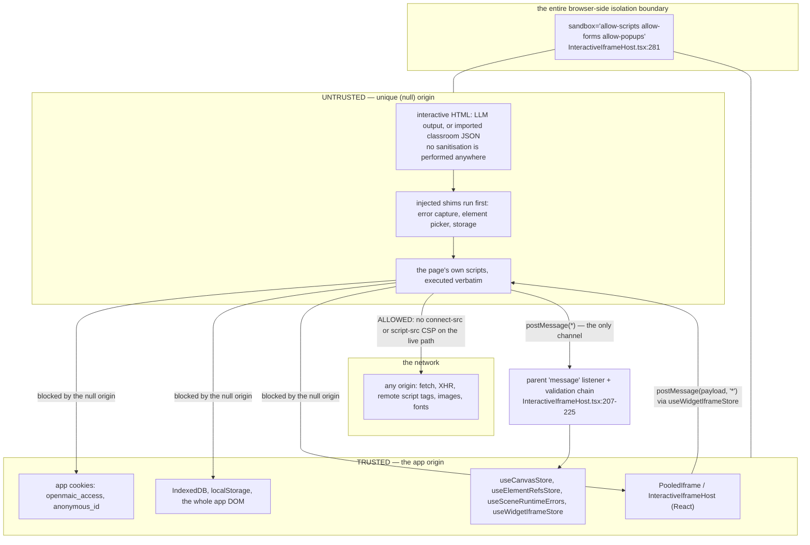
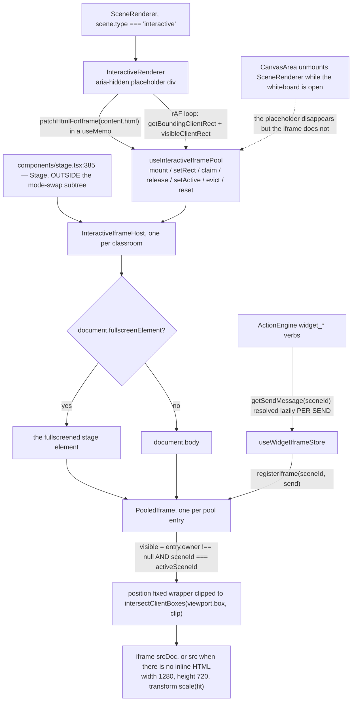
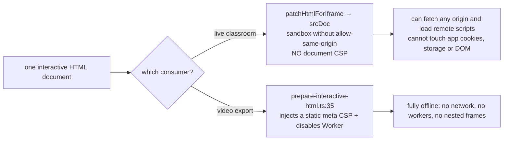
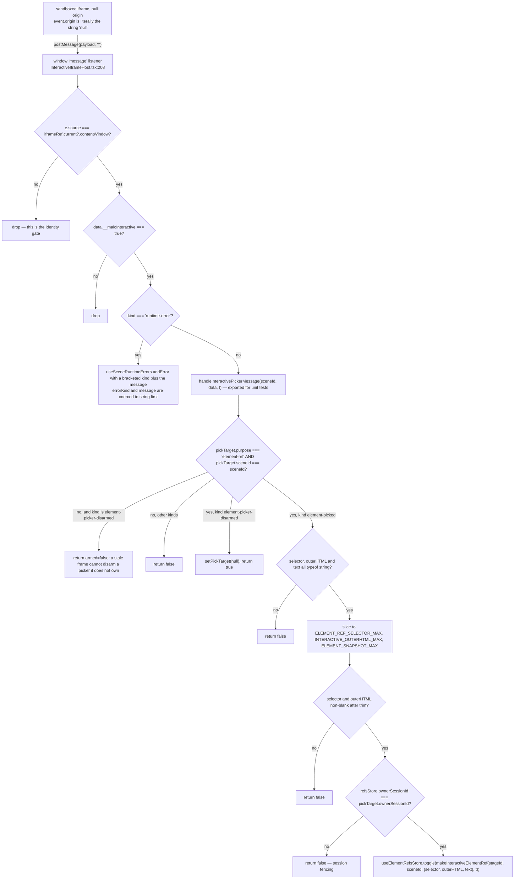

# Interactive Scenes: Embedding and Sandboxing

An `interactive` scene carries a complete HTML document — usually LLM-generated,
sometimes imported from classroom JSON — and the classroom runs it in an iframe.
This is the security-relevant part of the subsystem. Every statement below is
exact, and the controls that are **absent** are named as such.

**Sources:** `components/scene-renderers/interactive-renderer.tsx`,
`components/scene-renderers/InteractiveIframeHost.tsx`,
`lib/store/interactive-iframe-pool.ts`, `lib/utils/iframe.ts`,
`lib/interactive/logical-viewport.ts`, `components/stage.tsx`, `next.config.ts`,
`packages/@openmaic/dsl/src/interactive.ts`,
`lib/video-export-app/prepare-interactive-html.ts`,
[`../appendix/research/classroom-runtime/01c-modules-interactive-sandbox.md`](docs/appendix/research/classroom-runtime/01c-modules-interactive-sandbox.md).

## The trust boundary



Read that diagram as: **the `sandbox` attribute is the whole boundary.** There is
no CSP on the interactive document on the live path, so the page can reach the
network freely; it cannot reach anything belonging to the app origin.

## Split placeholder and host

The in-tree component renders nothing visible:

```tsx
return <div ref={slotRef} className="w-full h-full" aria-hidden />;
// components/scene-renderers/interactive-renderer.tsx:70
```

`InteractiveRenderer` does exactly three jobs (docstring at `:14-22`):

1. registers the patched HTML in the keep-alive pool via `mount(sceneId, {srcDoc,
   src})`, marks the scene active, and claims visibility with a `useId()` ownership
   token (`:42-50`);
2. reports its on-screen rect **every animation frame** —
   `getBoundingClientRect()` plus `visibleClientRect(node)` — so the host can
   position and clip the iframe (`:55-68`);
3. releases (never evicts) on unmount, preserving the document for a zero-reload
   return.

The real `<iframe>` elements live in `InteractiveIframeHost`, mounted **once at the
`Stage` root** ([`components/stage.tsx:385`](components/stage.tsx#L385)) — above the mode-swap subtree — and
portalled to `document.fullscreenElement ?? document.body`
([`InteractiveIframeHost.tsx:99`](components/scene-renderers/InteractiveIframeHost.tsx#L99)).



Why the split exists: `CanvasArea` unmounts the scene subtree whenever the
whiteboard opens ([`components/canvas/canvas-area.tsx:130`](components/canvas/canvas-area.tsx#L130)), and `Stage` cross-fades
between edit and playback chrome. Either would drop and re-parse the document. The
host sits above both, so visibility is driven by ownership — gone means hidden,
never unmounted.

## The keep-alive pool

`IFRAME_POOL_CAP = 3` ([`lib/store/interactive-iframe-pool.ts:21`](lib/store/interactive-iframe-pool.ts#L21)), LRU by a
monotonic `tick`, with the active scene never evictable — "The active scene is
never evicted (its iframe is on screen)" (`evictLru`, `:75-96`; the exclusion is
the `id !== activeSceneId` filter at `:86`).

| Action | Behaviour |
| --- | --- |
| `mount(sceneId, {srcDoc, src})` | Same content already loaded → refresh recency only, **keeping the existing string reference** so the host never re-sets `srcDoc` and the iframe never reloads (`:107-114`). String `===` is by value, so an equal-but-new `srcDoc` hits this fast path. Different content → rebuild the entry, then `evictLru` |
| `setRect(sceneId, rect, clip)` | Deep-compares all eight numbers and returns `{}` unchanged when they match (`:135-148`) — this is what stops the rAF loop from re-rendering every frame |
| `claim` / `release` | Ownership by placeholder `useId()`. `release` no-ops unless `owner` still matches (`:165`), so a stale unmount during the chrome cross-fade cannot hide a live iframe |
| `evict` / `reset` | `reset` runs when the host unmounts, e.g. on classroom switch, so a new classroom does not briefly render the previous one's iframes ([`InteractiveIframeHost.tsx:114`](components/scene-renderers/InteractiveIframeHost.tsx#L114)) |

A content change is the **only** intended reload path (`:115-116`).

## Geometry

The page is authored against a fixed logical viewport: `GENUI_LOGICAL_WIDTH = 1280`,
`GENUI_LOGICAL_HEIGHT = 720` (`lib/interactive/logical-viewport.ts`).
`fitGenUiViewport(slot)` contain-fits and centres it, returning `{box, scale}`.
The host renders the iframe at **full logical size** and applies
`transform: scale(...)` with `transformOrigin: 'top left'`
([`InteractiveIframeHost.tsx:262-271`](components/scene-renderers/InteractiveIframeHost.tsx#L262-L271)), and clips the wrapper to
`intersectClientBoxes(viewport.box, clip)` (`:236`) so an `overflow: hidden`
ancestor still clips a `position: fixed` iframe.

`shown` requires a *real measured* box: visible, non-null `rect` and `clip`,
positive intersection width and height, and positive `rect` width and height
(`:240-249`). Otherwise `visibility: hidden` and `pointerEvents: none` — never a
0×0 iframe pinned at the viewport origin.

## The sandbox attribute, exactly

```
sandbox="allow-scripts allow-forms allow-popups"
```

[`InteractiveIframeHost.tsx:281`](components/scene-renderers/InteractiveIframeHost.tsx#L281). Nothing else.

| Token | Granted? | Consequence |
| --- | --- | --- |
| `allow-scripts` | **yes** | the page's JavaScript runs |
| `allow-forms` | **yes** | form submission works |
| `allow-popups` | **yes** | the page can `window.open` |
| `allow-same-origin` | **no — deliberately** | the document runs in a unique (null) origin: no app cookies, no `localStorage`, no parent DOM |
| `allow-popups-to-escape-sandbox` | no | a popup inherits the sandbox |
| `allow-top-navigation` | no | it cannot navigate the classroom away |
| `allow-modals` | no | no `alert`/`confirm`/`prompt` |
| `allow-downloads` | no | — |
| `allow-pointer-lock` | no | — |

The reasoning is written out at `:145-155`: combining `allow-scripts` with
`allow-same-origin` on a `srcDoc` iframe effectively negates the sandbox — the
document would be treated as same-origin with the parent and could reach cookies,
`localStorage` and the parent DOM — and the HTML may originate from LLM output or
imported classroom JSON. **The sandbox attribute is load-bearing and must never
gain `allow-same-origin`.**

## CSP: what exists, and what does not

The only app-level CSP is emitted by [`next.config.ts:38-56`](next.config.ts#L38-L56):

```ts
const extraAncestors = process.env.ALLOWED_FRAME_ANCESTORS?.trim();
const frameAncestors = extraAncestors ? `'self' ${extraAncestors}` : "'self'";
headers: [
  ...(!extraAncestors ? [{ key: 'X-Frame-Options', value: 'SAMEORIGIN' }] : []),
  { key: 'Content-Security-Policy', value: `frame-ancestors ${frameAncestors}` },
]
```

That is a **`frame-ancestors` directive and nothing else**, on `source: '/(.*)'`.
`X-Frame-Options: SAMEORIGIN` is omitted when `ALLOWED_FRAME_ANCESTORS` is set,
because XFO cannot express an allowlist (comment at `:46-47`).

Absent controls, named explicitly:

| Directive | Present on the app response? | Injected into the interactive document? |
| --- | --- | --- |
| `frame-ancestors` | **yes** | n/a |
| `default-src` | no | **no** on the live path |
| `script-src` | no | **no** |
| `connect-src` | no | **no** |
| `img-src` / `font-src` / `media-src` | no | **no** |
| `worker-src` | no | **no** |
| `frame-src` | no | **no** |
| `object-src` / `base-uri` | no | **no** |
| `sandbox` (as a CSP directive) | no | n/a — the attribute is used instead |

The video exporter is the counter-example and the proof that the asymmetry is
visible in the codebase. `staticCaptureInjection()`
([`lib/video-export-app/prepare-interactive-html.ts:35`](lib/video-export-app/prepare-interactive-html.ts#L35)) injects a `<meta>` CSP into
the same HTML:

```
default-src 'none'; script-src 'unsafe-inline' 'unsafe-eval' data: blob:;
style-src 'unsafe-inline' data:; img-src data: blob:; font-src data:;
media-src data: blob:; worker-src 'none'; connect-src 'none'; frame-src 'none';
object-src 'none'; base-uri 'none'
```

and additionally replaces `window.Worker` / `window.SharedWorker` with a throwing
stub (`:50-52`). So an exported video's interactive HTML cannot reach the network
at all; **the same HTML in the live classroom can.**



## Injected shims

`patchHtmlForIframe(html)` ([`lib/utils/iframe.ts:288`](lib/utils/iframe.ts#L288)) builds one injection string
and hands it to `injectIntoDocumentHead`. The order is fixed at `:303-304`:

```ts
const injection = '\n' + ERROR_CAPTURE_SHIM + '\n' + ELEMENT_PICKER_SHIM + '\n' + STORAGE_SHIM + '\n' + iframeCss;
```

| # | Shim | Purpose | Notes |
| --- | --- | --- | --- |
| 1 | `ERROR_CAPTURE_SHIM` (`:57`) | forwards `window.onerror`, `unhandledrejection` and a wrapped `console.error` to `window.parent` via `postMessage(..., '*')` | messages truncated to 1 200 chars (`:69`); buffers and re-emits the whole buffer on `{__maicErrorReplayRequest: true}` (`:73-77`), because the errors that matter most fire synchronously during `srcDoc` parse, before the parent subscribes |
| 2 | `ELEMENT_PICKER_SHIM` (`:104`) | dormant by default; armed / disarmed / synced by parent messages | installs once via `window.__maicElementPickerInstalled` (`:106-107`); **only accepts messages where `event.source === window.parent`** (`:266`); on click it blocks the event and emits `{selector, outerHTML (≤2048), text (≤200)}` (`:223-227`) |
| 3 | `STORAGE_SHIM` (`:15`) | replaces `localStorage` / `sessionStorage` with an in-memory implementation | needed because touching real storage in a null origin throws `SecurityError`; without it a page that uses storage in setup code dies blank |
| 4 | `iframeCss` (`:289`) | `html, body` sizing, `overflow-x: hidden`, `overflow-y: auto`, `body { min-height: 100vh }` | — |

Order is commented at `:284-286`: error capture goes first so it also observes
failures in the storage shim. Note the `STORAGE_SHIM`'s own docstring still claims
it is "injected as the FIRST thing" (`:4-5`) — stale prose; it is third.

**`patchHtmlForIframe` performs no sanitisation.** It prepends shims and CSS and
returns. Script content is executed verbatim. That is the intended design — the
sandbox is the boundary — but it is why the attribute matters so much.

## Parent-side validation of iframe messages



`handleInteractivePickerMessage` is exported ([`InteractiveIframeHost.tsx:36`](components/scene-renderers/InteractiveIframeHost.tsx#L36))
specifically so this chain is unit-testable, and
`tests/scene-renderers/interactive-iframe-picker.test.ts` exercises it.

What is **not** checked, and cannot be: `event.origin`. A null-origin sandboxed
frame reports `origin: "null"`, which is exactly why `event.source` identity is the
gate. Outbound messages likewise use `targetOrigin: '*'`
([`InteractiveIframeHost.tsx:177`](components/scene-renderers/InteractiveIframeHost.tsx#L177)) — unavoidable for a null origin, and the comment
at `:152-154` says so.

The listener is re-subscribed per document version (`entry.srcDoc` is in the effect
deps, `:225`), and each fresh subscription immediately posts
`{__maicErrorReplayRequest: true}` (`:223`) to recover pre-subscription errors;
`addError` dedupes the live and replayed copies. A content change also clears the
scene's captured errors (`:229-231`) so the set reflects the current page.

## Widget messages, outbound

`ActionEngine`'s four `widget_*` verbs post into the frame:
`HIGHLIGHT_ELEMENT`, `SET_WIDGET_STATE`, `ANNOTATE_ELEMENT`, `REVEAL_ELEMENT`
([`lib/action/engine.ts:872-901`](lib/action/engine.ts#L872-L901)), each followed by a `WIDGET_MS` (300 ms) dwell.
The send function is resolved **lazily per send**:

```ts
const widgetSendMessage = (type, payload) =>
  useWidgetIframeStore.getState().getSendMessage(sceneIdForWidget)?.(type, payload);
// components/edit/PlaybackChromeRoot.tsx:748-749
```

The comment at `:741-746` explains why: the keep-alive host registers its
`postMessage` callback a commit *after* the engine is built, so resolving eagerly
would capture `null` on a scene's first visit and silently drop every widget
action. `sendWidgetMessage` logs a warning when no callback is set
([`lib/action/engine.ts:867`](lib/action/engine.ts#L867)).

## Residual exposure — facts, not speculation

1. **`entry.src` has no allowlist.** When a scene carries no inline `html`,
   `InteractiveContent.url` ([`packages/@openmaic/dsl/src/interactive.ts:53`](packages/@openmaic/dsl/src/interactive.ts#L53)) is
   loaded into the same sandboxed iframe via `src`
   ([`InteractiveIframeHost.tsx:278`](components/scene-renderers/InteractiveIframeHost.tsx#L278), [`interactive-renderer.tsx:45`](components/scene-renderers/interactive-renderer.tsx#L45)). No code in the
   render path validates or restricts that URL. The DSL validator requires only
   that at least one of `html` or `url` is a string ([`interactive.ts:64`](packages/@openmaic/dsl/src/interactive.ts#L64)).
2. **Unrestricted egress on the live path.** No `connect-src` and no `script-src`
   means the page can `fetch` any origin and load remote scripts. It cannot read
   app cookies or storage, so this is a data-exfiltration and third-party-code
   surface, not an app-state one.
3. **Up to three documents stay alive off-screen.** An evicted entry is dropped,
   but a merely-hidden one keeps running: only `visibility: hidden` and
   `pointerEvents: none` are applied (`:259-260`). The iframe is never unmounted or
   pointed at `about:blank`, so its timers, animations and network activity
   continue while the learner is on another scene.
4. **The error shim's own listener does not check `event.source`**
   ([`lib/utils/iframe.ts:73`](lib/utils/iframe.ts#L73)), so any frame that can reach it may trigger a buffer
   replay. Impact is bounded: the replay only re-posts to `window.parent`, and the
   parent dedupes.
5. **No sanitisation, by design.** `patchHtmlForIframe` does not parse or filter
   the HTML.

## Open questions

- Whether `InteractiveContent.url` is *supposed* to be allowlisted is a policy
  question with no answer in code. The DSL documents `url` as "a `src` fallback
  used only when `html` is absent" ([`interactive.ts:45-46`](packages/@openmaic/dsl/src/interactive.ts#L45-L46)) and says nothing about
  origin.
- Whether the live classroom is *meant* to have no document CSP is likewise
  unrecorded. The exporter deliberately injects `default-src 'none'; connect-src
  'none'`; the live path injects nothing. That could be a deliberate capability
  difference — a live widget may legitimately want to fetch — or an oversight.
- Nothing measures the memory or CPU cost of a three-entry pool of live documents.

## Next

- [`./07-utterance-to-output.md`](docs/08-classroom-runtime/07-utterance-to-output.md) — the `widget_*`
  verbs as playback actions.
- [`../15-cross-cutting/index.md`](docs/15-cross-cutting/index.md) — the app's other
  security boundaries.
- [`../09-media-and-export/index.md`](docs/09-media-and-export/index.md) — the
  export-path CSP and the static-capture harness.
