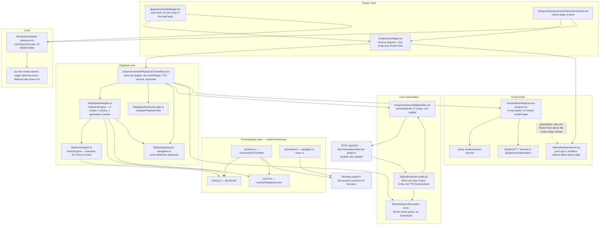
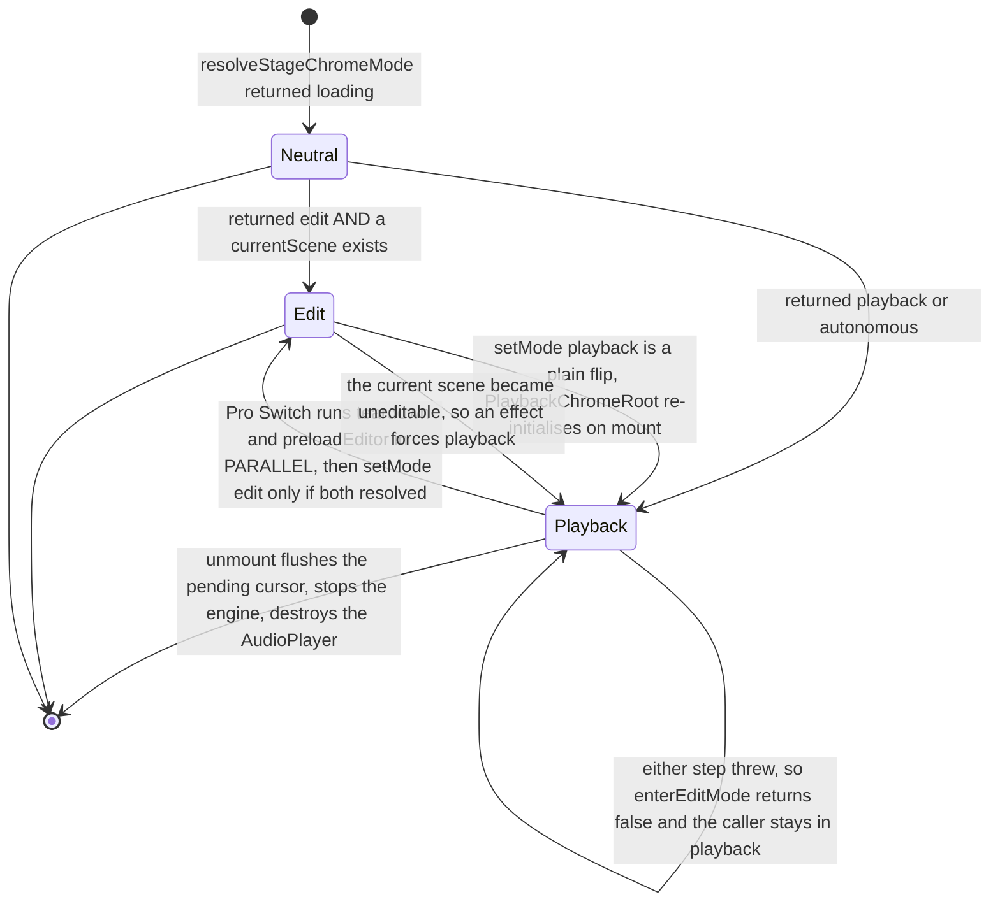

# Component View: Live Classroom Runtime

Everything that happens after a course document exists and a learner opens
`/classroom/<id>`: the playback state machine, the pure choreography spec it
shares with the video exporter, the pacing buffer behind live conversation, the
roundtable agent cast, the PBL v2 task runtime, and the sandbox that hosts
generated interactive HTML.

This is a C4 level-3 component view. It stops where other topics take over: the
course document contract is
[`../07-dsl-renderer-editor/index.md`](../07-dsl-renderer-editor/index.md), the
director that decides which agent speaks is
[`../05-agent-runtime/index.md`](../05-agent-runtime/index.md), TTS synthesis and
the video exporter are
[`../09-media-and-export/index.md`](../09-media-and-export/index.md), and the
route shell around the classroom is
[`../03-app-and-api/index.md`](../03-app-and-api/index.md).

## Who this is for

A staff engineer who has to change playback behaviour without breaking the video
exporter, or who has to reason about what a generated interactive page can reach.
Read [`./01-playback-vocabulary.md`](./01-playback-vocabulary.md) first — the
words *stage*, *scene*, *action* and *utterance* are all overloaded here, and one
of the four has no type at all.

## The one-paragraph model

`PlaybackChromeRoot` builds a fresh `ActionEngine` + `PlaybackEngine` pair per
scene (`components/edit/PlaybackChromeRoot.tsx:752`, `:759`). The
`PlaybackEngine` walks that scene's `Action[]` with a `(sceneIndex, actionIndex)`
cursor; narration is played by the engine itself, and every other verb is
delegated to `ActionEngine.execute` (`lib/playback/engine.ts:735`). There is no
single clock — whichever of four mechanisms is live owns the advance. Live
conversation runs on a different rail entirely: SSE frames land in a
`StreamBuffer` that reveals text at a fixed tick and holds each segment on screen
while its TTS audio plays. The pure timing spec in `lib/choreography/**` is the
only code shared with the offline video exporter, and eslint enforces that it
stays pure.

## Component map

Two things the map says that a table would not. `lib/choreography` has **no**
inbound edge from the app except through `PlaybackEngine` and `ActionEngine`, and
no outbound edge at all — that is an eslint-enforced purity boundary
(`eslint.config.mjs:255-323`). And `InteractiveIframeHost` is reached from
`Stage`, *above* the mode-swap subtree, not from the scene renderer — that is the
whole point of the keep-alive design.

## Chrome dispatch

`Stage` renders exactly one of three things — `EditChromeRoot`,
`PlaybackChromeRoot`, or a neutral `aria-busy` shell — chosen synchronously by
`resolveStageChromeMode` (`lib/edit/stage-mode.ts:98`). A standalone classroom
gets its `storedMode` verbatim (`:99`); a workspace-hosted one is **edit-locked**,
and `workbenchLearning` (Start Learning) is the single door to the learning chrome
(`:101`). Every other shortfall resolves to `loading`, never to playback — the
docstring at `:86-91` explains that the learning chrome used to be the default
branch and briefly painted a full playback UI over a course that had no scenes yet.

`teardown()` (`components/edit/PlaybackChromeRoot.tsx:544`) is the only imperative
escape hatch out of the playback chrome: it awaits `endActiveSession()`, aborts the
discussion controller, stops the engine, cleans up TTS and resets scene state.
Unmount cleanup alone would be fire-and-forget and could not guarantee SSE was
aborted first (`components/stage.tsx:221`, `lib/edit/enter-edit-mode.ts:32-38`).

## Sections

| File | What it covers |
| --- | --- |
| [`01-playback-vocabulary.md`](./01-playback-vocabulary.md) | `stage` / `scene` / `action` / `utterance` pinned to declared types, the containment hierarchy, the 21 action verbs grouped by playback behaviour, and the four overloads that trip readers up. |
| [`02-playback-state-machine.md`](./02-playback-state-machine.md) | The four `EngineMode` states and every transition, the four competing clocks, the generation-counter cancellation primitive, and what pause / seek / resume do mid-line. |
| [`03-choreography.md`](./03-choreography.md) | The pure spec: timing literals, `resolvePlaybackCursor`, `resolveActionTimeline` and its five injected callbacks, the animation descriptors, and the eslint-enforced purity boundary. |
| [`04-buffering-and-prefetch.md`](./04-buffering-and-prefetch.md) | What is and is not prefetched (slide media yes; narration audio, TTS and strokes no), the `StreamBuffer` tick policy, the TTS hold protocol, and three distinct underruns. |
| [`05-roundtable-agents.md`](./05-roundtable-agents.md) | The six built-in agents, the generated roster and its selection-restore rule, `agentsToParticipants`, and what the roundtable receives versus re-derives. |
| [`06-turn-taking-and-interruption.md`](./06-turn-taking-and-interruption.md) | One director→agent cycle per request, the browser re-post loop and its five exit reasons, the soft-close window, and the four pause semantics a learner can trigger. |
| [`07-utterance-to-output.md`](./07-utterance-to-output.md) | One `speech` action end to end: audio resolution, whiteboard strokes, slide effects, layering, and why the synchronisation mechanism is `await` rather than a timeline. |
| [`08-pbl-v2.md`](./08-pbl-v2.md) | The PBL v2 instructor agent and task engine: tracked state, the three phases, the two non-advance tools, and the three completion gates. |
| [`08b-pbl-v2-runtime-and-legacy.md`](./08b-pbl-v2-runtime-and-legacy.md) | The stateless `project_patch` wire protocol, the evaluator chain, the fold/drain/hydrate ledger, adaptive proficiency, and exactly how reachable legacy PBL is. |
| [`09-interactive-scene-sandbox.md`](./09-interactive-scene-sandbox.md) | Generated interactive HTML: the keep-alive iframe pool, the exact `sandbox` value, the CSP that exists and the CSP that does not, the message-validation chain, and residual exposure. |

## Sources

Primary code, all read for this topic:

- `lib/playback/` (8 files, 1 651 lines) — `engine.ts`, `types.ts`,
  `derived-state.ts`, `action-navigation.ts`, `action-resume.ts`, `cursor.ts`,
  `auto-resume.ts`
- `lib/choreography/` (8 files, 1 147 lines) — `timing.ts`, `cursor.ts`,
  `timeline.ts`, `descriptors/`
- `lib/action/engine.ts` (902 lines), `lib/buffer/stream-buffer.ts` (749 lines)
- `components/edit/PlaybackChromeRoot.tsx` (1 848 lines),
  `components/roundtable/index.tsx` (2 189 lines), `components/stage.tsx` (388),
  `components/stage/scene-renderer.tsx` (48), `components/canvas/canvas-area.tsx`
- `components/scene-renderers/InteractiveIframeHost.tsx` (285),
  `interactive-renderer.tsx` (71), `lib/store/interactive-iframe-pool.ts`,
  `lib/utils/iframe.ts`, `lib/interactive/logical-viewport.ts`, `next.config.ts`
- `lib/pbl/v2/**`, `lib/pbl/legacy/read.ts`,
  `packages/@openmaic/generation/src/pbl/operations/kernel/**`,
  `app/api/pbl/v2/task/update/route.ts`
- `lib/orchestration/registry/{store,types,agent-selection}.ts`,
  `lib/orchestration/{director-graph,director-prompt}.ts`,
  `lib/chat/agent-loop.ts`, `lib/chat/pi/tools/close-session.ts`,
  `components/chat/use-chat-sessions.ts`, `app/api/chat/route.ts`
- `lib/classroom/load-classroom.ts`, `lib/utils/audio-player.ts`,
  `lib/media/resolve-audio-bytes.ts`, `lib/hooks/use-discussion-tts.ts`,
  `lib/api/stage-api-whiteboard.ts`
- `packages/@openmaic/dsl/src/{stage,action,interactive,pbl}.ts`
- `eslint.config.mjs`, `lib/config/feature-flags.ts`, `.env.example`

Evidence packs:
[`../appendix/research/classroom-runtime/`](../appendix/research/classroom-runtime/00-overview.md),
[`../appendix/research/media-audio-video/`](../appendix/research/media-audio-video/00-overview.md),
[`../appendix/research/agent-runtime/`](../appendix/research/agent-runtime/00-overview.md),
[`../appendix/research/api-surface/`](../appendix/research/api-surface/00-overview.md).

Back to [`../README.md`](../README.md).
