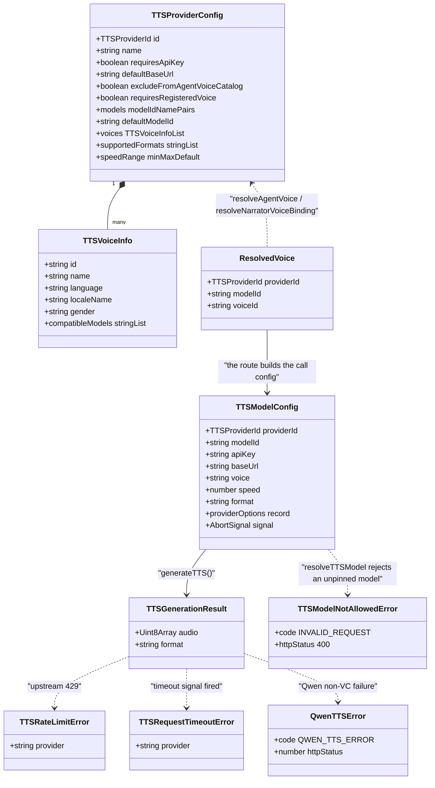
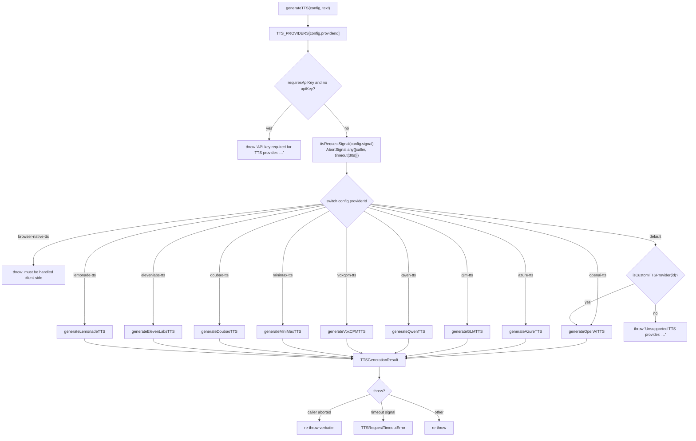
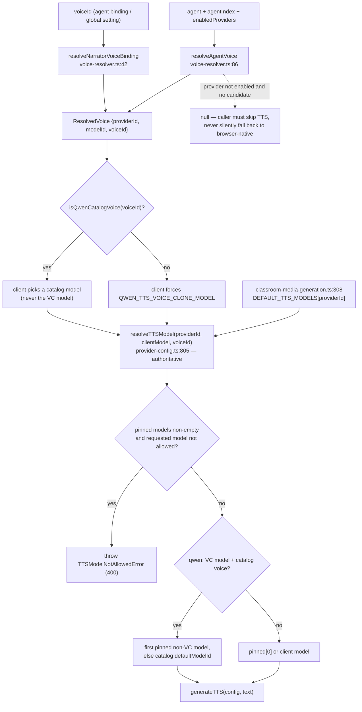

# TTS Adapters

One function — `generateTTS(config, text)` — is the only door to speech
synthesis in OpenMAIC. This file covers its contract, the ten built-in providers
behind it and their wire formats, how a voice choice constrains the model
(including the classroom pins), what caching exists (almost none, deliberately),
and the audio format/duration contract that the rest of the system depends on.

**Sources:** `lib/audio/types.ts`, `lib/audio/constants.ts`,
`lib/audio/tts-providers.ts`, `lib/audio/tts-utils.ts`,
`lib/audio/audio-duration.ts`, `lib/audio/wav-validate.ts`,
`lib/audio/voice-resolver.ts`, `lib/audio/voice-catalog.ts`,
`lib/server/provider-config.ts`,
`lib/server/classroom-media-generation.ts`, `app/api/generate/tts/route.ts`;
[`../appendix/research/media-audio-video/02a-interfaces-tts-asr.md`](../appendix/research/media-audio-video/02a-interfaces-tts-asr.md),
[`../appendix/research/media-audio-video/01a-modules-audio-media.md`](../appendix/research/media-audio-video/01a-modules-audio-media.md).

## 1. The adapter contract

Three types carry everything. `TTSProviderConfig` (`lib/audio/types.ts:113`) is
static registry metadata; `TTSModelConfig` (`:151`) is one call; and
`TTSGenerationResult` (`lib/audio/tts-providers.ts:111`) is
`{ audio: Uint8Array; format: string }` — bytes plus a format label, nothing
else. There is no streaming variant and no partial result.

Provider ids are an *open* union: `TTSProviderId = BuiltInTTSProviderId |
` `` `custom-tts-${string}` `` (`lib/audio/types.ts:94`). An id matching
`custom-tts-*` falls through the dispatch switch to the OpenAI-compatible
implementation (`tts-providers.ts:252`), which is how a self-hosted
OpenAI-shaped endpoint is added without touching the registry.



Two policy flags change behaviour elsewhere: `excludeFromAgentVoiceCatalog`
(`types.ts:127`) drops a provider from the agent-facing voice catalogue —
`qwen-tts` sets it (`constants.ts:351`) — and `requiresRegisteredVoice`
(`types.ts:134`) marks a provider whose only synthesizable voices are its
registered ones. Its one consumer is `buildVoiceCatalog`
(`lib/audio/voice-catalog.ts:120`, reasoning at `:94-98`): the flag keeps a
clone-kind registered voice in the catalogue even when the deployment cannot
synthesize clones (`supportsClone` false).

## 2. Dispatch, bounding, cancellation

`generateTTS` (`tts-providers.ts:207`) does exactly four things before the
switch: look up the registry entry, reject a missing key when
`requiresApiKey`, build the combined signal, and dispatch.

```ts
// lib/audio/tts-providers.ts:176
function ttsRequestSignal(callerSignal?: AbortSignal): AbortSignal {
  const timeout = AbortSignal.timeout(ttsRequestTimeoutMs());
  return callerSignal ? AbortSignal.any([callerSignal, timeout]) : timeout;
}
```

`DEFAULT_TTS_REQUEST_TIMEOUT_MS = 30_000` (`:152`), overridable by
`TTS_REQUEST_TIMEOUT_MS`; a non-finite or non-positive value silently falls back
to the default (`:154-158`). The catch block (`:257-268`) then discriminates
three outcomes, and the order matters:

1. `config.signal?.aborted` → re-throw the original error verbatim, so the
   enclosing run treats it as an interruption, not a provider failure.
2. `isTimeoutSignal(signal)` — checks `signal.reason instanceof DOMException &&
   reason.name === 'TimeoutError'` (`:182`) → `TTSRequestTimeoutError`.
3. Otherwise re-throw.

That distinction is what lets a session cancel abort an in-flight synthesis in
seconds rather than wedge for the full timeout.



## 3. The ten providers and their wire formats

All nine server-side implementations live in the same file. `browser-native-tts`
has no server implementation at all — it throws (`:246`) and the
`PlaybackEngine` handles it with `SpeechSynthesisUtterance`
(see [`./02-audio-pipeline.md`](./02-audio-pipeline.md)).

| Provider | Fn | Endpoint / payload shape | Returned `format` |
| --- | --- | --- | --- |
| OpenAI | `:274` | `POST {base}/audio/speech`, JSON, explicit UTF-8 | sniffed from `content-type` via `getAudioResponseFormat` (`:438`) |
| Lemonade | `:315` | `POST {base}/audio/speech` (OpenAI-shaped), `response_format` defaults `wav` | sniffed |
| VoxCPM2 | `:362` | three self-hosted backends: vLLM-Omni `/v1/audio/speech` (`:473`), Python API `/tts/upload` multipart (`:549`), nano-vLLM `/generate` (`:590`) | `getVoxCPMAudioFormat(mime, filename)`, default `wav` |
| Azure Speech | `:647` | `POST {base}/cognitiveservices/v1` with SSML; rate is `((speed-1)*100)%`; `X-Microsoft-OutputFormat: audio-16khz-128kbitrate-mono-mp3` | hardcoded `mp3` |
| GLM (BigModel) | `:690` | `POST {base}/audio/speech`, `response_format: 'wav'` | hardcoded `wav` |
| Qwen (DashScope) | `:739` | clone voices → `synthesizeQwenVoiceClone`; catalog voices → `POST {base}/services/aigc/multimodal-generation/generation`, then download the returned URL | `wav` |
| MiniMax | `:838` | `POST {base}/v1/t2a_v2`, `output_format: 'hex'`, 32 kHz / 128 kbps mono | `extra_info.audio_format`, else `mp3` |
| ElevenLabs | `:904` | `POST {base}/text-to-speech/{voice}?output_format=…`; **speed clamped to `[0.7, 1.2]`** (`:911`) | the requested format |
| Doubao / Seed-TTS 2.0 | `:1002` | `POST {base}/unidirectional`; auth is **shape-detected**: `appId:accessKey` → `X-Api-App-Id`/`X-Api-Access-Key`, a single `ark-…` → `X-Api-Key` (`:1030`) | hardcoded `mp3` |

Two provider quirks are load-bearing:

- **Doubao returns concatenated JSON objects with no delimiter.** It is split by
  `splitConcatenatedJsonObjects` (`lib/audio/json-stream.ts`) rather than a naive
  brace counter, because a `}` inside an error `message` would corrupt object
  boundaries (`tts-providers.ts:1060-1065`). Codes `45000000` / `45000292` map to
  `TTSRateLimitError` (`:1078`); `20000000` terminates the stream.
- **`getAudioResponseFormat` defaults to `mp3` on an unrecognised or absent
  `content-type`** (`:438-446`) and can also return `flac`, `ogg` or `webm` —
  three formats `measureAudioDuration` cannot parse (§6).

`speedRange` is declared per provider but only ElevenLabs clamps server-side.
Azure, Qwen, Doubao and MiniMax convert `speed` into provider-specific rate units
with no range check. `qwen-tts` declares **no** `speedRange` at all
(`constants.ts:341-708`); the route independently forces `speed: 1` for clone
voices (`app/api/generate/tts/route.ts:129`).

## 4. Voice and model pinning

The invariant is "**the model follows the voice**", and it is enforced twice —
once optimistically on the client, once authoritatively on the server.

| Symbol | Location | Behaviour |
| --- | --- | --- |
| `DEFAULT_QWEN_TTS_VOICE_CLONE_MODEL` | `constants.ts:82` | `'qwen3-tts-vc-2026-01-22'` |
| `isQwenVoiceCloneModel` | `constants.ts:86` | `/-tts-vc(?:-\|$)/iu` on the model id, or an exact match with the operator-configured VC model |
| `isQwenCatalogVoice` | `constants.ts:94` | voice id present in `TTS_PROVIDERS['qwen-tts'].voices` |
| `isQwenCloneVoice` | `constants.ts:99` | any Qwen voice id *not* in the catalog — local storage is deliberately not an authority |
| `resolveTTSModelForVoice` | `constants.ts:107` | client half: a clone voice forces the VC model; a catalog voice never gets one |
| `getManuallySelectableTTSModels` | `constants.ts:1404` | filters the VC model out of manual pickers — it is only ever *derived* |
| `isKnownTTSProviderId` | `constants.ts:1379` | two branches: `Object.hasOwn(TTS_PROVIDERS, id)` — deliberately not `in`, so prototype keys (`toString`) cannot pass — **or** `isCustomTTSProvider(id)`, which is a bare `id.startsWith('custom-tts-')` prefix test (`types.ts:216-218`) against no registry. Only the first branch is an allowlist; any `custom-tts-*` string passes the second whether or not such a provider was ever configured. `getTTSProvider` then returns `undefined` for it (`:1394`), so the id resolves to "no voice" rather than to a provider |

`resolveTTSModel(providerId, clientModel?, voiceId?)`
(`lib/server/provider-config.ts:805`) is the authority. For a non-Qwen provider
it is two lines: a non-empty `${PREFIX}_MODELS` pin list wins over the client
model, otherwise the client model passes through (`:845-846`). For `qwen-tts` it
additionally:

- normalises any VC *sentinel* model id to the resolved VC model (`:815-816`);
- throws `TTSModelNotAllowedError` (400) when a pin list exists and the requested
  model is neither pinned nor the VC model (`:819-825`);
- returns the VC model outright for a non-catalog voice (`:828`);
- **self-heals a persisted "VC model + catalog voice" wedge** by preferring the
  first pinned non-VC model, else the catalog `defaultModelId` (`:833-837`).

### Classroom TTS pins

Headless classroom generation used to bypass the pin list by handing
`DEFAULT_TTS_MODELS[providerId]` straight to `generateTTS`. Commit `a5c71845`
("fix(tts): honor classroom TTS model pins") routed it through the same helper:
`lib/server/classroom-media-generation.ts:308-310` now calls
`resolveTTSModel(providerId, DEFAULT_TTS_MODELS[providerId], voice)` inside the
`generateTTS` call at `:304`. So a deployment that pins `TTS_QWEN_MODELS` now
constrains classroom narration exactly as it constrains an interactive request.



## 5. Caching — what exists and what does not

There is **no TTS response cache**. `POST /api/generate/tts` synthesizes on every
call; a repo-wide search for a cache key or memo in `lib/audio/**` and
`lib/hooks/use-scene-generator.ts` finds none. What looks like caching is
*reuse of a stored clip*:

| Layer | Behaviour | Location |
| --- | --- | --- |
| Asset pool | Content-addressed durable byte store (`BrowserAssetStore` over IndexedDB `maic-asset-pool`, or a configured server-backed store) | `lib/media/asset-pool.ts:73-83` |
| Dexie `audioFiles` | Legacy/compat row keyed by `audioId`, carrying `blob`, `duration`, `format`, `text`, `voice` | `lib/utils/database.ts` |
| Read path | `resolveAudioBlob(audioId)` — pool first, Dexie fallback; a **zero-byte row counts as "no bytes"** so the reference stays retryable rather than playing silence | `lib/media/resolve-audio-bytes.ts:15` |
| Session-scoped negative cache | Only for *outbound media fetches*, not TTS: permanent 4xx verdicts, exponential transient backoff, per-URL request dedup | `lib/media/proxy-media-cache.ts` |

Text length, not caching, is the only request-shaping step:
`splitLongSpeechActions(actions, providerId)` (`lib/audio/tts-utils.ts:82`) is a
no-op unless the provider appears in `TTS_MAX_TEXT_LENGTH` — today exactly
`{ 'glm-tts': 1024 }` (`:12`). When it fires, one speech action becomes
`${id}_tts_1..N` sub-actions, **each with its own audio file**, explicitly not a
byte concatenation (`:77-80`).

## 6. The audio format and duration contract

`measureAudioDuration(bytes, format?)` (`lib/audio/audio-duration.ts:210`) is the
whole contract in one dependency-free function. Its ordering is the interesting
part: **sniff the magic bytes first** (`sniffFormat`, `:190`) and trust the
`format` hint only when the bytes are unrecognisable — because
`getAudioResponseFormat` defaults to `mp3` on a missing header and would
otherwise push WAV bytes through the MP3 frame-sync parser.

| Format | Parse strategy | Anchor |
| --- | --- | --- |
| WAV | walk the RIFF chunk list for the `fmt ` byte-rate and the `data` size; a declared size of `0` or `0xFFFFFFFF` falls back to remaining bytes | `:55`, `:70-74` |
| MP3 | skip ID3v2, parse the first frame header, prefer a Xing/Info frame count, then VBRI, else a CBR estimate with a trailing ID3v1 `TAG` excluded | `:105`, `:161`, `:174`, `:183` |
| anything else | returns `null`; the caller persists the clip with `duration` undefined | `:210` |

The header states WAV and MP3 are "the two formats OpenMAIC's TTS providers
actually emit" (`:12-14`). Combined with §3: a custom OpenAI-compatible provider
answering `audio/flac`, `audio/ogg` or `audio/webm` is stored with
`duration: undefined` and the exporter then falls back to
`estimateSpeechDurationMs`. That is a degradation, not a failure.

Reference-audio validation for Qwen voice enrolment is a separate, much stricter
gate: `validateReferenceAudio` (`lib/audio/wav-validate.ts:26`) requires PCM
format 1, mono, exactly 24 000 Hz, 16-bit, consistent `byteRate`/`blockAlign`,
no trailing bytes, and a 1–60 s duration — anything else throws
`InvalidReferenceAudioError` (`:12`, code `QWEN_VC_REFERENCE_AUDIO_INVALID`).

## 7. The route's gate chain

`app/api/generate/tts/route.ts` (`maxDuration = 30`, `:32`) applies gates in a
fixed order; the order encodes policy, not convenience.

| # | Gate | Failure |
| --- | --- | --- |
| 1 | `text`, `audioId`, `ttsProviderId`, `ttsVoice` present (`:56`) | 400 `MISSING_REQUIRED_FIELD` |
| 2 | `browser-native-tts` rejected (`:65`) | 400 `INVALID_REQUEST` |
| 3 | `isServerTTSProviderDisabled` (`:71`) — **operator disable beats any client key** | 403 `PROVIDER_DISABLED` |
| 4 | VoxCPM auto-voice with neither `voicePrompt` nor `registeredVoiceId` (`:81`) | 400 `VOXCPM_AUTO_VOICE_REQUIRES_CONTEXT` |
| 5 | managed providers ignore client `apiKey`/`baseUrl`; an unmanaged client base URL is SSRF-validated (`:97`) | 403 `INVALID_URL` |
| 6 | keyed provider with no resolvable key (`:113`) | 400 `MISSING_API_KEY` |
| 7 | `resolveTTSModel(...)` (`:124`) then `generateTTS(...)` (`:144`) | 400 `INVALID_REQUEST` on a pin violation |
| 8 | `recordGenerationUsage({kind:'tts', unit:'character', quantity: text.length})` fire-and-forget (`:146`) | — |
| 9 | respond `{ audioId, base64, format }` (`:157`) | — |

A Qwen clone voice additionally forces `speed: 1` (`:129`) and sets
`providerOptions.qwenVoiceClone = true` (`:134`).

Error mapping on the way out: `TTSRateLimitError` → 429 `RATE_LIMITED` (`:167`);
`QwenVoiceCloneError` → its own `httpStatus` (`:170`); `QwenTTSError` → the
provider status (`:173`); `TTSModelNotAllowedError` → 400 (`:176`); everything
else, **including `TTSRequestTimeoutError`**, → 500 `GENERATION_FAILED` (`:179`).

## Open questions

- Nothing enforces `TTSProviderConfig.speedRange` outside ElevenLabs. Whether
  `components/settings/tts-settings.tsx` (1672 lines, not read) clamps the UI is
  unverified; a scripted or agent-driven call certainly is not clamped.
- No built-in `TTS_PROVIDERS` entry sets `requiresRegisteredVoice`, so its one
  consumer (`voice-catalog.ts:120`, fault-injected at
  `tests/audio/voice-catalog.test.ts:98-102`) only fires for a runtime provider.
- A 429 is surfaced to the client rather than retried. `TTSRateLimitError`'s own
  doc comment (`tts-providers.ts:117-121`) says the class "enables future
  retry/backoff logic"; no backoff exists yet.
- `TTSRequestTimeoutError` collapses to a generic 500, so a caller cannot
  distinguish a slow provider from a broken one without reading the message.
