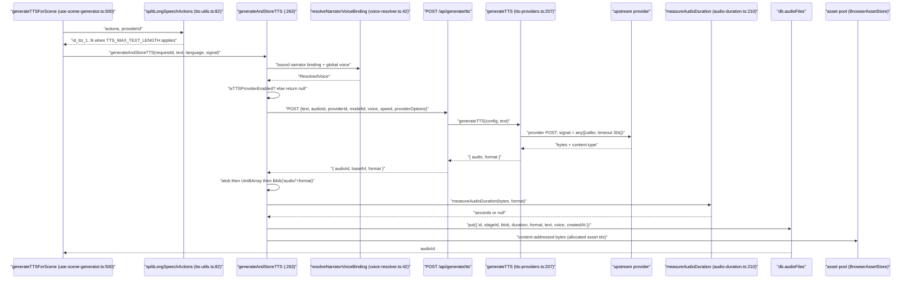
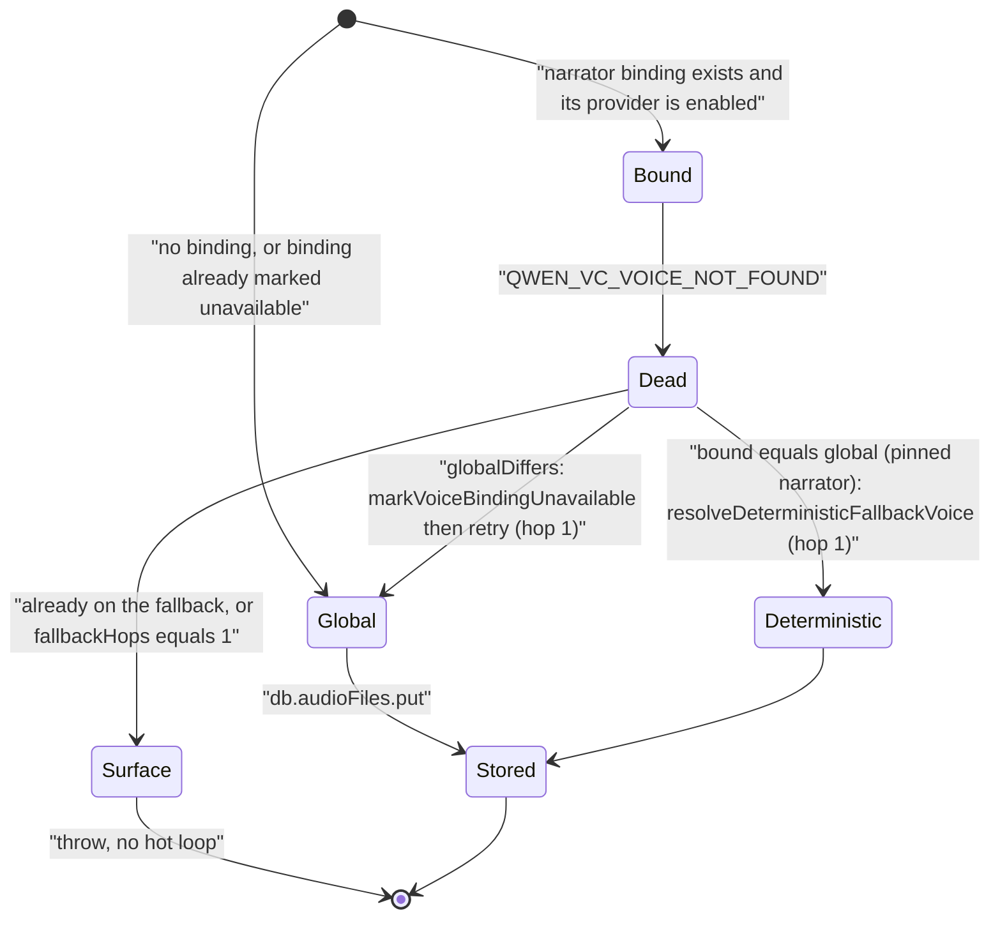
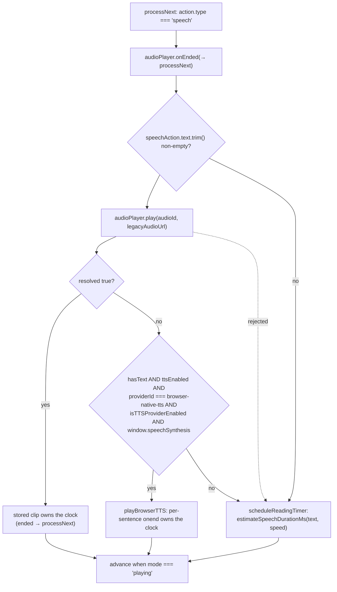
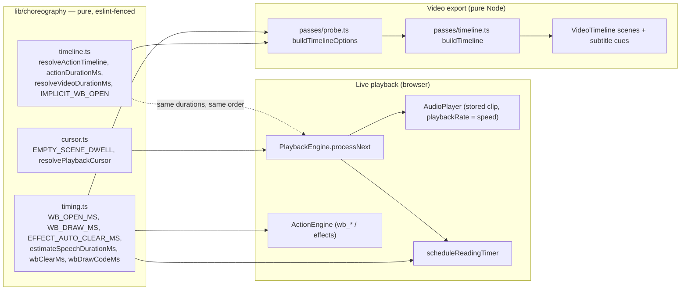

# Audio Pipeline

How a narration string becomes durable bytes, how those bytes reach a learner's
speaker, and how the *same* clip's length is turned into a wall-clock dwell that
live playback and the video exporter agree on to the millisecond.

**Sources:** `lib/hooks/use-scene-generator.ts`, `lib/audio/audio-duration.ts`,
`lib/audio/tts-utils.ts`, `lib/media/resolve-audio-bytes.ts`,
`lib/media/asset-pool.ts`, `lib/utils/audio-player.ts`, `lib/playback/engine.ts`,
`lib/choreography/timing.ts`, `lib/choreography/timeline.ts`,
`lib/video-export/deps.ts`, `lib/video-export-app/timeline-deps.ts`;
[`../appendix/research/media-audio-video/03a-flows-audio-media.md`](docs/appendix/research/media-audio-video/03a-flows-audio-media.md),
[`../appendix/research/media-audio-video/02d-interfaces-choreography-ir.md`](docs/appendix/research/media-audio-video/02d-interfaces-choreography-ir.md).

## 1. The four stages

| Stage | Owner | Output |
| --- | --- | --- |
| Synthesis | `generateAndStoreTTS` ([`lib/hooks/use-scene-generator.ts:263`](lib/hooks/use-scene-generator.ts#L263)) → `POST /api/generate/tts` → `generateTTS` | base64 audio + `format` |
| Measurement | `measureAudioDuration(bytes, format)` ([`lib/audio/audio-duration.ts:210`](lib/audio/audio-duration.ts#L210)) | `duration` in seconds, or `null` |
| Storage | `db.audioFiles.put({...})` ([`use-scene-generator.ts:474`](lib/hooks/use-scene-generator.ts#L474)) plus the content-addressed asset pool | an `audioId` a `SpeechAction` can reference |
| Delivery + playback | `resolveAudioBlob` ([`lib/media/resolve-audio-bytes.ts:15`](lib/media/resolve-audio-bytes.ts#L15)) → `AudioPlayer.play` ([`lib/utils/audio-player.ts:99`](lib/utils/audio-player.ts#L99)) | an `HTMLAudioElement` and an `ended` event |

The measurement step is not an optimisation — it is the reason the export
compiler's whole dependency-injection surface can be **synchronous**
(`lib/video-export/deps.ts` header). `TimingProbe.audioDurationMs(action)`
returns `number | null` with no promise, because the duration was already
computed and persisted at synthesis time.



The decode at [`use-scene-generator.ts:463-468`](lib/hooks/use-scene-generator.ts#L463-L468) is a hand-rolled
`atob` → `charCodeAt` loop, then `new Blob([bytes], { type: audio/${format} })`
(`:468`). `duration` is `measureAudioDuration(...) ?? undefined` (`:472`) — a
`null` measurement stores the clip without a duration rather than rejecting it.

## 2. Narrator voice fallback

`generateAndStoreTTS` bounds its own retry: `MAX_NARRATOR_VOICE_FALLBACK_HOPS = 1`
([`use-scene-generator.ts:260`](lib/hooks/use-scene-generator.ts#L260)), i.e. at most two `/api/generate/tts` attempts per
clip. The trigger is a `QWEN_VC_VOICE_NOT_FOUND` error code on the *bound* voice.



`generateTTSForScene` (`:500`) counts failures and never throws them upward — a
scene with three failed clips still renders, with those speech actions falling
back to the estimated reading timer.

## 3. Delivery: pool-first, Dexie-second, legacy URL last

`AudioPlayer.play(audioId, legacyUrl?)` ([`lib/utils/audio-player.ts:99`](lib/utils/audio-player.ts#L99)) is the
only playback entry point, and its resolution order is deliberate:

1. `resolveAudioBlob(audioId)` — dynamically imported (`:23`) so the module stays
   importable without the media graph. Pool first, Dexie second; a **zero-byte
   row counts as no bytes** so the reference stays retryable rather than playing
   silence.
2. If no bytes and a legacy `audioUrl` exists: `fetch(legacyUrl)` bounded by
   `LEGACY_URL_FETCH_TIMEOUT_MS = 15_000` (`:17`). A zero-byte response is *not*
   accepted as narration (`:117`).
3. If the fetch fails (typically a cross-origin URL with no CORS headers), hand
   the URL straight to the media element — `directUrl` (`:131`) — because a media
   element is not CORS-bound.
4. Neither → return `false`. The engine then decides between browser TTS and the
   reading timer.

Two correctness details worth preserving if you touch this class:

- **`requestToken` monotonic supersession** (`:100`, checked at `:105`, `:124`,
  `:142`, `:173`). Every `play`/`pause`/`stop` bumps it; a resolution that
  completes after supersession returns `false` instead of starting audio.
- **Object-URL revocation is idempotent and covers all four exits**: natural
  `ended` (`:160`), a rejected `play()` (`:170`), supersession (`:174`), and
  `stop`/replacement via `stopAudioElement` (`:77`). `releaseBlobUrl` (`:63`)
  only clears `this.blobUrl` when it still points at the URL being revoked.

`stop()` deliberately does **not** clear `onEndedCallback` (`:205-207`) because
`play()` calls `stop()` internally — clearing would break the callback chain.
Stale callbacks are harmless because the engine's generation check gates
`processNext`.

## 4. Playback: which mechanism owns the clock

There is no single clock. For a `speech` action, `PlaybackEngine.processNext`
([`lib/playback/engine.ts:583-656`](lib/playback/engine.ts#L583-L656)) installs *one* of three advance mechanisms:

| Mechanism | Fires | Anchor |
| --- | --- | --- |
| Pre-generated audio | `audioPlayer.onEnded(...)` → `processNext` when `mode === 'playing'` | [`engine.ts:589-595`](lib/playback/engine.ts#L589-L595) |
| Browser-native TTS | per-sentence `utterance.onend` | [`engine.ts:644`](lib/playback/engine.ts#L644) → `playBrowserTTS` |
| Reading timer | `setTimeout(estimateSpeechDurationMs(text, {speed}))` | [`engine.ts:601-614`](lib/playback/engine.ts#L601-L614) |

The selection is *result-driven*, not configuration-driven: `audioPlayer.play()`
resolves `false`, and only then does the engine check whether browser TTS is both
the selected provider **and** actually enabled — an opt-in gate
([`engine.ts:632-643`](lib/playback/engine.ts#L632-L643)). Anything else schedules the reading timer. A
`play()` rejection also lands on the reading timer (`:650-654`).

A speech action with empty text (`hasText === false`, `:621`) skips synthesis
entirely and goes straight to the reading timer, because speaking an empty
`SpeechSynthesisUtterance` does not reliably fire `onend` in Chromium and would
hang playback on that slide (`:616-620`).



Cancellation across all three is one mechanism: a monotonic
`playbackGeneration` counter, checked with `isCurrentGeneration(generation)` at
every callback boundary ([`engine.ts:590`](lib/playback/engine.ts#L590), `:602`, `:608`, `:628`, `:651`). Pause
stashes the remaining reading time (`speechTimerStart` / `speechTimerRemaining`,
`:605-606`) and, for browser TTS, saves the remaining chunks and calls
`speechSynthesis.cancel()` because `speechSynthesis.pause()` is broken on Firefox
(`:244-247`).

## 5. Timing alignment with the choreography clock

`lib/choreography/` is the shared spec. It is imported by *both* the live
`PlaybackEngine` and the pure export compiler, and it is machine-fenced (see
[`./09-execution-constraints.md`](docs/09-media-and-export/09-execution-constraints.md)) so it cannot
acquire a React or DOM dependency and drift.

Three pieces matter here.

**(a) The no-audio estimate is one function, used by both sides.**
`estimateSpeechDurationMs` ([`lib/choreography/timing.ts:113`](lib/choreography/timing.ts#L113)) was moved verbatim
out of the engine's `scheduleReadingTimer`. Its constants:
`CJK_REGEX` over CJK Unified Ideographs + Ext-A + Hiragana + Katakana + Hangul
Syllables (`:83`), `CJK_RATIO_THRESHOLD = 0.3` (`:86`), `MIN_READING_MS = 2000`
(`:89`), `CJK_MS_PER_CHAR = 150` (`:92`), `NON_CJK_MS_PER_WORD = 240` ≈ 250 WPM
(`:95`). The result is floored at 2000 ms then **divided by playback speed**
(`:120`).

**(b) A stored clip's dwell is `duration / speed`, not `duration`.**
`actionDurationMs` ([`lib/choreography/timeline.ts:184-195`](lib/choreography/timeline.ts#L184-L195)):

```ts
const audio = opts.getAudioDurationMs?.(action);
if (audio != null) return audio / speed;
return estimateSpeechDurationMs(action.text, { speed });
```

The comment at `:188-191` states why: the live path plays the clip at
`AudioPlayer.setPlaybackRate(speed)`, so its wall-clock dwell *is* its length
divided by speed — the same scaling the no-audio estimate applies. "Keeping the
two paths in lockstep is what stops non-1× exports from drifting."

**(c) `resolveActionTimeline` turns the index domain into wall-clock.**
[`lib/choreography/timeline.ts:282`](lib/choreography/timeline.ts#L282) walks scenes and actions in order with a
single accumulator `clockMs`, and a per-segment split between *visual presence*
and *cursor advance*:

```ts
const durationMs = actionDurationMs(action, opts);
const blocking = !FIRE_AND_FORGET.has(action.type);
const advancesCursorMs = blocking ? durationMs : 0;
// … push segment with startMs: clockMs …
clockMs += advancesCursorMs;
```

Two behaviours it models that a naive sum would miss:

- **Implicit whiteboard open.** A `wb_*` mutation on a closed board emits a
  synthetic `IMPLICIT_WB_OPEN` beat first (`:319-322`), mirroring the engine's
  `ensureWhiteboardOpen` ([`lib/action/engine.ts:443`](lib/action/engine.ts#L443)). The open flag carries
  across scenes and is toggled by `wb_open` / `wb_close` (`:324-325`).
- **Empty scene dwell.** A scene with zero actions still yields one
  `EMPTY_SCENE_DWELL` beat (`:330-331`) so it appears on screen, matching
  `resolvePlaybackCursor`.



**The one deliberate divergence.** `resolveVideoDurationMs`
([`timeline.ts:161-178`](lib/choreography/timeline.ts#L161-L178)) defaults `onUnresolvedVideoDuration` to `'throw'`,
because "a missing duration would silently shift later actions early". The
exporter's probe pass overrides it to `'cap'` ([`lib/video-export/passes/probe.ts:41`](lib/video-export/passes/probe.ts#L41))
and additionally forces an *unavailable* clip to a 0 ms dwell, preferring a
recorded diagnostic over a failed compile. A resolved duration is always capped
at `MAX_VIDEO_WAIT_MS = 5 * 60 * 1000` (`timing.ts` / [`timeline.ts:163`](lib/choreography/timeline.ts#L163)).

## 6. The export side of the same bytes

`createVideoTimelineDeps` ([`lib/video-export-app/timeline-deps.ts:205`](lib/video-export-app/timeline-deps.ts#L205)) is the
impure implementation of the synchronous probes. For audio it:

1. Gates on `enumerateAssetManifest({ stage, scenes })` (`:233`) so an orphan
   Dexie row is never even read.
2. Loads `db.audioFiles.get(id)` for metadata and `resolveAudioBlob(id)` for
   bytes (`:258-302`); an unconverted document's legacy `audioUrl` is fetched only
   when the id produced no bytes.
3. **Re-probes duration off-document** with `<audio preload="metadata">`
   (`:311-316`) at `PROBE_CONCURRENCY = 6` and `PROBE_TIMEOUT_MS = 10_000`
   (`:112-114`). The probe is the source of truth; the stored `duration` is the
   fallback — because `AudioFileRecord.duration` was only recorded from #861
   onward, and older classrooms would otherwise fall back to text estimates that
   run short (`:164-176`).

So the stored `duration` keeps the *compiler* synchronous; the off-document probe
keeps *old documents* accurate. Both feed the same `TimingProbe.audioDurationMs`.

## Open questions

- A duration measured at synthesis time and a duration probed at export time can
  disagree (different container interpretation, different decoder). Nothing
  reconciles or reports the delta; the probe silently wins.
- `AudioPlayer.getDuration()` ([`lib/utils/audio-player.ts:247`](lib/utils/audio-player.ts#L247)) exists and no
  caller in the playback path was found using it to correct a drifting timer.
- Whether `EMPTY_SCENE_DWELL`'s value matches the engine's actual behaviour for a
  zero-action scene was not verified end to end; `lib/choreography/cursor.ts` was
  not read in full.
