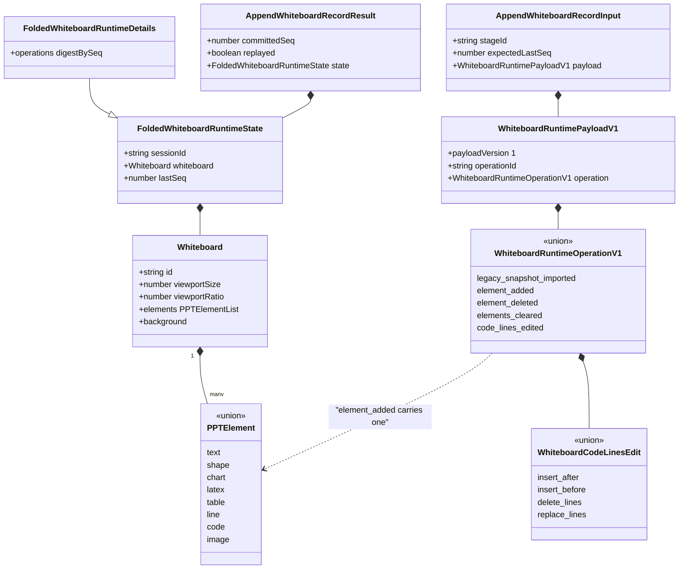
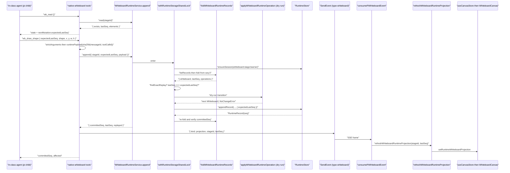
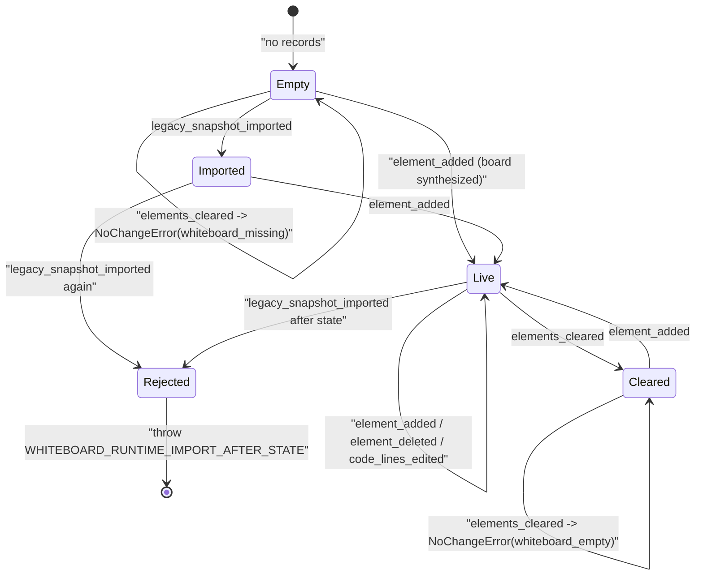

# Whiteboard

The whiteboard has no strokes. Every drawable is a `PPTElement` from
`@openmaic/dsl` — the same element model the slide canvas uses — and it is
reached by two independent write paths: an authored **document** path driven by
the Action DSL, and a durable **append-only operation log** driven by the in-class
agent. This file covers the primitive model, both emit paths, and the replay
runtime that projects the log onto the canvas.

**Sources:** `lib/whiteboard/runtime/{types,fold,store,browser-projection,legacy-import,validate}.ts`,
`lib/whiteboard/viewport.ts`, `lib/chat/pi/tools/native-whiteboard.ts`,
`lib/action/engine.ts`, `lib/api/stage-api-whiteboard.ts`,
`packages/@openmaic/dsl/src/action.ts`, `components/whiteboard/**`,
`components/chat/use-chat-sessions.ts`;
[`../appendix/research/media-audio-video/02c-interfaces-whiteboard.md`](../appendix/research/media-audio-video/02c-interfaces-whiteboard.md),
[`../appendix/research/media-audio-video/01b-modules-video-whiteboard.md`](../appendix/research/media-audio-video/01b-modules-video-whiteboard.md).

## 1. The primitive model

There are **no freehand or ink primitives.** `WhiteboardRuntimeOperationV1`
(`lib/whiteboard/runtime/types.ts:55`) has five members; only one introduces
geometry, and it carries a whole `PPTElement`:

| Operation | Payload | Anchor |
| --- | --- | --- |
| `legacy_snapshot_imported` | `{ source: { kind: 'stage.whiteboard', fingerprint: Sha256Digest }, whiteboard }` | `:10` |
| `element_added` | `{ element: PPTElement }` | `:19` |
| `element_deleted` | `{ elementId }` | `:24` |
| `elements_cleared` | `{}` (no payload) | `:29` |
| `code_lines_edited` | `{ elementId, edit }`; `edit` is `insert_after` / `insert_before` / `delete_lines` / `replace_lines` | `:33`, `:49` |

Because a board element *is* a slide element,
`components/whiteboard/whiteboard-canvas.tsx:15` renders it with the slide
renderer's `ScreenElement` — one element model, one renderer, no second
serialisation format.

The authored side has richer vocabulary but the same substrate: 12 of the DSL's 21
`Action` verbs are whiteboard verbs (`packages/@openmaic/dsl/src/action.ts:66-181`)
— `wb_open`, `wb_draw_{text,shape,chart,latex,table,line,code}`, `wb_edit_code`,
`wb_clear`, `wb_delete`, `wb_close` — and each `wb_draw_*` verb collapses to one
`element_added`-shaped mutation of a specific `PPTElement['type']`.

`viewportRatio` is **height / width**: canonical landscape 16:9 (1000 × 562.5) is
`0.5625`, never `16/9`. A value greater than 1 is an inverted ratio written by the
old stage API; it is reciprocated on read, clamped into `[0.4, 1]`, with a `9/16`
fallback (`lib/whiteboard/viewport.ts:22`).

## 2. Two write paths, and which one wins

| | Document path | Runtime op-log path |
| --- | --- | --- |
| Storage | `stage.whiteboard[]` inside the course document | `RuntimeRecord` stream under a per-learner session |
| Written by | `ActionEngine` executing authored `wb_*` Actions | `lib/chat/pi/tools/native-whiteboard.ts` (in-class agent tools) |
| Write API | `stageAPI.whiteboard.{create,get,update,addElement,delete}` (`lib/api/stage-api-whiteboard.ts:20`) | `WhiteboardRuntimeService.append` (`lib/whiteboard/runtime/store.ts:188`) |
| Concurrency | last write wins on the Zustand stage store | optimistic `expectedLastSeq`, `RuntimeAppendConflictError` on a stale value |
| Idempotency | none | canonical SHA-256 digest per `operationId` |
| Undo/history UI | snapshot history (`components/whiteboard/whiteboard-history.tsx`) | none — the log *is* the history |

The component decides at render time. `runtimeAuthoritative`
(`components/whiteboard/index.tsx:39-42`) is true when a projection exists, its
`stageId` matches the current stage, and its `lastSeq` is non-null. When true the
projected board is rendered (`:43`), the clear + snapshot-history controls are
hidden entirely (`:152`) and any open history panel is force-closed (`:62-64`);
otherwise the component falls back to `stage.whiteboard[0]`.

One duplicated literal: the component's clear animation is
`Math.min(380 + elementCount * 55, 1400)` (`index.tsx:81`) — byte-identical to
`wbClearMs` (`lib/choreography/timing.ts:72`) but **not** an import of it. The
exporter reads the choreography version; the live overlay reads its own copy.

## 3. How an agent emits a drawing command

### 3.1 The authored path (generation → playback)

Scene generation writes `wb_draw_*` Actions into the scene's action script.
`ActionEngine.execute` dispatches them (`lib/action/engine.ts:247-269`) and each
handler translates the verb into a `PPTElement` and hands it to
`this.stageAPI.whiteboard.addElement(element, wb.data.id)` — e.g.
`executeWbDrawText` builds `{ type: 'text', content, left: action.x,
top: action.y, width: action.width ?? 400, height: action.height ?? 100,
rotate: 0, defaultFontName: 'Microsoft YaHei',
defaultColor: action.color ?? '#333333' }` (`:485-500`).

Three behaviours in this path are load-bearing for timing:

- `ensureWhiteboardOpen` (`:443`) auto-opens the board before the first mutation
  and pays `WB_OPEN_MS`; `resolveActionTimeline` models the identical beat with
  `IMPLICIT_WB_OPEN` (see [`./02-audio-pipeline.md`](./02-audio-pipeline.md) §5).
- Every handler awaits its animation delay (`WB_DRAW_MS` etc.) **unless**
  `options.silent` is set (`:502-505`) — which is what seek/`jumpToAction` uses to
  replay whiteboard history instantly.
- `executeWbDrawText` sniffs its own content: a non-null
  `getLikelyLatexMath(htmlContent)` reroutes to `executeWbDrawLatex` (`:465-475`),
  and empty content is a no-op with no delay (`:463`).

### 3.2 The durable path (in-class agent)

`buildNativeWhiteboardTools(opts)` (`lib/chat/pi/tools/native-whiteboard.ts:662`)
registers **up to 13** tools: `wb_read` (`:669`) plus the 12 in
`NATIVE_WHITEBOARD_ACTION_NAMES` (`:335-348`), which excludes `wb_read`.
`wb_open` (`:741`) / `wb_close` (`:1111`) are visibility-only `effectTool`s; the
other ten are `NATIVE_WHITEBOARD_MUTATION_ACTION_SET` (`:350-352`) and go through
the log. Only `wb_read` is unconditional — every other tool is gated per name on
`opts.agent.allowedActions` (`:743`-`:1062`, the two effect tools also on any
`hasMutation`, `:665`), and the set is `[]` for an agent with no whiteboard
action (`:664`).

The protocol the tool descriptions enforce is read-then-mutate. `wb_read` (`:669`)
returns `{ exists, lastSeq, viewportSize, viewportRatio, elements }`
(`durableReadResult`, `:427`) plus a best-effort browser `visibility` and a
`nextMutation.expectedLastSeq` field (`:691`). Every mutation tool then takes
`expectedLastSeq: number | null` as its first parameter, with the schema
description telling the model to copy it *exactly* — "any JSON number, including
0, must remain a number and must not become null" (`:45`, `:503`). Arguments are
validated by `strictArguments` (`:362`), which rejects a non-plain prototype, any
key outside the declared set, and any TypeBox `Value.Check` failure — a
hand-rolled closed-schema gate, not just JSON-schema advertising.

Idempotency is derived, not random. `logicalInvocationDigest` (`:394`) is
`sha256(messageId + '\0' + toolCallId)` and the payload's id is
`` `native-wb-operation:${invocationDigest}` `` (`:573`) — so a re-executed tool
call (the durable runtime makes tool execution at-least-once) produces the *same*
`operationId` and the same canonical digest, and `findExactReplay`
(`store.ts:158`) returns `{ replayed: true }` instead of double-drawing.

`settleWhiteboardMutation` (`:451`) then maps every failure to a stable machine
code in the tool result rather than throwing at the model:

| Thrown | Reported code | Model's next move |
| --- | --- | --- |
| `RuntimeAppendConflictError` | `STALE_STATE` (+ `actualLastSeq`) | re-read, copy the fresh `expectedLastSeq` |
| `WhiteboardRuntimeSessionAmbiguousError` | `WHITEBOARD_RUNTIME_SESSION_AMBIGUOUS` | stop mutating |
| `WhiteboardRuntimeSessionInvariantError` | `WHITEBOARD_RUNTIME_SESSION_INVARIANT` | stop mutating |
| `WhiteboardRuntimeElementNotFoundError` | `WHITEBOARD_ELEMENT_NOT_FOUND` | re-read element ids |
| `WhiteboardRuntimeElementTypeMismatchError` | `WHITEBOARD_ELEMENT_TYPE_MISMATCH` | target a `code` element |
| `WhiteboardRuntimeCodeLineNotFoundError` / `…IdConflictError` | `WHITEBOARD_CODE_LINE_NOT_FOUND` / `…_ID_CONFLICT` | re-read line ids |
| `WhiteboardRuntimeNoChangeError` | *success* `{ noOp: true }` | continue |
| anything else | `reconcileOperation` first; if not an exact match → `WHITEBOARD_MUTATION_UNCERTAIN` | `wb_read` before any further mutation |

`reconcileOperation` (`store.ts:47` interface, `:283` impl, `:158` helper) is a read-only
recovery seam: it never appends and never retries, it only asks "did my operation
land?" — turning an ambiguous network failure into a determinate answer.

Note the ordering at `:474-488`: the projection event is emitted **after** the
durable commit and is explicitly best-effort — its `catch` block says
"Projection is best-effort and cannot change durable settlement" (`:480`). A
failed projection leaves the log correct and the screen stale, never the reverse.
The `wb_read` tool also issues a `visibility_query` event, answered by the browser
over `POST /api/chat/pi/whiteboard-visibility` with the *current*
`useCanvasStore.whiteboardOpen` (`components/chat/use-chat-sessions.ts:464-487`) —
advisory only, since "closed visibility never blocks durable drawing"
(`native-whiteboard.ts:672`).

## 4. The fold — replay semantics

`applyWhiteboardRuntimeOperation(sessionId, current, operation)`
(`lib/whiteboard/runtime/fold.ts:51`) is the single transition function, and it is
defensive in four specific ways:

- **`immutableClone` before use** (`:30`): `cloneCanonicalJson` then a recursive
  `Object.freeze`, so the fold cannot alias or mutate caller state.
- **Board synthesis on first element**: `element_added` against `current === null`
  creates `viewportSize: 1000`, `viewportRatio: 0.5625`, and an id that is a pure
  function of the session —
  `runtime-whiteboard:${sha256({namespace: 'openmaic.whiteboard-runtime-board.v1', sessionId})}`
  (`:41-49`, `:73-76`) — so a replay produces the same board id.
- **Duplicate element rejection**: `element_added` for an existing id throws
  `WHITEBOARD_RUNTIME_ELEMENT_ALREADY_EXISTS` (`:68-70`).
- **Canonicality re-check after a code edit**: the edited element must round-trip
  through `normalizeAndValidateWhiteboardElement` byte-identically, else
  `WHITEBOARD_RUNTIME_CODE_ELEMENT_NOT_CANONICAL` (`:162`). `replace_lines`
  anchors at the index of `edit.lineIds[0]` (`:154`).

`foldWhiteboardRuntimeRecords(sessionId, records)` (`:170`) validates the stream,
not just each operation: envelope validity, **rejection of any record carrying a
playback anchor** (`sceneId` / `actionIndex` / `subAnchor`, `:184`) — the
whiteboard log is learner-scoped, not scene-scoped — `record.seq === index`
(`:194`), `record.id === payload.operationId` (`:197`), and digest-based
deduplication where a repeated `operationId` with a *different* digest throws
`WHITEBOARD_RUNTIME_OPERATION_CONFLICT` (`:203`).

## 5. The service and its session identity

`createWhiteboardRuntimeService(deps)` (`lib/whiteboard/runtime/store.ts:170`)
exposes `read` / `append` / `reconcileOperation`. Everything runs inside
`withRuntimeStorageSharedLock` (`:174`). Session id is deterministic —
`whiteboard:${encodeURIComponent(stageId)}:${encodeURIComponent(learnerKey)}`
(`:57`) — and `selectSession` (`:86`) refuses more than one active session
(`WhiteboardRuntimeSessionAmbiguousError`) or any inactive session
(`WhiteboardRuntimeSessionInvariantError`) rather than guessing.

The append sequence is: fold → exact-replay check → `expectedLastSeq` check →
import guard → **dry-run the transition** → `appendRecord` → **re-fold and verify
the committed seq** (`WHITEBOARD_RUNTIME_POST_COMMIT_VERIFICATION_FAILED` on a
mismatch, `:272`). The dry run makes an empty-clear a rejection *before* any
record is written; the verification makes a storage bug loud, not divergent.

## 6. Projection and legacy import

`refreshWhiteboardRuntimeProjection(stageId, minimumLastSeq?)`
(`lib/whiteboard/runtime/browser-projection.ts:8`) reads the folded state into
`useCanvasStore`, guarded by a generation token plus three staleness checks — the
stage changed, this generation was superseded, or a projection with a strictly
*higher* `lastSeq` is already present (`:21-35`). It swallows every error and
returns `false` (`:42-44`), so a projection failure leaves the previous board on
screen rather than blanking the canvas. It has exactly two callers: the SSE
handler (`components/chat/use-chat-sessions.ts:501`) and the overlay's
mount/stage-change effect (`components/whiteboard/index.tsx:58`).

`lib/whiteboard/runtime/legacy-import.ts` migrates a document-path board into the
log, once, and only in a narrowly provenance-eligible deployment:
`isLegacyWhiteboardAutoImportEligible()` (`:43`) requires **all three** of
`NEXT_PUBLIC_PERSISTENCE !== '1'`, `!isDocumentStorageConfigured()` and
`!isRuntimeStorageConfigured()`. Its result type enumerates every refusal
explicitly (`:20-32`) — `runtime_authoritative`, `provenance_ineligible`,
`document_missing`, `legacy_missing`, `legacy_ambiguous`, `legacy_malformed`,
`runtime_won` — plus an `uncertain` status for `document_read_failed` /
`append_failed`.

## Open questions

- `getWhiteboardRuntimeService()` (`store.ts:314`) has exactly two in-repo
  callers, both on the read/import side (`browser-projection.ts:19`,
  `legacy-import.ts:134`). The agent tools receive a `service` through
  `NativeWhiteboardToolOptions` (`native-whiteboard.ts:442`); which construction
  site supplies it in production was not traced.
- `git ls-files 'tests/whiteboard/*'` returns nothing. Runtime-store coverage
  exists under `tests/lib/whiteboard/runtime-store.pg.test.ts` (named explicitly
  by `.github/workflows/storage-pg-contract.yml:67`), but the fold's own edge
  cases have no obvious dedicated suite.
- The clear-animation duration is duplicated between
  `components/whiteboard/index.tsx:81` and `wbClearMs`; nothing enforces parity.
