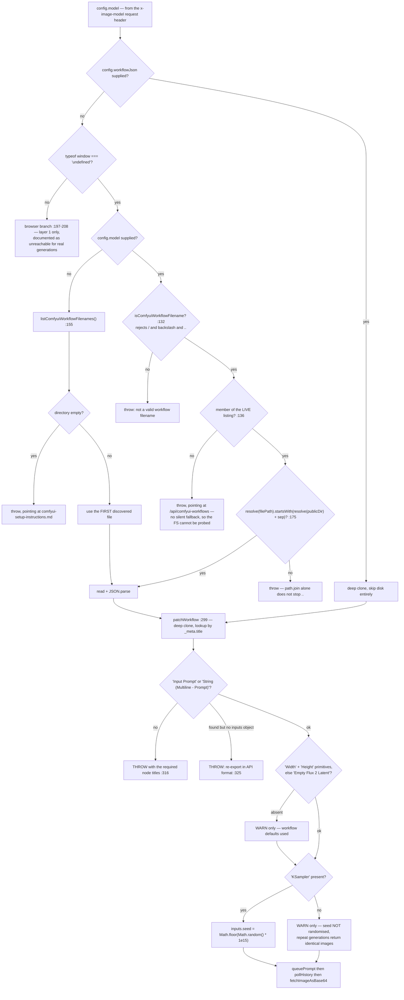
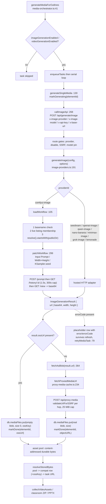

# Image and Video Generation

Eight image providers and six video providers behind two exhaustive `switch`
statements, one of which — ComfyUI — is not a hosted API at all but a
locally-discovered workflow JSON file that the adapter patches before queueing.
This file covers dispatch, ComfyUI workflow discovery and patching, and the
asset-storage path from a provider response to bytes an export can read.

**Sources:** `lib/media/types.ts`, `lib/media/image-providers.ts`,
`lib/media/video-providers.ts`, `lib/media/adapters/comfyui-image-adapter.ts`,
`lib/media/comfyui-workflows.ts`, `lib/media/media-orchestrator.ts`,
`lib/media/polled-task.ts`, `lib/media/proxy-media-cache.ts`,
`lib/media/asset-pool.ts`, `lib/media/resolve-stored-bytes.ts`,
`app/api/generate/image/route.ts`, `app/api/comfyui-workflows/route.ts`;
[`../appendix/research/media-audio-video/02b-interfaces-media.md`](docs/appendix/research/media-audio-video/02b-interfaces-media.md),
[`../appendix/research/media-audio-video/03a-flows-audio-media.md`](docs/appendix/research/media-audio-video/03a-flows-audio-media.md).

## 1. Registries and dispatch

| Kind | Ids | Registry | Dispatch |
| --- | --- | --- | --- |
| Image | `seedream`, `openai-image`, `qwen-image`, `nano-banana`, `minimax-image`, `grok-image`, `comfyui-image`, `lemonade` ([`lib/media/types.ts:73`](lib/media/types.ts#L73)) | `IMAGE_PROVIDERS` ([`image-providers.ts:33`](lib/media/image-providers.ts#L33)) | `generateImage` ([`:191`](lib/media/image-providers.ts#L191)) |
| Video | `seedance`, `kling`, `veo`, `minimax-video`, `grok-video`, `happyhorse` ([`types.ts:194`](lib/media/types.ts#L194)) | `VIDEO_PROVIDERS` ([`video-providers.ts:22`](lib/media/video-providers.ts#L22)) | `generateVideo` (same file) |

There are 14 adapter files under `lib/media/adapters/`. `testImageConnectivity`
([`image-providers.ts:163`](lib/media/image-providers.ts#L163)) mirrors the same switch so the settings UI's probe and
the real call cannot diverge on which providers exist.

`comfyui-image` deliberately declares `models: []` ([`image-providers.ts:144`](lib/media/image-providers.ts#L144)):
its selectable "models" are workflow **files** discovered at runtime, so a
hardcoded placeholder model id would resolve to a dead path.

Two dimension helpers live beside the registry rather than in each adapter:

- `aspectRatioToDimensions(ratio, maxWidth = 1024)` (`:217`) — splits `"16:9"`,
  falls back to 16:9 on a malformed ratio.
- `applyMinPixelFloor(width, height, minPixels)` (`:231`) — scales a pair *up* to
  a minimum pixel area preserving ratio, rounding both edges up to a multiple of
  8 (`Math.ceil((w * scale) / 8) * 8`, `:242-243`), the alignment several
  providers require. A no-op for a non-positive floor or degenerate dimensions.

Async video providers share one submit-then-poll harness rather than
hand-rolling loops: `runPolledTask({ submit, poll, intervalMs, maxAttempts,
label, formatTimeout })` ([`lib/media/polled-task.ts:31`](lib/media/polled-task.ts#L31)), whose `SubmitResult`
union lets a provider answer terminally on submit
(`{ status: 'done' | 'failed' }`) instead of forcing a fake task id (`:9`, `:18`).
The same harness drives the client-side MP4 render poller
(see [`./07-render-service.md`](docs/09-media-and-export/07-render-service.md)).

## 2. The route

`app/api/generate/image/route.ts` (132 lines) carries provider selection in
**headers**, not the body: `x-image-provider`, `x-image-model`, `x-api-key`,
`x-base-url` (`:10`, `:54`, `:68`). `maxDuration = 300` (`:42`) with an explicit
comment that ComfyUI workflows can take 3–5 minutes and a 60 s cap would let a
platform kill the request mid-generation (`:38-41`).

Gate order mirrors the TTS route: missing prompt → 400 (`:49`); no provider
resolvable → 400 `MISSING_PROVIDER` (`:57`); operator disable → 403
`PROVIDER_DISABLED` (`:62`); client base URL → `validateUrlForSSRF` → 403
`INVALID_URL` (`:71-73`); then `resolveImageModel(providerId, clientModel)`
(`:93`), `generateImage(...)` (`:111`), and fire-and-forget
`recordGenerationUsage` (`:113`). A provider content-policy rejection maps to
400 `CONTENT_SENSITIVE` (`:127`) rather than a generic 500.

## 3. ComfyUI: workflow discovery

`lib/media/comfyui-workflows.ts` is the single source of truth shared by the API
route and the adapter, so "a filename the UI offers is always a filename the
adapter will accept, and vice versa" (`:5-9`).

```ts
// :49 — doubles as the safety check for a client-supplied workflow id
export function isComfyuiWorkflowFilename(filename: string): boolean {
  if (filename.includes('/') || filename.includes('\\') || filename.includes('..')) return false;
  const lower = filename.toLowerCase();
  return lower.endsWith('.json') && (lower.startsWith('comfyui') || lower.includes('workflow'));
}
```

`listComfyuiWorkflows()` (`:72`) reads `process.cwd()/public`, filters by that
predicate *and* `statSync(...).isFile()`, and sorts by display name. `fs` and
`path` are **dynamically** imported inside a `typeof window === 'undefined'`
guard (`:77-81`). The 15-line comment above it (`:15-22`, `:64-71`) explains
this is not defensive style but a bundling requirement: a top-level
`import 'fs'` makes the bundler resolve `fs` for the browser build too and fail,
because this module is reachable from the client settings store via
`image-providers.ts`. The guard is what lets Turbopack dead-code-eliminate the
branch.

`filenameToDisplayName` (`:31`) strips the extension and a leading
`comfyui[-_]`, replaces separators with spaces, title-cases, and falls back to
`'Default Workflow'` if the result is empty.

`app/api/comfyui-workflows/route.ts` is one call to `listComfyuiWorkflows()`,
returning `{ workflows: [] }` on any error (`:19`) — an unreachable or
misconfigured `public/` yields an empty picker, not a 500.

## 4. ComfyUI: three-layer path defence

`loadWorkflow(config)` ([`lib/media/adapters/comfyui-image-adapter.ts:105`](lib/media/adapters/comfyui-image-adapter.ts#L105)) takes
the client-controlled `config.model` — which flows straight from the
`x-image-model` request header — and applies three independent checks before
reading a byte:

| Layer | Check | Anchor |
| --- | --- | --- |
| 1 | `isComfyuiWorkflowFilename(config.model)` — bare basename, no `/`, `\`, `..` | `:132` |
| 2 | membership in the **live** `listComfyuiWorkflowFilenames()` listing — no silent fallback, so the filesystem cannot be probed | `:136` |
| 3 | `path.resolve(filePath).startsWith(path.resolve(publicDir) + path.sep)` after the join, with a comment noting `path.join` alone does not stop `..` | `:174-175` |

When no model id is supplied the adapter uses the **first discovered** file
(`:155`), not a hardcoded name; an empty directory throws with a pointer to
[`comfyui-setup-instructions.md`](comfyui-setup-instructions.md). `config.workflowJson`, when present, short
circuits the disk read with a deep clone.

The browser branch (`:197-208`) keeps layer 1 but explicitly **not** layer 2, and
the comment states it "is currently unreachable for real generations".

## 5. ComfyUI: patching and polling

`patchWorkflow(workflow, options, maxW, maxH)` (`:299`) mutates a deep clone by
`_meta.title` lookup (`findNodeIdByTitle`, `:277`) — not by node id, because node
ids are export-order artefacts:

| Target | Preferred title | Fallback | Missing behaviour |
| --- | --- | --- | --- |
| Prompt | `Input Prompt` (`:311`) | `String (Multiline - Prompt)` (`:312`) | **throws** with the required titles (`:316`); a node with no `inputs` object throws telling the operator to re-export in API format (`:325`) |
| Size | `Width` + `Height` primitives (`:335-336`) | `Empty Flux 2 Latent` `inputs.width/height` (`:361`) | **warn only**, workflow defaults used |
| Seed | `KSampler` `inputs.seed = Math.floor(Math.random() * 1e15)` (`:387`) | — | **warn only** — repeated generations then return identical images |

Timeouts: `POLL_INTERVAL_MS = 1500` (`:56`), `GENERATION_TIMEOUT_MS = 300_000`
(`:58`), `FETCH_TIMEOUT_MS = 30_000` per HTTP call (`:65`),
`CONNECTIVITY_TIMEOUT_MS = 10_000` for the probe (`:67`).

The three HTTP calls against the ComfyUI instance:

| Call | Shape | Notes |
| --- | --- | --- |
| `queuePrompt` (`:450`) | `POST {base}/prompt` with `{ prompt: workflow, client_id }` | a non-empty `data.node_errors` throws even on HTTP 200 (`:471-474`) |
| `pollHistory` (`:480`) | `GET {base}/history/{promptId}` | **returns `null` on any failure or timeout** so a single blip retries on the next interval instead of aborting the generation (`:481-493`) |
| `fetchImageAsBase64` (`:496`) | `GET {base}/view?filename&subfolder&type` | `Buffer.from(buffer).toString('base64')` server-side; a `btoa` fallback exists only to keep the module import-safe in the browser bundle (`:513-523`) |

`testComfyuiImageConnectivity` (`:534`) is `GET {base}/system_stats` with
`redirect: 'manual'`. A failed history entry's reason is lifted from the
`execution_error` message tuple (`extractExecutionError`, `:434`), joining
`node_type` and `exception_message`.



## 6. The asset-storage path

`generateMediaForOutlines(outlines, stageId, abortSignal)`
([`lib/media/media-orchestrator.ts:41`](lib/media/media-orchestrator.ts#L41)) collects every `mediaGenerations` entry
across outlines, filters by the `imageGenerationEnabled` /
`videoGenerationEnabled` flags, skips tasks already `done`/`failed`, enqueues
them, then processes them **serially** — "image/video APIs have limited
concurrency" (`:69-73`).

`generateSingleMedia` (`:130`) has two storage branches per media type:

- **CDN path** — `result.ossUrl` present: the Dexie row is written with an
  **empty blob**, `size: 0`, and `ossKey: result.ossUrl` (`:150-161` for image,
  `:188-200` for video, which also records `posterOssKey`), then
  `markDone(elementId, ossUrl)`.
- **Blob path** — `fetchAsBlob(result.url)` (`:364`) routes the URL through
  `fetchProxiedMediaUrl`, stores the real bytes and `size: blob.size`
  (`:169-179`), then `markDone` with an object URL.

Non-retryable failures (those carrying an `errorCode`) are persisted as an empty
placeholder row with `error` / `errorCode` so the failure survives a refresh
(`:248-264`); the write is best-effort (`.catch(() => {})`). An **abort** marks
the task failed with an explanatory message rather than leaving it `generating`,
and the message says a video retry submits a *new* job because the MaaS task keeps
running to a billable terminal state server-side (`:230-240`).

Above Dexie sits the content-addressed **asset pool** — a `BrowserAssetStore` over
IndexedDB `maic-asset-pool`, or a configured server-backed store
([`lib/media/asset-pool.ts:73-83`](lib/media/asset-pool.ts#L73-L83)). `lib/media/resolve-stored-bytes.ts` documents
the read chain and, unusually, documents *why* the three historical callers
(classroom ZIP, PPTX, video export) run different levels of it (`:32-36`):

1. **Asset pool** — an opaque ref's current bytes win whenever the pool resolves
   them, because rendering resolves the pool and an export that skipped it would
   "ship media the classroom no longer shows" (`:20-21`).
2. **Dexie compatibility row**, optionally with `ossKey` as a byte source when the
   local blob is empty (`compatRowCdnFallback`) — a live classroom whose blobs
   were LRU-evicted still exports a self-contained archive (`:25-28`).
3. **Task-resolved URL** (`taskUrlFallback`) for generated media whose bytes never
   reached either store (`:69-76`).

`resolutionGating` gates every level through the media-resolution state machine so
an in-flight regeneration cannot serve stale bytes (`:77-80`), and
`StoredBytesFetchPolicy` (`:40`) makes byte validation explicit — `requireOk`
rejects an error body being shipped as image bytes, `requireNonEmpty` rejects a
0-byte blob. The function returns `null` when no level yields bytes and never
throws (`:36`).

Audio has its own narrower twin: `resolveAudioBlob(audioId)`
([`lib/media/resolve-audio-bytes.ts:15`](lib/media/resolve-audio-bytes.ts#L15)) — pool first, Dexie second, with a
zero-byte row treated as "no bytes".



## 7. The outbound-fetch memory

`fetchProxiedMediaUrl(url, init?)` ([`lib/media/proxy-media-cache.ts:234`](lib/media/proxy-media-cache.ts#L234)) is the
only sanctioned way to POST `/api/proxy-media`, and it is three mechanisms in
one, all session-scoped and in-memory by design:

- **Permanent verdicts.** A non-retryable 4xx is recorded in `permanentFailures`
  and short-circuits every later call for the session with a synthetic response —
  no network (`:154-158`). The retryable 4xx set is exactly `{408, 425, 429}`
  (`TRANSIENT_4XX_STATUSES`, `:118`).
- **Transient backoff.** 5xx and network failures increment `attempts` and arm
  `blockedUntil = now + min(4000, 400 * 2^(n-1))`; reaching
  `MAX_TRANSIENT_ATTEMPTS = 3` (`:110`) sets `blockedUntil = Infinity` for the
  session.
- **Per-URL dedup.** One real request per URL, refcounted by `consumers`
  (`InFlightEntry`, `:86`). The fetch runs on an *internal* `AbortController`;
  each caller races only its own signal (`waitForCaller`, `:307`). The last caller
  abandoning an unsettled entry records one transient failure with status 0
  (`:285-291`). A 2xx body is buffered once into a shared `Blob` and every consumer
  wraps that same `Blob` (`:356-379`) — and the entry is dropped when `consumers`
  reaches 0, so this is **not** a response cache.

See [`./05-transcription-and-search.md`](docs/09-media-and-export/05-transcription-and-search.md) for the
server side of `/api/proxy-media` and the SSRF guard it applies.

## Open questions

- `AssetKind` in the video-export IR includes `'poster'` and `'image'`, and
  [`lib/video-export-app/collect.ts:367-380`](lib/video-export-app/collect.ts#L367-L380) has handlers for both, but
  `lib/video-export/passes/assets.ts` only plans `frame`, `html`, `audio` and
  `video` entries. Either another path plans them or those branches are currently
  unreachable.
- Whether any adapter other than ComfyUI is ever invoked client-side (e.g. from a
  settings connectivity test) was not traced.
- [`comfyui-setup-instructions.md`](comfyui-setup-instructions.md) is referenced by two adapter error messages
  (`:160`, `:327`) but was not read; the adapter's own requirements are the three
  node titles in §5 plus API-format export (each node carrying an `inputs`
  object).
