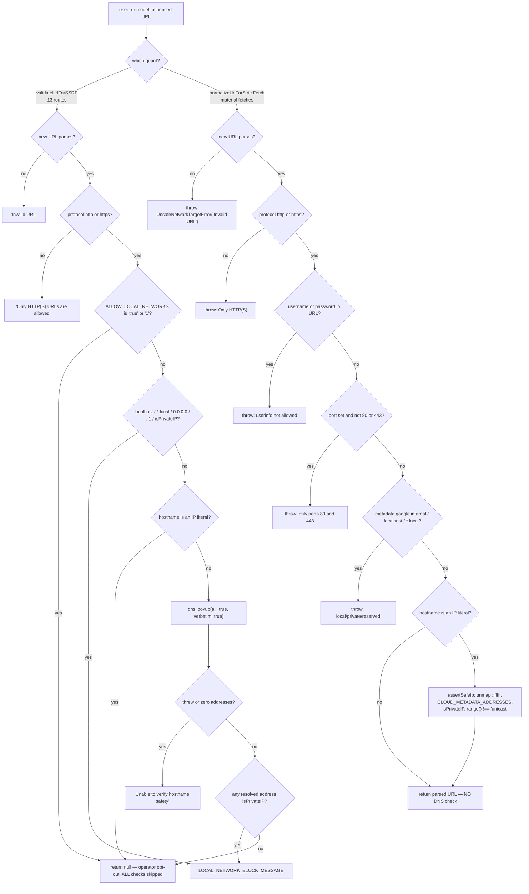
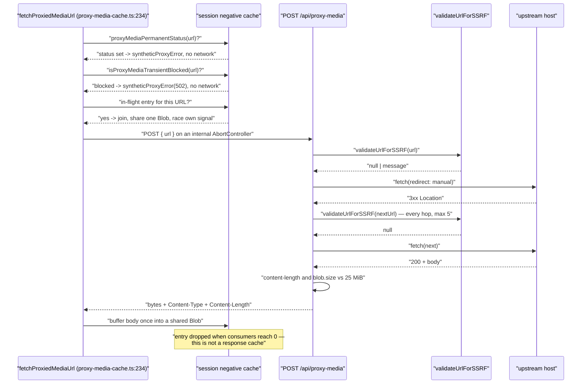
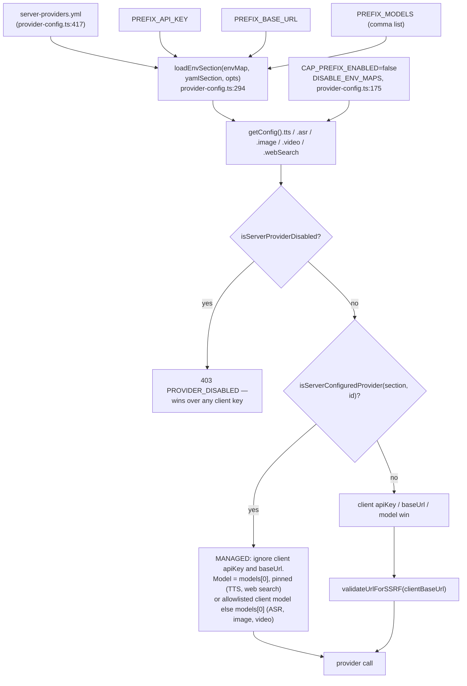

# Transcription and Web Search

Two provider families that share one property with the rest of this subsystem:
they reach outside the deployment. This file covers the ASR adapter and its six
providers, the nine web-search backends, and — the part worth reading twice —
the SSRF/egress controls that every user- or model-influenced outbound URL passes
through, including where those controls are deliberately *not* the same between
sibling routes.

**Sources:** `lib/audio/asr-providers.ts`, `lib/audio/constants.ts`,
`lib/audio/asr-enablement.ts`, `lib/web-search/{index,types,constants,format}.ts`,
`lib/server/ssrf-guard.ts`, `lib/server/web-search-config.ts`,
`app/api/transcription/route.ts`, `app/api/web-search/route.ts`,
`app/api/proxy-media/route.ts`, `app/api/azure-voices/route.ts`,
`lib/media/proxy-media-cache.ts`, `lib/audio/qwen-voice-clone.ts`,
`lib/server/render-service.ts`;
[`../appendix/research/media-audio-video/02b-interfaces-media.md`](docs/appendix/research/media-audio-video/02b-interfaces-media.md),
[`../appendix/research/media-audio-video/03a-flows-audio-media.md`](docs/appendix/research/media-audio-video/03a-flows-audio-media.md).

## 1. ASR

`transcribeAudio(config, audioBuffer)` ([`lib/audio/asr-providers.ts:164`](lib/audio/asr-providers.ts#L164)) mirrors
`generateTTS` exactly: registry lookup, key validation, exhaustive switch, custom
fallthrough. `ASRModelConfig` ([`lib/audio/types.ts:207`](lib/audio/types.ts#L207)) is
`{ providerId, modelId?, apiKey?, baseUrl?, language? }` and the result is just
`{ text: string }` ([`asr-providers.ts:157`](lib/audio/asr-providers.ts#L157)) — no timestamps, no confidence, no
segments.

| Provider | Handler | Default model | `supportedFormats` |
| --- | --- | --- | --- |
| `openai-whisper` | `transcribeOpenAIWhisper` (`:177`) | `gpt-4o-mini-transcribe` ([`constants.ts:1090`](lib/audio/constants.ts#L1090)) | mp3, mp4, mpeg, mpga, m4a, wav, webm (`:1155`) |
| `qwen-asr` | `transcribeQwenASR` (`:183`) | `qwen3-asr-flash` (`:1165`) | mp3, wav, webm, m4a, flac (`:1200`) |
| `azure-asr` | `transcribeAzureASR` (`:186`) | `''` — Fast Transcription has no model id (`:1210`) | wav, ogg, webm, mp3, flac, m4a (`:1226`) |
| `funasr-asr` | `transcribeWavOpenAICompatibleASR(…, 'FunASR')` (`:189`) | `sensevoice` (`:1307`) | wav only (`:1309`) |
| `lemonade-asr` | `transcribeWavOpenAICompatibleASR(…, 'Lemonade')` (`:192`) | `Whisper-Base` (`:1326`) | wav only (`:1328`) |
| `browser-native` | **throws** — "must be handled client-side using useBrowserASR hook" (`:180`) | `''` (`:1235`) | webm — the `MediaRecorder` format (`:1293`) |
| `custom-asr-*` | `transcribeCustomOpenAICompatibleASR` (`:201`) | — | — |

`funasr-asr` and `lemonade-asr` share one WAV-only OpenAI-compatible multipart
implementation (`:212`), parameterised only by the provider id and display name.

`POST /api/transcription` (94 lines, `maxDuration = 60`, `:17`) takes
`multipart/form-data` with `audio`, `providerId`, `modelId`, `language`,
`apiKey`, `baseUrl` (`:23-32`). Its distinguishing behaviour is that when the
client omits a provider it falls back to the operator-configured one and, if there
isn't one, **fails loudly** with `MISSING_PROVIDER` (400, `:43`) rather than
guessing a vendor.

## 2. Web search

`searchWeb(params)` ([`lib/web-search/index.ts:15`](lib/web-search/index.ts#L15)) switches over nine
`WebSearchProviderId` values ([`lib/web-search/types.ts:8`](lib/web-search/types.ts#L8)): `tavily`, `exa`,
`bocha`, `brave`, `baidu`, `claude`, `minimax`, `doubao`, `searxng`. The `default`
branch performs an `exhaustive: never` assignment (`:78`), so adding an id without
a case is a compile error. `AbortSignal` is threaded through as a conditional
spread (`abortOptions`, `:36`).

`WebSearchProviderConfig` ([`types.ts:31`](lib/web-search/types.ts#L31)) carries `requiresApiKey`,
`requiresBaseUrl` ("self-hosted instances need an explicit base URL"),
`defaultBaseUrl` and `endpointPath`; the registry is
`WEB_SEARCH_PROVIDERS` ([`lib/web-search/constants.ts:10`](lib/web-search/constants.ts#L10)).

`POST /api/web-search` (218 lines) is the most policy-dense route in the
subsystem. The ordering of its four decisions is the whole design:

1. **Provider selection with an operator override** (`:59-77`). The client's
   choice wins *unless* the operator has a server-configured backend, the client
   chose something different, **and** the client's choice is not itself
   server-configured. The comment gives the motivating cases: "Tavily without a
   key, or Brave HTML scrape with empty results" (`:66`).
2. **Disable check *after* the override** (`:83`) — explicitly so "a disabled
   client choice yields to the operator's enabled backend" (`:82`).
3. **Credential and base-URL resolution** (`:95-120`). A managed provider's
   client-sent key and base URL are *ignored, not rejected* (`:92-94`), and
   `searxng` never accepts a client base URL at all — `SEARXNG_BASE_URL` is the
   only source (`:97-98`).
4. **Bounded, best-effort LLM query rewrite** (`:123-152`). `pdfText` is clamped
   to `SEARCH_QUERY_REWRITE_EXCERPT_LENGTH` at the route boundary (`:123`), the
   rewrite model is resolved per request through
   `resolveModelFromRequest(req, body, 'web-search-query-rewrite')` (`:127`) with
   `maxOutputTokens: 256` (`:140`), and a failure only logs a warning — search
   still runs on the raw query (`:148-150`).

`buildSearchQuery` returns a telemetry-shaped record —
`{ hasPdfContext, rawRequirementLength, rewriteAttempted, finalQueryLength }` —
which is logged (`:154-159`) without logging the query text itself.

## 3. The egress guard

`lib/server/ssrf-guard.ts` exports two validators with different strictness and
different failure styles.

| | `validateUrlForSSRF(url)` (`:253`) | `normalizeUrlForStrictFetch(value)` (`:55`) |
| --- | --- | --- |
| Returns | `Promise<string \| null>` — a message, never throws | `URL` — throws `UnsafeNetworkTargetError` |
| DNS | yes: `dns.lookup(hostname, { all: true, verbatim: true })` (`:288`) | no DNS side effects at all |
| Scheme | http/https (`:261`) | http/https (`:63`) |
| Userinfo | not checked | rejected (`:66-68`) |
| Port | not checked | only 80 and 443 (`:69-71`) |
| `metadata.google.internal` | **not checked by name** | rejected (`:74`) |
| `100.100.100.200` | **not blocked** — `isPrivateIP` does not cover it | rejected via `CLOUD_METADATA_ADDRESSES` in `assertSafeIp` (`:46`) |
| `ALLOW_LOCAL_NETWORKS` bypass | yes (`:266-269`) | no |
| Non-unicast ranges | not checked | `address.range() !== 'unicast'` (`:48`) |

That table is the single most important thing in this file: the two guards are
*not* interchangeable, and the DNS-performing one is the weaker one on URL-layer
attacks. `169.254.169.254` and `fd00:ec2::254` are both blocked by
`validateUrlForSSRF` — but only incidentally, because `isPrivateIP` covers
`169.254.0.0/16` (`:192`) and `fc00::/7` (`:209`). Alibaba's metadata address
`100.100.100.200` falls through.

`isPrivateIP` (`:178`) is not a naive RFC1918 check. It un-maps `::ffff:` IPv4
(`:180-183`), covers `0.0.0.0/8`, `10/8`, `127/8`, `169.254/16`, `172.16-31`,
`192.168/16` (`:188-196`), `::`, `::1`, `fc00::/7`, `fe80::/10`, `fec0::/10`
(`:204-214`), and then unwraps three tunnel encodings to test the *embedded* IPv4:

| Tunnel | Prefix | Extraction | Anchor |
| --- | --- | --- | --- |
| 6to4 | `2002::/16` | embedded IPv4 in bits 16–47 (hextets 1–2) | `:217-223` |
| Teredo | `2001:0000::/32` | client IPv4 in the last 32 bits, **XOR-inverted** with `0xffff` | `:226-234` |
| ISATAP | interface id `0000:5efe:` or `0200:5efe:` | embedded IPv4 in hextets 6–7 | `:237-241` |

## 4. Per-route egress policy — and where it differs

The guard is shared; the *policy around it* is not. These asymmetries are real and
several are deliberate.

| Route / caller | SSRF check | Redirects | Size cap |
| --- | --- | --- | --- |
| `POST /api/generate/tts` | always, on a client `ttsBaseUrl` (`:97`) | n/a | n/a |
| `POST /api/generate/image` | always, on a client `x-base-url` (`:71`) | n/a | n/a |
| `POST /api/transcription` | **only when `NODE_ENV === 'production'`** (`:57`) | n/a | n/a |
| `POST /api/azure-voices` | always (`:29`) | `redirect: 'manual'`; any 3xx → 403 `REDIRECT_NOT_ALLOWED` (`:43`) | n/a |
| `POST /api/proxy-media` | initial URL (`:33`) **and every hop** (`:55`) | manual, `MAX_REDIRECTS = 5` (`:38`) | 25 MiB on both `content-length` and the realised `blob.size` (`:67-74`) |
| `POST /api/web-search` | none directly — `searxng` refuses client base URLs, other providers are allowlisted by registry | n/a | n/a |
| Qwen VC audio download | a strict host regex, **not** the shared guard ([`lib/audio/qwen-voice-clone.ts:348`](lib/audio/qwen-voice-clone.ts#L348)) | `redirect: 'error'`; http upgraded to https | `MAX_AUDIO_RESPONSE_BYTES` |
| `RENDER_SERVICE_URL` | deliberately **unguarded** ([`lib/server/render-service.ts:25-35`](lib/server/render-service.ts#L25-L35)) — operator config that is *meant* to point at an internal host | n/a | n/a |

The `NODE_ENV`-gated transcription check is the one asymmetry with no stated
rationale; the TTS route it otherwise mirrors always checks.

`/api/proxy-media` (89 lines) is the busiest of these. Its status translation is
policy, not accident:

| Condition | Response | Anchor |
| --- | --- | --- |
| SSRF failure (initial or any hop) | 403 `INVALID_URL` | `:35`, `:56` |
| Redirect with no `Location` | 502 `UPSTREAM_ERROR` | `:46` |
| More than 5 redirects | 502 `TOO_MANY_REDIRECTS` | `:47` |
| Unparseable redirect target | 502 `INVALID_URL` | `:52` |
| Upstream 4xx | **forwarded verbatim** | `:64` |
| Upstream 5xx | collapsed to 502 | `:64` |
| Declared or realised size over 25 MiB | 502 `UPSTREAM_ERROR` | `:69`, `:73` |

Forwarding 4xx verbatim is what lets the client-side negative cache
(`lib/media/proxy-media-cache.ts`, see
[`./04-image-generation.md`](docs/09-media-and-export/04-image-generation.md) §7) record a *permanent*
verdict and stop retrying — the two halves are designed together.

## 5. Provider configuration

All five media provider families resolve credentials through one mechanism in
`lib/server/provider-config.ts`: an optional YAML file, then environment
variables, then the client's own settings — with an operator force-off switch that
beats everything.

Env prefixes for the families this topic owns
([`lib/server/provider-config.ts:97-154`](lib/server/provider-config.ts#L97-L154)):

| Section | Prefixes |
| --- | --- |
| TTS | `TTS_OPENAI`, `TTS_AZURE`, `TTS_GLM`, `TTS_QWEN`, `TTS_VOXCPM`, `TTS_DOUBAO`, `TTS_ELEVENLABS`, `TTS_MINIMAX`, `TTS_LEMONADE` (+ `TTS_BROWSER_NATIVE`, disable only) |
| ASR | `ASR_OPENAI`, `ASR_QWEN`, `ASR_AZURE`, `ASR_FUNASR`, `ASR_LEMONADE` (+ `ASR_BROWSER_NATIVE`, disable only) |
| Image | `IMAGE_OPENAI`, `IMAGE_SEEDREAM`, `IMAGE_QWEN_IMAGE`, `IMAGE_NANO_BANANA`, `IMAGE_MINIMAX`, `IMAGE_GROK`, `IMAGE_LEMONADE` (+ `IMAGE_COMFYUI`, disable only) |
| Video | `VIDEO_SEEDANCE`, `VIDEO_KLING`, `VIDEO_VEO`, `VIDEO_MINIMAX`, `VIDEO_GROK`, `VIDEO_HAPPYHORSE` |
| Web search | `TAVILY`, `EXA`, `BOCHA`, `BRAVE`, `BAIDU`, `WEB_SEARCH_CLAUDE`, `WEB_SEARCH_MINIMAX`, `WEB_SEARCH_DOUBAO`, `SEARXNG` |

`_ENABLED` variables can only *disable*; they never force-enable a provider
without credentials ([`provider-config.ts:167-174`](lib/server/provider-config.ts#L167-L174)). What `_MODELS` *means* then
splits by family — it is a hard pin for two of the five and an allowlist for the
other three:

| Resolver | `_MODELS` semantics |
| --- | --- |
| `resolveTTSModel` (`:805`) | **Pin.** `pinnedModels[0]` is returned unconditionally once anything is pinned (`:845`); only `qwen-tts` deviates, and it *rejects* a non-allowlisted client model with `TTSModelNotAllowedError` (`:824`) rather than silently honouring it |
| `resolveWebSearchModel` (`:1074`) | **Pin.** `entry.models[0]` whenever the list is non-empty (`:1079`) |
| `resolveASRModel` (`:885`), `resolveImageModel` (`:961`), `resolveVideoModel` (`:1020`) | **Allowlist.** `if (clientModel && serverModels.includes(clientModel)) return clientModel;` runs first (`:888`, `:964`, `:1023`), so an allowlisted client model wins and `models[0]` is only the default |

## Open questions

- `ALLOW_LOCAL_NETWORKS` is a single global switch that disables the entire check
  for all 20 `validateUrlForSSRF` call sites at once — the 13 API routes above
  plus [`lib/server/agent-runtime/generate-image.ts:111`](lib/server/agent-runtime/generate-image.ts#L111),
  [`lib/server/agent-runtime/generate-video.ts:155`](lib/server/agent-runtime/generate-video.ts#L155) and
  [`lib/server/resolve-model.ts:106`](lib/server/resolve-model.ts#L106). There is no per-route or per-provider
  scoping.
- `100.100.100.200` (Alibaba Cloud metadata) is reachable through any
  `validateUrlForSSRF`-guarded route; only the strict path blocks it. Whether that
  is intentional is not stated in the code.
- No route in `app/api/**` has rate limiting, including `/api/web-search` and
  `/api/proxy-media` — both of which perform an outbound request per call.
- `components/audio/speech-button.tsx` and `lib/audio/asr-enablement.ts` (10
  lines) gate the mic UI on ASR availability; neither was read, so the exact
  client-side gate is unverified.
