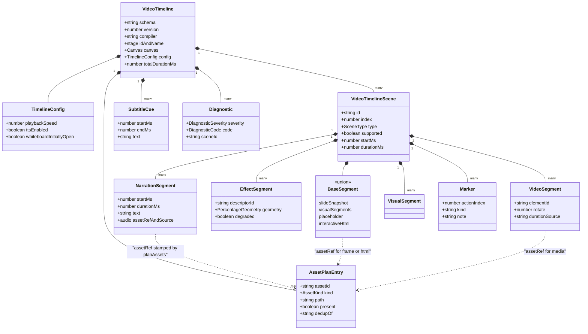
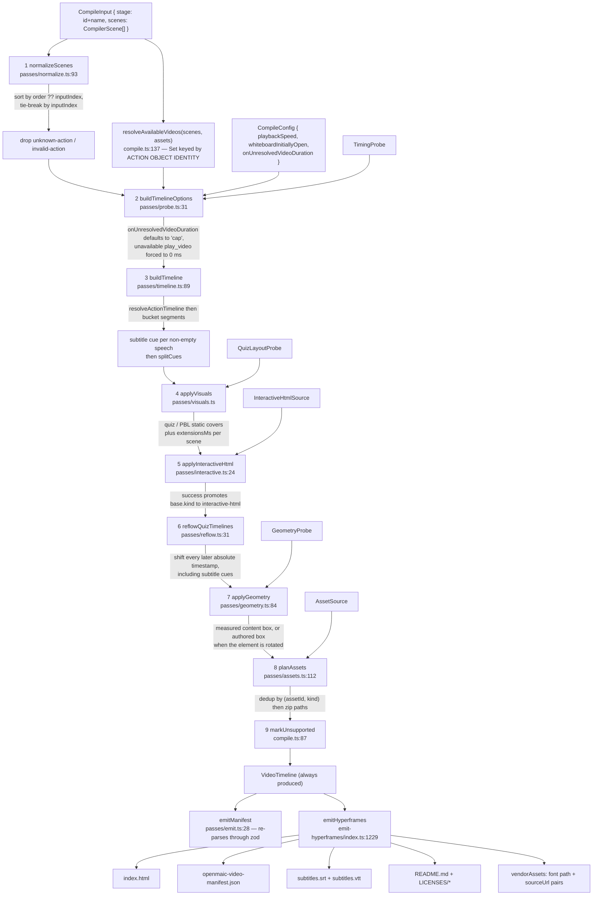

# Video Export Pipeline

A classroom document becomes an MP4 in three separable stages: a **pure**
nine-pass compiler produces the `VideoTimeline` IR; a **pure** emitter turns that
IR into one `index.html` driven by a single paused GSAP timeline; an **impure**
browser shell supplies real bytes and packages a ZIP. This file is the first
stage — the IR contract, the synchronous dependency-injection boundary, and the
nine passes one at a time. The emitter and the ZIP build continue in
[`./06b-video-export-emitter.md`](./06b-video-export-emitter.md).

**Sources:** `lib/video-export/{compile,ir,deps,interactive-static}.ts`,
`lib/video-export/passes/{normalize,probe,timeline,visuals,interactive,reflow,geometry,assets,emit}.ts`,
`lib/video-export/legacy/read.ts`, `lib/choreography/{timing,timeline}.ts`;
[`../appendix/research/media-audio-video/02d-interfaces-choreography-ir.md`](../appendix/research/media-audio-video/02d-interfaces-choreography-ir.md),
[`../appendix/research/media-audio-video/02e-interfaces-passes-emitter.md`](../appendix/research/media-audio-video/02e-interfaces-passes-emitter.md),
[`../appendix/research/media-audio-video/03b-flows-video-export.md`](../appendix/research/media-audio-video/03b-flows-video-export.md).

## 1. The IR is the contract

`lib/video-export/ir.ts` authors everything in zod and **infers** the TypeScript
types from the schema, not the reverse. Envelope constants:
`VIDEO_TIMELINE_SCHEMA = 'openmaic.videoTimeline'` (`:32`),
`VIDEO_TIMELINE_VERSION = 4` (`:35`),
`VIDEO_TIMELINE_COMPILER = 'openmaic-video-timeline'` (`:38`).

`CANVAS` (`:417`) fixes the coordinate contract once: `viewBox` 100 × 100,
`pixelBase` 1000 × 562.5, `aspectRatio '16:9'`. Geometry in the IR is therefore
percentage-based and resolution-independent; pixel width is an *emitter* option.

A scene (`VideoTimelineSceneSchema`, `:305`) is a `base` plus four typed buckets
and one catch-all:

| Field | Meaning |
| --- | --- |
| `base` | one of `slide-snapshot` / `visual-segments` / `placeholder` / `interactive-html` (`:113`) |
| `visuals` | compiler-generated static covers (quiz, PBL, question list) |
| `narration` | one segment per speech beat, with `text` and an `audio` ref |
| `effects` | spotlight / laser descriptors with resolved geometry |
| `videos` | `play_video` placements with a `durationSource` label |
| `markers` | **catch-all so no authored beat is silently dropped** (`:291`) |

Thirteen stable diagnostic codes (`DiagnosticCodeSchema`, `:80`) turn the emitted
manifest into an export report. `VideoTimelineCompileError` (`:424`) is the *only*
structural throw in the whole compiler, and it fires for exactly one condition:
zero scenes (`passes/normalize.ts:94-96`).

## 2. The dependency-injection boundary

`lib/video-export/deps.ts` declares five **synchronous** interfaces the app
implements. The file header states the reason plainly: durations are pre-resolved
at TTS time, so the whole compile is a pure synchronous fold and a test stub is a
literal object rather than a promise mock.

| Interface | Method(s) | Anchor |
| --- | --- | --- |
| `TimingProbe` | `audioDurationMs`, `videoDurationMs`, optional `clearElementCount`, `isDiscussionSkipped`, `isEditCodeNoop` | `:61` |
| `AssetSource` | `audio(action)`, `media(elementId, scene)` → `AssetMeta \| null` | `:101` |
| `InteractiveHtmlSource` | `html(scene)` → `InteractiveHtmlMeta \| null` | `:122` |
| `GeometryProbe` | `contentGeometry(elementId, scene)` → `PercentageGeometry \| null` | `:142` |
| `QuizLayoutProbe` | `measureQuestionList(scene)` → `QuizLayoutMeasurement \| null` | `:165` |

`CompilerScene = SceneCore & { type: SceneType; content?: CompilerSceneContent }`
(`:50`) is deliberately *looser* than the app's `Scene`, so callers pass their
scenes without casting. `CompilerSceneContent` (`:38`) is a structural slice —
`{ type?, canvas?, questions?, projectV2?, projectConfig?, html? }` — nothing
more.

## 3. The pass pipeline

### Pass 0 — `resolveAvailableVideos` (before the passes)

`compile.ts:137` pre-resolves which `play_video` actions have available media,
into a `Set<Action>` **keyed by object identity, not `action.id`**. The 10-line
comment (`:126-136`) explains why: the DSL does not enforce stage-wide action-id
uniqueness, so two scenes could share an id and an id-keyed set would produce a
contradictory IR — a five-minute dwell on a segment later stamped `skipped`.
Availability must be decided here, before `resolveActionTimeline` fixes dwell,
because asset planning runs *after* the timeline is laid out.

### Pass 1 — `normalize`

Ordering: `sort((a, b) => (a.order ?? a.inputIndex) - (b.order ?? b.inputIndex))`
tie-broken by input index so equal `order` values stay stable
(`normalize.ts:100-105`). Validation drops rather than throws;
`missingRequiredField` (`:29`) is a small, explicit table:

| Action types | Required field |
| --- | --- |
| `spotlight`, `laser`, `play_video`, `wb_delete`, `wb_edit_code` | non-empty `elementId` |
| `speech` | `text` must be a **string** — empty text is legal, it is a dwell beat (`:40-41`) |
| `wb_draw_code` | `code` must be a string |
| `discussion` | non-empty `topic` |

A type failing `isActionType` yields `unknown-action`; a missing field yields
`invalid-action` naming the field (`:58-77`). Both are `warn`, and the action is
dropped.

### Pass 2 — `probe`

`buildTimelineOptions(probe, config, isVideoAvailable)` (`probe.ts:31`) adapts the
injected `TimingProbe` into choreography's `ResolveTimelineOptions`. It makes two
deliberate departures from the live runtime:

- `onUnresolvedVideoDuration` defaults to `'cap'` (`:41`) where choreography
  defaults to `'throw'` — the compiler "prefers to degrade with a diagnostic over
  failing the whole compile".
- An *unavailable* `play_video` is forced to a **0 ms** dwell (`:44`) so later
  actions do not shift by the safety cap.

### Pass 3 — `timeline`

Timing only. Calls `resolveActionTimeline` (see
[`./02-audio-pipeline.md`](./02-audio-pipeline.md) §5), buckets each segment into
the scene's `narration` / `effects` / `videos` / `markers`, derives one subtitle
cue per non-empty speech, then splits those cues into line-sized cues via
`splitCues` (`timeline.ts:143`). The **IR carries the split track**, so the
burned-in overlay and the sidecar SRT/VTT cannot diverge.

It also sets `TimelineResult.ttsEnabled` — true when *any* narration had stored
audio — which lands in `VideoTimeline.config` as a determinism input, and emits
`estimated-duration` diagnostics for every clip that fell back to the estimate.
Effect `params` merge descriptor defaults with authored overrides (`effectParams`,
`:66`).

`VideoSegment.durationSource` is a four-value label — `stored` / `capped` /
`zero` / `skipped` (`ir.ts:281`) — so a consumer cannot mistake the five-minute
cap for a real clip length (`timeline.ts:237-244`).

### Pass 4 — `visuals`

Turns authored quiz and PBL data into whole-scene static covers.
`prepareQuizQuestionList(scene)` (`visuals.ts:65`) is the **only** path from
authored quiz data into the IR, and it is a projection, not a copy: answer keys,
analysis text, points and learner state are structurally unrepresentable in the
IR. Scroll timing constants (`:90-95`): `QUIZ_TRANSITION_MS = 600`,
`QUIZ_TOP_HOLD_MS = 1200`, `QUIZ_BOTTOM_HOLD_MS = 1200`,
`QUIZ_SCROLL_PX_PER_SECOND_720P = 96`, `QUIZ_MIN_SCROLL_MS = 4000`,
`QUIZ_MAX_SCROLL_MS = 24_000`. The pass returns `extensionsMs: number[]` — the
per-scene duration it *added* after the authored timeline — which pass 6 consumes.
PBL v1 scenes are read through `lib/video-export/legacy/read.ts`, a 207-line
read-only shim kept "indefinitely so historical scenes remain exportable" whose
header forbids writers from importing it (`:1-6`).

### Pass 5 — `interactive`

`applyInteractiveHtml(timelineScenes, sourceScenes, source?)`
(`interactive.ts:24`). Success promotes `base.kind` to `'interactive-html'` with
`readyTimeoutMs = 8000` and `settleMs = 250` from `interactive-static.ts:4-7`.
Failure maps to one of three diagnostic codes via `failureCode` (`:11`), over the
four `InteractiveHtmlFailure` values (`interactive-static.ts:13`):
`missing-html`, `packaging-failed`, `unresolved-resource`, `too-large`.

### Pass 6 — `reflow`

`reflowQuizTimelines(scenes, subtitles, totalDurationMs, extensionsMs)`
(`reflow.ts:31`). A compiler-added quiz tail extends its scene and shifts every
*later* absolute timestamp — including subtitle cues and the interactive bases
prepared by pass 5. **Authored intra-scene timing is untouched.** This is the only
pass that rewrites absolute time, which is why it runs after every pass that can
add duration and before the passes that only resolve references.

### Pass 7 — `geometry`

`applyGeometry(timelineScenes, sourceScenes, geometryProbe?)` (`geometry.ts:84`),
with `resolveEffectGeometry` (`:32`) and `resolveVideoPlacement` (`:59`) exported
for direct testing. It prefers the *measured* content box, but a **rotated**
element deliberately falls back to the authored box (`:59-68`) so the single
downstream `rotate` transform is not applied twice. A miss yields
`geometry: null`, `degraded: true`, and an `unresolved-element` diagnostic.

### Pass 8 — `assets`

`planAssets(sourceScenes, timelineScenes, assetSource)` (`assets.ts:112`) walks
the IR and produces the `AssetPlan` — the list of files the ZIP must contain.

Two design decisions, both in `AssetPlanner` (`:56`):

- **Dedup key is `(assetId, kind)`**, tracked in a nested
  `Map<AssetKind, Map<string, AssetPlanEntry>>` (`:60`), because one ref may
  legitimately be both narration audio and video media.
- **Presence is a property of the key, not of an individual reference** (`:62-73`).
  The first reference within a kind decides `present`, and every later same-kind
  reference *and the caller's segment* inherits it — so an `AssetSource` returning
  inconsistent `present` for one id cannot produce a dedup entry that claims a
  different presence than its owner.

Path scheme, with `unique()` (`:101`) suffixing `stem-2.ext`, `stem-3.ext`, … on
collision:

| Kind | Path | Anchor |
| --- | --- | --- |
| `frame` | `frames/<seq>-<slug>.png`, `seq` zero-padded to 3 (`:122-128`) | `:128` |
| `html` | `interactive/<seq>-<slug>.html` | `:131-136` |
| `audio` | `audio/<slug>/speech-NNN.<ext>` | `:160` |
| `video` | `media/<sanitizeFilenamePart(elementId)>.<ext>` | `:208-213` |

Those four are the only kinds any pass plans: `AssetKindSchema` (`ir.ts:333`) also
declares `'image'` and `'poster'`, handled in `collect.ts:367-380` but planned
nowhere.

`missing-audio` is recorded only when a narration segment **has text** but no asset (`:147-156`).

### Pass 9 — `markUnsupported`

Inline in `compile.ts:87`. For any scene still `supported: false`, it forces
`base.kind = 'placeholder'` with a reason, **prepends a whole-scene
`unsupported-scene` marker spanning `startMs`..`durationMs`** (`:106-114`), and
records a warn diagnostic. Nothing is dropped: an unrenderable scene still
occupies its slice of the timeline.

Finally `compile.ts:194-202` concatenates the seven diagnostic arrays in pass
order, and `emitManifest` (`passes/emit.ts:28`) re-parses the IR through
`VideoTimelineSchema` and then `VideoExportManifestSchema` (which adds
`runtimeDiagnostics: []`) — so a malformed IR fails at the compiler, not in the
renderer.

## 4. Where the pipeline continues

The emitter, the byte-collection/ZIP build, and the full degradation catalogue are
in [`./06b-video-export-emitter.md`](./06b-video-export-emitter.md). The MP4 leg —
handover to the isolated container, job lifecycle and the degrade rule — is in
[`./07-render-service.md`](./07-render-service.md) and
[`./07b-render-service-lifecycle.md`](./07b-render-service-lifecycle.md).

## Open questions

- `BaseSegmentSchema` includes `{ kind: 'visual-segments' }` (`ir.ts:119`) but no
  pass was observed producing it — `timeline` sets `slide-snapshot` or
  `placeholder`, `interactive` sets `interactive-html`, and `visuals` adds to
  `scene.visuals` rather than replacing `base`. Possibly dead.
- The quiz scroll constants (`visuals.ts:90-95`) are hand-tuned pixels-per-second
  at 720p. `tests/video-export/cover-card-layout.browser.test.ts` measures cover
  layout in a real browser; whether anything asserts the scroll *timing* was not
  checked.
- `resolveAvailableVideos` keys availability by action object identity — exact for
  `resolveActionTimeline`, but nothing stops a future pass from cloning scene
  actions and silently breaking that assumption.
