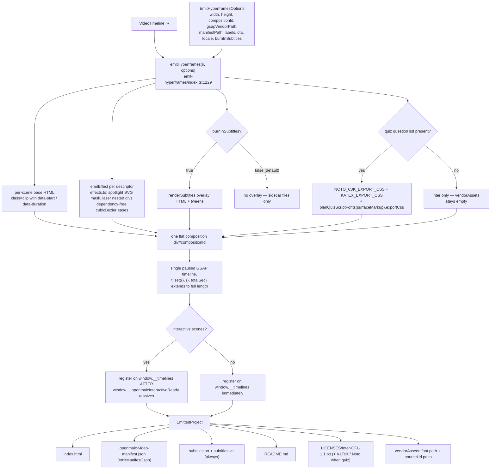
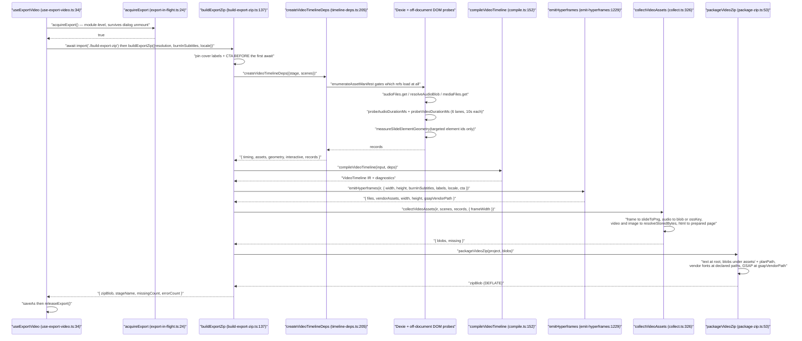

# Hyperframes Emitter and the Export Build

The second half of [`./06-video-export-pipeline.md`](docs/09-media-and-export/06-video-export-pipeline.md).
Once `compileVideoTimeline` has produced the `VideoTimeline` IR, a pure emitter
turns it into one `index.html` driven by a single paused GSAP timeline, and an
impure browser shell fills in real bytes and packages a ZIP. This file covers the
emitter contract, one complete export end to end, and the degradation catalogue
that spans both halves.

**Sources:** `lib/video-export/emit-hyperframes/**`,
`lib/video-export/{subtitles,split-cue}.ts`,
`lib/video-export-app/{build-export-zip,timeline-deps,collect,package-zip,export-options,export-in-flight}.ts`;
[`../appendix/research/media-audio-video/02e-interfaces-passes-emitter.md`](docs/appendix/research/media-audio-video/02e-interfaces-passes-emitter.md),
[`../appendix/research/media-audio-video/02f-interfaces-export-app.md`](docs/appendix/research/media-audio-video/02f-interfaces-export-app.md),
[`../appendix/research/media-audio-video/03b-flows-video-export.md`](docs/appendix/research/media-audio-video/03b-flows-video-export.md).

## 1. The emitter contract

`emitHyperframes(ir, options)`
([`lib/video-export/emit-hyperframes/index.ts:1229`](lib/video-export/emit-hyperframes/index.ts#L1229)) returns `EmittedProject`:
**text files only**, plus `vendorAssets` describing binary fonts as
`{ path, sourceUrl }` pairs (`:60`) for the packaging layer to fetch. The emitter
never touches bytes, which is what keeps it inside the purity fence
(see [`./09-execution-constraints.md`](docs/09-media-and-export/09-execution-constraints.md) §2) and
string-snapshot testable.



The output shape (`:1307-1351`) is one **flat** composition, because every IR time
is already absolute on the global clock — the compiler ran one cursor across all
scenes (`:7-11`):

```html
<div id="openmaic" data-composition-id="openmaic" data-start="0"
     data-duration="…" data-width="1920" data-height="1080" style="…">
  … scene bases (class="clip", data-start/data-duration) …
  … effect overlay DOM …
  … optional burned-in subtitle overlay …
  <script type="application/json" data-openmaic-runtime-diagnostics>[]</script>
</div>
<script src="assets/vendor/gsap.min.js"></script>
<script>
  var tl = gsap.timeline({ paused: true });
  … statements …
  window.__timelines["openmaic"] = tl;
</script>
```

`tl.set({}, {}, totalSec)` (`:1305`) extends the timeline to the full composition
length even when the last tween ends earlier, so trailing video/audio clips are
not cut short. When the project has interactive scenes, timeline registration is
*deferred* behind `window.__openmaicInteractiveReady` (`:1341-1346`) so the
renderer does not start capturing before the frames settle.

Defaults: `width 1920` (`:187`), height derived from the IR's 16:9 pixel base,
`compositionId 'openmaic'`, `gsapVendorPath 'assets/vendor/gsap.min.js'` (`:188`),
`manifestPath 'openmaic-video-manifest.json'` (`:189`), `locale 'en-US'` (`:190`),
`burnInSubtitles: false` (`:172`) — clean video plus sidecar SRT/VTT is the
default, and the SRT/VTT files are written regardless of the flag (`:1296-1297`).

Files written (`:1353-1391`): `index.html`, `LICENSES/Inter-OFL-1.1.txt`, the
manifest JSON, `subtitles.srt`, `subtitles.vtt`, `README.md`, plus — **only when a
quiz question list exists** — `LICENSES/KaTeX-MIT.txt`,
`LICENSES/Noto-Sans-SC-OFL-1.1.txt`, `LICENSES/Noto-Sans-KR-OFL-1.1.txt` and any
script-font licences from `planQuizScriptFonts`. `vendorAssets` is likewise empty
unless a quiz list is present (`:1395-1397`), because Inter is embedded as a
base64 data URI (see
[`./08-asset-generation-scripts.md`](docs/09-media-and-export/08-asset-generation-scripts.md) §5).

`VideoExportLabels` (`:93`) is the injected learner-facing chrome — 18 string keys
plus a nested `interactive: InteractiveFallbackLabels` (`:73`) — and every default
is the `en-US` value of the *same i18n key* the live `QuizView` / PBL Hero use
(`:86-92`), so exported and on-screen wording cannot drift.

## 2. Determinism red-lines

Stated at `:18-20` and enforced downstream by `hyperframes lint`: GSAP vendored
locally (no CDN), no `Date.now` / `Math.random` / network at render time, an
explicit root `data-duration`, no infinite repeats.

Two consequences are visible in the emitted CSS:

- **No `vw` units anywhere.** Cover CSS is written against
  `COVER_DESIGN_WIDTH = 1280` (`:789`) and scaled numerically by
  `width / COVER_DESIGN_WIDTH` with a 1 px hairline floor (`coverCardCss`,
  `:1064`), because viewport units track the browser window and would differ
  between `hyperframes preview` and `hyperframes render`.
- **RTL is scoped to text-bearing cover panels**, not the document (`:156-164`) —
  Hyperframes cannot safely render a document-level RTL direction.

Effects are emitted per-descriptor rather than generically
(`emit-hyperframes/effects.ts`): spotlight is an SVG mask, laser is nested CSS
divs, and a dependency-free `cubicBezier` implementation ([`effects.ts:44`](lib/video-export/emit-hyperframes/effects.ts#L44))
supplies the named eases so no easing library is needed.

Subtitles: `usableCues` ([`subtitles.ts:38`](lib/video-export/subtitles.ts#L38)) drops zero/negative spans and empty
text so an estimated 0 ms narration never emits a malformed block, and
`normalizeText` (`:29`) collapses CRLF and trims trailing whitespace so a cue
cannot terminate its own block early.

## 3. One export, end to end



Three ordering details in `build-export-zip.ts` that are load-bearing:

- **Chrome is pinned before the first `await`** (`:147-148`):
  `getVideoExportCoverLabels(locale)` and `configuredVideoExportCta()` are read
  synchronously, so a user switching UI language mid-compile cannot produce a
  mixed-locale export.
- `createVideoTimelineDeps` and `createQuizLayoutProbe` run concurrently via
  `Promise.all` (`:95`).
- `acquireExport` ([`export-in-flight.ts:24`](lib/video-export-app/export-in-flight.ts#L24)) is a **module-level** mutex, not a
  per-hook ref, because the export dialog unmounts when it closes and a
  per-instance ref would reset and let a second pipeline start (`:10-15`). The
  in-app MP4 render path uses the render store's `status` as its equivalent guard.

Collection specifics worth knowing (`collect.ts`): only *owning* plan entries are
iterated (`present && !dedupOf`, `:341`); a `frame` entry runs
`resolveGeneratedMedia` → `slideToPng({ width, pixelRatio: 1, backgroundColor:
'#ffffff', format: 'blob' })` with `revoke()` in a `finally` (`:350-361`); a video
with no poster gets one decoded from its first frame, bounded by
`FIRST_FRAME_TIMEOUT_MS = 8000` and catching a CORS-tainted canvas (`:80`, `:107`).

Resolutions ([`export-options.ts:4`](lib/video-export-app/export-options.ts#L4)): `720p` 1280 × 720, `1080p` 1920 × 1080,
`4k` 3840 × 2160. FPS choices `[24, 30, 60]`; qualities
`['draft', 'standard', 'high']`.

## 4. Degradation catalogue

Only `VideoTimelineCompileError` throws, and only for zero scenes. Everything else
degrades with a diagnostic:

| Code | Trigger | Degradation |
| --- | --- | --- |
| `unknown-action` | `!isActionType(action.type)` | action dropped |
| `invalid-action` | required field missing | action dropped |
| `estimated-duration` | no stored audio duration | `estimateSpeechDurationMs`; `audio.source = 'estimated'` |
| `missing-audio` | narration has text but `AssetSource.audio()` returned `null` | estimated timing, no plan entry |
| `skipped-media` | asset referenced but bytes unavailable, or no media for a `play_video` | `durationSource = 'skipped'` and a **0 ms** dwell |
| `unresolved-element` | effect/video `elementId` has no geometry | `geometry: null`, `degraded: true` |
| `unsupported-scene` | scene family the compiler cannot render | `placeholder` base + whole-scene marker |
| `cover-card` | quiz/PBL rendered as a static cover | deterministic cover visual |
| `quiz-layout-unavailable` | question list could not be measured | stays on the cover-only path |
| `interactive-static-html` | HTML packaged successfully | info-level note |
| `missing-interactive-html` | scene has no embedded HTML | placeholder base |
| `interactive-html-packaging` | preparation failed or exceeded its bound | placeholder base |
| `unresolved-interactive-resource` | an external/relative resource remained | placeholder base |

Collection is equally forgiving: each plan entry in `collectVideoAssets` is
wrapped in `try`/`catch` and pushed to `missing` ([`collect.ts:386-388`](lib/video-export-app/collect.ts#L386-L388)), surfacing
only as a warning toast ([`use-export-video.ts:60-64`](lib/video-export-app/use-export-video.ts#L60-L64),
[`lib/store/video-render.ts:240`](lib/store/video-render.ts#L240)). Bounded sub-failures that cannot wedge an
export:

| Probe | Bound | On failure |
| --- | --- | --- |
| `probeAudioDurationMs` / `probeVideoDurationMs` | `PROBE_TIMEOUT_MS = 10_000` per blob | resolves `null` → compiler estimates or caps |
| `decodeFirstFramePosterUrl` | `FIRST_FRAME_TIMEOUT_MS = 8000` | resolves `null`; also catches a CORS-tainted canvas |
| `measureSlideElementGeometry` | wrapped in `try`/`catch` | degrades to the authored-box calc ([`timeline-deps.ts:491-494`](lib/video-export-app/timeline-deps.ts#L491-L494)) |
| `accessDocument(stage.id)` | `.catch(() => undefined)` | falls back to `stage.name` then `'classroom'` ([`build-export-zip.ts:91`](lib/video-export-app/build-export-zip.ts#L91)) |
| legacy `audioUrl` fetch | `fetchMediaUrl(url, 15_000)` in `try`/`catch` | clip stays missing ([`timeline-deps.ts:299-301`](lib/video-export-app/timeline-deps.ts#L299-L301)) |

`packageVideoZip` is the deliberate exception — a failed GSAP or vendor-font fetch
**throws** ([`package-zip.ts:37`](lib/video-export-app/package-zip.ts#L37), [`:43`](lib/video-export-app/package-zip.ts#L43)) and fails the whole export, which is
correct: a ZIP without GSAP renders nothing.

## Open questions

- `lib/video-export/runtime-diagnostics.ts` supplies `RUNTIME_DIAGNOSTIC_CODES` to
  the emitter ([`emit-hyperframes/index.ts:34`](lib/video-export/emit-hyperframes/index.ts#L34)) and the emitter writes an empty
  `[]` sink — nothing in this subsystem other than the interactive bridge was
  observed *writing* to `window.__openmaicVideoManifest.runtimeDiagnostics`.
- `split-cue.ts` (294 lines) was not read; its role (character-weighted line-sized
  cues) is established only from the call site at [`passes/timeline.ts:143`](lib/video-export/passes/timeline.ts#L143).
- `AssetKind` includes `'poster'` and `'image'` and [`collect.ts:367-380`](lib/video-export-app/collect.ts#L367-L380) handles
  both, but `passes/assets.ts` plans only `frame`, `html`, `audio` and `video`
  entries — so those branches may be unreachable today.
- `hyperframes lint` — the downstream enforcer of the determinism red-lines — is
  invoked only from CI: [`.github/workflows/ci.yml:297`](.github/workflows/ci.yml#L297) runs
  `pnpm exec hyperframes lint "$dir"` over the seven sample dirs materialized
  under `HF_E2E_DIR` (`:285`, `:292`) and additionally requires the literal
  `0 errors, 0 warnings` summary (`:307`), against the `hyperframes`
  devDependency pinned at [`package.json:191`](package.json#L191). There is no `package.json` script
  alias, so the gate cannot be reproduced locally without copying the workflow
  step.
