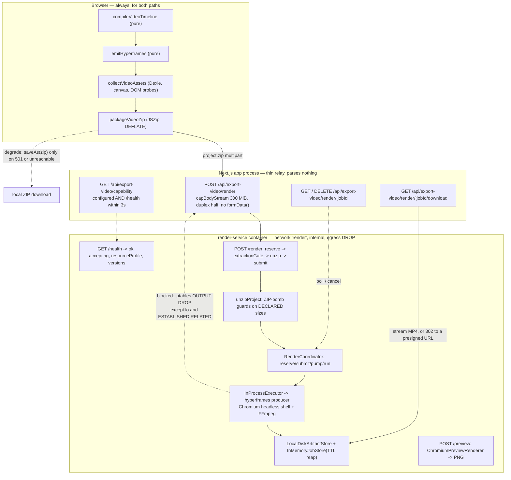
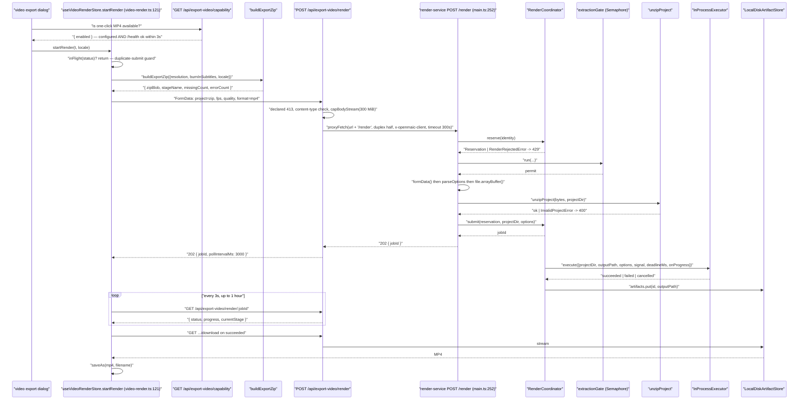

# The Render Service

`render-service/` is a standalone Node 22 + Chromium + FFmpeg container with its
own `package.json`, `tsconfig.json` and `vitest.config.ts`, run through `tsx`
with no build step. It exists for exactly one reason: it renders **untrusted,
uploaded HTML** in a real browser, and that has to happen somewhere the browser
cannot reach anything. This file covers its HTTP contract, the handover from the
app, the job lifecycle, and the separation rationale.

**Sources:** `render-service/src/{main,config,resource-profile,render-coordinator,render-executor,chunk-executor,unzip,types,preview-renderer,job-store,artifact-store,semaphore,capped-stream,preview-gate,runtime-info}.ts`,
`render-service/{Dockerfile,docker-entrypoint.sh,package.json}`,
`docker-compose.yml`, `app/api/export-video/**`,
`lib/server/render-service.ts`, `lib/store/video-render.ts`;
[`../appendix/research/media-audio-video/02g-interfaces-render-service.md`](docs/appendix/research/media-audio-video/02g-interfaces-render-service.md),
[`../appendix/research/media-audio-video/03b-flows-video-export.md`](docs/appendix/research/media-audio-video/03b-flows-video-export.md).

## 1. Why it is separate

Four independent reasons, each stated in the code:

1. **Untrusted HTML in a real browser.** The export ZIP is fully self-contained,
   so the render needs *zero* outbound network — and the entrypoint enforces that
   at the kernel ([`docker-entrypoint.sh:4-10`](render-service/docker-entrypoint.sh#L4-L10)).
2. **Binary toolchain the app does not want.** Chromium headless shell + FFmpeg on
   Debian bookworm-slim, **not** Alpine, because "Chromium + its shared libraries
   are far simpler to provision on glibc/Debian than on musl/Alpine"
   ([`Dockerfile:3-5`](render-service/Dockerfile#L3-L5)). Producer's BeginFrame capture requires the *old* headless
   shell binary; regular Chromium exposes the resolver path then rejects
   `HeadlessExperimental.beginFrame` and silently degrades to screenshots
   ([`Dockerfile:5-7`](render-service/Dockerfile#L5-L7)).
3. **A different memory and concurrency regime.** Both resource profiles fix
   `maxConcurrency: 1`; the compose file sets `mem_limit 8g` and `shm_size 2gb`.
   That cannot share a process with a Next.js server serving learners.
4. **Swappable internals behind a stable contract.** [`main.ts:8-10`](render-service/src/main.ts#L8-L10) says the
   contract is "intentionally minimal and stable so the internals (in-memory vs
   Redis job store, local-disk vs S3 artifacts) can be swapped for a demo-scale
   deployment without the app noticing".

One naming constraint worth knowing before you rename a file: the entry **must
not** be `server.ts`. `@hyperframes/producer`'s main module auto-starts its own
bundled HTTP server (on `PRODUCER_PORT`, default 9847) as an *import side effect*
when the process entry path ends with `/src/server.ts` or `/public-server.js`
([`main.ts:19-23`](render-service/src/main.ts#L19-L23)). The service uses producer as a library, so the entry is
`main.ts`.

## 2. HTTP contract

Stated verbatim in the file header ([`main.ts:12-17`](render-service/src/main.ts#L12-L17)):

| Method | Path | Contract |
| --- | --- | --- |
| POST | `/render` | multipart: `project` (zip) + `fps`/`quality`/`format` → `202 { jobId }` |
| POST | `/preview` | JSON: scene + stage + viewport → PNG |
| GET | `/render/:jobId` | `{ status, progress, currentStage, done, … }` |
| GET | `/render/:jobId/download` | stream MP4, or 302 to a presigned URL |
| DELETE | `/render/:jobId` | cancel |
| GET | `/health` | `{ ok, accepting, resourceProfile, versions }` |

`/health` ([`main.ts:241-250`](render-service/src/main.ts#L241-L250)) publishes `accepting` as an **aggregate boolean
only** — never queue depths, never per-identity data — because identity keys are
client IPs behind a trusted proxy and publishing them would leak active users'
addresses ([`render-coordinator.ts:123-129`](render-service/src/render-coordinator.ts#L123-L129)). `versions` is `RuntimeVersions`:
`{ service, producer, node, chromium, chromiumPath, ffmpeg, ffmpegPath,
containerImage }` ([`types.ts:26`](render-service/src/types.ts#L26)), collected once at boot by
`collectRuntimeVersions()` and copied into every job's metrics.

`RenderOptions` ([`types.ts:18`](render-service/src/types.ts#L18)) is `{ fps: number; quality: 'draft' | 'standard'
| 'high'; format: 'mp4' }`. `format` is a single-member union stated as explicit
forward-compat.

## 3. Admission ordering is the security boundary

`createApp(deps)` ([`main.ts:229`](render-service/src/main.ts#L229)) documents the rule above itself
(`:216-228`), and `POST /render` implements it in this order:

1. **Declared-length courtesy 413** (`:256-259`) — `Content-Length` is
   client-supplied and absent on chunked uploads, so this is politeness, not the
   bound.
2. **Identity from the header, not the body** (`:264`):
   `x-openmaic-client`, default `'anonymous'`. A client-supplied multipart
   `userId` is *deliberately ignored so it cannot be rotated to bypass the
   per-identity guard* (`:261-263`).
3. **`coordinator.reserve(identity)` BEFORE the buffering permit** (`:270`) — a
   rejected caller (`queue_full` / `per_identity_limit` → 429) never enters
   buffering or extraction.
4. **The entire RAM-heavy section inside `extractionGate.run(...)`** (`:283`):
   `capBodyStream` → construct a bounded `Request` with `duplex: 'half'` →
   `formData()` → `parseOptions` → `file.arrayBuffer()` → `unzipProject`. At most
   `maxConcurrentExtractions` bodies are buffered at once; the rest wait **with
   their request body unconsumed**, backpressured on the socket. That is what
   stops a near-cap burst from OOMing the box (`:279-282`).
5. **Every failure path releases the reservation** (`:322-330`) and cleans the
   project dir, then maps the error: `UploadTooLargeError` → 413,
   `BadRequestError` → 400, `InvalidProjectError` → 400, `RenderRejectedError` →
   429. The rule is stated as a comment at `:276`.

Note the `formData()`-in-the-gate detail: the comment at `:222-223` explains that
`formData()` is "what materializes the uploaded file into memory", which is why
the gate must wrap it rather than just the unzip.

Archive rejection ([`unzip.ts:31`](render-service/src/unzip.ts#L31)) happens on **declared** sizes via a synchronous
`filter` callback, before fflate decompresses anything:

| Guard | Default | Env | Anchor |
| --- | --- | --- | --- |
| Entry count | 5000 | `RENDER_MAX_ENTRIES` | `:42` |
| Single expanded entry | 200 MiB | `RENDER_MAX_ENTRY_BYTES` | `:45` |
| Expansion ratio (`originalSize / size`) | 200 | `RENDER_MAX_COMPRESSION_RATIO` | `:50` |
| Total expanded | 512 MiB | `RENDER_MAX_EXPANDED_BYTES` | `:54` |
| Path traversal | `relative(destRoot, target)` must not start with `..` | — | `:82` |
| `index.html` required (root or one level down) | — | — | `:74` |

## 4. Handover from the app

The split is explicit and stated at [`build-export-zip.ts:11-13`](lib/video-export-app/build-export-zip.ts#L11-L13): the compile and
ZIP build **always happen in the browser**; only frame capture and encoding move
to the service, and `buildExportZip` is the shared prefix of both paths "so the two
paths can never drift".

The app-side relay is deliberately thin. `app/api/export-video/render/route.ts`
(`maxDuration = 300`, `:15`; `MAX_UPLOAD_BYTES = 300 MiB`, `:18`;
`SUBMIT_TIMEOUT_MS = 300_000`, `:21`) forwards the raw multipart body **verbatim
and unparsed** (`:66-70`) — "re-parsing would defeat the streaming bound" — and
derives identity from `clientIdentity(req)` (`:33`), which honours
`x-forwarded-for` / `x-real-ip` **only** when `TRUST_PROXY_HEADERS === 'true'`,
otherwise collapsing every caller into a single `'direct'` bucket: "a conservative
shared limit rather than a spoofable one" (`:26-32`).

Status translation (`:87-97`): upstream 429 → 429 `RATE_LIMITED`; 413 → 413
`INVALID_REQUEST`; anything else → 502 `UPSTREAM_ERROR`. A cap trip aborts the
forwarded stream, surfaces as a fetch error, and is translated to 413 (`:102`).
An unconfigured service answers 501 `PROVIDER_DISABLED` (`:49`).

`GET /api/export-video/capability` reports `enabled: false` for a
*configured-but-absent* service (`checkRenderServiceHealth()`, 3 s budget), so the
menu offers only "Download ZIP" and never leaks the service URL.

### The degrade rule

[`lib/store/video-render.ts:243-269`](lib/store/video-render.ts#L243-L269) is deliberately narrow, and the comment states
the intent: the client silently falls back to downloading the ZIP **only** when
the submit never succeeded *and* the service is genuinely unavailable —
`submitStatus === null` (fetch threw) or `501`. A real rejection (429 busy, 413 too
large, 5xx) surfaces the error "instead of silently downloading a ZIP the user
didn't ask for, so the failure is honest and retryable" (`:246-251`). If the render
had already started, the store fires `DELETE /api/export-video/render/:jobId` to
free the slot and scratch space before reporting failure (`:263`).

The ETA model (`:152-158`, `:201-223`): track the previous `(percent, timestamp)`
sample, derive an instantaneous percent-per-ms rate, EMA-smooth it with
`SPEED_SMOOTHING = 0.3`, project the remaining percent. **Only forward progress
updates the speed**, so a stalled stage cannot blow the ETA to infinity, and the
ETA is hidden below `ETA_MIN_PERCENT = 3`. Polling is
`runPolledTask` at 3 s for up to one hour (`MAX_POLL_ATTEMPTS`).

## 5. Where the service view continues

The job lifecycle state machine, resource profiles, the fail-closed startup
sequence, and the unrelated `/preview` capability are in
[`./07b-render-service-lifecycle.md`](docs/09-media-and-export/07b-render-service-lifecycle.md).

## Open questions

- `NEXT_PUBLIC_ENABLE_VIDEO_EXPORT` is read only in
  [`lib/config/feature-flags.ts:122`](lib/config/feature-flags.ts#L122) (client). Nothing under
  `app/api/export-video/**` checks it, so the render relay routes appear reachable
  with the UI flag off — mediated only by `RENDER_SERVICE_URL`.
- `RENDER_SERVICE_URL` is deliberately exempt from `validateUrlForSSRF`
  ([`lib/server/render-service.ts:25-35`](lib/server/render-service.ts#L25-L35)) because it is meant to point at an internal
  host. That is defensible, but it also means a compromised env value turns the
  relay into an unguarded proxy for a 300 MiB streamed body.
- No test crosses the app↔service boundary end to end; the handover is exercised
  only in unit form on each side.
