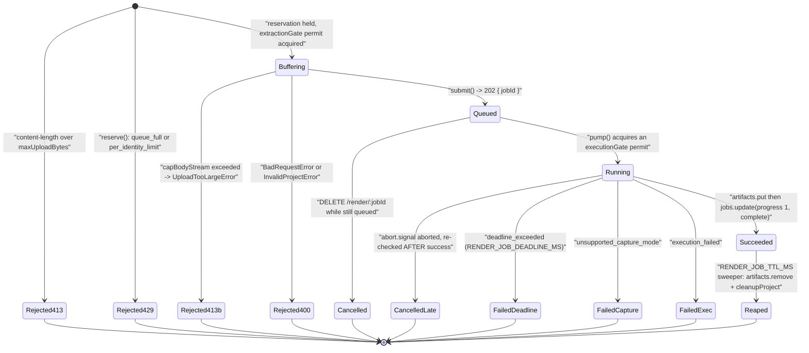
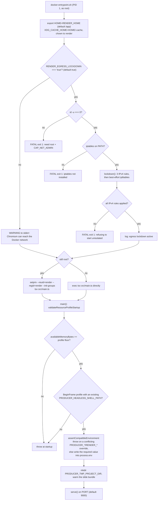
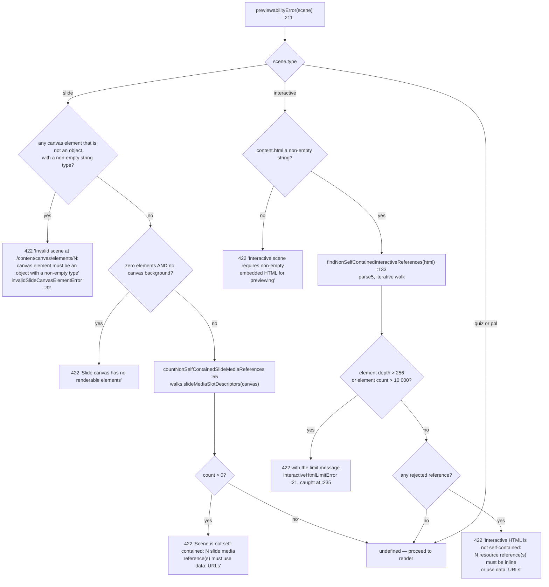

# Render Service: Lifecycle, Profiles, Preview

The second half of [`./07-render-service.md`](./07-render-service.md). Once a
project ZIP has been admitted and extracted, this is what happens to it: the job
state machine, the two resource profiles that fix concurrency and capture policy,
the startup checks that refuse to boot a misconfigured or unisolated container,
and the unrelated `/preview` capability that shares the same process.

**Sources:** all seventeen files of `render-service/src/` — `{render-coordinator,render-executor,chunk-executor,chunk-worker,resource-profile,config,types,preview-renderer,preview-gate,preview-validation,job-store,artifact-store,runtime-info,capped-stream,semaphore,unzip,main}.ts`,
`render-service/{Dockerfile,docker-entrypoint.sh,package.json}`,
`docker-compose.yml`;
[`../appendix/research/media-audio-video/02g-interfaces-render-service.md`](../appendix/research/media-audio-video/02g-interfaces-render-service.md),
[`../appendix/research/media-audio-video/05-failure-modes.md`](../appendix/research/media-audio-video/05-failure-modes.md).

## 1. Job lifecycle

`RenderCoordinator` (`render-coordinator.ts:73`) splits **admission** from
**enqueue** — `reserve` → `submit` → `pump` → `run`. `Reservation`
(`:55`) is `{ identity, consumed }`; `RenderRejectionReason` is
`'queue_full' | 'per_identity_limit'` (`:29`).



Three invariants in that machine:

- **Non-success always cleans up.** `finishNonSuccess`
  (`render-coordinator.ts:242`) puts `cleanupProject` in a `finally`, and
  `cleanupProject` (`:334`) removes the project dir plus the derived plan dir,
  `.local.json` and `.chunks` siblings, all `.catch(() => {})`.
- **A succeeded-but-aborted job is reported cancelled.** `run()` re-checks
  `abort.signal.aborted` *after* a successful execution (`:292`), so a cancel
  racing completion cannot leave a downloadable artifact.
- **The domain `failure` is kept separately from the HTTP-facing `error` string**
  (`RenderJobRecord`, `types.ts:130`). `RenderFailureCode` is
  `'cancelled' | 'deadline_exceeded' | 'unsupported_capture_mode' |
  'execution_failed'` (`:68`).

`InProcessExecutor` (`render-executor.ts:168`) is the only `RenderExecutor`
implementation. Non-chunked path: `createRenderJob(buildProducerJobConfig(options,
workers))` then `executeRenderJob(...)`, under a deadline `AbortController`,
discriminating `abortCause` between `cancelled` and `deadline`, and normalising
producer's percent into the service's stable 0..1 range (`:314`).
`buildRenderExecutionMetrics` (`:126`) records **requested vs actual** capture mode
and worker count — so a silent BeginFrame→screenshot downgrade is observable.

An opt-in chunked path exists (`RENDER_CHUNK_EXECUTION=true`) over
`@hyperframes/producer/distributed`: `executeRenderChunks(chunkRequest)`
(`:196-284`) with an `ImmutableRenderPlan` (`chunk-executor.ts:67`) carrying
`planHash`, `projectHash`, per-asset SHA-256, and the producer / FFmpeg / Node /
Chromium versions — so a stale or mismatched chunk is detectable via six
`ChunkFailureCode` values (`:29`). Capture mode must be unanimous across chunks
when `requireBeginFrame` is on (`render-executor.ts:243`).

## 2. Resource profiles and fail-closed startup

`resolveResourceProfile(env)` (`resource-profile.ts:107`) picks one of two named
profiles; anything other than `standard` / `low-memory` throws at import.

| | `standard` | `low-memory` |
| --- | --- | --- |
| `capturePolicy` | `prefer-beginframe` | `screenshot-only` |
| `minimumMemoryBytes` | 8 GiB | 4 GiB |
| `maxPreviewPixels` | 3840 × 2160 | 1920 × 1080 |
| `maxPreviewDeviceScaleFactor` | 2 | 1 |
| `maxParallelChunks` | 4 | 1 |
| `producerWorkers` / `maxConcurrency` / `maxConcurrentExtractions` | 1 / 1 / 1 | 1 / 1 / 1 |
| `requireBeginFrame` | `false` | `false` |

Both set `requireBeginFrame: false` (`:45`) because producer may legitimately
select screenshot capture for compatibility-sensitive compositions such as
iframe-based GenUI.

The `PRODUCER_*` and `RENDER_*` knobs are **not free**.
`assertCompatibleEnvironment` (`:75`) throws on any override that conflicts with
the selected profile — "Select a different resource profile instead of overriding
it" — and otherwise *writes* the required value into `process.env`.
`validateResourceProfileStartup` (`:138`) refuses to boot below the memory floor,
or when a BeginFrame profile has no existing `PRODUCER_HEADLESS_SHELL_PATH`.
`boundedIntEnv` (`config.ts:15`) throws when a chunk knob exceeds the profile
ceiling.

And the strongest gate is the entrypoint. `RENDER_EGRESS_LOCKDOWN` defaults to
`true`; when it is on and the lockdown cannot be installed the process **exits
non-zero** rather than starting. The reasoning is written out
(`docker-entrypoint.sh:16-21`): an unisolated service would still report
`/health: ok`, "and the app would advertise MP4 rendering while Chromium could
reach the app". Three separate fatal checks — not root (`:52`), no `iptables`
(`:56`), rules failed to apply (`:60`).

The rules themselves (`lockdown()`, `:34-49`):

```sh
iptables -A OUTPUT -o lo -j ACCEPT                                  || return 1
iptables -A OUTPUT -m state --state ESTABLISHED,RELATED -j ACCEPT   || return 1
iptables -P OUTPUT DROP                                             || return 1
# ip6tables equivalents are best-effort (stack/table may be absent) but still default-drop
```

IPv4 rules must all succeed; IPv6 is best-effort but still default-drops so v6
cannot be an escape (`:38-39`). Privileges then drop to the unprivileged `render`
user via `setpriv` (`:72`), and `HOME` is reset **before** the drop so producer's
font caches do not resolve to `/root/.cache` and fail with `EACCES` (`:24-27`).

The container also deliberately does *not* set `USER render` in the Dockerfile
(`Dockerfile:85-88`): it starts as root so the entrypoint can install the rules
with `CAP_NET_ADMIN`, then drops. Compose puts the service on an
`internal: true` `render` network with `cap_add: [NET_ADMIN]`.



## 3. Preview

`POST /preview` is a second, unrelated capability: server-render **one persisted
scene** with React and screenshot it. `ChromiumPreviewRenderer`
(`preview-renderer.ts:43`) builds a slide client bundle with esbuild
(`buildSlideClientBundle`, warmed at boot in `main.ts:504`), injects it into the
parsed `<head>` via parse5, and screenshots through puppeteer-core. It has its own
admission gate (`PreviewGate`, `RENDER_PREVIEW_MAX_IN_FLIGHT = 8`,
`RENDER_PREVIEW_MAX_PER_USER = 2`), its own JSON ceiling
(`RENDER_PREVIEW_MAX_JSON_BYTES = 32 MiB` → 413), and its own deadline
(`RENDER_PREVIEW_TIMEOUT_MS = 20_000` → 504).

Its status mapping is finer than `/render`'s (`main.ts:399-412`): 413 too large,
400 malformed, **422** for a valid payload whose scene cannot produce a faithful
preview (`UnprocessablePreviewError` from `previewabilityError`), 429 admission or
capacity, 504 deadline, 500 otherwise. That 422 is the interesting one — it
distinguishes "you sent nonsense" from "this scene is not previewable".

This duplication is why `render-service/package.json` carries `react`,
`react-dom`, `echarts`, `shiki`, `motion` and `tailwindcss`: the preview renderer
server-renders real scene content.

### The 422 is decided by `preview-validation.ts`

`preview-gate.ts` decides *whether you may try*; `preview-validation.ts` (245 lines)
decides *whether this scene can be previewed faithfully*. It runs at `main.ts:368`,
between `parsePreviewPayload` and `coordinator.tryRunWithExecutionSlot` — so a scene that
cannot be previewed is refused **before** it takes an execution slot, not after Chromium
has been launched.

Its charter, from the file's own first line: "Pure semantic checks that keep previews
faithful and drawable." The single entry point is `previewabilityError(scene)` (`:211`),
which returns a message or `undefined`.



What counts as "would load something from outside the page":

| Surface | Checked | Accepted as self-contained |
| --- | --- | --- |
| `<script>  <video> <audio> <source> <iframe> <embed> <object>` (`:79-88`) | the `src`, `href`, `srcset`, `poster` attributes (`:89`) | a `data:` URL only |
| `<link>` | `href`, but only when the `rel` loads a resource — `stylesheet`, `preload`, `modulepreload`, `prefetch`, or any rel containing `icon` or `font` (`:90,:97-102`) | a `data:` URL only |
| `url(...)` inside an inline `style` attribute or a `<style>` body (`:128-130,:146-154`) | every match | a `data:` URL **or** a `#fragment` reference (`:49-52`) — a fragment points inside the same document |
| A `video` element whose slot is a `video-media-ref` | skipped when the element's own `src` is already a data URL (`:70-73`) | — |

Three implementation choices are load-bearing rather than incidental:

- **`srcset` is parsed by hand** (`:105-126`) rather than split on commas, because a data
  URL contains commas. A naive split would report phantom references and 422 a valid scene.
- **The DOM walk is iterative with an explicit `pending` stack**, and the comment says why:
  it preserves the recursive walk's child-before-`template.content` order "without
  spreading an adversarially wide child list into function arguments" (`:195-196`).
  Combined with the depth and element caps, a hostile HTML payload cannot blow the stack.
- **`countNonSelfContainedSlideMediaReferences` is kept total and non-throwing**
  "as defense in depth for direct callers" (`:58-59`): it returns 0 rather than throwing on
  a malformed canvas, because `previewabilityError` has already reported that case with a
  more precise message.

### The full module inventory

Seventeen files, 3 933 lines (`wc -l render-service/src/*.ts`). The two smallest are the
ones most easily missed.

| Module | Lines | Role |
| --- | --- | --- |
| `chunk-executor.ts` | 926 | the opt-in distributed chunk path and `ImmutableRenderPlan` |
| `main.ts` | 543 | the Hono app: `/render`, `/preview`, `/health`, status mapping, boot |
| `preview-renderer.ts` | 519 | esbuild slide bundle + puppeteer-core screenshot |
| `render-executor.ts` | 391 | `InProcessExecutor`, deadlines, capture-mode metrics |
| `render-coordinator.ts` | 347 | admission, queue, cleanup, TTL reaping |
| `preview-validation.ts` | **245** | the pure previewability checks above — the 422 |
| `resource-profile.ts` | 183 | the two profiles and the fail-closed startup asserts |
| `types.ts` | 155 | `RenderJobRecord`, `RenderFailureCode`, `ChunkFailureCode` |
| `config.ts` | 111 | env parsing, `boundedIntEnv` profile ceilings |
| `unzip.ts` | 89 | project extraction |
| `job-store.ts` | 81 | `InMemoryJobStore` |
| `capped-stream.ts` | 82 | `capBodyStream`, the upload ceiling |
| `semaphore.ts` | 76 | the extraction and execution gates |
| `preview-gate.ts` | 60 | preview admission, idempotent release |
| `runtime-info.ts` | 60 | producer / FFmpeg / Node / Chromium versions for the plan hash |
| `artifact-store.ts` | 42 | `LocalDiskArtifactStore` |
| `chunk-worker.ts` | **23** | the child-process entry point for one chunk |

`chunk-worker.ts` is not imported — it is *spawned*. `chunk-executor.ts:220` resolves it as
`fileURLToPath(new URL('./chunk-worker.ts', import.meta.url))`, and the worker's entire
body is one `process.on('message')` handler: take `{ planDir, chunkIndex, outputPath }`,
call `renderChunk` from `@hyperframes/producer/distributed`, reply `{ ok: true, result }` or
`{ ok: false, error }`, `process.disconnect()`, then `exit(0)` or set `exitCode = 1`. It has
no other exports and no imports from the rest of the service, which is what makes it safe
to run in a process that is killed on a deadline.

## Open questions

- No app code was found calling `POST /preview`. The compose comments say
  "Preview callers send a durable owner identity in `x-openmaic-client`"
  (`docker-compose.yml:120-122`), so the caller presumably lives in the
  editor/snapshot path, outside this topic.
- `chunk-executor.ts` is 926 lines — the largest file in the service — for a path
  that is off by default (`config.ts:60`). Whether CI exercises it beyond
  `render-service/test/chunk-executor.test.ts` is unknown.
- `main.ts:453` handles a `{ kind: 'url' }` artifact location with a 302 for
  "presigned-URL stores (demo layer)", but `artifact-store.ts` is 42 lines and
  whether `LocalDiskArtifactStore` can ever produce that branch was not confirmed.
- `render-service/scripts/egress-smoke.sh` exists as the smoke check for the
  lockdown; whether CI runs it was not examined.
- `InMemoryJobStore` means a restart loses every in-flight and finished job record
  while the artifacts remain on disk until the TTL sweeper would have reaped them —
  no reconciliation pass was found.
