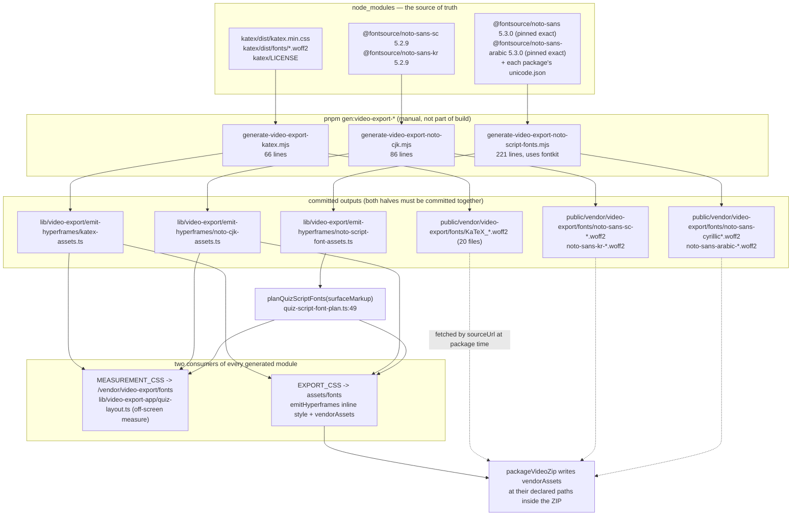
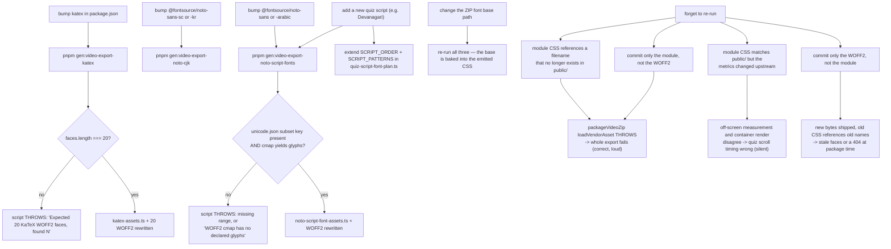

# Build-Time Asset Generation Scripts

Three `node scripts/generate-video-export-*.mjs` scripts turn npm-installed font
packages into **committed** TypeScript modules plus **committed** WOFF2 files under
`public/`. Nothing generates them at build or request time. This file covers what
each one emits, when to re-run it, and exactly what breaks when the output goes
stale.

**Sources:** `scripts/generate-video-export-katex.mjs`,
`scripts/generate-video-export-noto-cjk.mjs`,
`scripts/generate-video-export-noto-script-fonts.mjs`, `package.json:12-14`,
`lib/video-export/emit-hyperframes/{katex-assets,noto-cjk-assets,noto-script-font-assets,inter-font,quiz-script-font-plan}.ts`,
`lib/video-export-app/{quiz-layout,package-zip}.ts`,
`public/vendor/video-export/fonts/`, `render-service/docker-entrypoint.sh`.

## 1. Why prebuilt at all

Two reasons, and both make on-demand generation impossible rather than merely
slower.

1. **The render container has zero outbound network.**
   `render-service/docker-entrypoint.sh` installs an `iptables -P OUTPUT DROP`
   policy and *fails closed* if it cannot. Any font face the composition
   references must therefore already be inside the exported ZIP — a CDN
   `@font-face` `src` would silently render as a fallback face or as boxes.
2. **Pixel-identical quiz rendering across hosts.** The app measures a quiz
   question list off-screen *in the browser* to decide scroll timing, and the
   container renders it later. Those two measurements only agree if the exact
   same faces are used in both places — which is why every generated module
   exposes its CSS **twice**, once pointing at the app's `public/` URL and once at
   the ZIP-relative `assets/fonts` path.



## 2. `gen:video-export-katex`

`scripts/generate-video-export-katex.mjs` (66 lines) reads
`katex/dist/katex.min.css` from `node_modules` (`:13`) and rewrites it:

1. For each `@font-face` block containing a `url(fonts/*.woff2)`, copy the WOFF2
   into `public/vendor/video-export/fonts/` (`:26`) and re-emit a **minimal**
   face declaration keeping only `font-family`, `font-style`, `font-weight`, plus
   a forced `font-display: block` and a placeholder `src`
   (`__OPENMAIC_QUIZ_FONT_BASE__/<filename>`, `:29`).
2. Strip every original `@font-face` block from the CSS and concatenate the
   rewritten faces with the remaining rules (`:40-41`).
3. **Assert exactly 20 faces**, else throw (`:36-38`).
4. Emit a prettier-formatted module (`:63`) exporting
   `KATEX_MEASUREMENT_CSS` (placeholder → `/vendor/video-export/fonts`),
   `KATEX_EXPORT_CSS` (placeholder → `assets/fonts`), `KATEX_FONT_ASSETS`
   (20 `{ path, sourceUrl }` pairs) and `KATEX_MIT_LICENSE`.

`font-display: block` is not cosmetic: a `swap` or `auto` face could paint a
fallback glyph in the first captured frames.

The KaTeX version is read from `katex/package.json` (`:12`) and interpolated into
the generated file's header comment — so a diff of `katex-assets.ts` shows the
version bump.

## 3. `gen:video-export-noto-cjk`

`scripts/generate-video-export-noto-cjk.mjs` (86 lines) is a two-entry table
(`:7-22`), not a directory scan:

| Package | Subset | Emitted family | Filename | Licence export |
| --- | --- | --- | --- | --- |
| `@fontsource/noto-sans-sc` | `chinese-simplified` | `OpenMAIC Noto Sans SC` | `noto-sans-sc-chinese-simplified-400-normal.woff2` | `NOTO_SANS_SC_OFL_LICENSE` |
| `@fontsource/noto-sans-kr` | `korean` | `OpenMAIC Noto Sans KR` | `noto-sans-kr-korean-400-normal.woff2` | `NOTO_SANS_KR_OFL_LICENSE` |

Only weight 400 is taken. Families are **renamed with an `OpenMAIC ` prefix** so a
host-installed Noto Sans SC cannot be substituted for the vendored subset. The
script emits `NOTO_CJK_MEASUREMENT_CSS`, `NOTO_CJK_EXPORT_CSS`,
`NOTO_CJK_FONT_ASSETS` and the two licence strings, and logs the total byte count.

String escaping goes through a hand-rolled `singleQuoted` helper (`:28-35`) that
escapes backslash, quote, CR, LF, U+2028 and U+2029 — U+2028/U+2029 because they
are literal line terminators in JavaScript source and would break the emitted
module.

## 4. `gen:video-export-noto-script-fonts`

The most substantial of the three (221 lines) because it does something the others
do not: it **reads the actual WOFF2 cmap with `fontkit`** and narrows the CSS
`unicode-range` to the intersection of the declared Fontsource range and the real
glyph coverage.

| Script | Package (pinned exact) | Subsets | Emitted family |
| --- | --- | --- | --- |
| `cyrillic` | `@fontsource/noto-sans` 5.3.0 | `cyrillic`, `cyrillic-ext` | `OpenMAIC Noto Sans Cyrillic` |
| `arabic` | `@fontsource/noto-sans-arabic` 5.3.0 | `arabic` | `OpenMAIC Noto Sans Arabic` |

The pipeline per face (`:110-134`):

1. `unicodeRangeFor(face)` reads the package's `unicode.json` and **throws** when
   the subset key is missing (`:51-53`).
2. `numericRanges` parses `U+XXXX[-YYYY]` and throws on a malformed part (`:60`).
3. `openSync(fontPath).characterSet` is filtered to code points that both
   `hasGlyphForCodePoint` **and** fall inside the declared ranges (`:119-121`).
   The comment says why: "A CSS `unicode-range` can be wider than the actual
   subset cmap. Only code points present in both are safe for deterministic
   measurement" (`:130-131`).
4. Zero coverage throws (`:123-125`).
5. `compactRanges` + `cssUnicodeRange` re-serialise the intersection into a
   minimal `U+…` list (`:70-89`).

The emitted module is a `NOTO_SCRIPT_FONT_PLANS` record keyed by script
(`:197-214`), each entry carrying `measurementCss`, `exportCss`, `assets`,
`licenses` (with fixed ZIP paths `LICENSES/Noto-Sans-OFL-1.1.txt` /
`LICENSES/Noto-Sans-Arabic-OFL-1.1.txt`), `requiredFontLoads` with a literal
sample string (`'Привет Ёж Ԁ'`, `'العربية'`), and — uniquely — the numeric
`coverage` ranges.

`coverage` exists because it is consumed at *runtime*. `planQuizScriptFonts`
(`lib/video-export/emit-hyperframes/quiz-script-font-plan.ts:49`) selects packs by
Unicode property over the rendered surface markup, not by locale:

```ts
const SCRIPT_PATTERNS = {
  cyrillic: /\p{Script_Extensions=Cyrillic}/u,
  arabic:   /\p{Script_Extensions=Arabic}/u,
};
const PRIMARY_SCRIPT_PATTERNS = {
  cyrillic: /\p{Script=Cyrillic}/u,
  arabic:   /\p{Script=Arabic}/u,
};
```

Cyrillic requires a **primary**-script character to select its pack, so a
decomposed Latin accent (U+0301, whose `Script_Extensions` include Cyrillic)
cannot pull in the Cyrillic pack (`:33-40`, `:56-58`). Arabic deliberately accepts
the *extended* set because its punctuation and elongation marks are
`Script=Common` with `Script_Extensions=Arabic` (`:55-56`). Any code point the
selected pack does **not** cover — checked against the generated `coverage` ranges
— is re-emitted as an extra `requiredFontLoads` entry (`:72-80`), so the
measurement pass explicitly waits on a font that will not actually render it
rather than silently measuring a fallback.

## 5. Committed footprint

| Path | Measured | Produced by |
| --- | --- | --- |
| `public/vendor/video-export/fonts/` | **25 files, 2.0 MiB** (20 KaTeX + SC + KR + Cyrillic + Cyrillic-ext + Arabic) | the three scripts |
| `lib/video-export/emit-hyperframes/katex-assets.ts` | 100 lines | `gen:video-export-katex` |
| `lib/video-export/emit-hyperframes/noto-cjk-assets.ts` | 31 lines | `gen:video-export-noto-cjk` |
| `lib/video-export/emit-hyperframes/noto-script-font-assets.ts` | 86 lines | `gen:video-export-noto-script-fonts` |
| `lib/video-export/emit-hyperframes/inter-font.ts` | 10 lines, 69 403 bytes (~68 KiB) — line 7 alone is 64 517 characters | **hand-written, not generated** — the whole Inter variable Latin subset is a `data:font/woff2;base64` URI inside `INTER_FONT_FACE_CSS` (`:6-7`) |
| `public/vendor/gsap.min.js` | 72 927 bytes | committed vendor drop, no script |

Commands: `ls public/vendor/video-export/fonts | wc -l`,
`du -sh public/vendor/video-export/fonts`, `ls -la public/vendor/gsap.min.js`,
`wc -c -L lib/video-export/emit-hyperframes/inter-font.ts`.

GSAP is notably **not** an npm dependency of the app. It is a committed file,
fetched from `/vendor/gsap.min.js` at package time by `loadGsapSource()`
(`package-zip.ts:34`) and written into the ZIP at `project.gsapVendorPath`.

## 6. When to re-run, and what breaks if you do not



The two failure classes are worth separating:

**Loud.** `packageVideoZip` fetches each `vendorAssets[].sourceUrl` from the app's
own `public/` and **throws** on failure (`package-zip.ts:43`) — the same posture as
a missing GSAP. A generated module naming a file that is not committed fails the
whole export rather than shipping a ZIP with boxes for glyphs.

**Silent.** If the module and the files agree with each other but *disagree with
the upstream package the app also measures against*, nothing throws. The quiz
question list is measured off-screen with `KATEX_MEASUREMENT_CSS` /
`NOTO_CJK_MEASUREMENT_CSS` (`lib/video-export-app/quiz-layout.ts`), and that
measurement decides scroll duration via `QUIZ_SCROLL_PX_PER_SECOND_720P` (see
[`./06-video-export-pipeline.md`](./06-video-export-pipeline.md) §3). Different
metrics between measurement and render produce a scroll that clips content or
holds too long — a visual regression with no diagnostic.

Both scripts that can detect a mismatch do so aggressively at *generation* time —
the 20-face assertion, the missing-subset throw, the empty-cmap throw. There is no
CI gate that re-runs them and diffs the output, so "regenerate and commit" is a
manual discipline enforced only by review.

## Open questions

- No CI step verifies that the committed modules match what the scripts would
  emit from the currently-installed packages. `.github/workflows/ci.yml` has no
  `gen:video-export-*` invocation.
- `inter-font.ts` is hand-written while its siblings are generated, and its
  source is named in a comment (`@fontsource-variable/inter/files/inter-latin-wght-normal.woff2`,
  `:3`) rather than resolved from `node_modules`. Because the face is a base64
  data URI it needs no `vendorAssets` entry — which is why a non-quiz export ships
  `vendorAssets: []` yet still renders Inter — but nothing checks that the embedded
  bytes match the installed `@fontsource-variable/inter` version.
- `@fontsource/noto-sans` and `@fontsource/noto-sans-arabic` are pinned **exact**
  (`package.json:171-172`) while the CJK packages use carets
  (`:60-61`). The asymmetry is presumably because the script-font generator reads
  `unicode.json` and the cmap, but no comment states it.
