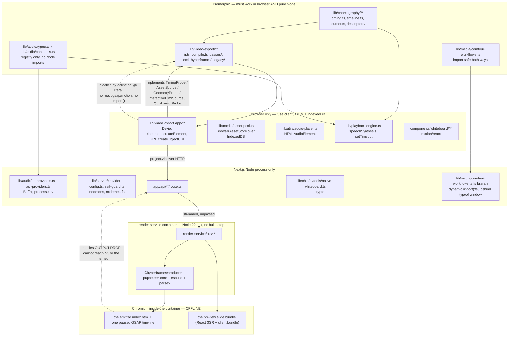
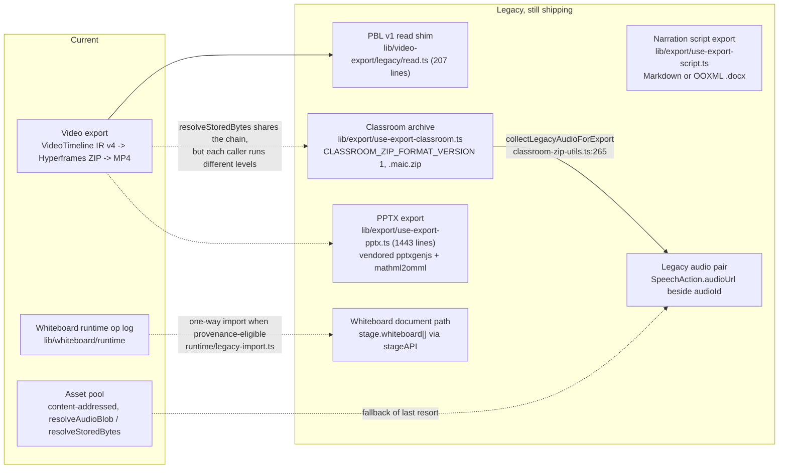

# Execution Constraints and Legacy Export Paths

This subsystem spans four execution environments — the browser, the Next.js Node
process, a separate Node container, and an offline Chromium inside that container.
Several of its least obvious design decisions exist only because of that spread.
This file maps which code runs where, how each boundary is enforced, and the
legacy export paths that still ship alongside the current ones.

**Sources:** `eslint.config.mjs:254-533`,
`tests/video-export/{eslint-boundary,export-loading-boundary}.test.ts`,
`lib/choreography/**`, `lib/video-export/**`, `lib/video-export-app/**`,
`lib/audio/{constants,types,tts-providers}.ts`,
`lib/media/{comfyui-workflows,asset-pool}.ts`,
`lib/media/adapters/comfyui-image-adapter.ts`, `lib/utils/audio-player.ts`,
`lib/whiteboard/runtime/legacy-import.ts`, `lib/video-export/legacy/read.ts`,
`lib/export/**`, `render-service/**`;
[`../appendix/research/media-audio-video/03b-flows-video-export.md`](../appendix/research/media-audio-video/03b-flows-video-export.md).

## 1. Which code runs where

| Code | Runs where | How the boundary is enforced |
| --- | --- | --- |
| `lib/choreography/**` | browser **and** pure Node | eslint `no-restricted-syntax` + `no-restricted-imports` (`eslint.config.mjs:254-329`) |
| `lib/video-export/**` (root) | browser **and** pure Node | `eslint.config.mjs:348-415` |
| `lib/video-export/{passes,legacy}/**` | browser **and** pure Node | `eslint.config.mjs:419-492` (a *separate, deeper* allowlist) |
| `lib/video-export/emit-hyperframes/**` | browser **and** pure Node | `eslint.config.mjs:498-533` |
| `lib/video-export-app/**` | browser only | `'use client'`; Dexie, `document.createElement('video'\|'audio'\|'canvas')`, `URL.createObjectURL`, `@openmaic/renderer/snapshot` |
| `lib/audio/constants.ts`, `lib/audio/types.ts` | both | file header states the split: kept free of Node libs so client components can import the registry (`constants.ts:5-8`) |
| `lib/audio/tts-providers.ts` | Next Node process | uses `Buffer` and `process.env`; `browser-native-tts` throws with a client-side directive (`:246-249`) |
| `lib/media/comfyui-workflows.ts` | import-safe both ways; `fs` paths server-only | `typeof window === 'undefined'` wrapping a **dynamic** `import('fs')` (`:77-81`) |
| `render-service/src/**` | the container only | its own `package.json` / `tsconfig.json` / `vitest.config.ts`, run via `tsx` |
| the emitted `index.html` | Chromium in the container, **offline** | the ZIP is self-contained; `iptables -P OUTPUT DROP` blocks everything but loopback and established replies |

## 2. The eslint fence, precisely

Four separate config blocks, not one. They exist because a single `../…` means
different things at different depths, and flat config *replaces* rule options per
key rather than merging them — so the shared guards are duplicated verbatim in
each block.

| Block | Files | Permitted import sources |
| --- | --- | --- |
| `:254-329` | `lib/choreography/**` | `@openmaic/dsl`(+subpaths), `zod`, in-folder `./…` |
| `:348-415` | `lib/video-export/*` (root only) | `@openmaic/dsl`, `zod`, `../choreography`, `./…` |
| `:419-492` | `lib/video-export/{passes,legacy}/**` | `@openmaic/dsl`, `zod`, `../../choreography`, `./…`, **one** `../…` (which stays inside the module) |
| `:498-533` | `lib/video-export/emit-hyperframes/**` | `./…`, one `../…`, and exactly `../../quiz/math-text` |

The comment at `:336-343` spells out the reasoning: "from a module-root file it
escapes the module (`lib/video-export/../action` = `lib/action`), but from
`passes/` it stays inside (`lib/video-export/passes/../ir` =
`lib/video-export/ir`)". The allowlists are written as **negative lookaheads** on
the import-source literal (e.g.
`Literal.source[value=/^(?!@openmaic\/dsl(\/|$)|zod(\/|$)|\.\//).+/]`) so the guard
is a true allowlist rather than a blocklist of known-bad names.

All four blocks also forbid `ImportExpression` (dynamic `import()`) and
`CallExpression[callee.name='require']` — either would bypass the static
allowlist and could pull in a render backend at runtime.

The first three blocks add two guards the fourth does not have:

- a `@/…` host-app path in both literal forms — `Literal[value=/^@\//]` and
  `TemplateElement[value.cooked=/^@\//]` (`:260`, `:265`; `:354`, `:359`;
  `:428`, `:433`);
- `no-restricted-imports` on `react`, `react-dom`, `gsap`, `framer-motion`,
  `motion` and their subpaths (`:306`, `:392`, `:469`) — these are *bare*
  specifiers the `@/…` selector cannot see.

The `emit-hyperframes` block (`:498-533`) is deliberately thinner: it carries
`no-restricted-syntax` only, with the three import-source allowlist selectors
plus the two dynamic-load selectors and nothing else. `react`, `gsap` and
`motion` are rejected there *by the allowlist itself* — they are neither `./…`,
one `../…`, nor exactly `../../quiz/math-text` — so a second bare-specifier rule
would be redundant. The consequence of the missing `@/…` selectors is narrow but
real: in that subtree a `@/…` string that is not an import source (an emitted
asset path in a template literal, say) is not flagged at all.

That one exception, `../../quiz/math-text`, is the shared pure quiz math
renderer, allowed "so classroom and exported formulas cannot drift"
(`:494-497`).

`tests/video-export/eslint-boundary.test.ts` runs the **real ESLint against the
real config** over in-memory text at
`lib/video-export/emit-hyperframes/probe.ts`, with seven negative cases (host
alias, sibling app module, named re-export, star re-export, React, dynamic
import, `require`) and one positive case. Line 9 makes an eslint-ignored path a
sentinel failure rather than a silent pass — so narrowing the config's scope
fails a test rather than quietly disabling the guard.

## 3. The other machine-enforced boundary: bundle loading

The compiler, emitter and JSZip must not enter the main client bundle.
`tests/video-export/export-loading-boundary.test.ts` asserts this by *reading the
source text* of four client entry points —
`components/stage/video-export-dialog.tsx`, `lib/store/video-render.ts`,
`lib/video-export-app/use-export-video.ts`,
`lib/video-export-app/use-download-subtitles.ts` — and requiring that none of
them statically imports anything matching `build-export-zip`, *and* that the
three that need it contain the exact string
`await import('…/build-export-zip')`.

That is a textual test, not a bundle-size test, which is the pragmatic choice: it
fails on the code change that would cause the regression rather than on a
threshold that drifts.

## 4. Constraints that shaped specific designs

Each of these exists *because* of a boundary above.

| Constraint | Consequence |
| --- | --- |
| The compiler cannot touch Dexie or the DOM | Five **synchronous** DI interfaces (`lib/video-export/deps.ts`) and a `duration` persisted at TTS time so `TimingProbe.audioDurationMs` needs no promise |
| The compiler cannot import GSAP | The emitter produces GSAP *statements as strings*; the browser never evaluates them, Chromium does |
| Chromium is offline | Every font ships inside the ZIP (see [`./08-asset-generation-scripts.md`](./08-asset-generation-scripts.md)); GSAP is vendored to `public/vendor/gsap.min.js` and copied in |
| `hyperframes preview` and `hyperframes render` differ in window size | No `vw` units anywhere in the emitted CSS; cover CSS is written at `COVER_DESIGN_WIDTH = 1280` and scaled numerically (`emit-hyperframes/index.ts:789`, `:1064`) |
| No `Date.now` / `Math.random` at render time | Determinism red-line stated at `emit-hyperframes/index.ts:18-20`, enforced downstream by `hyperframes lint` |
| The settings store (client) imports `image-providers.ts` | `comfyui-workflows.ts` must be import-safe in the browser → dynamic `import('fs')` behind a `typeof window` guard the bundler can dead-code-eliminate (`:15-22`, `:64-71`) |
| `browser-native-tts` has no server implementation | `generateTTS` throws for it (`tts-providers.ts:246`); the route rejects it (`app/api/generate/tts/route.ts:65`); the `PlaybackEngine` handles it with `SpeechSynthesisUtterance` |
| `speechSynthesis.pause()` is broken on Firefox | Pause saves the remaining browser-TTS chunks and calls `cancel()` instead (`lib/playback/engine.ts:244-247`) |
| `cancel()` can fire `onend` synchronously | The engine sets `mode` *before* stopping audio (`engine.ts:459`) |
| A cross-origin legacy audio URL has no CORS headers | `AudioPlayer` falls back to handing the URL to the media element, which is not CORS-bound (`audio-player.ts:126-131`) |
| Chromium must run `--no-sandbox` in a container | The container drops to an unprivileged `render` user via `setpriv` after installing iptables (`docker-entrypoint.sh:71-73`) |
| `@hyperframes/producer` auto-starts a server when the entry is `src/server.ts` | The render-service entry is named `main.ts` (`main.ts:19-23`) |

## 5. Legacy export paths still in the tree

Six distinct legacy surfaces coexist with the current ones. None is dead code;
each has a stated reason to remain.

**(1) The classroom archive.** `lib/export/use-export-classroom.ts` (300 lines)
writes a `.maic.zip` (`CLASSROOM_ZIP_EXTENSION`,
`CLASSROOM_ZIP_FORMAT_VERSION = 1`, `classroom-zip-types.ts:11-12`) containing a
`ClassroomManifest` plus a media index. It predates video export and inlines
interactive HTML assets through a 727-line `inline-assets.ts` pipeline. It carries
its own legacy-audio path: `collectLegacyAudioForExport`
(`classroom-zip-utils.ts:265`) and `legacyAudioArchivePath` (`:111`) exist beside
the modern `collectAudioFiles` (`:144`) / `audioArchivePath` (`:103`), and
`rewriteAudioRefsToIds` (`:356`) normalises references on the way out.

**(2) PPTX export.** `lib/export/use-export-pptx.ts` (1443 lines) over the
vendored `packages/pptxgenjs` + `packages/mathml2omml` forks. Covered in
[`../07-dsl-renderer-editor/index.md`](../07-dsl-renderer-editor/index.md); it
shares only `resolveStoredBytes` with this subsystem.

**(3) Narration script export.** `lib/export/use-export-script.ts` (259 lines) —
downloads `SpeechAction.text` per scene as Markdown or a genuine OOXML `.docx`.
Its header states it exists because "teachers want the TTS narration text as a
local document for lesson prep/reference, not just the PPTX export" (issue #413),
and it is deliberately pure client-side: store read, serialise, `saveAs`, no
server route and no media work.

**(4) PBL v1 read shim.** `lib/video-export/legacy/read.ts` is inside the *pure*
compiler and its header is explicit: "This module is kept indefinitely so
historical scenes remain exportable. Writers must never import it to create or
project legacy PBL shapes" (`:3-5`). It reads unknown-shaped records defensively
(`isRecord`, `isRecordArray`, `records`) and produces a `LegacyPblCover`.

**(5) Two whiteboard substrates.** `stage.whiteboard[]` (document) and the runtime
op log both exist; `components/whiteboard/index.tsx:39-43` picks per render, and
`lib/whiteboard/runtime/legacy-import.ts` migrates document → log **one way**, only
when `isLegacyWhiteboardAutoImportEligible()` (`:43`) finds all three of
`NEXT_PUBLIC_PERSISTENCE !== '1'`, no configured document storage and no configured
runtime storage. See [`./03-whiteboard.md`](./03-whiteboard.md) §2.

**(6) The legacy audio pair.** An unconverted document holds both `audioId` and
`audioUrl` on a `SpeechAction`; a converted one carries no `audioUrl`
(`lib/utils/audio-player.ts:88-93`). Three consumers still honour it: the player
(§4 above), `createVideoTimelineDeps` (fetches the URL only when the id produced no
bytes, `timeline-deps.ts:299-301`, bounded at 15 s), and the classroom archive.

## 6. Where the boundaries are *not* enforced

Honest gaps, each verified:

- **`lib/video-export-app/**` has no eslint fence.** Its purity is one-directional
  (it may import the pure modules; they may not import it), and only the pure side
  is guarded. Nothing stops a future edit from importing `video-export-app` *from*
  a component that also runs during SSR.
- **`lib/choreography`'s animation descriptors are hand-transcribed mirrors** of
  the React overlay components, not generated from them. The timing *constants* are
  imported by both sides; the descriptors are consumed only by the exporter and a
  schema test.
- **One duplicated timing literal.** `Math.min(380 + n * 55, 1400)` appears in both
  `components/whiteboard/index.tsx:81` and `lib/choreography/timing.ts:72`
  (`wbClearMs`). They agree today; nothing enforces it.
- **No CI check regenerates the font modules** and diffs them (see
  [`./08-asset-generation-scripts.md`](./08-asset-generation-scripts.md) §6).
- **`e2e/` is excluded from both tsconfig and ESLint** with no `tsc` step anywhere,
  so any export-related Playwright spec is unchecked.

## Open questions

- Whether any component outside `lib/video-export-app/**` imports it during SSR was
  not audited; the loading-boundary test only covers four named client entries.
- The classroom archive (`.maic.zip` v1) and the video export ZIP both package
  media, with different byte-resolution policies through the same
  `resolveStoredBytes` options. Whether the two can disagree on which bytes are
  authoritative for the same ref was not tested.
- `render-service/vitest.config.ts` is a separate Vitest project; `.github/`
  runs it as its own CI job, but no test crosses the app↔service boundary end to
  end (the handover is only exercised in unit form on each side).
