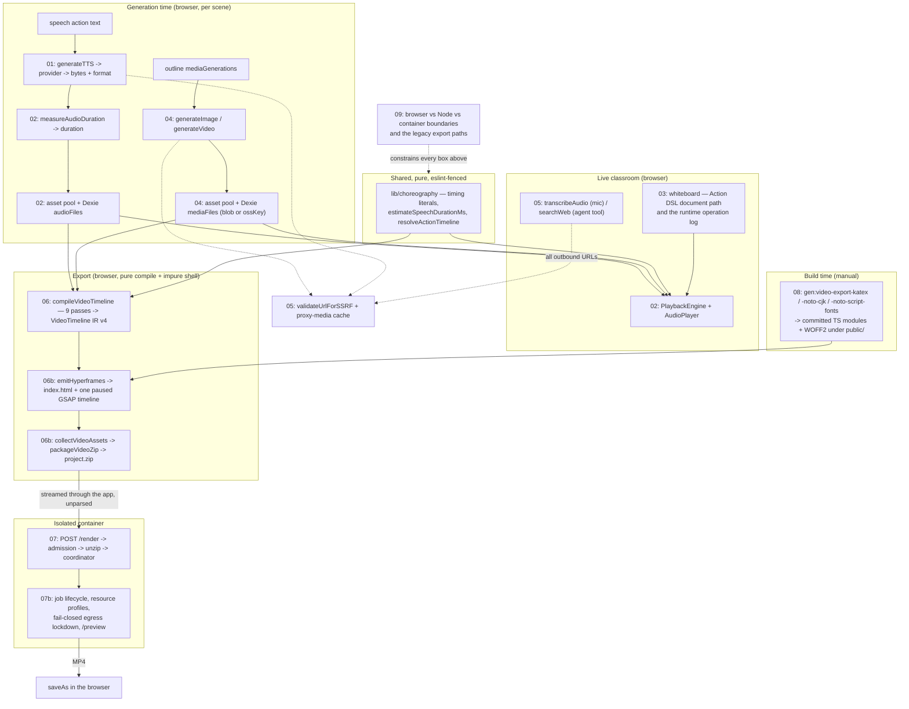

# Component View: TTS, Audio, Whiteboard, Images, Video Export

This topic is the C4 level-3 view of everything OpenMAIC does with media bytes:
turning narration text into audio with a known duration, drawing on a whiteboard,
generating images and video clips, transcribing speech, searching the web, and
compiling a finished classroom into a self-contained video project that a
separate container encodes to MP4.

## What this topic covers

Five cooperating layers plus one isolated container:

1. **TTS / ASR** — one provider-neutral adapter (`generateTTS`,
   `lib/audio/tts-providers.ts:207`) fanning out to ten TTS and six ASR
   providers, each with its own wire format, under a combined
   cancel-plus-timeout signal.
2. **The narration/timing contract** — `measureAudioDuration`
   (`lib/audio/audio-duration.ts:210`) parses WAV/MP3 headers with no DOM, and
   the resulting `duration` is stored on the audio record at synthesis time.
   That is what lets the export compiler's dependency-injection surface be
   *synchronous*.
3. **The whiteboard** — not a mutable document but an append-only log of five
   operations folded on read, plus a parallel document-shaped path driven by the
   21-verb Action DSL.
4. **Image / video / transcription / search providers** — eight image, six
   video, six ASR and nine web-search backends, all behind one exhaustive
   `switch` each, all outbound URLs funnelled through one SSRF guard.
5. **Video export** — a machine-enforced *pure* nine-pass compiler producing the
   `VideoTimeline` IR, a pure emitter turning that IR into one `index.html`
   driven by a single paused GSAP timeline, an impure browser shell that supplies
   bytes and packages the ZIP, and `render-service/` — a Node 22 + Chromium +
   FFmpeg container with its own kernel-level egress lockdown.

## Who this is for

A staff engineer who needs to change synthesis, playback timing, whiteboard
semantics, media provider wiring, or the video pipeline without breaking the
invariant that live playback and the exported video dwell identically.

Read [`../08-classroom-runtime/index.md`](../08-classroom-runtime/index.md)
first if you do not yet know what a `Scene`, an `Action` or the `PlaybackEngine`
is — this topic assumes that vocabulary. Read
[`../04-ai-provider-layer/index.md`](../04-ai-provider-layer/index.md) for how
provider credentials and model pins resolve in general; this topic documents only
the media-specific parts of that mechanism. The set root is `../README.md`.

## Sources

Everything here was verified against the working tree at `c2c9553a` (branch
`main`). Primary code paths:

| Area | Paths |
| --- | --- |
| TTS / ASR | `lib/audio/**` (28 files), `app/api/generate/tts/route.ts`, `app/api/transcription/route.ts`, `app/api/azure-voices/route.ts` |
| Server-side provider policy | `lib/server/provider-config.ts`, `lib/server/classroom-media-generation.ts` |
| Audio playback | `lib/utils/audio-player.ts`, `lib/playback/engine.ts`, `lib/choreography/**` |
| Whiteboard | `lib/whiteboard/**` (7 files), `lib/chat/pi/tools/native-whiteboard.ts`, `lib/action/engine.ts`, `lib/api/stage-api-whiteboard.ts`, `components/whiteboard/**` |
| Image / video / assets | `lib/media/**` (39 files incl. 14 adapters), `app/api/generate/image/route.ts`, `app/api/proxy-media/route.ts`, `app/api/comfyui-workflows/route.ts` |
| Web search | `lib/web-search/**` (14 files), `app/api/web-search/route.ts` |
| Egress guard | `lib/server/ssrf-guard.ts` |
| Video export | `lib/video-export/**` (29 files), `lib/video-export-app/**` (12 files), `lib/store/video-render.ts`, `app/api/export-video/**` |
| Render service | `render-service/**` (17 src files), `render-service/Dockerfile`, `render-service/docker-entrypoint.sh`, `docker-compose.yml` |
| Build-time assets | `scripts/generate-video-export-{katex,noto-cjk,noto-script-fonts}.mjs`, `public/vendor/video-export/fonts/` |
| Boundaries | `eslint.config.mjs:254-533` |

Evidence packs (verbatim signatures and traced flows, written before this topic):

- [`../appendix/research/media-audio-video/00-overview.md`](../appendix/research/media-audio-video/00-overview.md)
- [`../appendix/research/media-audio-video/01a-modules-audio-media.md`](../appendix/research/media-audio-video/01a-modules-audio-media.md)
- [`../appendix/research/media-audio-video/01b-modules-video-whiteboard.md`](../appendix/research/media-audio-video/01b-modules-video-whiteboard.md)
- [`../appendix/research/media-audio-video/02a-interfaces-tts-asr.md`](../appendix/research/media-audio-video/02a-interfaces-tts-asr.md) … `02g-interfaces-render-service.md`
- [`../appendix/research/media-audio-video/03a-flows-audio-media.md`](../appendix/research/media-audio-video/03a-flows-audio-media.md), [`03b-flows-video-export.md`](../appendix/research/media-audio-video/03b-flows-video-export.md)
- [`../appendix/research/media-audio-video/04-dependencies-and-config.md`](../appendix/research/media-audio-video/04-dependencies-and-config.md), [`05-failure-modes.md`](../appendix/research/media-audio-video/05-failure-modes.md), [`06-quality-and-metrics.md`](../appendix/research/media-audio-video/06-quality-and-metrics.md), [`07-open-questions.md`](../appendix/research/media-audio-video/07-open-questions.md)

## Topic overview

## Section files

| File | Contents |
| --- | --- |
| [`01-tts-adapters.md`](./01-tts-adapters.md) | The `generateTTS` adapter, all ten providers and their wire formats, voice/model pinning including the classroom pins, caching, and the audio format contract. |
| [`02-audio-pipeline.md`](./02-audio-pipeline.md) | Synthesis → storage → delivery → playback, and how narration dwell aligns with the shared choreography clock. |
| [`03-whiteboard.md`](./03-whiteboard.md) | The two whiteboard write paths, the five-operation log and its fold, how an agent emits a drawing command, and the replay/projection runtime. |
| [`04-image-generation.md`](./04-image-generation.md) | Eight image providers, six video providers, ComfyUI workflow discovery and patching, and the asset-storage path from provider response to durable bytes. |
| [`05-transcription-and-search.md`](./05-transcription-and-search.md) | ASR providers and web-search backends, plus the SSRF/egress controls on `proxy-media`, `web-search` and their siblings. |
| [`06-video-export-pipeline.md`](./06-video-export-pipeline.md) | The `VideoTimeline` IR, the synchronous DI boundary, and the nine pure compiler passes one at a time. |
| [`06b-video-export-emitter.md`](./06b-video-export-emitter.md) | The Hyperframes emitter, one export end to end, and the degradation catalogue. Split out of `06` at the 350-line ceiling. |
| [`07-render-service.md`](./07-render-service.md) | The standalone MP4 renderer: why it is separate, its HTTP contract, admission ordering, and the handover from the app. |
| [`07b-render-service-lifecycle.md`](./07b-render-service-lifecycle.md) | Job lifecycle, resource profiles, fail-closed startup and egress lockdown, and `/preview`. Split out of `07`. |
| [`08-asset-generation-scripts.md`](./08-asset-generation-scripts.md) | The three `gen:video-export-*` scripts: what they emit, when to re-run them, and what breaks if they go stale. |
| [`09-execution-constraints.md`](./09-execution-constraints.md) | Which code runs in the browser, in Node, or in the render container — and the legacy export paths this subsystem still carries. |

## Reading order

`01` → `02` establishes the audio contract everything downstream depends on.
`06` → `06b` → `07` → `07b` is the export spine, in that order. `03`, `04`, `05`
and `08` are independent and can be read on demand. `09` is the cross-cutting
summary; read it last, or first if you are about to move code between runtimes.
