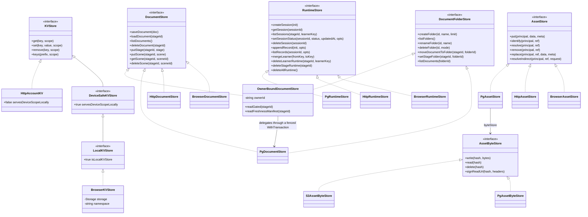
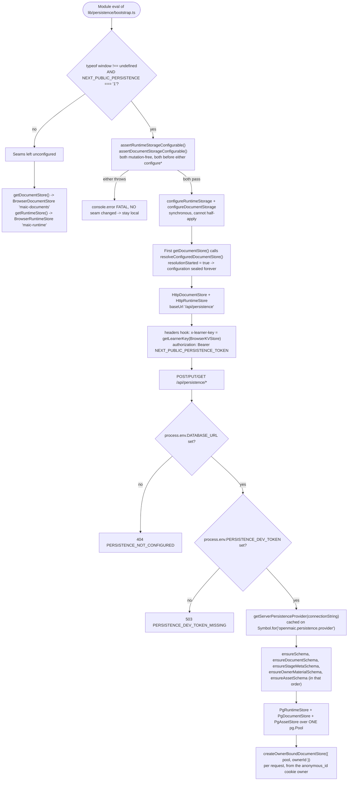
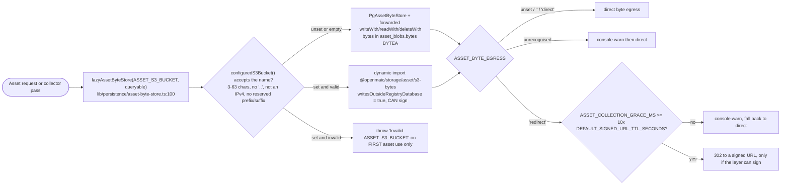

# The storage abstraction and its backends

The five persistence primitives `@openmaic/storage` defines, every backend that
ships for each, the injected-driver seam that keeps the package driver-free, and
the exact single-shot logic that picks a backend at runtime. Read this before
[`02-data-model.md`](docs/10-persistence-and-state/02-data-model.md) — the tables only make sense once you know which backend owns
them.

**Sources:** `packages/@openmaic/storage/src/index.ts`, `src/kv/types.ts`,
`src/document/types.ts`, `src/runtime/types.ts`, `src/asset/types.ts`,
`src/asset/byte-store.ts`, `src/agent-session/types.ts`, `src/runtime/pg.ts`,
`src/server/index.ts`, `src/zustand/persist.ts`; `lib/persistence/bootstrap.ts`,
`lib/persistence/server-provider.ts`, `lib/persistence/asset-byte-store.ts`,
`lib/document-store/config.ts`, `lib/document-store/store.ts`,
`lib/runtime/config.ts`, `lib/runtime/store.ts`, `lib/runtime/learner-key.ts`,
`app/api/persistence/[...path]/route.ts`; evidence
[../appendix/research/persistence-storage-state/01a-modules-package.md](docs/appendix/research/persistence-storage-state/01a-modules-package.md),
[02a-interfaces-abstraction.md](docs/appendix/research/persistence-storage-state/02a-interfaces-abstraction.md),
[04-dependencies-and-config.md](docs/appendix/research/persistence-storage-state/04-dependencies-and-config.md).

> **`lib/storage/` is not this package** — it is one 32-line browser upload helper posting
> to a route this repository does not serve, and four other things also answer to "storage".
> [01b-adjacent-modules-and-name-collisions.md](docs/10-persistence-and-state/01b-adjacent-modules-and-name-collisions.md).

## Charter: the backend is the seam, not the driver

[`packages/@openmaic/storage/src/index.ts:1-23`](packages/@openmaic/storage/src/index.ts#L1-L23) states it in the module comment:
`@openmaic/dsl` owns *what* persists (document/runtime shape, validation,
migration, the asset `StorageProvider` interface); this package owns *where and
how*. Two consequences you will feel immediately:

1. Every PostgreSQL backend takes an injected `Queryable` / `WithTransaction` and
   imports no driver. The only `pg` import in the whole subsystem is in the app
   ([`lib/persistence/server-provider.ts:8`](lib/persistence/server-provider.ts#L8)).
2. Each primitive's backends are held to one shared contract suite, so "does the
   HTTP backend behave like the browser one" is a test question, not a review
   question — 12 of the package's 47 test files are those suites.

Package version `0.28.1`, 14 904 source lines against 17 068 test lines, 16
subpath exports ([`packages/@openmaic/storage/package.json:9-72`](packages/@openmaic/storage/package.json#L9-L72)), sole runtime
dependency `@openmaic/dsl`, two optional peers (`@aws-sdk/client-s3`,
`@aws-sdk/s3-request-presigner`).

## The five primitives

| Primitive | Interface | Unit of work | Backends shipped |
| --- | --- | --- | --- |
| KV | `KVStore` ([`src/kv/types.ts:15`](packages/@openmaic/storage/src/kv/types.ts#L15)) | one small JSON value under a key, in one of two scopes | browser `localStorage`, HTTP `account`-only |
| Document | `DocumentStore` ([`src/document/types.ts:180`](packages/@openmaic/storage/src/document/types.ts#L180)) | a course aggregate: `{ stage, scenes, outline?, dslVersion? }` | browser IndexedDB, HTTP, PostgreSQL |
| Runtime | `RuntimeStore` ([`src/runtime/types.ts:96`](packages/@openmaic/storage/src/runtime/types.ts#L96)) | a learner session plus its append-only `seq`-ordered records | browser IndexedDB, HTTP, PostgreSQL |
| Asset | `AssetStore` ([`src/asset/types.ts:140`](packages/@openmaic/storage/src/asset/types.ts#L140)) | content-addressed bytes behind an allocated `AssetId` | browser IndexedDB pool, HTTP, PostgreSQL registry over a pluggable byte layer |
| Agent session family | `AgentSessionStore` plus 5 sibling interfaces — `AgentSessionTitleStore`, `AgentSessionEventLog`, `AgentSessionEntryTree`, `OwnerSessionEventProjection`, `AgentSessionUrlStore` ([`src/agent-session/types.ts:269,345,376,416,454,576`](packages/@openmaic/storage/src/agent-session/types.ts#L269)); `AgentSessionTransaction` ([`:482`](packages/@openmaic/storage/src/agent-session/types.ts#L482)) and `AgentSessionHooks` ([`:495`](packages/@openmaic/storage/src/agent-session/types.ts#L495)) are wiring, not stores | a durable agent run: lifecycle, lease, event log, entry tree, owner projection, URL allowlist | PostgreSQL only |

Two more PostgreSQL-only stores sit beside the family: session materials
(`src/material/`) and user skills (`src/skill/`). One entity in the whole
subsystem has a **filesystem** backend and no interface at all: usage metering
appends JSONL to `data/usage/<YYYY>-<MM>.jsonl` ([`lib/server/usage-storage.ts:132`](lib/server/usage-storage.ts#L132)).

### KV: the scope axis is type-enforced

`KVScope = 'device' | 'account'` ([`src/kv/types.ts:8`](packages/@openmaic/storage/src/kv/types.ts#L8)); default `account`
(`DEFAULT_KV_SCOPE`, `:58`). `device` values must never leave the machine, and
that is not a convention — it is three type layers:

- `KVStore` (`:15`) — `get`/`set`/`remove`/`keys`, all scope-taking.
- `DeviceSafeKVStore` (`:40`) — brands `servesDeviceScopeLocally: true`. The
  comment explains why the brand has to exist: a purely networked store
  structurally satisfies `KVStore`, so a `KVStore`-typed parameter asking for
  device safety "would happily accept a pure network transport" (`:31-38`).
- `LocalKVStore` (`:53`) — additionally `isLocalKVStore: true`; what a composite
  demands of the backend it injects for `device`, because "nesting one inside
  another is a loop of routers with no local floor" (`:48-52`).

`assertKVScope` (`:83`) fails closed on an unrecognised scope rather than
guessing, and there is deliberately **no key validator** (`:95-117`): transport
limits belong to `HttpAccountKV`, not to the primitive. The zustand adapter
([`src/zustand/persist.ts:54-75`](packages/@openmaic/storage/src/zustand/persist.ts#L54-L75)) exposes two overloads and deliberately omits a
`(KVStore, KVScope)` one, since that overload "would match every call the two
above reject, handing the guard straight back" (`:56-58`).

## Class structure



`HttpAccountKV` declares `servesDeviceScopeLocally: false`, which is not
assignable to the `true` the brand requires — "claiming the capability would mean
writing the lie out by hand" ([`src/kv/types.ts:34-38`](packages/@openmaic/storage/src/kv/types.ts#L34-L38)).
`AssetByteStore.signReadUrl` is optional and the PostgreSQL byte column omits it
entirely, so `resolveIndirect` does not take a blob-row lock before declining
([`lib/persistence/asset-byte-store.ts:117-123`](lib/persistence/asset-byte-store.ts#L117-L123)).

## The injected database surface

Every PostgreSQL backend depends on exactly this, declared once in
[`packages/@openmaic/storage/src/runtime/pg.ts:41-53`](packages/@openmaic/storage/src/runtime/pg.ts#L41-L53) and reused by the document,
asset, agent-session, material and skill backends:

```ts
export interface Queryable {
  query<TRow extends Record<string, unknown> = Record<string, unknown>>(
    text: string,
    params?: unknown[],
  ): Promise<QueryResult<TRow>>;
}
export type WithTransaction = <T>(body: (queryable: Queryable) => Promise<T>) => Promise<T>;
```

The module comment names the shortcut it forbids: `(body) => body(sharedClient)`
"is unsafe because concurrent calls can interleave in one transaction"
([`runtime/pg.ts:9-11`](packages/@openmaic/storage/src/runtime/pg.ts#L9-L11)). The app supplies the real implementation via
`nodePostgresTransaction` from the package's reference module
([`lib/persistence/server-provider.ts:48`](lib/persistence/server-provider.ts#L48)). JSONB payloads are additionally
narrowed to values that round-trip losslessly — `Date`, `Map`, nested
`undefined`, non-finite numbers and strings containing NUL are rejected
([`runtime/pg.ts:11-12`](packages/@openmaic/storage/src/runtime/pg.ts#L11-L12), enforced in `runtime/json-value.ts`).

## Backend selection

Selection happens in two independent places: once per browser session at module
eval, and once per server process on first request.



Precise rules, in evaluation order:

| Step | Rule | Where |
| --- | --- | --- |
| 1 | An explicit `deps.store` wins and is wrapped by `withPlainJsonDocumentWrites` | [`lib/document-store/store.ts:64`](lib/document-store/store.ts#L64) |
| 2 | An explicit `deps.indexedDB` / `deps.dbName` builds a fresh `BrowserDocumentStore` (test isolation only) | [`store.ts:65`](lib/document-store/store.ts#L65) |
| 3 | Otherwise `defaultStore ??= resolveConfiguredDocumentStore() ?? createBrowserStore({})` | [`store.ts:68-71`](lib/document-store/store.ts#L68-L71) |
| 4 | `??=` assigns only on success, so a throwing factory is retried, never cached | [`store.ts:66-67`](lib/document-store/store.ts#L66-L67) |
| 5 | `resolveConfiguredDocumentStore()` sets `resolutionStarted = true`, permanently sealing configuration even if resolution failed | [`lib/document-store/config.ts:104-111`](lib/document-store/config.ts#L104-L111), [`:69-78`](lib/document-store/config.ts#L69-L78) |
| 6 | The browser fallback probes the **capability**, not the environment, so node runners injecting a fake `indexedDB` work | [`store.ts:47-51`](lib/document-store/store.ts#L47-L51) |

Runtime storage is the same shape ([`lib/runtime/config.ts:42-62`](lib/runtime/config.ts#L42-L62),
[`lib/runtime/store.ts:35-51`](lib/runtime/store.ts#L35-L51)) with one addition: it latches
`usesDefaultBrowserStore` so the stage-deletion cascade knows whether the
`indexedDB.databases()` existence probe applies ([`lib/runtime/store.ts:63-69`](lib/runtime/store.ts#L63-L69)) —
opening the store would *create* the database, which a delete must not do on a
device that never wrote runtime data.

Runtime storage also owns the learner identity: `getLearnerKey`
([`lib/runtime/learner-key.ts:81`](lib/runtime/learner-key.ts#L81)) reads or mints `anon:<uuid>` under KV `device`
key `runtime.learnerKey` (`:17`), minting inside the Web Lock `maic:learner-key`
(`:19,52-59`). Without Web Locks it degrades to read-after-write with a
documented residual race that "merely splits one anonymous learner's local
history" (`:61-66`).

## KV has no server side in this repo

`src/kv/http.ts` is a complete client for a `/kv/entries/:key` + `/kv/keys`
contract, and
[`packages/@openmaic/storage/docs/kv-http-contract.md`](packages/@openmaic/storage/docs/kv-http-contract.md)
specifies it.
But `packages/@openmaic/storage/src/server/` contains only `asset.ts`,
`document.ts`, `index.ts`, `read-json.ts`, `reference.ts` — no `kv.ts` — and
`HttpAccountKV` / `HttpKVStore` are referenced nowhere in `lib`, `app`,
`components` or `tests` (verified: zero matches). `resolveKv`
([`lib/store/kv-persist.ts:470-474`](lib/store/kv-persist.ts#L470-L474)) can only produce a `BrowserKVStore` — or
`null`, where no ambient `localStorage` is reachable at all.

**Consequence:** `account`-scoped KV — provider API keys, models, the user
profile — is device-local in every shipped deployment mode, even though the
scope's whole purpose is cross-device sync. See
[03-client-state-stores.md](docs/10-persistence-and-state/03-client-state-stores.md) and
[08-data-lifecycle.md](docs/10-persistence-and-state/08-data-lifecycle.md).

## The asset byte layer is a second, independent selection



Two design points worth carrying: the byte layer is *lazy* precisely so a bad
bucket name fails asset requests and only asset requests, never document or
runtime traffic ([`asset-byte-store.ts:87-99`](lib/persistence/asset-byte-store.ts#L87-L99)); and it is *shared* with the
collector rather than owned by the route, because "a collector holding a
PostgreSQL byte store while the route writes to S3 would drop the blob row and
leave the object behind forever" ([`asset-byte-store.ts:3-8`](lib/persistence/asset-byte-store.ts#L3-L8)). The route says the
same from its side and explains why it does not schedule reclamation itself: a
route module has no once-per-process guarantee
([`app/api/persistence/[...path]/route.ts:100-104`](app/api/persistence/[...path]/route.ts#L100-L104)).

## Configuration surface

| Variable | Effect when set | Where read |
| --- | --- | --- |
| `NEXT_PUBLIC_PERSISTENCE` | `'1'` in a browser flips documents + runtime to HTTP stores. Inlined at build time. | [`lib/persistence/bootstrap.ts:16`](lib/persistence/bootstrap.ts#L16) |
| `NEXT_PUBLIC_PERSISTENCE_TOKEN` | Bearer token sent on every persistence request. Compiled into the public bundle — **not a secret**. | [`bootstrap.ts:34-38`](lib/persistence/bootstrap.ts#L34-L38) |
| `DATABASE_URL` | Required for any server persistence; absent → 404 `PERSISTENCE_NOT_CONFIGURED`. | [`route.ts:271-274`](app/api/persistence/[...path]/route.ts#L271-L274) |
| `PERSISTENCE_DEV_TOKEN` | Required once `DATABASE_URL` is set; absent → 503. Compared with a SHA-256 digest + `timingSafeEqual`. | [`route.ts:275-281`](app/api/persistence/[...path]/route.ts#L275-L281), [`lib/persistence/server-auth.ts:32-43`](lib/persistence/server-auth.ts#L32-L43) |
| `ASSET_S3_BUCKET` | Moves asset bytes to S3 and enables signed reads. | [`lib/persistence/asset-byte-store.ts:51-68`](lib/persistence/asset-byte-store.ts#L51-L68) |
| `ASSET_BYTE_EGRESS` | `'redirect'` opts into 302-to-signed-URL byte reads. | [`route.ts:43-49`](app/api/persistence/[...path]/route.ts#L43-L49) |
| `ASSET_COLLECTION_ENABLED` / `_INTERVAL_MS` / `_GRACE_MS` | Reclamation on/off, period (default 900 000 ms, floor 1 000), and unreferenced-byte retention (default 3 600 000 ms). | [`lib/persistence/asset-collector-schedule.ts:35,57-60,106-112`](lib/persistence/asset-collector-schedule.ts#L35), [`lib/persistence/asset-collection-grace.ts:17-29`](lib/persistence/asset-collection-grace.ts#L17-L29) |

[`lib/persistence/server-auth.ts:1-13`](lib/persistence/server-auth.ts#L1-L13) is a 13-line disclaimer stating exactly
what server mode does not provide. Take it literally; see
[06-access-codes.md](docs/10-persistence-and-state/06-access-codes.md) and
[08-data-lifecycle.md](docs/10-persistence-and-state/08-data-lifecycle.md).

## Open questions

- The KV HTTP contract has a client, a spec doc and a 459-line conformance
  server in `test/`, but no shipped handler. Whether the conformance server is
  the intended reference implementation for hosts to copy, or a first-party
  handler is planned, is not determinable from the code
  ([evidence 07-open-questions.md §2](docs/appendix/research/persistence-storage-state/07-open-questions.md)).
- `RuntimeStore.mergeLearner` and `AgentSessionStore.mergeOwner` are the declared
  anonymous→authenticated migration paths and are called from nowhere in `lib`,
  `app` or `components`. Which auth system is intended — and how it reconciles
  the three unrelated identities this subsystem mints — is unanswered.
