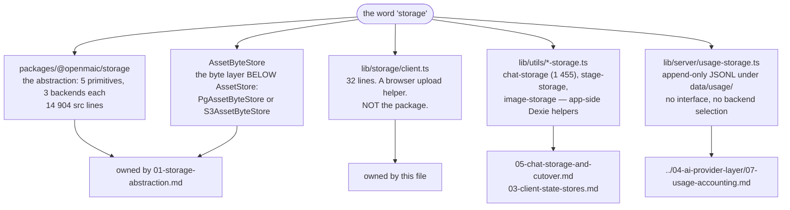
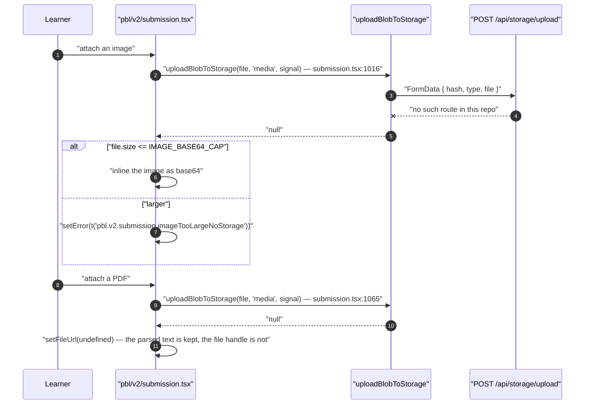

# Adjacent modules, and five things called "storage"

Five different things in this repository answer to the word *storage*, and only one of
them is the abstraction [01-storage-abstraction.md](./01-storage-abstraction.md)
describes. A reader who greps `lib/storage` after reading that page finds a 32-line file
with no relationship to it, and reasonably assumes they are the same thing.

This page exists so that assumption fails loudly. It also names the small modules whose
directory names put them next to persistence without belonging to it.

**Sources read directly:** `lib/storage/client.ts`,
`tests/runtime/storage-entrypoint-removal.test.ts`,
`components/scene-renderers/pbl/v2/submission.tsx`, `lib/usage/normalize.ts`,
`lib/server/usage-storage.ts`, `lib/contexts/`, and a directory listing of `app/api/`.

## The five

Only `@openmaic/storage` and `AssetByteStore` are the same subsystem. The other three
share a word and nothing else.

## `lib/storage/client.ts` — what it actually is

One directory, one file, 32 lines, two exports:

| Export | Signature | What it does |
| --- | --- | --- |
| `sha256` | `(blob: Blob) => Promise<string>` | `crypto.subtle.digest('SHA-256', …)` over the blob's `ArrayBuffer`, hex-encoded |
| `uploadBlobToStorage` | `(blob, type: 'media' \| 'audio' \| 'poster', signal?) => Promise<string \| null>` | hashes, builds a `FormData` of `{hash, type, file}`, `POST`s it to `/api/storage/upload`, and returns `url` from the JSON body — or `null` |

It is a browser-side helper. It does not implement `AssetStore`, does not know about
`AssetRef`, and does not participate in backend selection. The docstring states its own
contract precisely: "The content hash dedups uploads server-side, so re-uploading the same
bytes is cheap and returns the same URL (makes callers idempotent). Returns `null` on any
failure or when storage is unconfigured — callers decide the fallback."

## It posts to a route that does not exist

There is no `app/api/storage/` directory. `find app/api -type d -name 'storage*'` returns
nothing, across all 69 `route.ts` files. So in this repository `uploadBlobToStorage` always
takes its `catch`/`!res.ok` branch and always returns `null`.

Its one live caller handles that, at both call sites:

The behaviour is therefore correct but *indistinguishable from a failure*: "object storage
is not configured in this deployment" and "the upload failed" produce the same `null`. The
capability-probe pattern the video exporter uses
(`GET /api/export-video/capability`, returning `{ enabled }`) is the shape that would
separate them; the remediation is Tier-2 item 8 in
[`../14-code-quality/12-remediation-backlog.md`](../14-code-quality/12-remediation-backlog.md).

## What used to be in `lib/storage/`, and why it is not

`tests/runtime/storage-entrypoint-removal.test.ts` is a **deletion pin**: a test whose only
job is to assert that removed code stays removed. It is worth reading in full, because it
records the reason as well as the fact.

| Assertion | What it pins |
| --- | --- |
| `existsSync(lib/storage/index.ts)` is `false` | the public entry point is gone |
| `existsSync(lib/storage/types.ts)` is `false` | so is the interface |
| `existsSync(lib/storage/providers/noop.ts)` is `false` | and the implementation |
| `import('@/lib/storage')` **rejects** | a caller that still believes it has storage gets "a loud resolution failure at import time — never a silent no-op provider" |
| `import('@/lib/storage/client')` exports a function | "only the dead abstraction was removed" |

The recorded reason: "`getStorageProvider()` unconditionally returned a
`NoopStorageProvider` and swallowed every operation into silence, with no real caller
anywhere in the repo." The specifier in the rejection test is deliberately held in a
`string` variable "so type-checking does not re-require the deleted module".

This is the rejected-alternative evidence behind
[`../18-decisions/05-client-first-persistence-with-a-postgres-cutover.md`](../18-decisions/05-client-first-persistence-with-a-postgres-cutover.md):
a pluggable storage-provider layer over both backends was tried, and its removal is the
only rejected alternative in this documentation set that is enforced by an executable
assertion.

## Two more adjacent directories

Both are small, both are named as if they belonged to this topic, and neither does.

| Directory | Files | What it is | Owning topic |
| --- | --- | --- | --- |
| `lib/usage/` | `normalize.ts` (66 lines) | a pure mapper from the AI SDK's `LanguageModelUsage` to the four-class `NormalizedUsage` (`inputTokens`, `outputTokens`, `cacheReadTokens`, `cacheCreationTokens`, `reasoningTokens`). It stores nothing. The *storing* half is `lib/server/usage-storage.ts` | [`../04-ai-provider-layer/07-usage-accounting.md`](../04-ai-provider-layer/07-usage-accounting.md) |
| `lib/contexts/` | `media-stage-context.tsx`, `scene-context.tsx` | two React contexts that carry the current stage and scene down the render tree. In-memory only, never persisted; they are *not* part of the Zustand store family in [03-client-state-stores.md](./03-client-state-stores.md) | [`../08-classroom-runtime/index.md`](../08-classroom-runtime/index.md) |

The complete `lib/*` directory-to-topic ledger — every one of the ~45 directories with its
owning topic, so a gap like this one is visible rather than discovered — is
[`../02-container-view/04-logical-layering.md`](../02-container-view/04-logical-layering.md).

## Open questions

- Whether `/api/storage/upload` was removed with the rest of the abstraction and its client
  overlooked, or whether it is expected to be provided by a host deployment. The
  `POST /api/materials` route already accepts raw bytes and returns a `materialId`, which
  makes "overlooked" the likelier reading — but nothing in the tree says so.
- Whether `IMAGE_BASE64_CAP` was chosen against a real payload limit or as a round number.
  The constant is local to `components/scene-renderers/pbl/v2/submission.tsx` and carries no
  derivation.

---

Previous [01-storage-abstraction.md](./01-storage-abstraction.md) · next
[02-data-model.md](./02-data-model.md) · back to [index.md](./index.md) · set root
[`../README.md`](../README.md)
