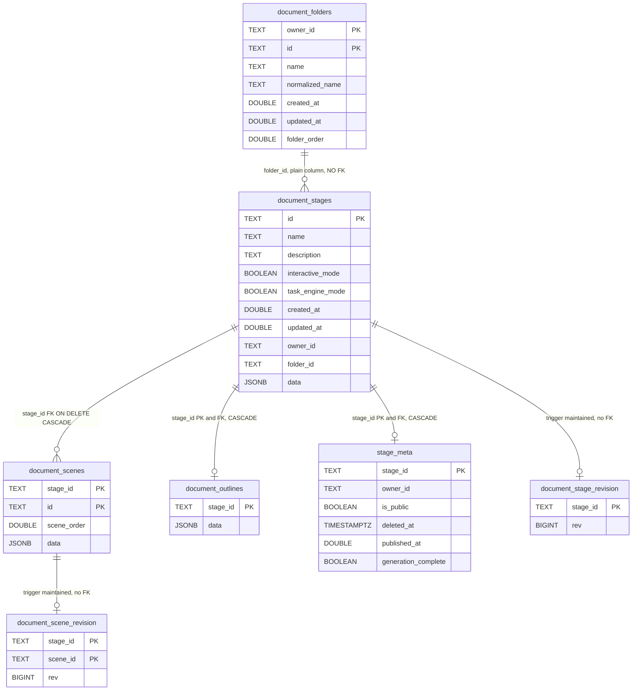
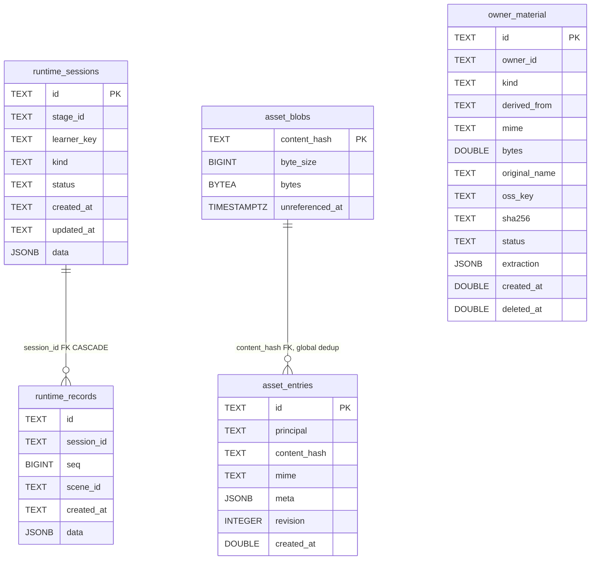

# The persisted data model: course, runtime, assets, browser

Every table and object store OpenMAIC writes for course content, learner runtime,
assets and owner materials — with the real column names from the DDL. The
agent-run cluster is large enough to have its own file:
[02b-agent-run-tables.md](docs/10-persistence-and-state/02b-agent-run-tables.md). Anything not confirmed by a
writer in the code is marked.

**Sources:** [`packages/@openmaic/storage/src/document/pg.ts:58-225`](packages/@openmaic/storage/src/document/pg.ts#L58-L225),
[`src/runtime/pg.ts:68-97`](packages/@openmaic/storage/src/runtime/pg.ts#L68-L97), [`src/asset/pg.ts:62-85`](packages/@openmaic/storage/src/asset/pg.ts#L62-L85);
[`lib/persistence/stage-meta.ts:24-48`](lib/persistence/stage-meta.ts#L24-L48),
[`lib/persistence/owner-materials.ts:102-131`](lib/persistence/owner-materials.ts#L102-L131);
[`src/document/browser.ts:163-172`](packages/@openmaic/storage/src/document/browser.ts#L163-L172), [`src/runtime/browser.ts:164-176`](packages/@openmaic/storage/src/runtime/browser.ts#L164-L176),
[`src/asset/browser-store.ts:187-189`](packages/@openmaic/storage/src/asset/browser-store.ts#L187-L189), [`src/kv/browser.ts:24-51`](packages/@openmaic/storage/src/kv/browser.ts#L24-L51);
[`lib/utils/database.ts:299,546-565`](lib/utils/database.ts#L299); evidence
[../appendix/research/persistence-storage-state/02b-entities.md](docs/appendix/research/persistence-storage-state/02b-entities.md).

## Table census

Exactly 20 `CREATE TABLE IF NOT EXISTS` targets exist across
`packages/@openmaic/storage/src` and `lib/persistence` (verified by enumeration):

| Cluster | Tables | Provisioned by | Documented in |
| --- | --- | --- | --- |
| Course document | `document_stages`, `document_scenes`, `document_outlines`, `document_folders`, `document_stage_revision`, `document_scene_revision` | `ensureDocumentSchema` | this file |
| App ownership sidecar | `stage_meta` | `ensureStageMetaSchema` ([`lib/persistence/stage-meta.ts:50`](lib/persistence/stage-meta.ts#L50)) | this file |
| Learner runtime | `runtime_sessions`, `runtime_records` | `ensureSchema` (runtime) | this file |
| Assets | `asset_blobs`, `asset_entries` | `ensureAssetSchema` | this file |
| Owner material library | `owner_material` | `ensureOwnerMaterialSchema` ([`lib/persistence/owner-materials.ts:132`](lib/persistence/owner-materials.ts#L132)) | this file |
| Agent run | `agent_sessions`, `agent_session_events`, `agent_session_entries`, `agent_session_urls`, `agent_owner_session_events`, `agent_owner_session_event_counters` | `ensureAgentSessionSchema` | [02b](docs/10-persistence-and-state/02b-agent-run-tables.md) |
| Agent materials / skills | `agent_session_materials`, `agent_user_skill` | `ensureAgentSessionMaterialSchema`, `ensureUserSkillSchema` | [02b](docs/10-persistence-and-state/02b-agent-run-tables.md) |

Only five of these are provisioned by the shared server bootstrap
([`lib/persistence/server-provider.ts:43-47`](lib/persistence/server-provider.ts#L43-L47), in that order: runtime, document,
stage-meta, owner-material, asset). The agent-session, material and skill schemas
are provisioned lazily by their own stores on first use, and
`agent_session_materials.session_id` has an FK to `agent_sessions(id)` — so the
ordering matters and is enforced only by which module is touched first.

Every schema string is idempotent by construction (`CREATE TABLE IF NOT EXISTS`,
`CREATE OR REPLACE FUNCTION`, `DROP TRIGGER IF EXISTS`,
`ADD COLUMN IF NOT EXISTS`) so re-provisioning on every cold start is safe
(`document/pg.ts` header comment).

## The course document

`DOUBLE` above is `DOUBLE PRECISION` in the DDL; Mermaid attribute types cannot
contain a space.

Notes that matter when you write a query:

- `document_stages.data` and `document_scenes.data` are the whole DSL objects as
  JSONB. Column-level fields (`name`, `scene_order`, `interactive_mode`) are
  denormalised projections used for listing and ordering; `listDocuments`
  deliberately returns only these version-independent fields and tolerates a
  corrupt `dslVersion` inside `data` so one bad row cannot fail a listing
  ([`src/document/types.ts:196-204`](packages/@openmaic/storage/src/document/types.ts#L196-L204)).
- `document_folders` is `PRIMARY KEY (owner_id, id)` with
  `UNIQUE (owner_id, normalized_name)`, indexed
  `(owner_id, folder_order, id)`. `document_stages.folder_id` is a bare `TEXT`
  with no foreign key.
- `document_stages.owner_id` and `folder_id` are retrofitted with
  `ADD COLUMN IF NOT EXISTS`, and both partial indexes are `WHERE owner_id IS NOT
  NULL` — so a pre-ownership database upgrades in place.
- `stage_meta` is the **app's** table, not the package's. It is the ownership
  fence: `OwnerBoundDocumentStore` takes `FOR SHARE` (reads) or `FOR UPDATE`
  (writes) on the `stage_meta` row and raises one of four named refusals —
  `foreign`, `tombstoned`, `reserved-document`, `unclaimed`
  ([`lib/persistence/owner-bound-document-store.ts:187-211`](lib/persistence/owner-bound-document-store.ts#L187-L211),
  [`lib/persistence/stage-meta.ts:90`](lib/persistence/stage-meta.ts#L90)). The fence is keyed on the tagged
  operation's `stageId` (`:187`), so it covers every **stage-scoped** transaction
  and not the folder-library ones (`mode: 'library'`, which carry no stage id).
  `StageAccessError extends DocumentNotFoundError` so the package's existing 404
  mapping applies unchanged, and `readGated` (`:120-127`) converts any refusal on
  a read into `null`.
- The `foreign` refusal is write-only: `:195` tests `mode !== 'read'`, so it never
  fires for a read. A read of *someone else's* document is a miss for a different
  reason — `PgDocumentStore` carries the `ownerId` it was constructed with
  ([`owner-bound-document-store.ts:240-245`](lib/persistence/owner-bound-document-store.ts#L240-L245)) and gates every document query on an
  owner predicate ([`packages/@openmaic/storage/src/document/pg.ts:497-508`](packages/@openmaic/storage/src/document/pg.ts#L497-L508),
  applied in `loadDocument` at `:727`, with the same gate reused at `:737`).
- `stage_meta`'s DDL ends with a backfill:
  `INSERT INTO stage_meta (stage_id, owner_id) SELECT id, owner_id FROM
  document_stages WHERE owner_id IS NOT NULL ON CONFLICT (stage_id) DO NOTHING`
  ([`stage-meta.ts:43-48`](lib/persistence/stage-meta.ts#L43-L48)). It runs on every provisioning pass. Note
  `ensureStageMetaSchema` splits on a plain `';'` ([`stage-meta.ts:50-55`](lib/persistence/stage-meta.ts#L50-L55)) — safe
  only because this schema contains no dollar-quoted body.
- `stage_meta_public_live_idx ON (stage_id) WHERE is_public AND deleted_at IS
  NULL` is the index behind published-course lookup.

### The revision companions

The two `*_revision` tables are trigger-maintained monotonic counters, ported from
the reference implementation's migration 0071. Three properties are load-bearing
and each is stated in the DDL header comment:

| Property | Detail |
| --- | --- |
| Why triggers | "course content has several write seams that share no application-level signal (HTTP routes, agent tools, jobs, migration scripts, manual psql). Only a trigger can make 'wrote but never signaled' unexpressible." Companion tables rather than columns "keep the document tables' authoritative DDL untouched." |
| Lock order | `openmaic_bump_scene_revision()` bumps `document_stage_revision` **before** `document_scene_revision`, matching `saveDocument`'s stage-then-scene write order, "or the deadlock (40P01) between concurrent stage-first and scene-first writers comes back." |
| Notify | Both triggers `PERFORM pg_notify('openmaic_agent_event_wakeup', json_build_object('kind','stage','stageId', v_stage_id)::text)` unless `current_setting('openmaic.suppress_stage_notify', true) = 'on'`. Batch writers must `SET LOCAL` that inside their transaction — outside one it "only emits a warning and has NO effect." |

Both triggers are `AFTER INSERT OR UPDATE OR DELETE … FOR EACH ROW`, and both
`RETURN NULL`. Two operational traps recorded in the same comment: `TRUNCATE` does
not fire row triggers, so any truncate reset must also truncate both revision
tables; and the notify payload is built with `json_build_object`, never string
concatenation, "because a stageId containing quotes or backslashes would yield
invalid JSON."

`splitSqlStatements` ([`document/pg.ts:234`](packages/@openmaic/storage/src/document/pg.ts#L234)) exists because a plain `split(';')`
would carve the `$$ BEGIN … END; $$` plpgsql bodies apart. It skips single-quoted
strings, double-quoted identifiers, `$tag$` bodies, `--` line comments and block
comments.

## Runtime, assets, owner materials

- `runtime_records` has `UNIQUE (session_id, seq)` and `CHECK (seq >= 0)` rather
  than a primary key; `id` is a plain column. Indexes:
  `runtime_sessions (stage_id, learner_key)`, `runtime_sessions (learner_key)`,
  `runtime_records (session_id, scene_id)`.
- `(stage_id, learner_key)` is the partition key of the whole runtime layer —
  "there is deliberately no global listing", and listings tolerate corrupt rows by
  omission while a direct `getSession` on such an id stays fail-loud
  (`src/runtime/types.ts`, `listSessions` doc comment).
- `runtime_sessions.created_at` / `updated_at` are `TEXT` (ISO-8601), not
  timestamps, and listings sort "by the instant each timestamp denotes, not by
  string order (ISO-8601 permits numeric zone offsets)".
- Default runtime payload validators cover two kinds only, `chat` and
  `quizAttempt` ([`runtime/pg.ts:114-131`](packages/@openmaic/storage/src/runtime/pg.ts#L114-L131)); the app replaces them with
  `APP_RUNTIME_PAYLOAD_VALIDATORS`.
- `asset_entries.content_hash` is many-to-one on `asset_blobs`: that is what makes
  deduplication reclaimable. `revision` starts at 1 and is "never derived from the
  content" — a content-derived validator would be the hash under another name
  ([`src/asset/types.ts:284-293`](packages/@openmaic/storage/src/asset/types.ts#L284-L293)). Every `put()` allocates a **new** id even for
  bytes already held, because returning an existing id would be an existence
  oracle over data the caller never stored (`:141-161`).
- `asset_blobs.bytes` is `BYTEA` and **nullable** — that is the S3 case, where the
  bytes live in the object store and only the registry row stays local.
  `unreferenced_at` is stamped, never deleted, on the request path, and
  `asset_blobs_unreferenced_idx ON (unreferenced_at) WHERE unreferenced_at IS NOT
  NULL` is the collector's scan index.
- `ASSET_PG_SCHEMA` is an array of one-statement-per-entry strings rather than one
  blob, "One PGlite-compatible statement per entry, in dependency order"
  ([`asset/pg.ts:62`](packages/@openmaic/storage/src/asset/pg.ts#L62)).
- `owner_material.oss_key` was retrofitted:
  `ALTER TABLE owner_material ADD COLUMN IF NOT EXISTS oss_key TEXT NOT NULL
  DEFAULT ''` plus `DROP COLUMN IF EXISTS asset_id`, because pre-byte-store
  databases tracked an asset id and `CREATE TABLE IF NOT EXISTS` would leave them
  untouched ([`owner-materials.ts:122-129`](lib/persistence/owner-materials.ts#L122-L129)). `OWNER_MATERIAL_STATUSES` is
  `['uploading', 'ready']` ([`owner-materials.ts:30`](lib/persistence/owner-materials.ts#L30)).

## Browser-side stores

| Store | Kind | Name and keys | Declared at |
| --- | --- | --- | --- |
| Documents | IndexedDB | `maic-documents`: `STAGES` keyed `id`, `SCENES` keyed `['stageId','id']`, `OUTLINES` keyed `stageId` | [`src/document/browser.ts:163-172`](packages/@openmaic/storage/src/document/browser.ts#L163-L172) |
| Runtime | IndexedDB | `maic-runtime`: `SESSIONS` keyed `id`, `RECORDS` keyed `['sessionId','seq']` | [`src/runtime/browser.ts:164-176`](packages/@openmaic/storage/src/runtime/browser.ts#L164-L176) |
| Asset pool | IndexedDB | `maic-asset-pool`: `ASSETS` and `BLOBS` in the **same** database so writes, refcounting and inline reclamation share one transaction | [`src/asset/browser-store.ts:187-189`](packages/@openmaic/storage/src/asset/browser-store.ts#L187-L189), [`packages/@openmaic/storage/src/index.ts:14-20`](packages/@openmaic/storage/src/index.ts#L14-L20) |
| Legacy app DB | IndexedDB (Dexie) | `MAIC-Database`, schema version 17 | [`lib/utils/database.ts:299,562`](lib/utils/database.ts#L299) |
| KV | localStorage | `maic:account:<key>` and `maic:device:<key>`, prefix from `assertKVScope(scope)` so an unknown scope cannot invent a third namespace | [`src/kv/browser.ts:34-41`](packages/@openmaic/storage/src/kv/browser.ts#L34-L41) |

Dexie's v17 table set ([`lib/utils/database.ts:307-322`](lib/utils/database.ts#L307-L322)): `stages`, `scenes`,
`audioFiles`, `imageFiles`, `snapshots`, `chatSessions`, `chatRestoreStaging`,
`playbackState`, `stageOutlines`, `mediaFiles`, `generatedAgents`,
`voiceProfiles`, `autoVoiceCache`, `agentEditSessions`, `folders`,
`stageFolders`. Version 13 was skipped deliberately (it "briefly added
`chatStorageLocks` on the draft chat cutover branch"; v14 drops it with
`chatStorageLocks: null`). v15 added `chatRestoreStaging` — *after* the chat
cutover, which is why the cutover is not vestigial
([05-chat-storage-and-cutover.md](docs/10-persistence-and-state/05-chat-storage-and-cutover.md)). v16 re-keyed
`audioFiles` to `id, stageId, createdAt` to make new audio "independently
reclaimable by stage". v17 added `folders: 'id, order'` and
`stageFolders: 'stageId, folderId'` as **device-local** organisation metadata that
"never touches the document aggregate", so an existing course with no membership
row is simply unfiled.

The named KV keys in use:

| Key | Scope | Value | Declared at |
| --- | --- | --- | --- |
| `settings-storage` | `account` | the whole settings blob | [`lib/store/settings.ts:1984`](lib/store/settings.ts#L1984) |
| `user-profile-storage` | `account` | the profile blob | [`lib/store/user-profile.ts:53`](lib/store/user-profile.ts#L53) |
| `runtime.learnerKey` | `device` | `anon:<uuid>` | [`lib/runtime/learner-key.ts:17`](lib/runtime/learner-key.ts#L17) |
| `document-storage-generation` | `device` | monotonic counter bumped by `clearDatabase` | [`lib/document-store/storage-generation.ts:3`](lib/document-store/storage-generation.ts#L3) |
| `document-migration:<stageId>` | `device` | migration marker: `sourceUpdatedAt`, FNV-1a `sourceHash`, `migratedAt` | [`lib/document-store/migration.ts:98`](lib/document-store/migration.ts#L98) |
| `editor-current-scene:<…>` | `device` | last-viewed scene, cleared by `clearDocumentStoreKeys` | [`lib/utils/database.ts:623`](lib/utils/database.ts#L623) |

Two more browser-side stores sit **outside** the `KVStore` contract:
`localStorage['workbench.panel.<sessionId>']` ([`lib/workbench/session-store.ts:570`](lib/workbench/session-store.ts#L570))
and `localStorage['locale']` ([`lib/hooks/use-i18n.tsx:8`](lib/hooks/use-i18n.tsx#L8)).

Two cookies complete the identity picture: `openmaic_access` (HttpOnly,
SameSite=Lax, 7-day `maxAge`) from [`app/api/access-code/verify/route.ts:32-38`](app/api/access-code/verify/route.ts#L32-L38),
and `anonymous_id` (HttpOnly, SameSite=Lax, 30-day) from
[`lib/server/agent-runtime/owner.ts:3-4,22-28`](lib/server/agent-runtime/owner.ts#L3-L4). Neither is a user account; see
[06-access-codes.md](docs/10-persistence-and-state/06-access-codes.md).

## Open questions

- `document_folders.folder_order` is written on create as `MAX(folder_order) + …`
  and read into `DocumentFolder.order`, but there is no `reorderFolder` on
  `DocumentFolderStore`, no reorder route under `app/api/folders`, and no
  `folder_order = ` update anywhere. Whether drag-to-reorder is deliberately
  local-only (the Dexie `folders` table is indexed on `order`) is unresolved.
- No query anywhere selects `deleted_at IS NOT NULL` in order to purge, so every
  tombstone in this model is permanent. See
  [08-data-lifecycle.md](docs/10-persistence-and-state/08-data-lifecycle.md).
