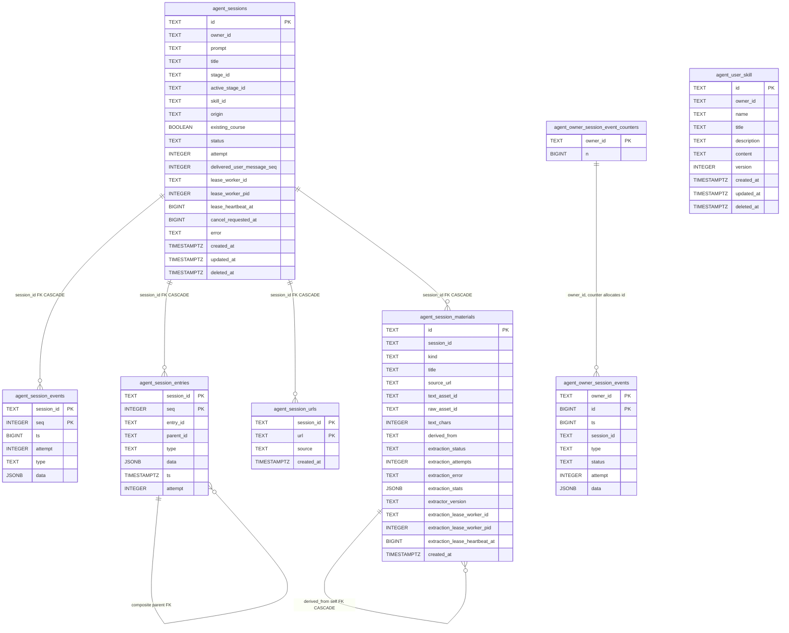
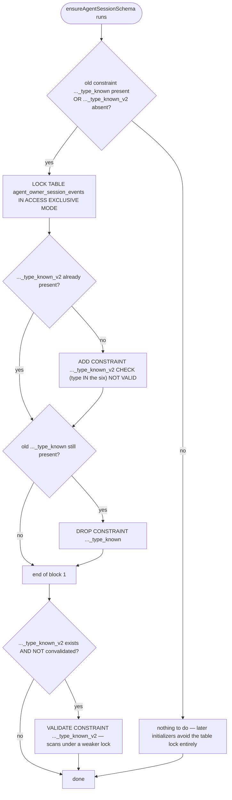
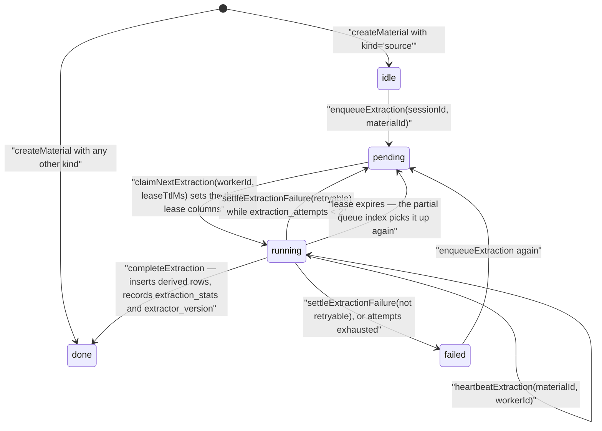

# The persisted data model: the agent-run cluster

The eight PostgreSQL tables that hold a durable agent run — lifecycle and lease,
the event log the browser replays, the append-only entry tree, the URL trust gate,
session materials with their leased extraction state, the per-owner navigation
projection, and user skills. Split out of
[02-data-model.md](docs/10-persistence-and-state/02-data-model.md) because the constraint set is the domain
model here, not decoration.

**Sources:** [`packages/@openmaic/storage/src/agent-session/pg.ts:87-245`](packages/@openmaic/storage/src/agent-session/pg.ts#L87-L245),
[`src/agent-session/types.ts:11,71,77,269,424`](packages/@openmaic/storage/src/agent-session/types.ts#L11), [`src/material/pg.ts:55-89`](packages/@openmaic/storage/src/material/pg.ts#L55-L89),
[`src/material/types.ts:44-51,156`](packages/@openmaic/storage/src/material/types.ts#L44-L51), [`src/skill/pg.ts:50-76`](packages/@openmaic/storage/src/skill/pg.ts#L50-L76); evidence
[../appendix/research/persistence-storage-state/02b-entities.md](docs/appendix/research/persistence-storage-state/02b-entities.md),
[../appendix/research/agent-runtime/00-overview.md](docs/appendix/research/agent-runtime/00-overview.md).

## The tables

Note that `agent_owner_session_events` and `agent_user_skill` carry no FK to
`agent_sessions` — the projection is deliberately sparse and detachable, and a
skill belongs to an owner, not a run.

## Constraints as domain rules

Verbatim from the DDL:

| Table | Constraint | Meaning |
| --- | --- | --- |
| `agent_sessions` | `status IN ('queued','running','succeeded','failed','cancelled')` (constraint `agent_sessions_status_known`), `attempt >= 0` | the five-state lifecycle, matching `AGENT_SESSION_STATUSES` ([`types.ts:11`](packages/@openmaic/storage/src/agent-session/types.ts#L11)) |
| `agent_session_events` | `PRIMARY KEY (session_id, seq)`, `CHECK (seq > 0)` | a gapless 1-based per-session event log — this is what `Last-Event-ID` replay indexes |
| `agent_session_entries` | `PRIMARY KEY (session_id, seq)`, `UNIQUE (session_id, entry_id)`, plus `FOREIGN KEY (session_id, parent_id) REFERENCES agent_session_entries (session_id, entry_id)` | an append-only tree that structurally cannot reference a parent in another session |
| `agent_session_urls` | `PRIMARY KEY (session_id, url)`, `source IN ('user','web_search')` | the fetch trust gate: only URLs the user typed or `web_search` surfaced |
| `agent_session_materials` | `kind IN ('source','extraction','transcript','audio-track','image','web')`, `extraction_status IN ('idle','pending','running','done','failed')`, `text_chars >= 0`, `extraction_attempts >= 0` | six material kinds chosen so derivatives need no schema migration, plus the leased extraction state machine |
| `agent_owner_session_events` | `type IN ('session_created','session_status','session_deleted','session_active_stage','session_cancel_requested','session_title')` (constraint `..._type_known_v2`), `status IS NULL OR status IN (…the five…)`, `attempt IS NULL OR attempt >= 0` | the per-owner navigation projection |
| `agent_owner_session_event_counters` | `n >= 0` | the monotonic id allocator for the projection |
| `agent_user_skill` | `version = 1`, `name ~ '^my-[a-z0-9]+(?:-[a-z0-9]+)*$' AND length(name) <= 64`, `length(title) BETWEEN 1 AND 80`, `length(description) BETWEEN 1 AND 500 AND description !~ '[\r\n]'`, `octet_length(content) BETWEEN 1 AND 65536` | user skills are name-, size- and shape-bounded at the database |

Indexes that shape the hot paths:

| Index | Purpose |
| --- | --- |
| `agent_sessions_status_live_idx (status, created_at) WHERE deleted_at IS NULL` | the runner's claim scan |
| `agent_sessions_owner_live_idx (owner_id, created_at) WHERE deleted_at IS NULL` | the owner's session list |
| `agent_session_entries_type_idx (session_id, type, seq)` | entry-tree reads by kind |
| `agent_session_urls_session_created_idx (session_id, created_at)` | allowlist enumeration |
| `agent_session_materials_session_created_idx (session_id, created_at)` | the material list surface |
| `agent_session_materials_extraction_queue_idx (created_at) WHERE kind = 'source' AND extraction_status IN ('pending','running')` | the extraction claim scan |
| `agent_user_skill_owner_name_unique (owner_id, name) WHERE deleted_at IS NULL` | name uniqueness that survives soft deletes |
| `idx_agent_user_skill_owner (owner_id, created_at) WHERE deleted_at IS NULL` | the owner's skill list |

## The one online-migration dance

`agent_owner_session_events`'s type constraint is the only place in the whole
schema set that does a real online migration, and it does it in two `DO $$` blocks:

The comment states the reason for the split: "Installing the superset above is a
catalog-only operation while the short ACCESS EXCLUSIVE lock is held. Validate
separately so PostgreSQL scans an existing projection table under VALIDATE
CONSTRAINT's weaker lock instead. Once validated, later initializers avoid taking
that table lock altogether."

## Semantics you cannot read off the DDL

These come from the interface doc comments and matter when reading the runner:

| Behaviour | Detail |
| --- | --- |
| `claimNextSession` | scans optimistically, then locks and rechecks; the second check is the authority. Attempt charging is per *takeover* — a cleanly released (null) lease costs no attempt, an abandoned one does ([`types.ts:275-294`](packages/@openmaic/storage/src/agent-session/types.ts#L275-L294)) |
| `postUserMessage` | locks, persists, classifies delivery (`steer` vs `queued`) and revives a terminal session in one transaction, "so a message cannot fall into the runner's settle window" ([`types.ts:328-337`](packages/@openmaic/storage/src/agent-session/types.ts#L328-L337)) |
| `OwnerSessionEventProjection.append` | runs inside the caller's transaction through a SAVEPOINT and returns `null` on error: "derived navigation data must never veto the authoritative lifecycle write" ([`types.ts:455-462`](packages/@openmaic/storage/src/agent-session/types.ts#L455-L462)) |
| `AgentSessionUrlStore` | "links scraped from fetched pages are never registered, so a page cannot widen the allowlist by itself" ([`types.ts:569-575`](packages/@openmaic/storage/src/agent-session/types.ts#L569-L575)) |
| `softDeleteSession` | tombstones a visible session "while deliberately preserving every child row" ([`types.ts:273-274`](packages/@openmaic/storage/src/agent-session/types.ts#L273-L274)) |
| Material extraction | `MAX_MATERIAL_EXTRACTION_RETRIES = 2`; `createMaterial` inserts `'idle'` for `kind='source'` and `'done'` otherwise; `enqueueExtraction` only moves rows in `('idle','failed')`; `listMaterials` is keyset-paged, default 50, capped 200 |
| Material ids | `mat_` + Crockford-base32 of 128 random bits ([`material/types.ts:21-38`](packages/@openmaic/storage/src/material/types.ts#L21-L38)) |
| Material bytes | a material row records asset ids only — `text_asset_id` for extracted markdown, `raw_asset_id` for the optional raw download. Bytes live in the asset store |

The four store interfaces are split so that "a control-plane reader [cannot]
accidentally gain lease-bound write authority" ([`types.ts:1-9`](packages/@openmaic/storage/src/agent-session/types.ts#L1-L9)):
`AgentSessionStore` (lifecycle + leases), `AgentSessionEventLog`,
`AgentSessionEntryTree`, `OwnerSessionEventProjection`, plus
`AgentSessionTitleStore` and `AgentSessionUrlStore`.

## Extraction as a state machine

`createMaterial`'s insert is shaped
`INSERT … SELECT … FROM agent_sessions WHERE session.id = $2 AND session.deleted_at
IS NULL`, so a material can only ever be attached to a live session
([`material/pg.ts:249-257`](packages/@openmaic/storage/src/material/pg.ts#L249-L257)).

## Unconfirmed

- **`agent_sessions.active_stage_id`** exists in the DDL but no writer for it
  appears anywhere in `packages/@openmaic/storage/src`, and `AgentSessionMeta`
  ([`types.ts:77`](packages/@openmaic/storage/src/agent-session/types.ts#L77)) has no corresponding field.
- **`'session_active_stage'`** is accepted by the SQL `CHECK` and listed by the
  browser client ([`lib/workbench/owner-session-client.ts:13-20`](lib/workbench/owner-session-client.ts#L13-L20),
  [`lib/workbench/pro-home-data.ts:82,128`](lib/workbench/pro-home-data.ts#L82)) but is **absent** from the package's
  exported `OWNER_SESSION_EVENT_TYPES` and the `NewOwnerSessionEvent` union
  ([`types.ts:424-446`](packages/@openmaic/storage/src/agent-session/types.ts#L424-L446)). The client's own comment says its set is closed "because
  EventSource dispatches named events only to matching listeners", which suggests
  the client list is authoritative for the UI — but that does not explain the
  package's narrower type.

Whether these two are forward compatibility for an unported feature, a
column/constraint the host writes directly, or drift from a partial port is not
determinable from the code
([evidence 07-open-questions.md §1](docs/appendix/research/persistence-storage-state/07-open-questions.md)).

## Cross-references

- Who reads and writes these tables:
  [../05-agent-runtime/index.md](docs/05-agent-runtime/index.md)
- The rest of the schema: [02-data-model.md](docs/10-persistence-and-state/02-data-model.md)
- The interfaces above them: [01-storage-abstraction.md](docs/10-persistence-and-state/01-storage-abstraction.md)
- Retention of tombstoned sessions: [08-data-lifecycle.md](docs/10-persistence-and-state/08-data-lifecycle.md)
