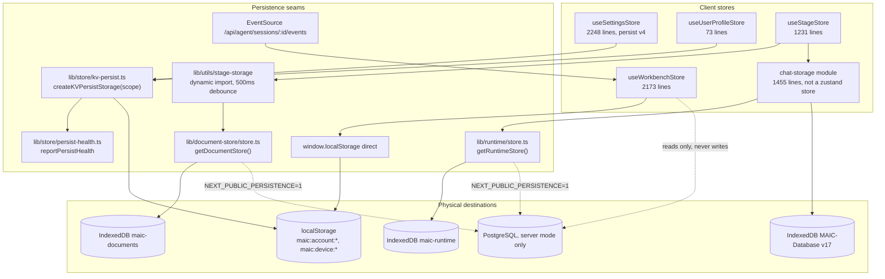
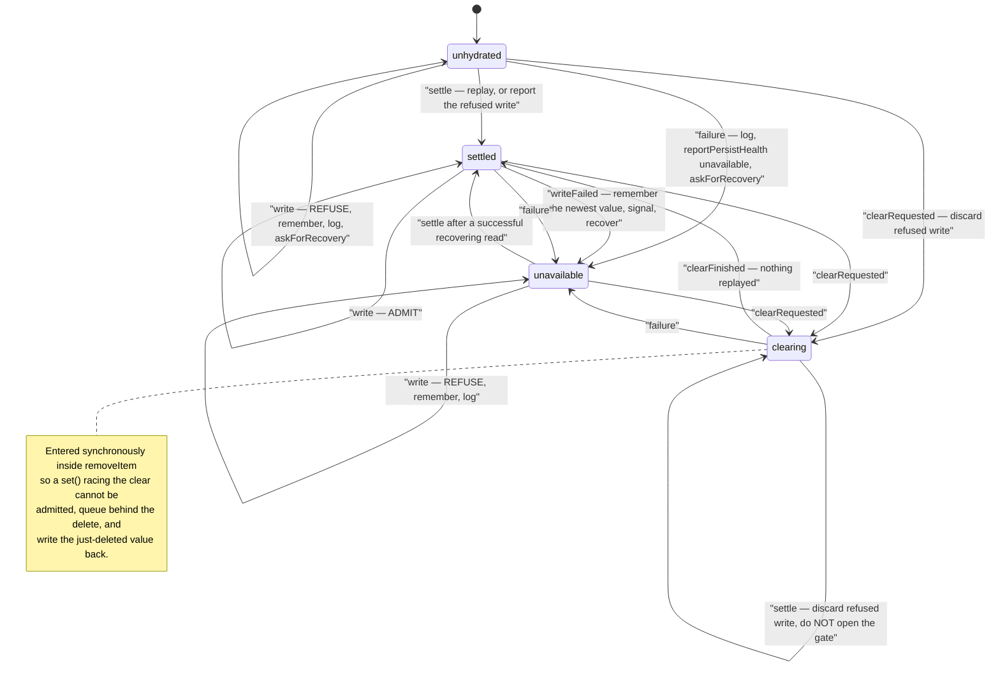

# Client state stores

Four stores hold OpenMAIC's browser state, and no two of them persist the same
way. This file says what each owns, where each lands, why the three big ones are
big, and how the KV persist adapter turns an async backend failure into a user
notice instead of silent data loss.

**Sources:** `lib/store/settings.ts`, `lib/store/user-profile.ts`,
`lib/store/stage.ts`, `lib/store/kv-persist.ts`, `lib/store/persist-health.ts`,
`lib/workbench/session-store.ts`, `lib/utils/chat-storage.ts`,
`packages/@openmaic/storage/src/zustand/persist.ts`; evidence
[../appendix/research/persistence-storage-state/01b-modules-app.md](docs/appendix/research/persistence-storage-state/01b-modules-app.md),
[05-failure-modes.md](docs/appendix/research/persistence-storage-state/05-failure-modes.md),
[06-quality-and-metrics.md](docs/appendix/research/persistence-storage-state/06-quality-and-metrics.md).

## The four stores at a glance

Line counts measured with `wc -l`:

| Store | Lines | Owns | Persists to | Persist mechanism |
| --- | --- | --- | --- | --- |
| `useSettingsStore` (`lib/store/settings.ts`) | 2248 | the entire provider/model/media/TTS/ASR/PDF/image/video/web-search configuration, plus five layout prefs (`sidebarCollapsed`, `chatAreaCollapsed`/`Width`, `editRailCollapsed`/`Width`) and a playback/agent-selection block (`ttsMuted`, `ttsVolume`, `autoPlayLecture`, `playbackSpeed`, `selectedAgentIds`, `agentMode`, `autoAgentCount`, `agentVoiceOverrides`, `agentSelectionIsUserSet`) | KV `account` key `settings-storage` | zustand `persist` → `createKVPersistStorage`, `version: 4` |
| `useUserProfileStore` (`lib/store/user-profile.ts`) | 73 | `avatar`, `nickname`, `bio` | KV `account` key `user-profile-storage` | same adapter, no `version` |
| `useStageStore` (`lib/store/stage.ts`) | 1231 | the live course being viewed or edited, plus the save orchestration around it | `DocumentStore` (IndexedDB or PostgreSQL) via `lib/utils/stage-storage` | debounced dirty-set flush, 500 ms ([`stage.ts:60`](lib/store/stage.ts#L60)) |
| `useWorkbenchStore` (`lib/workbench/session-store.ts`) | 2173 | the folded state of one agent-runtime run | nothing, except one panel flag in raw `localStorage` | pure fold over the SSE event log |

`createKVPersistStorage` has exactly two consumers — settings and user profile.
Everything else that persists does so through a different seam.

## Ownership and destinations

Three things this diagram is saying:

1. Nothing the workbench store holds is durable. Its authority is the server's
   `agent_session_events` log; the store is a projection of it.
2. `useStageStore` never talks to a backend directly — it stages `PendingChange`
   entries and a debounced flush hands them to `lib/utils/stage-storage`, which
   holds the `getDocumentStore()` handle. `stage-storage` is loaded through a
   cached dynamic `import()` ([`stage.ts:56`](lib/store/stage.ts#L56)) so the store module does not pull the
   persistence graph in at eval time.
3. Only `kv-persist` reports health. A failed document or runtime write surfaces
   as a store-level error, not as a `persist-health` notice.

## `settings.ts`: why 2248 lines

`SettingsState` is one flat interface of 91 members — 44 state fields and 47
actions, 42 of them `set*`-prefixed ([`settings.ts:81-391`](lib/store/settings.ts#L81-L391)). The bulk is not UI
state — it is one `Record<ProviderId, {...}>` per capability, and there are eight
capabilities: LLM providers, TTS, ASR, PDF, image, video, web search, plus
per-model thinking configs. The entry shape differs per capability rather than
being shared: an LLM entry carries `apiKey`, `baseUrl`, `models`, the built-in/custom
metadata (`name`, `type`, `defaultBaseUrl?`, `icon?`, `requiresApiKey`, `isBuiltIn`,
`modelsUrl?`) and `isServerConfigured?` / `serverModels?`
([`lib/types/settings.ts:21-45`](lib/types/settings.ts#L21-L45)); TTS and ASR entries add `enabled`, `modelId?`,
`customModels?`, `providerOptions?`, `serverDisabled?` and the custom-provider
fields ([`settings.ts:101-140`](lib/store/settings.ts#L101-L140)); image and video entries carry `enabled`,
`serverDisabled?`, `customModels?` and `replaceBuiltInModels?` but no `modelId` or
`providerOptions` ([`settings.ts:163-192`](lib/store/settings.ts#L163-L192)). The store's own header states the intent: this is "the canonical
`account`-scoped value in the storage contract, and the thing a second device
should not have to be told again" ([`settings.ts:1-8`](lib/store/settings.ts#L1-L8)) — which, given that
`account` KV has no HTTP backend
([01-storage-abstraction.md](docs/10-persistence-and-state/01-storage-abstraction.md)), it currently is not.

Two behaviours in the persist config are worth internalising before you touch it:

| Hook | What it does | Line |
| --- | --- | --- |
| `migrate` | a four-step v0→v4 ladder, reading fields that no longer exist on the type through `as Record<string, unknown>` casts (22 of them in the file) | [`settings.ts:1998`](lib/store/settings.ts#L1998) onward |
| `merge` | runs on **every** rehydrate, not just on migration: deletes the retired `editInsertToolbarCollapsed`, then six `ensureBuiltIn*` passes, `promoteLegacyCustomProviderBaseUrls`, `ensureValidProviderSelections`, `stripLegacyServerBaseUrl` and `pruneThinkingConfigs` | [`settings.ts:2213-2235`](lib/store/settings.ts#L2213-L2235) |

The stated reason for the unconditional `merge` work is "always sync built-in
providers on every rehydrate, so newly added providers/models appear without
clearing cache" ([`settings.ts:2211-2212`](lib/store/settings.ts#L2211-L2212)). The cost is that per-provider defaults
are re-derived on every page load rather than once at migration time.

At the bottom of both KV-persisted stores, `purgeLegacyPersistKey(name)` fires
once, best-effort, to drop the pre-cutover raw `localStorage` blob. For settings
that blob "holds plaintext provider API keys, so clearing it is a small security
win. No correctness depends on it" ([`settings.ts:2244-2248`](lib/store/settings.ts#L2244-L2248)).

The `onWriteRefused` hook in both stores routes through a
`const recovery: { rehydrate?: ... } = {}` assigned *after* the store is created.
That is not style: naming the store inside its own definition "would make the
store's own type circular, and every `useSettingsStore(s => ...)` selector would
silently widen to `any`" ([`settings.ts:1989-1994`](lib/store/settings.ts#L1989-L1994)).

## `kv-persist.ts`: the 735-line reason a failed write is not silence

The module comment explains the problem it exists to solve. Before it, persisted
stores wrote straight to `localStorage` through zustand's default storage while
the rest of the app's keyed values had already moved to `KVStore` — "two unrelated
mechanisms over the same browser API, which is the split-brain the storage RFC set
out to remove" ([`kv-persist.ts:1-10`](lib/store/kv-persist.ts#L1-L10)). And async storage fails in ways
`localStorage` never did; review rounds kept finding the same two bugs: "a backend
failure read as 'there is nothing there', and the result of an operation that
nobody looked at" (`:18-23`).

The fix is structural. Every backend call returns an `Outcome` whose payload is a
`#`-private field and whose only reader, `Outcome.into(state, operation)`, demands
a `KeyState`. "Feeding the machine is not a convention to remember; it is the only
way to get the value out" (`:25-28`). `UNAVAILABLE` is a `Symbol`, deliberately
not `null`.

The full table lives in the source doc comment ([`kv-persist.ts:130-160`](lib/store/kv-persist.ts#L130-L160)). Four
rows carry the design:

- `unhydrated` + `write` refuses. Persisting from an un-hydrated store would
  overwrite real data with defaults.
- A remembered write is replayed on the next `settle` **only if** the last read
  served the store real data (`RefusedWrite.replayable`) — a write taken over
  defaults must never be replayed.
- `clearing` + `settle` stays in `clearing`: a read finishing mid-clear must not
  open the write gate.
- `clearing` + `clearFinished` reaches `settled` with nothing replayed. The user
  asked for that data to be gone.

Recovery is capped by `DEFAULT_RECOVERY_BACKOFF_MS = [0, 250, 1000]`
([`kv-persist.ts:451`](lib/store/kv-persist.ts#L451)) — the array length *is* the attempt cap, bounding the
treadmill a readable-but-unwritable backend would otherwise create. `removeItem`
failing throws on purpose: "a caller clearing a user's data has to be able to tell
that it did not happen".

`persist-health.ts` (174 lines) is the one-way channel out, framework-free so the
SSR-evaluated store seam does not pull the toast stack into its module graph. Three
statuses (`:13-19`): `unavailable` (resolvable, describes now), `changes-lost`
(final until `acknowledgePersistLoss`, describes something that already happened),
`recovered` (retracts a standing notice, and only if that notice was actually
delivered). Two independent latch sets per key for exactly that reason, and
publishing is deferred one macrotask so a fast recovery can cancel a notice nobody
saw yet.

`resolveKv` ([`kv-persist.ts:470-474`](lib/store/kv-persist.ts#L470-L474)) is where the whole scope story bottoms out.
It returns `KVStore | null` over three branches: the injected `deps.kv` if there is
one; then `null` when no ambient `localStorage` is reachable — SSR, or a
`localStorage` that throws outright under some privacy settings (`:454-456`) —
which is how the adapter degrades to a no-op instead of constructing a store; and
otherwise a memoised `defaultKv ??= new BrowserKVStore()`.

## `session-store.ts`: why 2173 lines with nothing persisted

Two invariants, both stated in the header ([`session-store.ts:13-24`](lib/workbench/session-store.ts#L13-L24)):

1. **The rendered UI is a pure function of the applied event prefix.** `foldEvent`
   is pure and exported for tests; no event handler queries the session status
   endpoint. "That is what makes `Last-Event-ID` resumption correct rather than
   approximately correct: reattaching at N and applying N+1… produces the same
   state as applying 1… from scratch."
2. **It lives outside React.** Unmounting the chat tree tears down the
   `EventSource`; the folded state survives in the module, and reattaching resumes
   from `lastEventId` instead of replaying the whole run.

The size follows from (1). `WorkbenchFold` is a wide record of derived run state —
status, `lastEventId`, the chat node list, plan, built pages, `libraryRevision`,
`stageLinkStageIds`, `touchedStageIds`, `runCourseStageIds`, the in-flight markers
`thinkingKey` / `assistantKey` / `waitingKey`, and an `epoch` fence — and
`foldEvent` is one ~840-line pure reducer over roughly thirty event types plus
about twenty small pure helpers. Purity forbids the usual escape of asking the
server, so every derivation has to be in the fold.

`createInitialSessionState()` ([`session-store.ts:511`](lib/workbench/session-store.ts#L511)) is the single total reset,
used by the store's initial state, by `attach()` for a different session, and by
`detach()`. Its comment is the best bug postmortem in the repo: the
one-field-left-behind bug arrived three times (`replaying`, then `status` whose
`connecting` initial value made a nonexistent conversation read as a live run),
"and a hand-written reset per transition is twenty-nine chances to miss one". So
the reset is an object literal whose return type is the complete state — a new
fold field that is not initialised fails to compile — and
`tests/workbench/draft-conversation-reset.test.ts` walks the live store's keys
against the factory. It is a function, not a constant, because the arrays and
record are mutable by type and "one shared literal would let a fold hand the next
session the previous one's `chat` array".

The only thing this store persists is one preference per session:
`localStorage['workbench.panel.<sessionId>']`, written directly through
`window.localStorage`, not through `KVStore` ([`session-store.ts:570-590`](lib/workbench/session-store.ts#L570-L590)).
Per-session rather than global because "'I want the classroom out' is a statement
about the course being built", and written only on a deliberate toggle so "the
automatic opener must not silently become a preference".

## `stage.ts`: the write-coalescing store

`useStageStore` is the only store whose persistence is a scheduler. Module-level
state (not store state) holds `pendingStageId`, `pendingRevision`, a
`Map<string, PendingEntry>` of dirty changes, one `saveTimer`, and one
`flushInFlight` round ([`stage.ts:44-55`](lib/store/stage.ts#L44-L55)). Constants:
`SAVE_DEBOUNCE_MS = 500` and `DEPARTING_STAGE_RETRY_DELAY_MS = 100`
([`stage.ts:58,60`](lib/store/stage.ts#L58)).

It also carries the deletion fences: `isStageDeleted`,
`isStageDeletionInFlight`, `isStageWriteStale`, `stageDeletionEpoch`,
`stageDeletionSettled` from `lib/utils/deleted-stages` ([`stage.ts:27-34`](lib/store/stage.ts#L27-L34)), so a
save that would land after a course was deleted is dropped rather than
resurrecting it. `PENDING_SCENE_ID = '__pending__'` ([`stage.ts:38`](lib/store/stage.ts#L38)) is the virtual
scene shown when the user navigates to a page still being generated.

Chat is not a store: `lib/utils/chat-storage.ts` (1455 lines) is a module the
stage store calls into, with its own locking and its own legacy source. It gets
its own file — [05-chat-storage-and-cutover.md](docs/10-persistence-and-state/05-chat-storage-and-cutover.md).

## Cross-references

- Backend selection behind `getDocumentStore` / `getRuntimeStore`:
  [01-storage-abstraction.md](docs/10-persistence-and-state/01-storage-abstraction.md)
- The one-way settings pull that writes `isServerConfigured` / `serverModels`:
  [04-settings-server-sync.md](docs/10-persistence-and-state/04-settings-server-sync.md)
- What the workbench fold is folding over:
  [../05-agent-runtime/index.md](docs/05-agent-runtime/index.md)
- Where the stage document physically lands:
  [08-data-lifecycle.md](docs/10-persistence-and-state/08-data-lifecycle.md)

## Open questions

- `useStageStore` and `useWorkbenchStore` both track course-stage identity
  (`touchedStageIds` / `runCourseStageIds` versus the stage store's own current
  stage) with no shared vocabulary. Whether they are meant to converge is not
  stated anywhere in either file.
- The doc comment on `createInitialSessionState()` counts twenty-nine fold fields;
  the factory object measured 31 keys in the evidence pass. The discrepancy is
  cosmetic (the comment predates two additions) but nothing in the code pins the
  number, so treat the comment as narrative rather than a count.
