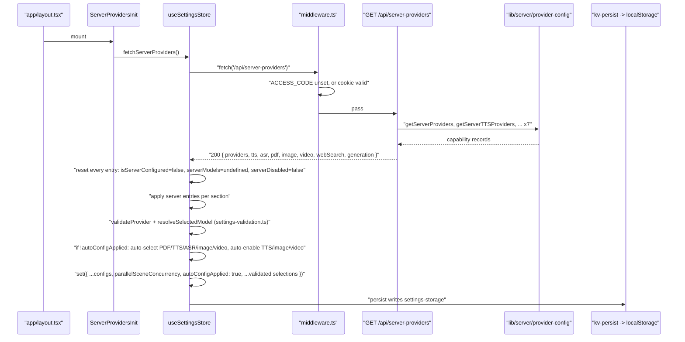
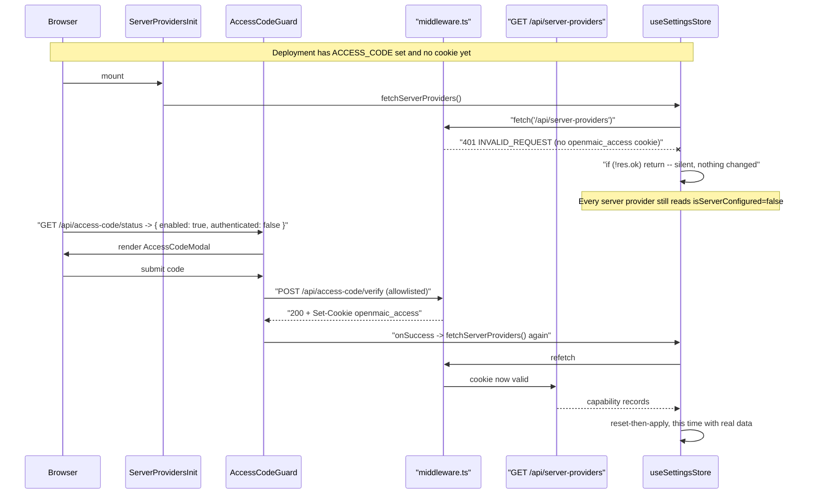

# Settings server sync

There is no bidirectional settings sync in OpenMAIC. There is one **one-way pull**
of server-side provider *capability* into the local settings store, whose entire
conflict strategy is reset-then-apply per capability section, and which never
touches a user-entered credential. This file is that protocol, its two callers,
and the one ordering bug it has already had to work around.

**Sources:** `lib/store/settings.ts:1461-1979` (`fetchServerProviders`),
`app/api/server-providers/route.ts`, `lib/server/provider-config.ts`,
`components/server-providers-init.tsx`, `components/access-code-guard.tsx:45-54`,
`lib/store/settings-validation.ts`, `lib/types/settings.ts:39`; evidence
[../appendix/research/persistence-storage-state/04-dependencies-and-config.md](../appendix/research/persistence-storage-state/04-dependencies-and-config.md).

## What "sync" means here

| It does | It does not |
| --- | --- |
| Tell the client which providers the **server** has credentials for (`isServerConfigured`) | Send any base URL or API key to the client |
| Tell the client which providers an admin has force-disabled (`serverDisabled`) | Read the client's settings, ever |
| Narrow a provider's model list to a server allow-list (`serverModels`) | Write anything back to the server |
| Carry one generation tuning number (`parallelSceneConcurrency`) | Persist anything server-side — the result lands only in the client's KV blob |
| Auto-select and auto-enable providers, **once**, on first run | Reconcile two devices; `account` KV has no HTTP backend at all |

The comment at the top of the handler states the disclosure rule: managed
providers expose "only their allowed model list (LLM/image) and presence (the
'managed' flag) — never a base URL" (`settings.ts:1465-1468`).

## The endpoint

`GET /api/server-providers` (`app/api/server-providers/route.ts:16`) is a pure
projection of seven `lib/server/provider-config` getters plus one number:

```
apiSuccess({
  providers:  getServerProviders(),        // Record<string, { models?: string[] }>
  tts:        getServerTTSProviders(),     // Record<string, { disabled?: boolean }>
  asr:        getServerASRProviders(),     // Record<string, { disabled?: boolean }>
  pdf:        getServerPDFProviders(),     // Record<string, Record<string, never>>
  image:      getServerImageProviders(),   // Record<string, { models?: string[]; disabled?: boolean }>
  video:      getServerVideoProviders(),   // Record<string, { models?: string[]; disabled?: boolean }>
  webSearch:  getServerWebSearchProviders(),
  generation: { parallelSceneConcurrency: getParallelSceneConcurrency() },
})
```

Note the asymmetry, which the client's inline response type mirrors exactly
(`settings.ts:1469-1478`): only LLM, image and video carry `models`; only TTS,
ASR, image, video and web search carry `disabled`; PDF carries neither, so its
presence in the record *is* the signal. On a throw the route answers
`apiError('INTERNAL_ERROR', 500, …)`.

## The two callers

| Caller | When | Why it exists |
| --- | --- | --- |
| `ServerProvidersInit` (`components/server-providers-init.tsx:13-15`) | one `useEffect` on mount of the root layout; renders `null` | the normal path |
| `AccessCodeGuard`'s `onSuccess` (`components/access-code-guard.tsx:53`) | after the access-code modal succeeds | the fix for a real ordering bug, quoted below |

The second caller's comment is the whole story: "`ServerProvidersInit` runs on
mount, which on an `ACCESS_CODE`-gated deployment is before any access cookie
exists: the middleware answers 401 and the store silently keeps its blank
defaults. Nothing re-fetches afterwards, so every server-configured provider
reads as unconfigured until a manual reload." (`access-code-guard.tsx:47-52`).
That is the failure mode a silent-on-error pull produces, and the remedy is one
extra call at the moment the request becomes authorised.

## A normal sync



The reset-then-apply pass is written out once per capability, seven times, with
the same shape (`settings.ts:1483-1493` for LLM, `:1535-1555` TTS,
`:1558-1578` ASR, then PDF, image, video, web search). What each section resets
differs:

| Section | Reset fields | Applied fields |
| --- | --- | --- |
| LLM `providersConfig` | `isServerConfigured: false`, `serverModels: undefined` | `isServerConfigured: true`, `serverModels: info.models`, and a rewritten `models` when the server sent an allow-list |
| TTS / ASR / web search | `isServerConfigured: false`, `serverDisabled: false` | `isServerConfigured: !info.disabled`, `serverDisabled: info.disabled === true` |
| PDF | `isServerConfigured: false` only | `isServerConfigured: true` (presence is the signal) |
| Image / video | `isServerConfigured: false`, `serverDisabled: false` | the TTS pair, plus `customModels: info.models.map(id => ({ id, name: id }))` and `replaceBuiltInModels: true` when an allow-list arrived |

A `disabled` entry is deliberately **not** treated as managed:
`isServerConfigured: !info.disabled` means a force-off provider reads as
neither configured nor selectable, "server precedence" (`settings.ts:1536-1538`).

The LLM model merge is the only one that reconciles per item rather than
wholesale: for each id in the server's allow-list it prefers the built-in
metadata for `name` and capabilities and the local entry for everything else
(`settings.ts:1498-1528`), so a locally added custom model that the server also
allows keeps its local configuration and gains the canonical name.

## Conflicts, and the one that is not handled



Conflict resolution, stated precisely:

1. **Server versus server (a provider that disappeared).** Handled by the reset:
   an entry the new response omits keeps `isServerConfigured: false` from the
   reset pass, so removing a server credential propagates on the next sync.
2. **Server versus user (both configured the same provider).** No conflict by
   construction: the server writes only `isServerConfigured`, `serverDisabled`,
   `serverModels` and (for LLM/image/video) the model list. `apiKey`, `baseUrl`,
   `enabled` and `providerOptions` are never written by this path.
3. **Server versus a now-invalid selection.** `validateProvider` /
   `resolveSelectedModel` (`lib/store/settings-validation.ts`) run after the
   merge and correct `providerId` / `modelId` / `ttsProviderId` / `ttsVoice` /
   `imageProviderId` / `imageModelId` / `videoProviderId` / `videoModelId`
   atomically in the same `set`, and force `imageGenerationEnabled` /
   `videoGenerationEnabled` off when no usable provider remains.
4. **First-run auto-configuration.** Gated on `!state.autoConfigApplied`
   (`settings.ts:1820`): PDF `unpdf` → `mineru-cloud` or `mineru` if the server
   has one; TTS/ASR/image/video → the first non-disabled server provider when the
   current selection is not server-configured; TTS, image and video generation
   auto-*enabled* when such a provider exists. The `set` always writes
   `autoConfigApplied: true`, and the v0→v4 persist migration sets it for existing
   users so they never get retro-auto-configured. The comment records that LLM
   first-load auto-select was **removed** because symmetric provider recovery plus
   `resolveSelectedModel` already resolve provider and model atomically.
5. **Failure.** `if (!res.ok) return` and a `catch` that logs
   `Failed to fetch server providers` at warn level — "server providers are
   optional" (`settings.ts:1976-1979`). Nothing is retried. Case (1) above means a
   failed sync leaves the *previous* sync's flags in the persisted blob, since the
   reset only happens on a successful response.

`parallelSceneConcurrency` is clamped twice on purpose:
`Math.max(0, Math.floor(data.generation?.parallelSceneConcurrency ?? 0))` here as
"belt-and-suspenders against a malformed response", and again in the consumer
(`lib/hooks/use-scene-generator.ts`). `0` means serial generation.

## Why this is not cross-device sync

The store's own header calls the provider configuration "the thing a second device
should not have to be told again" (`settings.ts:1-8`), and the KV `account` scope
exists for exactly that. But no HTTP KV backend is wired
([01-storage-abstraction.md](./01-storage-abstraction.md)), so the blob never
leaves `localStorage`. What crosses machines today is only the *server's* half:
any browser hitting the same deployment learns the same capability set. The user's
own keys and selections do not travel.

## Cross-references

- The provider registry and `lib/server/provider-config` model pinning:
  [../04-ai-provider-layer/index.md](../04-ai-provider-layer/index.md)
- The gate that produces the 401 in the conflict diagram:
  [06-access-codes.md](./06-access-codes.md)
- Where the persisted blob lands: [03-client-state-stores.md](./03-client-state-stores.md)
- Endpoint reference: [../12-api-reference/index.md](../12-api-reference/index.md)

## Open questions

- Nothing re-syncs after the initial mount (or the post-modal refetch). A server
  operator adding a credential mid-session is invisible until a page reload; there
  is no polling, no SSE, and no `visibilitychange` hook. Whether that is
  deliberate is not stated in the code.
- The 401-then-blank-defaults bug is fixed only for the access-code path. Any
  other cause of a failed first fetch (cold server, transient 500) reproduces it
  with no second caller to recover, because the pull is silent on failure by
  design.
