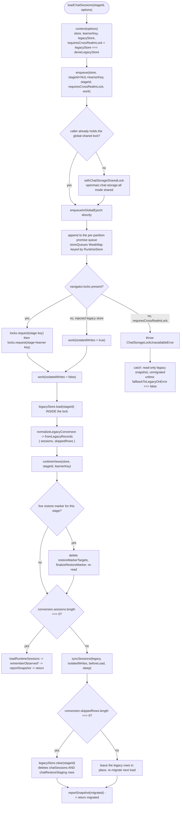
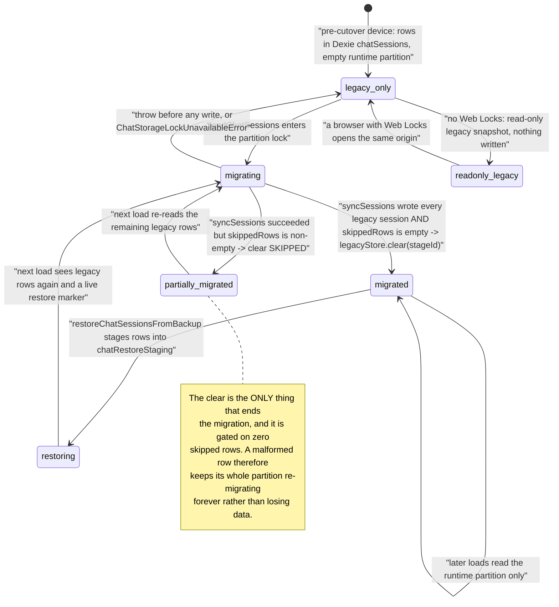

# Chat storage and the Dexie cutover

Classroom chat moved from a Dexie table to the learner `RuntimeStore`, and the
migration is still in the request path on every load. This file explains where
chat lives now, exactly what the cutover migrates, what makes it idempotent, and
why it cannot be deleted yet.

**Sources:** `lib/utils/chat-storage.ts` (1455 lines),
`lib/utils/chat-storage-core.ts`, `lib/utils/chat-storage-lock.ts`,
[`lib/utils/database.ts:299,546-565`](lib/utils/database.ts#L299), `lib/runtime/store.ts`,
`lib/runtime/learner-key.ts`, `tests/runtime/database-chat-cutover.test.ts`,
`tests/runtime/chat-storage.test.ts`; evidence
[../appendix/research/persistence-storage-state/03-flows.md](docs/appendix/research/persistence-storage-state/03-flows.md)
(Flow 3),
[05-failure-modes.md](docs/appendix/research/persistence-storage-state/05-failure-modes.md) §4.

## The two homes

| | Legacy (source) | Current (destination) |
| --- | --- | --- |
| Store | Dexie `MAIC-Database` tables `chatSessions` and `chatRestoreStaging` | `RuntimeStore` partition `(stageId, learnerKey)` |
| Shape | one row per chat session, `stageId`-indexed | one `runtime_sessions` row per chat plus append-only `runtime_records` |
| Read path | `dexieLegacyStore.load(stageId)` — `chatRestoreStaging` first, else `chatSessions`, sorted by `createdAt` ([`chat-storage.ts:91-105`](lib/utils/chat-storage.ts#L91-L105)) | `runtimeViews()` → `listSessions` + `listRecords` folded by `foldRecords` |
| Identity | none; the table is per-origin | `learnerKey` = KV `device` `runtime.learnerKey` = `anon:<uuid>` |
| Backend | always IndexedDB | IndexedDB **or** PostgreSQL, per [01-storage-abstraction.md](docs/10-persistence-and-state/01-storage-abstraction.md) |

The module header states the model: "Runtime records are append-only, while the
latest session-state record describes the current message window and mutable chat
metadata" ([`chat-storage.ts:1-7`](lib/utils/chat-storage.ts#L1-L7)). So a chat is a runtime session whose message
history is records and whose mutable metadata is the newest state record — reads
fold, writes append.

Public surface (`chat-storage.ts`): `saveChatSessions` (`:1005`),
`loadChatSessions` (`:1170`), `clearRuntimeChatSessions` (`:1304`),
`restoreChatSessionsFromBackup` (`:1328`), `deleteChatSessions` (`:1453`), plus
three error classes at `:119-121`.

## The cutover decision, per load

Two ordering decisions in that flow are load-bearing and commented as such:

- **Legacy rows are read *inside* the partition lock**, not before it: "Otherwise
  a delayed migration can replay a snapshot captured before a concurrent save
  cleared it and resurrect deleted chats" ([`chat-storage.ts:1186-1189`](lib/utils/chat-storage.ts#L1186-L1189)).
- **The global shared lock is taken before joining the partition queue.**
  Registering in the queue first would let "a caller already holding a shared lock
  wait for a later operation queued behind maintenance, creating a
  shared → later shared → exclusive → shared inversion"
  ([`chat-storage.ts:266-269`](lib/utils/chat-storage.ts#L266-L269)).

## The lock stack

Five coordination mechanisms cooperate. Every one has a stated reason; together
they are the module's biggest complexity cost.

| Mechanism | Name / shape | Purpose |
| --- | --- | --- |
| Global reader/writer Web Lock | `openmaic:chat-storage:all`, shared for writers, exclusive for maintenance ([`chat-storage-lock.ts:1,75,113`](lib/utils/chat-storage-lock.ts#L1)) | let runtime writers run together while excluding whole-store maintenance |
| Per-partition Web Locks, nested | `openmaic:chat-storage:<encodeURIComponent(key)>` — stage key, then `(stage, learner)` key ([`chat-storage.ts:214-228`](lib/utils/chat-storage.ts#L214-L228), [`chat-storage-lock.ts:13-16`](lib/utils/chat-storage-lock.ts#L13-L16)) | cross-realm mutual exclusion over the shared Dexie table |
| Per-`(RuntimeStore, partition)` promise queue | `storeQueues: WeakMap<RuntimeStore, Map<string, Promise<void>>>` | keep debounced, overlapping stage saves sequential in this realm |
| Three observation `WeakMap`s | `observedChatSessionIds` (`:112`), `observedChatSessions` (`:113`), `skippedLegacyRowsByPartition` (`:114`) | distinguish "the user deleted this chat" from "I never saw this chat" |
| Markers stored as runtime sessions | `chat-restore-marker:<stage>:…`, `chat-deletion:<stage>:<chat>:<learner>` — prefixes at [`chat-storage.ts:44-45`](lib/utils/chat-storage.ts#L44-L45), the composed restore-marker id at [`:376`](lib/utils/chat-storage.ts#L376) | make restore and deletion visible to a concurrent reader holding a stale snapshot |

A no-Web-Locks environment is handled two ways: [`chat-storage-lock.ts:33-72`](lib/utils/chat-storage-lock.ts#L33-L72)
implements an in-realm fallback reader/writer lock with a FIFO waiter queue, used
when `navigator.locks` is missing but a window exists; and the nested *partition*
locks hard-fail with `ChatStorageLockUnavailableError` whenever the shared Dexie
table is involved, because no in-realm lock can protect a cross-realm table.

`withChatStorageSharedLock` / `withChatStorageExclusiveLock` are aliases of
`withRuntimeStorageSharedLock` / `withRuntimeStorageExclusiveLock`
([`chat-storage-lock.ts:209-210`](lib/utils/chat-storage-lock.ts#L209-L210)) — the lock module is named for chat but scoped to
the whole runtime store.

## Migration state per partition

### What makes it idempotent

Three independent properties:

1. **The clear is the terminator.** `legacyStore.clear(stageId)` runs only when
   `conversion.skippedRows.length === 0` ([`chat-storage.ts:1250`](lib/utils/chat-storage.ts#L1250)). A partition
   whose legacy table still holds rows simply re-migrates on the next load.
2. **`planChatSync` converges rather than overwrites.** It plans against the
   newest `updatedAt` on either side ([`chat-storage.ts:652-668`](lib/utils/chat-storage.ts#L652-L668) region), so
   re-running the migration over already-migrated data is a no-op rather than a
   duplication.
3. **Runtime session ids are derived, not random, for the identity that matters.**
   `chatRuntimeIdentity` / `chatRuntimeCandidates` / `newestRuntimeCandidate`
   (`chat-storage-core.ts`) resolve an existing runtime session for a legacy chat
   instead of creating a second one; `nanoid` only supplies suffixes.

Retry bounds, all module constants ([`chat-storage.ts:47-49`](lib/utils/chat-storage.ts#L47-L49)):
`MAX_CHAT_SYNC_ATTEMPTS = 8`, `MAX_CHAT_PLAN_STEPS_PER_ATTEMPT = 8`,
`MAX_CHAT_RETRY_DELAY_MS = 500`. Retry classification stops on deterministic
failures — HTTP 400/401/403/413, any `VALIDATION_FAILED`, `409 FUTURE_VERSION` —
with an explicit exception for `isInactiveSessionAppendError`, which is a race
worth retrying ([`chat-storage.ts:517-540`](lib/utils/chat-storage.ts#L517-L540)).

### The three named failures

| Error | Raised when | Degradation |
| --- | --- | --- |
| `ChatStorageLockUnavailableError` (`:119`) | no `navigator.locks` while the shared Dexie table is in play | **save**: swallowed only when the write is provably a no-op echo of what the caller already saw; any real creation, edit or deletion still fails loud. **load**: read-only unmigrated legacy snapshot, unless `fallbackToLegacyOnError === false` (strict callers such as backup export) |
| `ChatStorageSnapshotInvalidatedByRestoreError` (`:120`) | a backup restore moved the restore marker under a caller holding a stale snapshot | an unchanged autosave passes as a no-op; a real mutation fails |
| `ChatStorageSnapshotInvalidatedByDeletionError` (`:121`) | the chat carries a deletion tombstone and the caller's baseline either matches it (stale) or never observed it | the write is refused rather than resurrecting a deleted chat |

Post-failure bookkeeping is the subtle part and is easy to break. On a failed
runtime read the observation is deliberately **cleared**
(`rememberObservedIds(store, key, [])`) so a later stage save cannot read the
missing sessions as deletions. On a legacy-only fallback it is set to the legacy
ids only, "because runtime-only sessions discovered during sync were never
exposed to the caller" ([`chat-storage.ts:1284-1294`](lib/utils/chat-storage.ts#L1284-L1294) region).

## Is the cutover still needed?

Yes, and not marginally. Four pieces of evidence:

1. `dexieLegacyStore` is the **default** legacy source on every call —
   `options.legacyStore ?? dexieLegacyStore` ([`chat-storage.ts:280`](lib/utils/chat-storage.ts#L280), with
   `requiresCrossRealmLock` derived from it at `:286`) — so every
   load and save consults Dexie.
2. `db.chatSessions` still exists at Dexie schema v17
   ([`lib/utils/database.ts:307-322`](lib/utils/database.ts#L307-L322)).
3. `restoreChatSessionsFromBackup` ([`chat-storage.ts:1328`](lib/utils/chat-storage.ts#L1328)) *writes into* the
   legacy tables on purpose: its own doc line is "Stage legacy backup rows and
   clear their runtime partitions under the same locks." Backup restore is
   implemented **as** a legacy-row injection followed by the normal cutover.
4. `chatRestoreStaging` was added in Dexie **v15** — after the cutover shipped
   (v13 was the skipped cutover-draft version). A table added after a migration is
   not vestigial.

Removing the cutover therefore requires re-homing backup restore first. There is
no telemetry, version floor, or marker anywhere in the code that would tell a
maintainer when no user still holds legacy rows.

`tests/runtime/database-chat-cutover.test.ts` is the pin: it drives the real
`BrowserRuntimeStore` over `fake-indexeddb` with a hand-written serialising
`LockManager` stub, so the lock ordering and the clear gate are covered without a
browser.

## Cross-references

- The `RuntimeStore` contract and its `(stageId, learnerKey)` partition:
  [01-storage-abstraction.md](docs/10-persistence-and-state/01-storage-abstraction.md)
- `runtime_sessions` / `runtime_records` columns:
  [02-data-model.md](docs/10-persistence-and-state/02-data-model.md)
- Who calls `saveChatSessions`: [03-client-state-stores.md](docs/10-persistence-and-state/03-client-state-stores.md)
- Chat during playback: [../08-classroom-runtime/index.md](docs/08-classroom-runtime/index.md)
- Deletion cascade and retention: [08-data-lifecycle.md](docs/10-persistence-and-state/08-data-lifecycle.md)

## Open questions

- No policy exists for how long the cutover stays. Nothing in the code records a
  target release or a version floor, and nothing measures how many users still
  have legacy rows.
- A partition with one permanently malformed legacy row re-runs the whole
  migration on every load, forever, with only a `console.warn`. That is the
  correct data-safety choice, but there is no path to resolution short of a
  serializer that accepts the shape or a manual delete — and no surface tells the
  user which row is stuck.
