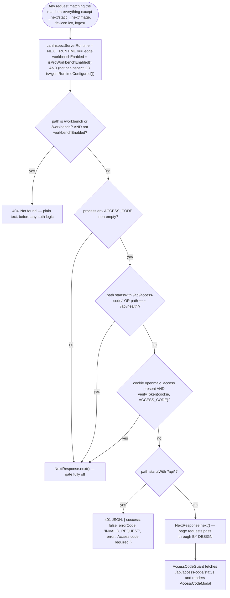
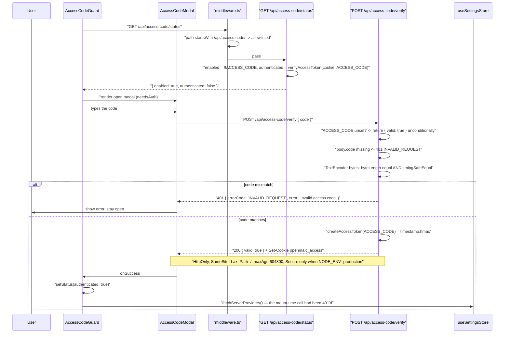

# Access codes

`ACCESS_CODE` is OpenMAIC's only site-wide gate: one shared password, an
HMAC-signed cookie, and 40 lines of Edge middleware. This file is the whole
mechanism — issuance, verification, what it authorises, what bounds it — and an
explicit list of the four things it is not, because every one of them is
load-bearing when you reason about the rest of this topic.

**Sources:** `middleware.ts`, `lib/server/access-token.ts`,
`app/api/access-code/verify/route.ts`, `app/api/access-code/status/route.ts`,
`components/access-code-guard.tsx`, [`components/access-code-modal.tsx:34`](components/access-code-modal.tsx#L34),
[`.env.example:522-525`](.env.example#L522-L525); evidence
[../appendix/research/persistence-storage-state/03-flows.md](docs/appendix/research/persistence-storage-state/03-flows.md)
(Flow 5),
[../appendix/research/api-surface/00-overview.md](docs/appendix/research/api-surface/00-overview.md),
[../appendix/research/quality-testing-ci-deps/00-overview.md](docs/appendix/research/quality-testing-ci-deps/00-overview.md).

## The surface

Exactly four files implement it, plus two routes:

| Piece | File | Role |
| --- | --- | --- |
| The gate | [`middleware.ts:46-86`](middleware.ts#L46-L86) | runs on every matched request; 404s `/workbench*`, then enforces the cookie |
| Edge verifier | [`middleware.ts:18-44`](middleware.ts#L18-L44) | hand-rolled HMAC-SHA256 over `crypto.subtle`, because `node:crypto` is unavailable on the Edge runtime |
| Node token helpers | [`lib/server/access-token.ts:4,11`](lib/server/access-token.ts#L4) | `createAccessToken` / `verifyAccessToken`, used by the two routes |
| Issuance | `app/api/access-code/verify/route.ts` | `POST`; compares the submitted code, mints the cookie |
| Introspection | `app/api/access-code/status/route.ts` | `GET`; `{ enabled, authenticated }` |
| Client gate | `components/access-code-guard.tsx` | mounted in the root layout; renders the modal when `enabled && !authenticated` |

[`.env.example:522-525`](.env.example#L522-L525) documents the whole feature in three lines: "Set a password
to restrict site access. When set, users must enter this code before using the
app. Leave empty or remove to disable access control."

## The token

`createAccessToken(accessCode)` ([`lib/server/access-token.ts:4-8`](lib/server/access-token.ts#L4-L8)) is:

```
timestamp = Date.now().toString()
signature = HMAC-SHA256(key = accessCode, message = timestamp) as hex
token     = `${timestamp}.${signature}`
```

**The access code is the HMAC key.** There is no separate signing secret. Two
consequences follow directly: rotating `ACCESS_CODE` invalidates every outstanding
token (that is the only revocation lever there is), and anyone who knows the code
can mint a valid token themselves without ever calling the endpoint.

Verification exists twice, in two runtimes, with different comparison primitives:

| | Edge ([`middleware.ts:18-44`](middleware.ts#L18-L44)) | Node ([`access-token.ts:11-25`](lib/server/access-token.ts#L11-L25)) |
| --- | --- | --- |
| HMAC | `crypto.subtle.importKey` + `sign`, hex-encoded by hand | `createHmac('sha256', accessCode)` |
| Compare | length check, then an XOR-accumulate loop over `charCodeAt`; the comment says "not truly constant-time in JS, but sufficient here" (`:37`) | `timingSafeEqual` over the two hex-decoded `Buffer`s |
| Checks the timestamp | no | no |

Neither reads the timestamp for anything. It is signed but never compared to a
maximum age.

## The gate



Order matters twice here:

1. The `/workbench` 404 runs **before** the access-code check, so a disabled
   workbench answers 404 whether or not the visitor is authenticated. Its
   correctness note is in the source: Edge middleware "cannot reliably inspect
   server-only deployment variables", so it enforces the public flag and defers the
   runtime/database half to Node ([`middleware.ts:49-55`](middleware.ts#L49-L55)).
2. Unauthenticated **page** requests are let through deliberately, so the client
   can render a modal rather than a bare 401 ([`middleware.ts:84-85`](middleware.ts#L84-L85)). Only
   `/api/*` is hard-blocked. That is also why [04-settings-server-sync.md](docs/10-persistence-and-state/04-settings-server-sync.md)
   needs a second `fetchServerProviders()` call after the modal succeeds.

The allowlist is two entries: `/api/access-code/*` (so the visitor can
authenticate) and `/api/health` (so a liveness probe works before the code is
known). Everything else under `/api` is 401 without the cookie — and no route
re-checks the cookie itself, so this middleware is the single point of enforcement
for the entire 69-file HTTP surface.

## Redemption



`POST /api/access-code/verify` with `ACCESS_CODE` unset answers
`{ valid: true }` **unconditionally and sets no cookie**
([`verify/route.ts:7-10`](app/api/access-code/verify/route.ts#L7-L10)). A client cannot distinguish "correct code" from "no gate
configured" from the response body alone — it has to read `status`.

`AccessCodeGuard` fails closed on its own error path: if `GET
/api/access-code/status` throws, it sets `{ enabled: true, authenticated: false }`
because that is "safer than silently disabling" ([`access-code-guard.tsx:29-31`](components/access-code-guard.tsx#L29-L31)).

## What it authorises, and its bounds

| Property | Value |
| --- | --- |
| Scope | every path matched by `matcher: ['/((?!_next/static\|_next/image\|favicon.ico\|logos/).*)']` ([`middleware.ts:88-90`](middleware.ts#L88-L90)) — all of `/api/*` hard, all pages soft |
| Cookie | `openmaic_access`, HttpOnly, SameSite=Lax, `Path=/` |
| Client-side lifetime | `maxAge = 60 * 60 * 24 * 7` seconds (7 days) |
| Server-side lifetime | **none** — no code path compares the signed timestamp to now |
| `Secure` flag | only when `NODE_ENV === 'production'` |
| Revocation | change `ACCESS_CODE` (it is the HMAC key), which invalidates all tokens at once |
| Rate limiting on `POST /verify` | none. There is no rate limiting anywhere in `app/api/**` |
| Tests | none. `middleware.ts` has no test file |

## What it explicitly is NOT

1. **Not authentication.** It carries no principal. Two people who know the same
   code are indistinguishable to every downstream route. Owner identity is a
   *separate*, unrelated mechanism: the `anonymous_id` UUIDv4 cookie resolved by
   `resolveRequestOwnerId` ([`lib/server/agent-runtime/owner.ts:52-64`](lib/server/agent-runtime/owner.ts#L52-L64)), which
   prefixes `anon:` and whose `authenticatedOwnerId` parameter no call site
   supplies. Its own comment says a future auth integration "must thread
   `authenticatedOwnerId` through those call sites".
2. **Not authorization.** Passing the gate grants the same access as every other
   visitor. Per-document ownership is enforced separately and lower down, by the
   `stage_meta` row fence in `OwnerBoundDocumentStore`
   ([02-data-model.md](docs/10-persistence-and-state/02-data-model.md)) — which fences on the *anonymous cookie
   owner*, not on the access code.
3. **Not the persistence auth.** Server-mode persistence uses
   `PERSISTENCE_DEV_TOKEN` plus a client-supplied `x-learner-key`, and
   [`lib/persistence/server-auth.ts:1-13`](lib/persistence/server-auth.ts#L1-L13) states plainly that this "provides no
   confidentiality and no user isolation — anyone who can load the page can read and
   write EVERY learner partition and all documents by supplying an arbitrary
   x-learner-key", and is "suitable only for localhost or trusted-network,
   single-user deployments". A deployment can have `ACCESS_CODE` set and still have
   zero data isolation between the people who know it.
4. **Not a session with an expiry.** The token embeds `Date.now()` and nothing
   checks it. Validity is bounded only by the cookie's own `maxAge`, which is a
   client-side hint — a copied cookie value replayed after eight days still
   verifies. This is the single most commonly mis-assumed property of the gate.

Treat `ACCESS_CODE` as what the env comment calls it: a password on the front
door of a single-tenant deployment. It keeps a public URL from being an open
public app. It does not make the app multi-user.

## Cross-references

- The middleware's other job, and the full request edge:
  [../03-app-and-api/index.md](docs/03-app-and-api/index.md)
- Per-route auth (and its absence): [../12-api-reference/index.md](docs/12-api-reference/index.md)
- The three unrelated identities this repo mints:
  [08-data-lifecycle.md](docs/10-persistence-and-state/08-data-lifecycle.md)
- Cross-cutting security posture: [../15-cross-cutting/index.md](docs/15-cross-cutting/index.md)

## Open questions

- The signed timestamp exists but is unused. Whether an expiry check was intended
  and dropped, or the timestamp is only there to make each token unique, is not
  recorded anywhere.
- `middleware.ts` is the only enforcement point for the entire API surface and has
  no test. A matcher regression would silently open every route; nothing in CI
  would notice.
