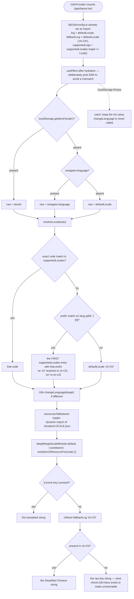
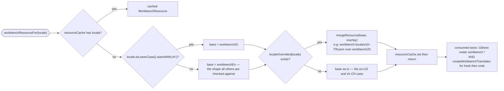
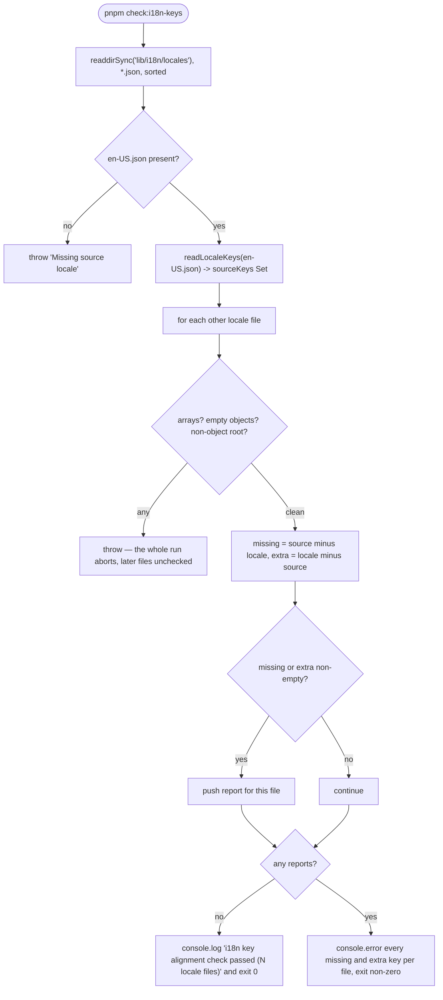
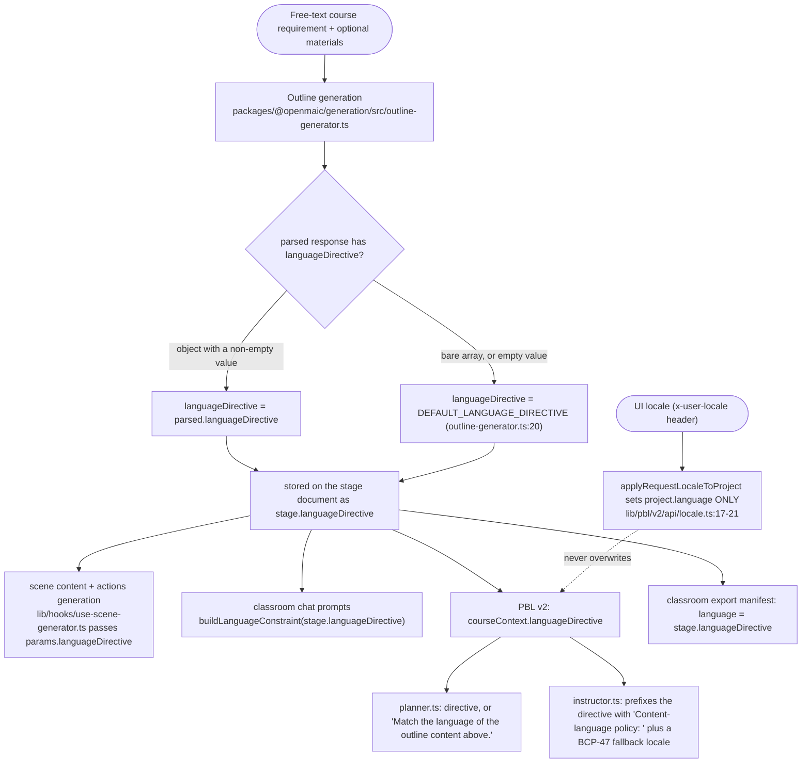

# i18n: two locale trees and one language directive

OpenMAIC localises two independent things through two independent mechanisms: the
**UI**, via i18next over 12 JSON locale trees plus 10 TypeScript-backed workbench
overlays; and the **model's output language**, via a `languageDirective` string
that lives in the course document and is never derived from the UI locale. Mixing
them up is the standard mistake here.

**Sources:** `lib/i18n/config.ts`, `lib/i18n/locales.ts`, `lib/i18n/types.ts`,
`lib/i18n/index.ts`, `lib/i18n/workbench.ts`, `lib/i18n/TRANSLATION_GUIDE.md`,
`lib/hooks/use-i18n.tsx`, `components/language-switcher.tsx`,
`scripts/check-i18n-keys.mjs`, `package.json:19`,
`packages/@openmaic/generation/src/outline-generator.ts:20,127-179`,
`lib/pbl/v2/api/locale.ts`, `lib/pbl/v2/agents/planner.ts:129-134`,
`lib/pbl/v2/agents/instructor.ts:118-119,551-552`; evidence
[../appendix/research/persistence-storage-state/01b-modules-app.md](../appendix/research/persistence-storage-state/01b-modules-app.md).

## The two trees

| Tree | Files | Authored in | Held to shape by |
| --- | --- | --- | --- |
| App UI | `lib/i18n/locales/<code>.json` — 12 files: `ar-SA`, `de-DE`, `en-US`, `es-MX`, `fr-FR`, `ja-JP`, `ko-KR`, `pt-BR`, `ru-RU`, `vi-VN`, `zh-CN`, `zh-TW` | JSON, ~2035 lines each, 1801 leaf keys in `en-US` | `pnpm check:i18n-keys` (`scripts/check-i18n-keys.mjs`) |
| Pro workbench | `lib/i18n/workbench.ts` (`workbenchEn` + `workbenchZh`) plus `lib/i18n/workbench-locales/<code>.json` — 10 overlays: everything except `en-US` and `zh-CN` | TypeScript for en/zh, JSON overlays for the rest | `tests/workbench/workbench-i18n.test.ts` |

Why the second tree is TypeScript and not one more locale file, verbatim from
`lib/i18n/workbench.ts:1-16`: the presentation table
(`components/workbench/chat/tool-presentation.ts`), the progress captions and the
session store "are pure functions with no hook to read a language from, so they
take a translator and this module can build one synchronously".

The registry is `supportedLocales` (`lib/i18n/locales.ts:16-29`), a
`as const satisfies readonly LocaleEntry[]` array of `{ code, label, shortLabel }`.
`Locale` is derived from it (`types.ts:3`) and `defaultLocale = 'zh-CN'`
(`types.ts:5`) — which is also `fallbackLng`.

## UI locale resolution

Three consequences worth knowing:

- **The user's locale is stored in raw `localStorage` under the bare key
  `'locale'`** (`lib/hooks/use-i18n.tsx:8,39,51`), *not* through `KVStore` and
  therefore not under the `maic:device:` namespace. It is a third localStorage
  mechanism alongside `maic:*` and `workbench.panel.*`
  ([03-client-state-stores.md](./03-client-state-stores.md)).
- **Prefix matching depends on array order.** `TRANSLATION_GUIDE.md:6` states the
  rule explicitly: append new entries to the end and "do not reorder existing
  entries, as the first locale for each language prefix (e.g. `zh-CN` for `zh`) is
  used as the default when the browser sends a bare language code."
- **An unknown locale code degrades to Simplified Chinese**, not to raw keys,
  because `lng` and `fallbackLng` are both `defaultLocale`.

### The workbench overlay chain

So an untranslated workbench key "degrades to a readable sentence rather than to
`workbench.tool.label.x`" (`workbench.ts:12-16`). The hook-free translator has the
same terminal behaviour by hand: `createWorkbenchTranslator` returns the key itself
when the resolved value is not a string, and `defaultWorkbenchTranslator =
createWorkbenchTranslator('zh-CN')` is what `lib/workbench/session-store.ts` uses
when no locale has been threaded in. Interpolation there is a hand-rolled
`{{name}}` replacement, matching i18next's default syntax.

## Key-management conventions

`lib/i18n/TRANSLATION_GUIDE.md` is the contract for contributors. Its rules:

| Rule | Detail |
| --- | --- |
| Adding a language | copy `locales/en-US.json`, **append** to `supportedLocales`, translate every value, keys identical |
| Interpolation | i18next default `{{variable}}`; "Do NOT remove or rename interpolation variables — they are referenced in code" |
| Design-intent keys | a six-row table naming keys whose UX context changes the translation: `home.greetingWithName` (a call-to-action that must keep `{{name}}`), `profile.defaultNickname` (warm, gender-neutral, obviously a placeholder — EN "Learner", ZH "同学"), `profile.bioPlaceholder` (must hint that the bio feeds the AI teacher), `generation.textTruncated` / `generation.imageTruncated` (short and factual, with `{{n}}` / `{{total}}` / `{{max}}`), `agentBar.readyToLearn` (inviting, not instructional), `settings.agentsCollaboratingCount` (descriptive, contains `{{count}}`) |

Two structural rules the checker enforces but the guide does not state: no arrays
anywhere, and no empty objects anywhere.

## The `check:i18n-keys` CI contract

`package.json:19` → `node scripts/check-i18n-keys.mjs`. `LOCALES_DIR` is
`lib/i18n/locales` and `SOURCE_LOCALE` is `en-US.json` (`:4-5`) — note that the
*source of truth for keys* is English while the *runtime fallback* is Simplified
Chinese. Four checks, in this order:

| # | Check | Failure | Line |
| --- | --- | --- | --- |
| 1 | no `Array.isArray(value)` at any depth | `throw` naming the key path: "Locale values must not be arrays." | `:16-20` |
| 2 | no object with zero entries at any depth | `throw`: "Locale objects must not be empty." | `:22-29` |
| 3 | root must be a plain object | `throw`: "must contain a JSON object at the root." | `:39-41`, `:52-54` |
| 4 | every non-source locale's **leaf-key set must equal** the source's | both `missing` and `extra` are failures, reported per file with full sorted key lists, `console.error` then a non-zero exit | `:69-82`, `:91-` |

A throw from checks 1-3 aborts the whole run, so a malformed file masks the parity
report for every other file.

What it does **not** cover, and each gap is real:

- **`workbench-locales/` is outside its scope entirely** (`LOCALES_DIR` is only
  `lib/i18n/locales`). Those ten overlays are held to `workbenchEn`'s shape by a
  vitest test instead, so a contributor can pass `pnpm check:i18n-keys` and still
  ship a broken overlay unless they also run the unit suite.
- **It does not check that a key is used.** Dead keys accumulate silently.
- **It does not check that a value is translated.** An English string copied under
  a translated key passes every check.

## Model output language: a separate axis

The language the *model writes in* is not the UI locale. It is
`languageDirective`, a free-text instruction produced by the outline step and
stored on the stage.

The separation is stated where it is enforced: `applyRequestLocaleToProject`
syncs `project.language` (a BCP-47 *fallback* locale) with the user's UI language
and "Does NOT touch `project.languageDirective` — the classroom's content-language
policy is authoritative for all Planner / Instructor / Evaluator content and is
never overwritten by the UI locale header" (`lib/pbl/v2/api/locale.ts:8-16`). The
same comment explains why the sync is at route level at all: it "closes the timing
gap where the user clicks into PBL before the Hero's client-side locale effect has
published the updated project".

The directive is deliberately prose, not a code: the outline system prompt asks for
"A 2-5 sentence instruction covering teaching language, terminology handling, and
cross-language situations"
(`lib/prompts/templates/interactive-outlines/system.md:18`), and the instructor
prompt tells the model that "If the directive contains nuanced instruction (e.g.
'keep technical terms in English'), follow it literally"
(`lib/pbl/v2/agents/instructor.ts:552`). `x-user-locale` is additionally read by
`app/api/generate/scene-content/route.ts:322` and sent by two PBL client modules.

Precedence, where multiple signals exist:

| Consumer | Order |
| --- | --- |
| PBL planner | `project.languageDirective`, else the literal fallback string `'Match the language of the outline content above.'` (`planner.ts:134`) |
| PBL eval prompts | `project.languageDirective`, else `project.language`, else `'en-US'` (`lib/pbl/v2/operations/runtime/eval-prompts.ts:40`) |
| Scene generation | `params.languageDirective`, else `params.stageInfo.language` (`lib/hooks/use-scene-generator.ts:833,1016`) |

## Cross-references

- Where `stage.languageDirective` is produced and consumed:
  [../06-generation-pipeline/index.md](../06-generation-pipeline/index.md)
- The stage document that carries it: [../07-dsl-renderer-editor/index.md](../07-dsl-renderer-editor/index.md)
- The workbench store that uses `defaultWorkbenchTranslator`:
  [03-client-state-stores.md](./03-client-state-stores.md)
- CI gates in full: [../16-development-view/index.md](../16-development-view/index.md)

## Open questions

- Whether the 11 non-source locale files are actually translated (rather than
  English copied under translated keys) is not checkable from the repo, and
  `check:i18n-keys` proves key parity only. The evidence pass did not sample them.
- The UI locale key is `localStorage['locale']`, outside the `KVStore` contract
  that `lib/store/kv-persist.ts` exists to make universal. Nothing in the code
  explains why it was not migrated; it predates the KV cutover, but that is an
  inference, not a stated reason. **Inferred:** the exception survives because
  `I18nProvider` must read it synchronously in a post-hydration effect, and
  `KVStore` is async.
