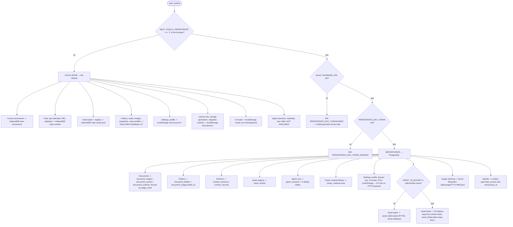
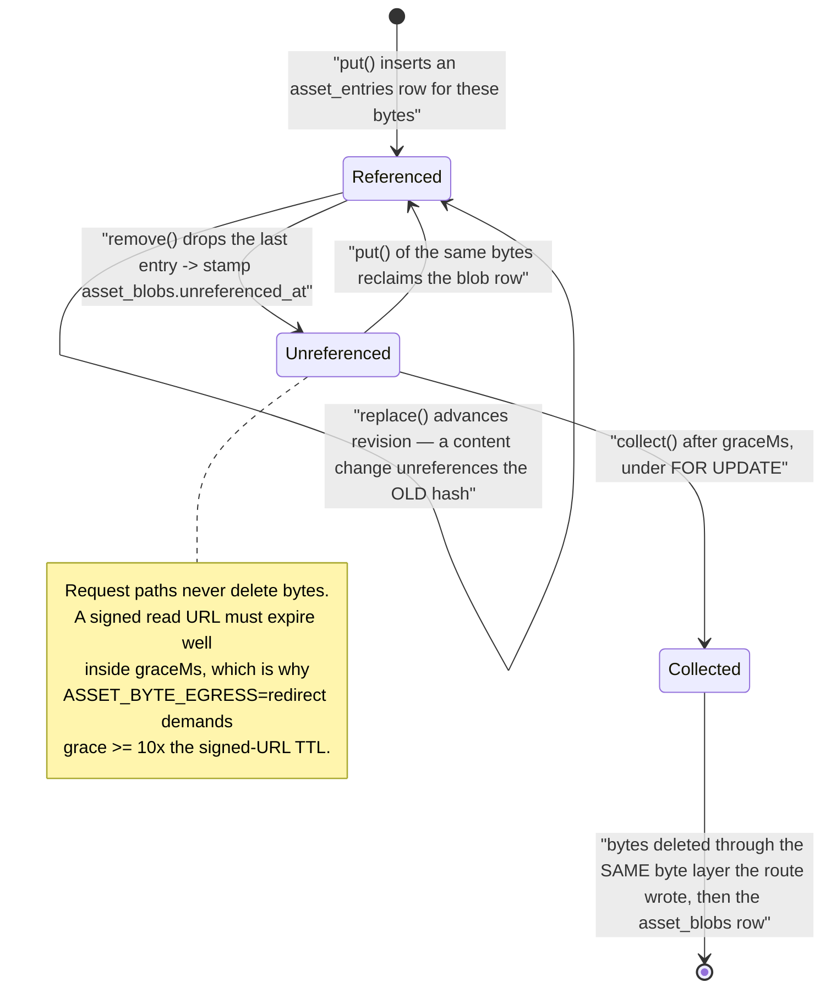

# Data lifecycle: retention, deletion, residency

Where user content physically lands in each deployment mode, every code path that
removes it, and how long the rest survives. The short answer for retention: one
reclamation job exists, it reclaims **bytes only**, and every row-level delete in
the server schema is a tombstone that nothing ever collects.

**Sources:** `lib/persistence/asset-collector-schedule.ts`,
`lib/persistence/asset-collection-grace.ts`, [`lib/persistence/stage-meta.ts:104-133`](lib/persistence/stage-meta.ts#L104-L133),
[`lib/persistence/owner-bound-document-store.ts:96-139`](lib/persistence/owner-bound-document-store.ts#L96-L139),
[`lib/persistence/owner-materials.ts:1-30`](lib/persistence/owner-materials.ts#L1-L30), [`lib/runtime/store.ts:86-135`](lib/runtime/store.ts#L86-L135),
[`lib/utils/database.ts:595-626`](lib/utils/database.ts#L595-L626), `lib/document-store/storage-generation.ts`,
[`lib/server/usage-storage.ts:90-137`](lib/server/usage-storage.ts#L90-L137), [`instrumentation.ts:13-21`](instrumentation.ts#L13-L21),
`packages/@openmaic/storage/src/asset/types.ts`, [`src/agent-session/types.ts:273-274`](packages/@openmaic/storage/src/agent-session/types.ts#L273-L274),
[`src/skill/pg.ts:61`](packages/@openmaic/storage/src/skill/pg.ts#L61); evidence
[../appendix/research/persistence-storage-state/04-dependencies-and-config.md](docs/appendix/research/persistence-storage-state/04-dependencies-and-config.md),
[07-open-questions.md](docs/appendix/research/persistence-storage-state/07-open-questions.md) §3.

## Residency per deployment mode

The single most surprising row is `kvstill`: turning on server persistence moves
documents, runtime and assets to PostgreSQL and leaves the user's provider API
keys, model selections, profile and locale in `localStorage`, because no HTTP KV
backend is wired ([01-storage-abstraction.md](docs/10-persistence-and-state/01-storage-abstraction.md)). A
"server-backed" OpenMAIC still loses all settings when you switch browsers.

Two more things that never move regardless of mode:

| Data | Always lands in | Why |
| --- | --- | --- |
| `device`-scoped KV | this machine's `localStorage` | the scope's contract — enforced by the `DeviceSafeKVStore` brand |
| Usage metering | the server's filesystem, `data/usage/<YYYY>-<MM>.jsonl` | `lib/server/usage-storage.ts` is the one filesystem backend; there is no interface and no other implementation |

Also note the `render-service/` container: the ZIP it receives contains the
compiled timeline, fonts and assets, and its egress is iptables-DROPped
(`render-service/docker-entrypoint.sh`). Whether it retains anything of its own on
disk was not examined in this pass — see Open questions.

## The one reclamation job

`AssetCollector` is the only thing in the entire subsystem that deletes bytes.
[`lib/persistence/asset-collector-schedule.ts:1-18`](lib/persistence/asset-collector-schedule.ts#L1-L18) states the design and the
reason it is not left to the operator: `PgAssetStore.remove`, and a `replace` that
changes content, "only stamp `asset_blobs.unreferenced_at`;
`AssetCollector.collect` is the sole deletion path in the design. Leaving it to
'the deployment' is not a decision this repository can defer, because the
deployment it ships is `docker-compose.yml` — the app and PostgreSQL, and nothing
else that could ever call it. Unrun, ordinary asset churn retains PostgreSQL bytes
or S3 objects forever."

It is started exactly once, from [`instrumentation.ts:19-21`](instrumentation.ts#L19-L21), because "Next calls
`register` once per server instance, before it serves a request" and a route module
has no such guarantee ([`instrumentation.ts:1-12`](instrumentation.ts#L1-L12)).

| Knob | Default | Floor / rule |
| --- | --- | --- |
| `ASSET_COLLECTION_ENABLED` | on | only `'0'` or `'false'` disables it; the Compose deployment "has to be correct with no operator action, so the working default is 'collect'" |
| `ASSET_COLLECTION_INTERVAL_MS` | 900 000 (15 min) | floor 1 000 ms, "keeps a typo from spinning the database" |
| `ASSET_COLLECTION_GRACE_MS` | 3 600 000 (1 h), from the package | "This is the retention window a user's deleted bytes actually get, so raise it deliberately." Resolved by one shared parser so the collector and the persistence route run on the same number |

Operational properties, all deliberate:

- **First pass is one interval away, not immediate** — so a cold start does not
  race PostgreSQL coming up, "and nothing can be reclaimed in that window anyway:
  the grace period exceeds it by default."
- **`timer.unref?.()`** — "Never the reason the process stays alive; the HTTP
  server is."
- **A slow pass never stacks on itself** — `if (stopped || running) return`.
- **A failed pass never ends the schedule** — an unreachable database, a revoked
  bucket credential and a lock timeout "are all transient. Log it and let the next
  tick try again." A failed *construction* is also not cached, so the next tick
  retries `ensureAssetSchema` + byte-store creation.
- **Concurrent collectors are safe and a distributed lock is explicitly
  unwanted**: each candidate blob is re-checked and `FOR UPDATE`-locked inside its
  own transaction, so "two collectors serialize on the row: the loser finds the row
  gone, or still referenced, and skips it… please do not add one."

## Every deletion path

```mermaid
flowchart TD
  subgraph client["Client-initiated"]
    del1["Delete one course"] --> ds["useStageStore / stage-storage -> DocumentStore.deleteDocument"]
    ds --> casc["beginStageRuntimeDeletionSafely(stageId)<br/>lib/runtime/store.ts:110"]
    casc --> probe{"usesDefaultBrowserStore AND indexedDB.databases() says maic-runtime absent?"}
    probe -->|yes| skip["skip — opening the store would CREATE the database"]
    probe -->|no| rt["RuntimeStore.deleteStageRuntime(stageId)"]
    rt --> bound["bounded by STAGE_RUNTIME_DELETE_TIMEOUT_MS = 5000<br/>any failure warns and moves on, leaving orphaned rows"]
    del2["Clear all data"] --> cd["clearDatabase() under withRuntimeStorageExclusiveLock<br/>lib/utils/database.ts:595"]
    cd --> cd1["bumpGeneration() — fences later writes"]
    cd1 --> cd2["deleteAllRuntime()"]
    cd2 --> cd3["deleteAllDocuments() — per-document deleteDocument, not a raw DB drop"]
    cd3 --> cd4["clearDocumentStoreKeys() — device keys 'document-migration:' and 'editor-current-scene:'"]
    cd4 --> cd5["db.delete() — drops the whole Dexie database"]
    cd5 --> cd6["clearAssetPool()"]
  end
  subgraph server["Server-side"]
    sdel["DELETE a document in server mode"] --> obd["OwnerBoundDocumentStore.deleteDocument<br/>owner-bound-document-store.ts:96"]
    obd --> tomb["tombstoneStageMeta: UPDATE stage_meta SET deleted_at = CURRENT_TIMESTAMP WHERE deleted_at IS NULL"]
    tomb --> unfile["UPDATE document_stages SET folder_id = NULL"]
    unfile --> nodel["inner.deleteDocument is NEVER called — the rows stay"]
    nodel --> hidden["listDocuments intersects with stage_meta WHERE deleted_at IS NULL, so it disappears from listings"]
    sess["Delete an agent session"] --> softd["softDeleteSession sets agent_sessions.deleted_at,<br/>'deliberately preserving every child row'"]
    skill["Delete a user skill"] --> skd["agent_user_skill.deleted_at — the unique index is partial WHERE deleted_at IS NULL"]
    mat["Abandoned material upload"] --> mreclaim["the NEXT upload's 24-hour reclaim removes status='uploading' rows:<br/>object first, then the reservation"]
    matdel["Delete an owner material"] --> mtomb["owner_material.deleted_at"]
  end
  subgraph never["Never removed by any code path"]
    n1["tombstoned document_stages / document_scenes / document_outlines rows"]
    n2["tombstoned agent_sessions and all their events, entries, urls, materials"]
    n3["tombstoned agent_user_skill and owner_material rows"]
    n4["data/usage/*.jsonl lines"]
  end
```

Verified: `grep -rn 'deleted_at IS NOT NULL' lib packages/@openmaic/storage/src`
returns **nothing**. No query anywhere selects tombstoned rows in order to purge
them.

### Retention, per entity

| Entity | Retention | Reclaimed by |
| --- | --- | --- |
| Asset bytes (BYTEA or S3 object) | `ASSET_COLLECTION_GRACE_MS` after the last reference goes, default 1 h | `AssetCollector.collect()` |
| `asset_entries` rows | until `remove()` | the request path (real delete) |
| `document_stages` / `_scenes` / `_outlines` | forever after a delete; only hidden | nothing |
| `stage_meta` | forever; `deleted_at` is set, the row stays | nothing |
| `agent_sessions` + `agent_session_events` / `_entries` / `_urls` / `_materials` | forever after a soft delete; children are preserved on purpose | nothing |
| `agent_user_skill` | forever after `deleted_at` | nothing |
| `owner_material` (`ready`) | forever after `deleted_at` | nothing |
| `owner_material` (`uploading`) | 24 h | the next upload's reclaim |
| `runtime_sessions` / `runtime_records` | real deletes exist (`deleteSession`, `deleteLearnerRuntime`, `deleteStageRuntime`, `deleteAllRuntime`), but a timed-out cascade leaves orphans | the browser cascade, best-effort |
| `data/usage/<YYYY>-<MM>.jsonl` | forever; `readUsageRecords` can filter by month but nothing prunes | nothing |
| Browser IndexedDB / localStorage | until the user clears data or the browser evicts; `navigator.storage.persist()` is requested at init ([`lib/utils/database.ts:583`](lib/utils/database.ts#L583)) to reduce eviction | `clearDatabase()` |

The asymmetry is worth naming: the collector's own header argues that leaving
reclamation to "the deployment" is not deferrable for *bytes*. No equivalent
argument or job exists for *rows*, which makes their absence a gap rather than an
obvious policy.

### The write fences that make deletion safe

Two independent, similarly-named mechanisms guard against a write landing after
something was removed underneath it. They do not reference each other.

| Mechanism | Where | Guards |
| --- | --- | --- |
| `document-storage-generation`, a `device`-scoped monotonic counter ([`lib/document-store/storage-generation.ts:3,21-26`](lib/document-store/storage-generation.ts#L3)) | browser | `clearDatabase()` bumps it first; a write carrying an older generation fails with `DocumentStorageGenerationChangedError` rather than resurrecting wiped data |
| `document_stage_revision` / `document_scene_revision`, trigger-maintained (`document/pg.ts`) | server | staleness detection for the freshness manifest and the agent-event wakeup |

On the client there is a third: `lib/utils/deleted-stages` (`isStageDeleted`,
`isStageWriteStale`, `stageDeletionEpoch`, `stageDeletionSettled`), consulted by
`useStageStore` before a debounced flush lands
([03-client-state-stores.md](docs/10-persistence-and-state/03-client-state-stores.md)).

## Usage metering, precisely

`recordUsage` ([`lib/server/usage-storage.ts:90`](lib/server/usage-storage.ts#L90)) appends one JSON line per billable
event to `data/usage/<YYYY>-<MM>.jsonl`. Fields: `id`, `createdAt`, `kind`,
`source`, `providerId`, `modelId`, `modelString`, the five token counters, and
optional `quantity` / `unit`. It records **no user identity at all** — no owner id,
no learner key, no session id — so the log is aggregate telemetry, not per-user
data.

Three guards:

- LLM rows require billable tokens; non-LLM rows require `quantity > 0`.
- Under `VITEST` or `NODE_ENV === 'test'` with no explicit `baseDir` the function
  returns immediately. The comment records why: test rows named
  `minimax-auth-test` and `serialization-test` "were sitting in there next to
  production traffic, corrupting any real usage analysis."
- The whole body is wrapped in a `try/catch` that logs
  `Failed to record usage (ignored)`. Metering never fails a request.

## Three unrelated identities

A single browser session against a server-mode deployment mints three identities
that share no value and no lifecycle:

| Identity | Minted by | Scopes | Lifetime |
| --- | --- | --- | --- |
| `anon:<uuid>` from cookie `anonymous_id` | `resolveRequestOwnerId` ([`lib/server/agent-runtime/owner.ts:52-64`](lib/server/agent-runtime/owner.ts#L52-L64)) | documents, folders, agent sessions, `stage_meta` ownership | 30-day cookie |
| `anon:<uuid>` from KV `device` `runtime.learnerKey` | `getLearnerKey` ([`lib/runtime/learner-key.ts:81`](lib/runtime/learner-key.ts#L81)) | runtime sessions and records, sent as `x-learner-key` | until `localStorage` is cleared |
| the constant `'shared'` asset principal | [`lib/persistence/server-auth.ts:26,53`](lib/persistence/server-auth.ts#L26) | every asset write in server mode | permanent |

The declared migration paths — `RuntimeStore.mergeLearner` and
`AgentSessionStore.mergeOwner` — exist on the interfaces and are called from
nowhere. `mergeLearner`'s own doc comment describes it as "the
anonymous-learner-signs-in migration… Idempotent (a second run — or a self-merge —
moves 0) and non-clobbering by construction", and it aborts the whole merge
atomically on any throw. So the primitive is ready; the caller is not written.

## Cross-references

- Backend and byte-layer selection: [01-storage-abstraction.md](docs/10-persistence-and-state/01-storage-abstraction.md)
- Table and column names: [02-data-model.md](docs/10-persistence-and-state/02-data-model.md)
- Chat's own deletion tombstones and restore markers:
  [05-chat-storage-and-cutover.md](docs/10-persistence-and-state/05-chat-storage-and-cutover.md)
- Which cookie is which: [06-access-codes.md](docs/10-persistence-and-state/06-access-codes.md)
- Deployment topology and the Compose target:
  [../17-deployment-view/index.md](docs/17-deployment-view/index.md)
- Where user bytes originate: [../09-media-and-export/index.md](docs/09-media-and-export/index.md)

## Open questions

- **Is unbounded tombstone growth the intended posture?** For a single-tenant
  self-host where the operator can `psql`, plausibly yes. Nothing in the code says
  so, and the collector's header makes the opposite argument for bytes. Not
  determinable from the repo.
- **`data/usage/` has no rotation or pruning.** For a long-lived deployment the
  monthly files accumulate forever. No cleanup script exists.
- **`render-service/` persistence was not examined.** `TRUST_PROXY_HEADERS` and the
  `RENDER_CHUNK_*` variables ([`.env.example:480-491`](.env.example#L480-L491)) suggest per-client handling
  that may or may not touch disk.
- **A timed-out runtime deletion cascade leaves orphaned rows** that are
  unreachable through normal navigation. The source says "a future startup sweep
  can reclaim them" ([`lib/runtime/store.ts:86-94`](lib/runtime/store.ts#L86-L94)); that sweep does not exist yet.
