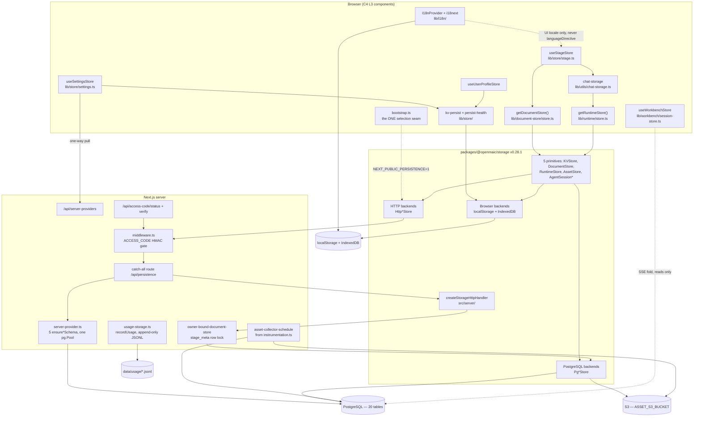

# Component View: Persistence, Storage, Client State, i18n

Everything OpenMAIC writes down, and everything it holds in memory on the client
between writes. This topic covers the `@openmaic/storage` abstraction and its
backends, the PostgreSQL/IndexedDB/localStorage/S3/filesystem landing zones, the
three large Zustand-and-not-Zustand client stores, the settings server pull, the
chat-storage cutover, the access-code gate, the two locale trees, and what
retention actually exists (very little).

## Who this is for

A staff engineer who has to answer one of these without reading 33 000 lines:

- "Where does a course document physically live in mode X?" → [08-data-lifecycle.md](./08-data-lifecycle.md)
- "Why does this store not sync between my laptop and my phone?" → [01-storage-abstraction.md](./01-storage-abstraction.md), [04-settings-server-sync.md](./04-settings-server-sync.md)
- "What are the real column names?" → [02-data-model.md](./02-data-model.md), [02b-agent-run-tables.md](./02b-agent-run-tables.md)
- "Why is `settings.ts` 2248 lines?" → [03-client-state-stores.md](./03-client-state-stores.md)
- "Can I delete the Dexie chat code?" → [05-chat-storage-and-cutover.md](./05-chat-storage-and-cutover.md)
- "Is `ACCESS_CODE` authentication?" → [06-access-codes.md](./06-access-codes.md) (no)
- "What breaks if I add a translation key?" → [07-i18n.md](./07-i18n.md)

## Scope boundary

| In scope | Out of scope (and where it lives) |
| --- | --- |
| `packages/@openmaic/storage` (all five primitives, all backends) | The DSL shapes it persists → [../07-dsl-renderer-editor/index.md](../07-dsl-renderer-editor/index.md) |
| `lib/persistence/`, `lib/document-store/`, `lib/runtime/` | The agent runtime that consumes `AgentSessionStore` → [../05-agent-runtime/index.md](../05-agent-runtime/index.md) |
| `lib/store/` (settings, profile, stage), `lib/workbench/session-store.ts` | The HTTP surface in general → [../03-app-and-api/index.md](../03-app-and-api/index.md), [../12-api-reference/index.md](../12-api-reference/index.md) |
| `lib/utils/chat-storage.ts`, `lib/utils/database.ts` (Dexie) | Whiteboard `RuntimeRecord` folding → [../09-media-and-export/index.md](../09-media-and-export/index.md) |
| `lib/i18n/`, `scripts/check-i18n-keys.mjs` | Playback/session resume in the classroom → [../08-classroom-runtime/index.md](../08-classroom-runtime/index.md) |
| `middleware.ts` access-code gate, `app/api/access-code/*` | Asset *content* generation (TTS, images) → [../09-media-and-export/index.md](../09-media-and-export/index.md) |

## Topic overview

Read the diagram as three layers with exactly two crossings: `bootstrap.ts` is the
only thing that decides browser-versus-server, and `middleware.ts` is the only
thing that decides authorised-versus-not.

## Sources

Read from the code, at `main` / `c2c9553a`:

- `packages/@openmaic/storage/` — `src/index.ts`, `src/kv/`, `src/document/`,
  `src/runtime/`, `src/asset/`, `src/agent-session/`, `src/material/`,
  `src/skill/`, `src/server/`, `src/zustand/persist.ts`
- `lib/persistence/` (13 files), `lib/document-store/` (10 files),
  `lib/runtime/`, `lib/store/`, `lib/workbench/session-store.ts`,
  `lib/utils/chat-storage.ts`, `lib/utils/database.ts`, `lib/i18n/`
- `app/api/persistence/[...path]/route.ts`, `app/api/access-code/*`,
  `app/api/folders/*`, `middleware.ts`, `instrumentation.ts`
- `lib/server/usage-storage.ts`, `lib/server/access-token.ts`,
  `lib/server/agent-runtime/owner.ts`, `scripts/check-i18n-keys.mjs`

Evidence packs, each a traced survey with verbatim signatures:

- [../appendix/research/persistence-storage-state/00-overview.md](../appendix/research/persistence-storage-state/00-overview.md)
  (charter, inventory, deployment modes)
- [../appendix/research/persistence-storage-state/01a-modules-package.md](../appendix/research/persistence-storage-state/01a-modules-package.md),
  [01b-modules-app.md](../appendix/research/persistence-storage-state/01b-modules-app.md)
- [../appendix/research/persistence-storage-state/02a-interfaces-abstraction.md](../appendix/research/persistence-storage-state/02a-interfaces-abstraction.md),
  [02b-entities.md](../appendix/research/persistence-storage-state/02b-entities.md)
- [../appendix/research/persistence-storage-state/03-flows.md](../appendix/research/persistence-storage-state/03-flows.md),
  [04-dependencies-and-config.md](../appendix/research/persistence-storage-state/04-dependencies-and-config.md),
  [05-failure-modes.md](../appendix/research/persistence-storage-state/05-failure-modes.md),
  [06-quality-and-metrics.md](../appendix/research/persistence-storage-state/06-quality-and-metrics.md),
  [07-open-questions.md](../appendix/research/persistence-storage-state/07-open-questions.md)
- [../appendix/research/api-surface/](../appendix/research/api-surface/) — the
  owner-cookie identity and the no-existence-oracle 404 posture
- [../appendix/research/agent-runtime/](../appendix/research/agent-runtime/) — who
  writes `agent_sessions` and why leases exist
- [../appendix/research/quality-testing-ci-deps/](../appendix/research/quality-testing-ci-deps/)
  — the contract suites and the CI gates that pin this subsystem

## Section files

| File | Contents |
| --- | --- |
| [01-storage-abstraction.md](./01-storage-abstraction.md) | The five primitives, every shipped backend, and the single-shot selection logic with its env vars. |
| [01b-adjacent-modules-and-name-collisions.md](./01b-adjacent-modules-and-name-collisions.md) | The five different things called "storage", why `lib/storage/client.ts` is not the package, the route it posts to that does not exist, the deletion pinned by `tests/runtime/storage-entrypoint-removal.test.ts`, and the two adjacent directories that are not persistence. |
| [02-data-model.md](./02-data-model.md) | The course-document, runtime, asset and owner-material tables plus every browser object store, with real column names and the trigger-maintained revision companions. |
| [02b-agent-run-tables.md](./02b-agent-run-tables.md) | The eight agent-run tables: lifecycle and lease, event log, entry tree, URL trust gate, materials, owner projection, user skills — and their constraints as domain rules. |
| [03-client-state-stores.md](./03-client-state-stores.md) | Settings, user-profile, stage and workbench stores: what each owns, where it persists, and why the big ones are big. |
| [04-settings-server-sync.md](./04-settings-server-sync.md) | The one-way `GET /api/server-providers` pull, its reset-then-apply conflict rule, and what it never touches. |
| [05-chat-storage-and-cutover.md](./05-chat-storage-and-cutover.md) | Chat on the learner `RuntimeStore`, the Dexie cutover, its idempotency gate, and why it is not removable yet. |
| [06-access-codes.md](./06-access-codes.md) | The shared-password HMAC cookie gate end to end, and the four things it explicitly is not. |
| [07-i18n.md](./07-i18n.md) | 12 app locales + 10 workbench overlays, the resolution/fallback chain, the `check:i18n-keys` contract, and model-output language control. |
| [08-data-lifecycle.md](./08-data-lifecycle.md) | Retention, every deletion path, and where user content physically lands per deployment mode. |

## The one-paragraph version

The persistence seam is `packages/@openmaic/storage` (v0.28.1, 14 904 source
lines / 17 068 test lines): five primitives — `KVStore`, `DocumentStore`,
`RuntimeStore`, `AssetStore`, and the PostgreSQL-only agent-session family — each
with an interface and one to three backends proven equivalent by shared contract
suites (`packages/@openmaic/storage/src/index.ts:1-23`). Backend selection is
**single-shot and client-bootstrap-only**: `lib/persistence/bootstrap.ts:41`
switches documents and runtime from IndexedDB to HTTP stores against
`/api/persistence` if and only if `NEXT_PUBLIC_PERSISTENCE === '1'` in a browser;
KV has no HTTP wiring at all, so `account`-scoped settings are device-local in
every shipped mode. Server-side, one `pg.Pool` cached on a `globalThis` symbol
provisions five idempotent schemas (`lib/persistence/server-provider.ts:43-47`)
and every document operation is fenced on a `stage_meta` row lock. Client state
is three large stores with three different persistence stories: settings through
a 735-line `KVStore` state machine, workbench as a pure fold over an SSE event
log with nothing persisted but a panel flag, and chat through a Web-Locks-guarded
migration off Dexie that is still live. Retention is one job (`AssetCollector`)
for bytes and nothing at all for rows.

## Related

- [`../18-decisions/05-client-first-persistence-with-a-postgres-cutover.md`](../18-decisions/05-client-first-persistence-with-a-postgres-cutover.md)
  — why the browser is the system of record, why PostgreSQL is a cutover rather than a
  cache, and the pluggable-provider alternative that was tried and deleted with its
  rationale pinned in a test.
- [`../18-decisions/03-dsl-as-the-serialized-contract.md`](../18-decisions/03-dsl-as-the-serialized-contract.md)
  — the two version lines and the CI gate that make three backends interchangeable.
- [`../07-dsl-renderer-editor/index.md`](../07-dsl-renderer-editor/index.md) — the document
  shapes these tables hold.
- [`../glossary.md`](../glossary.md) — the five different things called "storage".
- [`../README.md`](../README.md) — the documentation set root.
